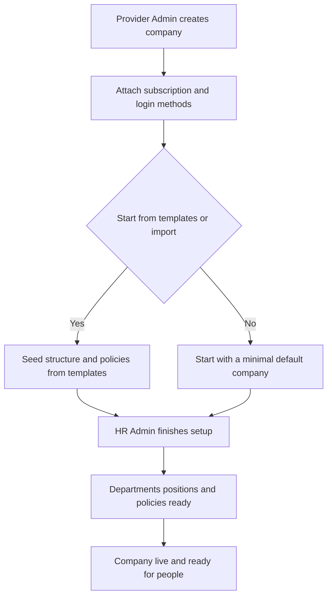
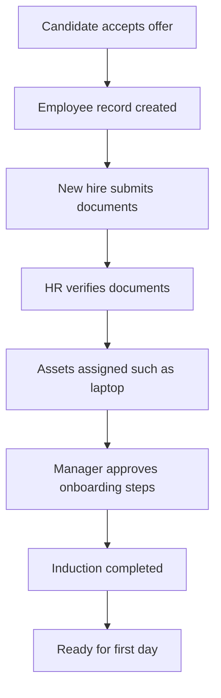
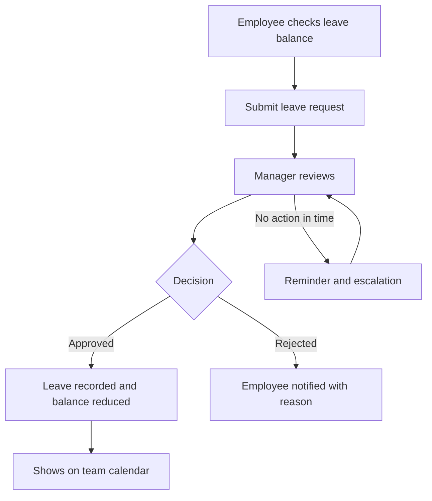
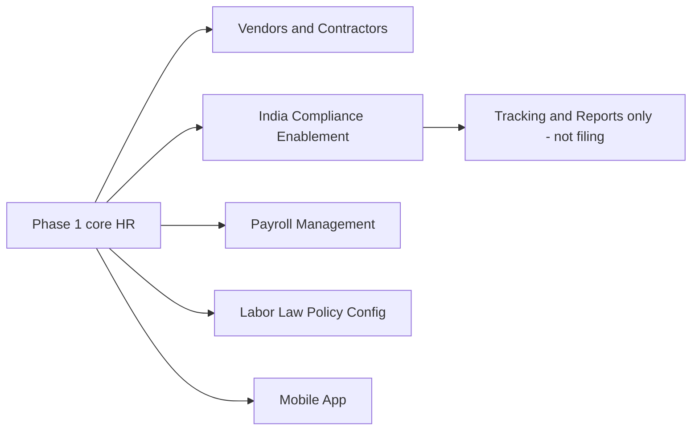
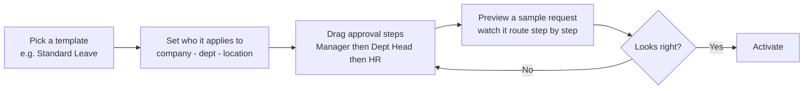
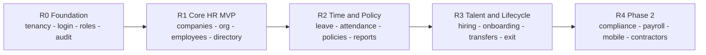

# SatelliteHR — A Plain-Language Guide & Build Roadmap

*One platform, many companies: what it does, how it's designed, and how to build it simply.*

> **How to read this guide.** It's written for non-technical readers — a founder, an HR leader, or a product designer — with zero HR-software background. It moves from the big idea, to the people who use it, to what gets built (Phase 1 and Phase 2), then to a product-design roadmap for keeping something this large *simple*, and finally to an honest list of gaps to fix before building. Every acronym is spelled out on first use. You can read it top to bottom, or jump to any section below.

## Contents
1. [What is SatelliteHR & the core concepts](#1-what-is-satellitehr--the-core-concepts)
2. [The people & their everyday journeys](#2-the-people--their-everyday-journeys)
3. [Phase 1 — what the product does at launch](#3-phase-1--what-the-product-does-at-launch)
4. [Phase 2 — what comes next](#4-phase-2--what-comes-next)
5. [Product design roadmap — the simplest-possible UX](#5-product-design-roadmap--the-simplest-possible-ux)
6. [Gaps, risks & things to fix](#6-gaps-risks--things-to-fix)
7. [The north star](#7-the-north-star)

---

## 1. What is SatelliteHR & the core concepts

### What is SatelliteHR? (in one minute)

Picture a large apartment building. Many different families live inside it. Each family has its own front door, its own keys, and its own private rooms — no family can peek into another's home. Yet everyone shares the same foundation, plumbing, lifts, and wiring that the building manager maintains for all.

SatelliteHR is that building, but for **companies** instead of families. It is one piece of software, shared by many companies at once. Each company gets its own private, locked "apartment" where it keeps everything about its people, and that data never mixes with the company next door.

And what does it keep? The whole working life of a company's people — from the day someone is interviewed for a job, through their first day, their leave and attendance, promotions and transfers, the company gear they're handed, the HR letters they receive, all the way to the day they leave. SatelliteHR does this for employees and (in a later phase) contractors, across many companies, all on one shared system.

In short: **one building, many private apartments, one well-run HR system serving them all.**

### Three big ideas you need to understand

**1. Multi-tenant SaaS — one shared system, many isolated companies.**
*SaaS (Software as a Service)* means software you rent and use over the internet, like Netflix instead of buying DVDs. *Multi-tenant* means many customers ("tenants") share that one rented system — exactly like tenants in an apartment building share one structure. The non-negotiable rule is **isolation**: each company's data is walled off from every other's. This is sacred, because HR records — salaries, performance notes, personal IDs — are deeply private. If Company A could see Company B's people, trust in the platform would collapse overnight.
> *Example:* Acme Foods and Bright Tech both use SatelliteHR. Acme's HR manager searches the directory and sees only Acme's 300 people. Bright Tech's staff are simply invisible.

**2. The hierarchy: Platform > Portfolio > Group Company > Company.**

| Level | Analogy | One-line example |
|-------|---------|------------------|
| **Platform** | The whole building, run by its owner | SatelliteHR itself, run by the software provider |
| **Portfolio** | A firm that manages several buildings for different owners | An HR-outsourcing firm running HR for 12 unrelated clients from one login |
| **Group Company** | A family that owns several related apartments | A conglomerate containing two affiliated subsidiaries |
| **Company** | A single apartment, where life happens | "Acme Foods Pvt Ltd" — one tenant with its own staff and rules |

Not every company sits inside a portfolio or group. Many are **standalone**. A company can belong to at most one group and one portfolio, never two at once.

**3. User ≠ Employee ≠ Contractor — three deliberately separate records.**
- **User** = a login. Like a building keycard: it lets a person in and says which doors they may open.
- **Employee** = a job record at one specific company (department, position, manager, leave balance).
- **Contractor** = the same kind of record for a contingent worker hired through an *engagement* rather than as staff (arrives in Phase 2).

Why split them? Because real life is messy: a person may have a job record but no login (a factory worker who never touches the system); one login may reach several companies; and the same human can play different roles in different places.
> *Example:* **Priya** is a full-time **employee** at Company A and, at the same time, a **contractor** at Company B. SatelliteHR holds two separate work records for her — one per company — even though she is one person. If she needs to log in, a single **User** keycard can link to both.

These three ideas — isolation, the hierarchy, and the user/employee/contractor split — recur throughout the guide. Get them, and everything else falls into place.

---

## 2. The people & their everyday journeys

We just met the building; here is the cast who live and work in it, and how their days actually flow.

### The cast, simplified

SatelliteHR defines about twenty named roles, but you only need a handful of **personas**. (The three-way "a login is not the same as a work record" idea from §1 is what lets one person hold different roles in different companies.)

| Persona | In plain terms | What they care about most |
|---|---|---|
| **Platform / Provider Admin** | The company that owns and runs SatelliteHR (the "landlord"). | Keeping the platform healthy and creating new customer companies. |
| **Portfolio Manager** (shared services) | A team running HR for many companies from one login. | Switching between companies fast and reusing the same setup everywhere. |
| **Company HR Admin** | The HR owner inside one customer company. | Their people, policies, leave, and reports for that one company. |
| **People Manager** | A team lead or department head. | Seeing their own team and approving its requests. |
| **Employee** | A regular staff member. | Their own profile, leave balance, payslips-to-come, and announcements. |
| **Candidate** | Someone being considered for a job, before hiring. | Getting through interviews and accepting an offer. |
| **Interview Panel Member** | A colleague who interviews candidates. | Scheduling interviews and submitting structured feedback (scorecards). |

*One note for later:* **Contractors and Vendors** (outside workers and the agencies that supply them) arrive in **Phase 2**. Phase 1 is built for full-time employees.

### Three everyday journeys

**1. Setting up a brand-new company.**
When a new customer signs up, the **Provider Admin** creates their "apartment" in the building: provisions the company, attaches the subscription (priced by number of companies, employees, and modules), and switches on the login methods. To avoid a blank start, Phase 1 lets the admin begin from **templates and bulk import** (departments, locations, and policies come pre-seeded and editable). *(Copying a whole existing company wholesale — "cloning" — is a Phase 2 capability; in Phase 1 the shortcut is templates + import, not full replication.)* The customer's **Company HR Admin** then finishes the fit-out: departments, positions, leave rules, and the first user accounts.

**2. Onboarding a new employee.**
This begins the moment a **Candidate** accepts an offer. Acceptance hands them from hiring to onboarding and creates an **employee record**. Onboarding then runs as a checklist with set stages: the new hire submits documents, HR verifies them, equipment like a laptop is assigned, and a welcome induction is completed. The **People Manager** may approve some steps. When every stage is ticked, the person is ready for day one.

**3. Requesting and approving leave.**
The most common everyday action. An **Employee** opens self-service, sees their balance, and submits a request — much like booking time off in an app. It travels to the **People Manager** for a decision. Approvals can be a chain (one person, then the next) or in parallel (several at once); if it stalls, the system sends reminders and can escalate. Once approved, the leave is recorded, the balance drops, and it appears on the team calendar. HR keeps an override switch for special cases — and every override leaves an audit trail.

All three share one backbone: a configurable **workflow engine** routes the approvals, **notifications** keep people informed by email, and an **audit trail** quietly records who did what. Build that backbone once and it powers leave, onboarding, exits, and almost every other request.

---

## 3. Phase 1 — what the product does at launch

Phase 1 delivers a single, secure online HR system where one provider hosts many companies, each company runs its people operations end-to-end, and trusted users can manage several companies from one login. Below is a complete tour of all ~29 modules, grouped by the nine functional domains.

### A. Platform access, identity and security
*The front door, the keys, and the security camera: who gets in, what they may touch, and a permanent record of who did what.*

| Module | In plain English | Why it matters |
|---|---|---|
| **User Authentication** | The login system. People sign in with a company login — SAML, Active Directory, Office 365, or Google (these are *single sign-on / SSO* methods) — or a simple email and password. One person can hold keys to several companies and hop between them mid-session. | Keeps a "user" (login) separate from an "employee" (work record), so one human can log into two companies and an employee can exist with no login at all. This split is the spine of the product. |
| **Roles and Security (RBAC)** | *RBAC = who is allowed to do what.* Each person gets a role granting exactly the right buttons and no more, set per company. Includes delegation (hand approvals to a colleague), audited impersonation ("log in as" for support), and MFA (multi-factor login — a second proof of identity). | Stops the wrong people seeing salaries or deleting records. The same person can be an admin in one company and an ordinary employee in another. |
| **Audit and Logging** | A tamper-resistant diary of every important change — who changed what, from what to what, and when. Authorized staff can replay any record's full history. | If a number is wrong or a dispute arises, you can prove exactly what happened. Essential for trust and audits. |

### B. Multi-company operating model
*The building directory and the master keyring: run many companies cleanly, and let related ones share where it makes sense.*

| Module | In plain English | Why it matters |
|---|---|---|
| **Portfolio Management** | A "portfolio" is a set of companies one outsourced HR team manages — from one login, switching instantly, with reports spanning the group where their role permits. | Lets shared-services and HR-outsourcing firms serve many clients without juggling logins. |
| **Group Company Management** | Links sister companies or subsidiaries that genuinely belong together. They can share locations and roll up combined reports — only when explicitly switched on and logged. | A corporate group sees its whole family in one view without breaking the wall between unrelated tenants. |
| **Companies** | The tenant itself: provisioning a new company, its legal details (legal name, registration IDs like GSTN or EIN), subscription, and closure — including exporting all its data on exit and 7-year retention. | Each company is a self-contained world. This module creates and retires those worlds and protects the data inside. |

### C. Organizational and master data
*The company's skeleton — reference lists everything else hangs off. Set them up once and policies, reports, and approvals snap into place.*

| Module | In plain English | Why it matters |
|---|---|---|
| **Jurisdictions** | A simple catalog of where a company operates — countries, states, regions — used for tax rules and to decide which policies apply where. A pick-list, not a rigid geography tree. | A rule can target "everyone in this jurisdiction." Keeps multi-region operations tidy. |
| **Locations** | The actual offices and sites, each tied to one jurisdiction. Private to a company unless a group deliberately shares one. | Reflects where staff sit, drives holiday calendars and policy scope. |
| **Groups** | Flexible labels for grouping people — for policy eligibility, access, and reporting. Groups nest to any depth and can be global or company-specific. | Lets you say "this benefit applies to this group" without rebuilding the org chart. |
| **Departments** | The org-chart boxes (Sales, Engineering…), each with a head, nestable to any depth. | Routes approvals to the right manager and shapes reporting. |
| **Positions** | Specific job slots inside a department (e.g., "Senior Analyst, Finance"). Each employee holds one. | Connects recruitment, onboarding, letters, and reporting to one consistent job definition. |

### D. Workforce management
*The heart of the system: the people records themselves.*

| Module | In plain English | Why it matters |
|---|---|---|
| **Employees** | The master file for each worker — personal details, department, position, location, manager, lifecycle history. Each record is private to one company (a person at two companies has two records). Captures statutory IDs (UAN, PAN), enforces no duplicates, and supports primary, dotted-line, and temporary managers, with every change date-stamped. | The single source of truth about who works here. Leave, pay-readiness, and reporting all depend on it being accurate. |

### E. Policy and compliance enablement
*The company rulebook, and proof people have read it.*

| Module | In plain English | Why it matters |
|---|---|---|
| **Policy Management** | Create HR and business policies and aim them precisely — by company, jurisdiction, location, department, group, or worker type — with versions and "effective dates" (when they kick in). | One rulebook, surgically targeted; old versions stay on record. |
| **Policy Distribution and Acknowledgment** | Send a policy to the right audience, then track who clicked "I have read and accept." Sends reminders, escalates laggards, and re-asks when a policy changes or a person transfers. | Turns "we sent it" into "we can prove they accepted it" — vital if a rule is disputed. |

> **A small consistency note for builders:** policy acknowledgment uses reminders at **50%, 75%, and 100%** of the deadline, while the Workflow Engine's SLAs use reminders at **50% and 75%** with **escalation at 100%**. Same idea, slightly different ladders — keep them straight to avoid a contradiction.

### F. Workflow and process automation
*The conveyor belt that moves approvals along on their own.*

| Module | In plain English | Why it matters |
|---|---|---|
| **Workflow Engine** | A reusable approval-routing brain used across the product: step-by-step or all-at-once approvals, branching rules ("if location is X, route to Y"), deadlines (SLAs), automatic escalation, and a full audit trail. | Build an approval flow once, reuse it everywhere. Nothing falls through the cracks. *(This is meant to be configurable by admins at run time — see Gap 3a for why that matters.)* |

### G. Talent, lifecycle and workforce operations
*Everything from "we might hire you" to "thanks and goodbye," plus daily self-service in between.*

| Module | In plain English | Why it matters |
|---|---|---|
| **Talent Acquisition** | The hiring pipeline: open a requisition, manage candidates and resumes, schedule interviews with scorecards, run reference checks, send offers, convert the accepted candidate into an employee. | One organized funnel from job opening to first day, with a clean handoff into onboarding. |
| **Employee Lifecycle Management** | The big post-hire milestones: onboarding, confirming people after probation, transfers (department, location, or company), and structured exits with clearances. Configurable and tracked. | Makes major people-moves consistent, fair, and auditable instead of ad-hoc email chains. |
| **Task/Checklist Management** | Reusable to-do templates for lifecycle events (e.g., a standard onboarding checklist). | Ensures every new hire or leaver gets the same complete set of steps. |
| **HR Letters and Certificates** | Generates official documents — appointment, confirmation, transfer, promotion, relieving letters, experience certificates — by merging employee data into templates, with approvals, versioning, and PDF output. | Saves hours of manual drafting and keeps wording consistent, with a 7-year history. |
| **Employee Self-Service** | A web portal where employees view/update their info, request leave, check attendance, read announcements, and access documents — within what their role and policy allow. | Cuts the HR inbox dramatically by letting people help themselves. |
| **Leave Management** | Configurable leave rules and types (annual, sick, maternity, comp-off…), live balances, approval flows, an HR override with mandatory reason, and personal/team/company calendars. | Removes guesswork and email back-and-forth from time off. |
| **Time and Attendance** | Captures attendance (manual, biometric, file import, or API), manages shifts and rosters, holiday calendars, overtime, and correction requests, with HR override and audit. | Produces the reliable presence-and-hours data that pay and compliance depend on. |
| **Feedback and Grievance** | A structured, access-controlled channel for staff to raise feedback or grievances, with status tracking and an audit trail. | Gives employees a safe, traceable way to be heard; sensitive cases stay restricted. |
| **Employee Asset Management** | Tracks company items handed to staff — laptops, phones, furniture, licenses — through their life (issued, returned, in repair, retired), with digital sign-off and links to onboarding and exit. | Stops expensive gear from going missing and ties recovery into leaving. |
| **Employee Directory and Org Chart** | A searchable people directory (list, card, and org-chart views), advanced filters, and — for group companies — cross-company search, all respecting privacy rules. | The company's "people map." |

### H. Data, documents and extensibility
*The filing cabinet, the moving truck, and the ability to add your own fields without custom code.*

| Module | In plain English | Why it matters |
|---|---|---|
| **Documents and Attachments** | Secure file storage attached to companies, employees, and candidates, with metadata, expiry tracking, role-based access, and encryption. Common formats up to 2 MB. | Keeps important paperwork organized, access-controlled, and flagged before it expires. |
| **Data Management (Import / Export)** | Bulk-load or extract data via spreadsheet or file. Imports run in a safe "sandbox" first, validate every row, report errors line by line, and roll back cleanly if something breaks. | Makes moving onto the platform (or pulling data out) fast and safe — critical when onboarding a new company. |
| **Data Model Extensibility (Custom Fields)** | Add your own fields (text, number, date, dropdown, file…) to records, platform-wide or per company, with validation. They flow into search, workflows, reports, imports, and the API. | Every organization tracks something unique; this bends the product to fit you without a rebuild. |

### I. Reporting, analytics and communications
*Turning all that data into answers, and keeping people informed.*

| Module | In plain English | Why it matters |
|---|---|---|
| **Reporting and Analytics** | Ready-made reports (workforce, leave, attendance, hiring, assets, compliance), interactive dashboards with drill-down, a build-your-own report tool, scheduled email delivery, and cross-company reports for authorized portfolio/group users. *Note: even in Phase 1, reporting ships PF/ESIC eligibility and statutory register **templates** — so there is some statutory output before the full Phase 2 compliance module arrives.* | Replaces manual spreadsheets with trustworthy, on-demand insight — always filtered to what each user may see. |
| **Notifications and Communications** | Automated messages for approvals, escalations, reminders, and lifecycle events. Email is always on; in-app, Teams, and WhatsApp are optional. Templates carry company branding; users set preferences. | Keeps everyone in the loop at the right moment, so approvals and deadlines don't stall. |
| **Announcements** | Authorized staff broadcast organizational messages, targeted by company, location, department, group, or worker type, with scheduling and expiry. | A controlled noticeboard that tidies itself away when stale. |

---

## 4. Phase 2 — what comes next

Phase 1 built the core HR system: employees, leave, attendance, onboarding. Phase 2 widens the circle — the people who work *with* you but aren't on your regular payroll (contractors and vendors), staying on the right side of India's labor laws, payroll, and a mobile app.

### The single most important idea: tracker, not filer

One distinction runs through all of Phase 2. The platform helps you **track, calculate, and report** statutory compliance. It does **not** file paperwork with the government, and it does **not** move money on your behalf.

Think of it as a **very smart filing cabinet plus calculator**: it keeps records neat, flags what's due, and works out the numbers — but it is not your accountant who signs and submits the return, and not your bank that wires the deposit. Or: it's a **GPS** that shows the route and warns of a turn; you still steer and press the accelerator.

| What the platform DOES | What stays the customer's job |
|---|---|
| Stores statutory data (UAN, ESIC number, eligibility) | Filing returns to EPFO, ESIC, PT departments |
| Calculates PF, ESI, PT, gratuity, bonus amounts | Actually paying/remitting that money |
| Generates registers and report templates | Legal interpretation and advice |
| Sends due-date and eligibility alerts | Confirming the law has truly been met |

The BRD repeats this line in nearly every section — it's a deliberate boundary, not an oversight.

### The Phase 2 areas, in plain English

| Area | In plain English | Why it matters |
|---|---|---|
| **Vendors and Contractors** | Manage people who work for you through a staffing agency or on contract, not as full employees. Each company keeps its own vendor list; each vendor can supply many contractors. | Most modern teams mix permanent staff with contract help. This tracks them properly instead of in spreadsheets. |
| **Contractor engagement models** | Four ways a contractor can be hired: through a **vendor** (an agency), **direct** (you contract them), **gig** (short, task-based), or **consultant** (specialist advice). | The rules (leave, access) change with the type. One size does not fit all. |
| **India Statutory Compliance Enablement** | Capture and track everything Indian labor law requires — PF, ESI, PT, gratuity, bonus, maternity, minimum wages — and produce the supporting reports and registers. | India has many overlapping labor laws; getting the data and records right keeps you audit-ready and avoids penalties. |
| **State-specific variations** | The same law can differ by state (e.g., Maharashtra, Karnataka, Tamil Nadu, Delhi…). Phase 2 ships configurable, per-state rule templates a company picks during setup. | A company operating in several states needs different rules per location — handled by configuration, not custom code. |
| **Payroll Management** | Calculate salaries, allowances, deductions, overtime, and statutory cuts; generate payslips; reconcile bank payments. | Pay is the most sensitive thing you do; accuracy and timeliness build trust and meet the law. |
| **Labor Law Policy Configuration** | Set up your rules once — leave types, working hours, PF/ESI applicability, gratuity and bonus parameters — so the system applies them automatically. | Write the rulebook once; the system enforces it consistently everywhere. |
| **Mobile App** | Core HR in employees' and contractors' hands: view profiles, apply for leave, mark attendance, see announcements, push notifications. | People expect to do HR from their phone — especially field and contract staff who aren't at a desk. |
| **Contractor and Vendor roles** | Carefully limited login types so outside people see only what they should (Contractor–Standard, Contractor–Restricted, Vendor Administrator, Vendor User). | Outsiders touching your HR data is risky; least-access permissions keep things safe. |

*Looking further ahead:* the documents also sketch **future jurisdictions beyond India** (United States, United Kingdom, Singapore, UAE, Australia, Canada) for a Phase 3+. India-first is a deliberate starting point, not the ceiling — the rules engine is meant to extend to other countries later.

### A note on contractors and identity

The same physical person can be a **contractor in one company and a full employee in another**, through separate records (the §1 user/employee/contractor split again). The system keeps a **history** of which vendor a contractor came through, so switching agencies doesn't lose the trail. Contractors can have their own leave rules — project-based contractors may only get leave tied to the project, and statutory benefits like maternity may not apply, depending on engagement type.

### ⚠️ A data-quality problem to fix before building (Phase 2, section 5.3.1)

While reading the compliance section, one thing needs flagging. The list of **ESI (Employees' State Insurance — government health-and-injury cover for workers) statutory Forms** runs from **Form 5 all the way through Form 200** — nearly 200 entries — and almost every one carries the *identical* description, "Medical benefit claim for TB treatment" (a couple cycle through "for IP" — *Insured Person* — and "for family").

This is clearly **corrupted or placeholder text**, not real requirements: real ESI forms do not number into the hundreds, and certainly aren't ~196 copies of the same line. It doesn't change the *concept* — the platform should generate the genuine ESI forms and registers — but the actual list must be re-sourced from the real ESI rules (verified by a compliance expert) **before anyone builds from it**, or the team could waste effort creating ~196 phantom forms. (Tracked as Gap 1b / D1 below.)

---

## 5. Product design roadmap — the simplest-possible UX

SatelliteHR is a deeply configurable platform: many companies on one system, portfolios and group companies, one person across several companies, dozens of modules. That power is also the danger — hand all of it to a new user on day one and they freeze. Great product design does the opposite of "expose everything." It **hides complexity behind defaults, templates, and guided flows**, and reveals depth only when asked.

Think of a modern car: a new driver can start, steer, and stop on day one without ever opening the engine bay. The complexity is still there — they just don't have to meet it yet. That's the goal.

### 1. Design philosophy for taming complexity

| Principle | Plain meaning | SatelliteHR example |
|---|---|---|
| **Progressive disclosure** | Show the few things most people need now; tuck the rest behind "Advanced." | The 6-step company wizard asks for legal name, jurisdiction, currency, time zone, contact. Subscription tier, branding, and SSO config wait under Settings. |
| **Sensible defaults out of the box** | Every setting ships pre-filled so nothing is blank. | A new company auto-gets default security policies, a generated code (COMP-2026-0043), and a sensible approval chain — the admin overrides only what they care about. |
| **Templates / start from a template** | Don't build from scratch; pick a ready-made starting point and tweak. | Leave policies, offer letters, onboarding checklists, and report layouts all start from a template. |
| **Configuration, not customization** | Users assemble behavior from supplied building blocks — no code, no bespoke screens. | Approval workflows are configured by choosing steps (Manager → Dept Head → HR), not by a developer writing logic. |
| **Role-scoped UIs** | Each persona sees only their slice. | An Employee sees profile, leave, payslips. A Platform Admin sees company provisioning. Same app, very different screens — driven by RBAC. |
| **Guided setup wizards** | Break a scary task into small ordered steps with a progress bar. | Creating a company is a 6-step wizard with a 1–2–3–4–5–6 indicator and a Save-as-Draft escape hatch. |
| **Clone from an existing company** | Copy a working setup instead of redoing it. | A shared-services team spins up company #12 by cloning #11's structure and policies, then adjusts. *(Note: full cloning is a **Phase 2** capability — Phase 1's shortcut is templates + import. Design for clone now, ship it later.)* |
| **Usable on day 1, fine-tune later** | It works immediately on defaults; tuning is optional. | A company can add employees and approve leave the moment setup ends, then refine policies next week. |

The throughline: **a blank screen is the enemy.** Every starting point should be a sensible default or a template the user edits down — never a void they fill up.

### 2. Information architecture and navigation

A short top-level list, predictable places for things, and one global control for "which company am I in." Most HR apps fail by dumping 25 modules into one flat sidebar; we group them into a handful of human buckets.

```mermaid
graph TD
  ROOT[SatelliteHR]
  ROOT --> HOME[Home and My Inbox]
  ROOT --> PEOPLE[People]
  ROOT --> TIME[Time and Leave]
  ROOT --> TALENT[Hiring and Lifecycle]
  ROOT --> POLICY[Policies and Documents]
  ROOT --> REPORTS[Reports]
  ROOT --> ADMIN[Admin and Setup]

  PEOPLE --> P1[Directory]
  PEOPLE --> P2[Org Chart]
  PEOPLE --> P3[Employee Records]

  TIME --> T1[Leave]
  TIME --> T2[Attendance and Shifts]
  TIME --> T3[Holidays]

  TALENT --> H1[Requisitions and Candidates]
  TALENT --> H2[Onboarding]
  TALENT --> H3[Transfers and Exit]
  TALENT --> H4[Letters and Assets]

  POLICY --> PO1[Policy Library]
  POLICY --> PO2[Acknowledgements]
  POLICY --> PO3[Documents]

  ADMIN --> A1[Company Setup]
  ADMIN --> A2[Roles and Users]
  ADMIN --> A3[Workflow Builder]
  ADMIN --> A4[Custom Fields]
  ADMIN --> A5[Audit Log]
```

Two rules keep it calm. First, **what you see depends on your role** — an Employee's sidebar is just Home, People (read-only), Time and Leave, and Policies; the heavy Admin branch simply doesn't render. Second, **Home is the front door for action** — it carries the unified inbox, so people start with "what needs me today," not "go hunt through 7 menus."

**The company context switcher.** Someone who works across companies should never log out to change companies. A single control in the header — a chip showing the current company name and logo, with a dropdown of only the companies they're authorized for — switches context on click: that company's currency, time zone, policies, permissions, and a fresh secure token. It works like switching accounts in Gmail — same login, different mailbox — and every switch is written to the audit trail.

### 3. The hard UX problems and the simplest pattern for each

| # | The problem (one line) | Simplest UX pattern | Why it works |
|---|---|---|---|
| a | **Setting up a company is huge** — dozens of fields, legal details, policies, roles. | A 6-step wizard with a progress bar, only mandatory fields per step, Save-as-Draft, and a live "Company Code Preview." Everything non-essential is auto-defaulted and editable later. | Chunking turns an overwhelming form into a short journey; defaults make the company usable the moment the wizard ends. |
| b | **Switching between companies** without re-logging-in or losing your place. | Persistent header switcher showing the current company; bookmarkable per-company URLs; current company always visible. | One click, and a constant visible label removes "which company am I editing?!" anxiety. |
| c | **Approvals are scattered** across leave, attendance, onboarding, transfers, exits, letters, policy sign-offs. | ONE unified inbox on Home: every pending approval, request, and acknowledgement in a single list with type tags, deadline (SLA) timers, and bulk Approve/Reject. | A manager has one place to clear their plate instead of seven screens; deadline badges make urgency obvious. |
| d | **Employees get lost** in a system built for admins. | A stripped-down self-service home: my profile, request leave, my attendance, my documents, policies to sign, announcements. Nothing else exists for this role. | Less is more — the one task finishes in seconds because there's almost nothing to navigate past. |
| e | **Admins must configure policies and workflows** without drowning. | A visual rule builder (drag steps: Manager → Dept Head → HR), start-from-template, an applicability picker (company / dept / location / group), and a **live Preview** that simulates a sample request before saving. | Templates remove the blank page; the visual builder removes the manual; Preview removes the fear of "did I just break leave for 300 people?" |
| f | **Reporting is intimidating** — too many fields and combinations. | Ready-made report templates (headcount, leave balances, attendance register) plus saved views: build filters once, name it, pin it, schedule it by email. | People rarely need a novel report; they need the same five repeatedly. Saved views make repeat work one click. |

The visual rule builder deserves a picture, because it's where most admins would otherwise give up:

### 4. A product release roadmap (user-value lens)

Releases are ordered by **value per unit of effort**: each unlocks something a customer can actually do, and each builds on the last. *(For a 4–10 person team this is realistically a ~12–18 month journey — see Gap 3d.)*

> **One shared first milestone.** "R1 — Core HR MVP" below is the **same** target the execution plan calls "Phase I Core GA" and the gaps section calls the "thin MVP." Treat it as the single, named **Design-Partner GA**: the first version you put in front of a real customer. Everything before it is groundwork; everything after it is expansion.

| Release | The user promise — "after this, a customer can…" | Modules included | Why this order |
|---|---|---|---|
| **R0 — Foundation** | "…log in securely, with the right people having the right access, and every action recorded." | Multi-tenancy & isolation, authentication (SSO + local), RBAC roles/permissions, audit & logging | Invisible plumbing. Nothing else is safe without isolation, login, roles, and an audit trail underneath. |
| **R1 — Core HR MVP** *(= Design-Partner GA)* | "…create a company, build its org structure, add employees, and let them find each other." | Companies + 6-step wizard, jurisdictions, locations, departments, positions, groups, employee records, directory & org chart, basic self-service, **data import/export** (to migrate in) | The smallest thing that's genuinely an HR system; a company runs its people database from day one. |
| **R2 — Time and Policy** | "…manage leave and attendance, publish and enforce policies, and report on it all." | Leave, time & attendance, policy management + distribution/ack, the **workflow engine**, notifications, reporting & analytics, **announcements** | The daily-use core that earns trust; the workflow engine and reporting unlock value across every later module. |
| **R3 — Talent and Lifecycle** | "…hire, onboard, move people around, and offboard cleanly — with the right paperwork." | Talent acquisition, onboarding, probation, transfers, exit, HR letters, asset management, **feedback & grievance**, **documents & attachments**, **custom fields** | These reuse R2's workflow engine and templates, so they cost less now — and they complete the full employee journey. |
| **R4 — Compliance, Payroll & Mobile (Phase 2)** | "…run statutory compliance and payroll, manage contractors, and do it from a phone." | India compliance enablement, payroll, vendors & contractors, native mobile apps with push | Highest complexity and regulatory risk; deferring it lets the core mature and real customers shape requirements first. |

The shape is deliberate: an **invisible base** (R0), the **smallest real product** (R1), the **daily-use engine plus reusable workflow rails** (R2), **everything that rides those rails cheaply** (R3), then the **hard, high-risk frontier** (R4). Each step is the cheapest next thing that makes a customer say "now I can do my job."

---

## 6. Gaps, risks & things to fix

Think of this as a pre-flight checklist. The plan is strong, but a few things need fixing before takeoff. *(IDs in brackets like "D1" match the execution plan's own gap list, so the two documents line up.)*

### At a glance: severity ranking

| Priority | Gap | Bucket |
|----------|-----|--------|
| 🔴 Fix in Week 0 | Self-contradicting data-isolation model (D2) | Source docs / Architecture |
| 🔴 Fix in Week 0 | Corrupted statutory form list (D1) | Source docs |
| 🔴 Decide early | No thin first-customer version (MVP) | Scope |
| 🔴 Design early | The "Workflow Engine" is misunderstood | Architecture |
| 🟠 Amber | Open questions still unanswered (D3) | Source docs |
| 🟠 Amber | Missing referenced document + integration specs | Source docs |
| 🟠 Amber | Reporting will overload the main database | Architecture |
| 🟠 Amber | Unrealistic original timeline | Architecture / Scope |
| 🟠 Amber | The user interface is barely described | Architecture |
| 🟠 Amber | Effective-dating rules are inconsistent (D4) | Source docs |
| 🟡 Yellow | Too configurable; too many roles; setup is heavy | UX & adoption |

### 1. Source-document gaps

**1a. Two contradictory data-isolation models (🔴 = D2).**
*What it is:* The Functional Spec gives two answers for how each company's data is kept separate — COMP-FR-004 says "create a tenant database schema" (each company its own filing cabinet), but §7.2 says "all queries must include company_id filter" (one shared cabinet with labels).
*Why it matters:* Isolation is the one thing a multi-company HR system cannot get wrong — a leak could end the business — and you can't build two designs at once.
*Fix:* Pick one before any data work. The execution plan's ADR-001 already recommends the right answer — shared cabinet with strict labels (Row-Level Security), with separate cabinets offered only to large "Enterprise" customers. Ratify it in Week 0.

**1b. The corrupted ESI form list (🔴 = D1).**
*What it is:* Phase 2 §5.3.1 lists "ESI Forms" from Form 5 to Form 200 with the same TB-treatment description ~195 times — auto-generated filler.
*Why it matters:* This is a legal-compliance feature; building from this list ships wrong government forms.
*Fix:* Discard the list; re-source the authoritative ESI/EPF form set from statute, verified by a compliance expert and lawyer, before any compliance code. It's a Phase 2 concern, so there's time — but block that work until done.

**1c. Open requirements still unanswered (🟠 = D3).**
*What it is:* Phase 1 BRD §10 admits three undefined items: exact mandatory fields per master record; the full Indian statutory field list; and how biometric/third-party attendance devices connect.
*Fix:* Run short workshops to nail each list and record the answers as decisions; build clearly-marked placeholders ("stubs") for anything still pending.

**1d. Inconsistent effective-dating rules (🟠 = D4).**
*What it is:* "Effective dating" = scheduling a change for a future date. Manager changes *are* effective-dated (BRD 6.9.5), but company config is *not* ("no future-dating for Phase 1," COMP-FR-016).
*Fix:* Decide once, centrally, exactly which records can be future-dated, and document it before the data model is frozen.

**1e. A referenced document that doesn't exist, plus missing integration specs (🟠).**
*What it is:* The BRD points to "SatelliteHR-TaskChecklist-BRD.md" for onboarding task detail — but that file isn't in the repo. Separately, biometric/attendance integration specs are missing.
*Fix:* Locate or write the missing checklist and obtain the device specs before estimating the Task/Checklist and Time & Attendance modules; mark both "spec-pending."

### 2. Scope and product gaps

**2a. 29 modules with no thin first version (🔴).**
*What it is:* Phase 1 is ~29 modules with no defined "smallest useful product."
*Why it matters:* Building all 29 before anyone uses anything is the classic way to spend a year and learn nothing.
*Fix:* Make the **Design-Partner GA** from §5 (R1: companies, org, employees, self-service + the security/audit foundation) the explicit, contractual first target — not a waypoint on the road to all 29.

### 3. Architecture and technical gaps

**3a. The "Workflow Engine" is two different things wearing one name (🔴).**
*What it is:* The BRD's Workflow Engine (§6.25) lets a company's HR admin set up their own approval chains *at run time, through the screen, no programmer needed* — a **product feature** (a configurable rules engine, like the "if this, then that" automations in Zapier). Some plans conflate it with "Step Functions," which is cloud plumbing for wiring back-end jobs — a different thing.
*Why it matters:* ~15 modules depend on this engine. Reaching for cloud plumbing and expecting a customer-facing, run-time-configurable feature means discovering the gap deep into the build.
*Fix:* Build a proper data-driven workflow engine — rules stored in the database and interpreted by the app while it runs, with a reliable timer for deadlines and escalations. A first-class, early component, not a library call.

**3b. Heavy reporting will strain the main database (🟠).**
*What it is:* The same database that records day-to-day transactions is also expected to power dashboards and cross-company reports within 2 seconds (BRD 8.1).
*Why it matters:* Big reports are like a delivery truck in the fast lane — they slow everyone else down.
*Fix:* Run heavy/consolidated reports against a separate read-only copy (a "read replica") or a small analytics store, not the live transaction database.

**3c. The user interface is barely specified (🟠).**
*What it is:* The Functional Spec sketches a few screens, but for a 29-module product the UI — roughly half the total work — is thinly described.
*Fix:* Invest early in a shared design system (reusable buttons, forms, tables, navigation) and design the high-traffic flows (context switching, onboarding, leave) before building broadly.

**3d. The original timeline is unrealistic for a small team (🟠).**
*What it is:* The first plan targeted full Phase 1 in ~7 months — but that assumed 5–6 parallel squads. With 4–10 people it's realistically **12–18 months**.
*Fix:* Adopt the honest estimate and re-scope — pods instead of squads, sequential delivery, and the Design-Partner GA (2a) as the real first milestone.

### 4. UX and adoption gaps

| Gap | What it is / Why it matters | Suggested fix |
|-----|------------------------------|---------------|
| **So configurable it overwhelms** | Almost everything is configurable; like a camera in full manual mode, infinite options paralyze a new admin and invite misconfiguration. | Ship opinionated defaults and templates; start customers in "easy mode," reveal advanced settings only when needed. |
| **~20 distinct roles** | About 20 roles across 4 levels is a job to administer and a source of over- or under-granting access. | Offer a few common role "bundles," hide rarely-used roles, and provide a "what can this person see?" preview. |
| **Context switching confuses people** | A portfolio manager can act in the wrong company — approving leave for A while thinking they're in B. | Make the current company impossible to miss (large name, distinct color), confirm before sensitive actions, label every screen with the active company. |
| **First-time setup is heavy** | Standing up a company means a wizard plus departments, positions, locations, groups, policies, workflows before it's usable. | Guided setup with sensible defaults, copy-from-template/import, and a clear progress checklist so onboarding feels achievable. |

---

## 7. The north star

If a designer pins one list above their desk, make it this:

- **No blank pages.** Every start is a default or a template the user edits down — never an empty form to fill up.
- **Day-1 usable, day-30 tunable.** It works immediately on defaults; configuration can wait.
- **Hide depth until asked.** The common 20% is on the surface; the powerful 80% lives behind "Advanced."
- **One inbox, one switcher.** All approvals in a single list; all companies behind a single header control.
- **Show your role, hide the rest.** People only see screens their job needs.
- **Preview before you commit.** Any rule or workflow can be simulated on a sample before it goes live.
- **Clone beats configure; configure beats customize.** Copy what works, assemble from blocks, never build bespoke screens.
- **Every powerful action is reversible and recorded.** Drafts, soft-deletes, and a visible audit trail make experimenting safe.

The product's job is to make a genuinely complex system *feel* like a simple one — by deciding, on the user's behalf, what they don't need to think about yet.

---

*Companion documents:* [`execution.md`](execution.md) (how to build it — phases, ADRs, quality gates), [`architecture.md`](architecture.md) (the small-team execution architecture), and [`TECH-STACK-AND-INFRA-COMPARISON.md`](TECH-STACK-AND-INFRA-COMPARISON.md) (backend, compute, cloud, and data-tier decisions).
