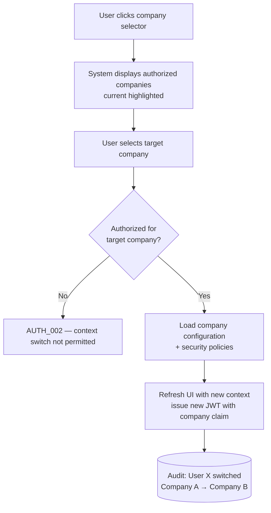
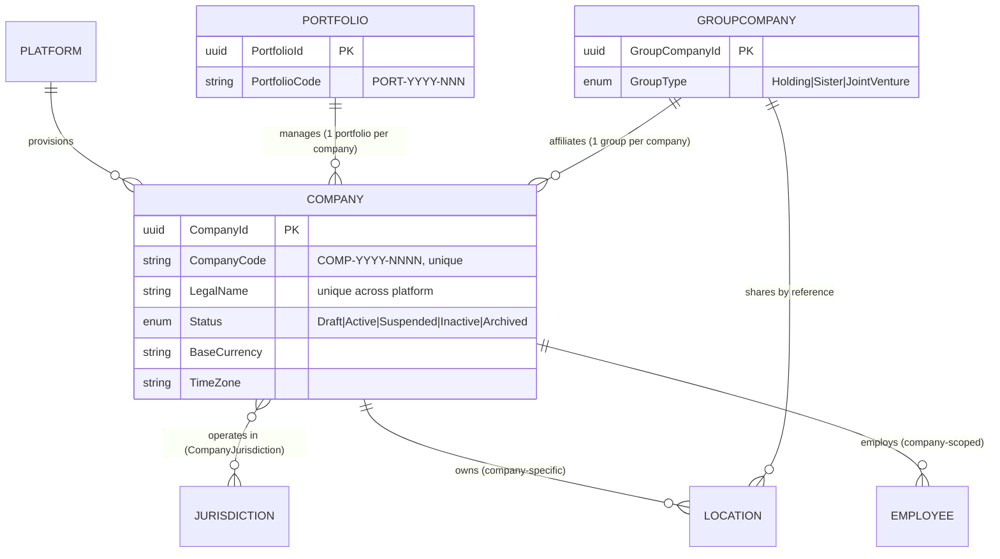

# Functional Specification Document

## Company Management Module

### SatelliteHR - Phase I

---

## Document Information

| Attribute | Value |
|-----------|-------|
| **Module** | Company Management |
| **Version** | 1.0 |
| **Date** | April 13, 2026 |
| **Status** | Draft |
| **Related Documents** | SatelliteHR-BRD.md, SatelliteHR Phase II-BRD.md |

---

## 1. Overview

The Company Management module is the foundational component of SatelliteHR's multi-tenant SaaS architecture. It enables the HRMS provider to provision and manage tenant companies, supports portfolio-based administration for shared services teams, and facilitates group-company structures for affiliated entities.

This module ensures tenant isolation while enabling authorized cross-company operations through portfolio and group-company constructs.

---

## 2. Scope

### 2.1 In Scope

| Feature | Description |
|---------|-------------|
| Company Provisioning | Creation, configuration, and lifecycle management of tenant companies |
| Company Master Data | Business details, legal information, operational configuration |
| Portfolio Management | Multi-company administration for shared services teams |
| Group Company Management | Affiliated company structures and shared constructs |
| Company Lifecycle | Activation, suspension, archival, and decommissioning |
| Commercial Configuration | Subscription and packaging attributes |

### 2.2 Out of Scope

| Feature | Reason | Phase |
|---------|--------|-------|
| Company Replication/Cloning | Complexity | Phase II |
| Advanced Commercial Billing | Requires billing integration | Phase II |
| Company Merger Workflows | Complexity | Phase II |
| White-label Customization | Branding requirements TBD | Future |

---

## 3. Functional Requirements

### 3.1 Company Management

#### 3.1.1 Company Creation and Provisioning

**Use Case:** UC-COMP-001 Create New Company

| Attribute | Value |
|-----------|-------|
| **Actor** | Platform Super Administrator, Platform Operations Admin |
| **Trigger** | New customer onboarding request |
| **Preconditions** | Actor authenticated with appropriate platform-level role |
| **Postconditions** | Company record created, tenant initialized, default configuration applied |

**Functional Requirements:**

1. **COMP-FR-001** The system shall provide a company creation wizard with the following steps:
   - Step 1: Basic Information (legal name, trade name, website)
   - Step 2: Legal Details (registration identifiers, incorporation date)
   - Step 3: Contact Information (primary address, billing address)
   - Step 4: Operational Configuration (jurisdictions, base currency, time zone)
   - Step 5: Administrative Setup (initial company administrator assignment)
   - Step 6: Review and Confirm

2. **COMP-FR-002** The system shall validate mandatory fields:
   - Legal Name (unique across platform)
   - Primary Jurisdiction
   - Base Currency
   - Time Zone
   - Primary Contact Email

3. **COMP-FR-003** The system shall support the following registration identifiers:
   - GST Number (India)
   - EIN (USA)
   - Company Registration Number (UK)
   - Custom identifier type (configurable)

4. **COMP-FR-004** Upon company creation, the system shall automatically:
   - Create tenant database schema
   - Initialize default security policies
   - Create default company administrator user (if email provided)
   - Send welcome email to company administrator
   - Log creation event in audit trail

5. **COMP-FR-005** The system shall prevent duplicate company creation by:
   - Checking legal name uniqueness (exact match)
   - Checking registration identifier uniqueness within jurisdiction
   - Displaying warning for potential duplicates

**User Interface Requirements:**

| Element | Requirement |
|---------|-------------|
| Company Creation Button | Visible only to Platform Super Administrator and Platform Operations Admin |
| Duplicate Warning | Modal dialog with list of potential matches |
| Progress Indicator | Step indicator showing current step (1-6) |
| Save as Draft | Allow saving incomplete company creation |

---

#### 3.1.2 Company Master Data Management

**Use Case:** UC-COMP-002 Manage Company Details

**Functional Requirements:**

1. **COMP-FR-006** The system shall maintain the following company information categories:

| Category | Fields |
|----------|--------|
| **Basic Information** | Legal Name, Trade Name (optional), Website, Company Code (auto-generated) |
| **Legal Details** | Registration Type, Registration Number, Incorporation Date, Tax ID |
| **Contact Information** | Primary Address, Billing Address, Primary Contact Name, Email, Phone |
| **Operational Settings** | Jurisdictions (multi-select), Base Currency, Time Zone, Language |
| **Branding** | Company Logo (optional), Primary Color (optional) |
| **Commercial** | Subscription Tier, Employee Limit, Module Subscription |

2. **COMP-FR-007** The system shall support company code generation with format: `COMP-{YYYY}-{NNNN}` where:
   - YYYY = Year of creation
   - NNNN = Sequential number (0001-9999)

3. **COMP-FR-008** The system shall allow editing of company details with the following constraints:
   - Legal Name: Editable (triggers audit log)
   - Company Code: Non-editable (system-generated)
   - Jurisdictions: Addable (cannot remove if employees assigned)
   - Base Currency: Non-editable after first transaction

4. **COMP-FR-009** The system shall maintain version history for company master data changes with:
   - Field changed
   - Previous value
   - New value
   - Changed by (user)
   - Changed date/time
   - Change reason (optional)

**Validation Rules:**

| Field | Validation Rule | Error Message |
|-------|-----------------|---------------|
| Legal Name | Required, 3-100 characters, alphanumeric + special chars | "Legal name is required and must be 3-100 characters" |
| Website | Optional, valid URL format | "Please enter a valid URL" |
| Primary Email | Required, valid email format | "Please enter a valid email address" |
| GST Number | Optional, 15 characters if India jurisdiction | "GST number must be 15 characters" |

---

#### 3.1.3 Company Lifecycle Management

**Use Case:** UC-COMP-003 Manage Company Lifecycle

**Company Status States:**

| Status | Description | Allowed Transitions |
|--------|-------------|---------------------|
| **Draft** | Initial creation, not yet active | → Active, → Cancelled |
| **Active** | Fully operational company | → Suspended, → Inactive |
| **Suspended** | Temporarily disabled (non-payment, violation) | → Active, → Inactive |
| **Inactive** | Closed or merged, data retained | → Archived (after 7 years) |
| **Archived** | Data exported and purged | None (terminal state) |

**Functional Requirements:**

1. **COMP-FR-010** The system shall support company status transitions with approval workflow:
   - Draft → Active: Automatic upon completion of setup
   - Active → Suspended: Requires Platform Super Administrator approval
   - Active → Inactive: Requires Platform Super Administrator approval + confirmation
   - Suspended → Active: Requires Platform Super Administrator approval
   - Inactive → Archived: Automatic after 7-year retention period

2. **COMP-FR-011** Upon company suspension, the system shall:
   - Prevent new logins (except Platform Administrators)
   - Allow read-only access for existing sessions (grace period: 30 minutes)
   - Queue background jobs for completion
   - Send notification to company administrators

3. **COMP-FR-012** Upon company inactivation (closure), the system shall:
   - Disable all user accounts
   - Complete all pending workflows (or cancel with audit)
   - Generate company data export package
   - Initiate 7-year data retention timer
   - Send confirmation to company administrators and Platform Operations

4. **COMP-FR-013** The system shall provide company archival with:
   - Complete data export (JSON/CSV format)
   - Audit log export
   - Document attachment export
   - Verification checksum for data integrity
   - Secure deletion of data after archival confirmation

**Data Retention Rules:**

| Data Type | Retention Period | Action After Retention |
|-----------|------------------|------------------------|
| Employee Records | 7 years from exit | Anonymize and archive |
| Transactional Data | 7 years | Archive to cold storage |
| Audit Logs | 7 years | Archive to compliance storage |
| Documents | 7 years | Export and delete |
| Backup Data | 90 days | Purge |

---

#### 3.1.4 Company Configuration

**Use Case:** UC-COMP-004 Configure Company Settings

**Functional Requirements:**

1. **COMP-FR-014** The system shall support company-level configuration for:

| Configuration Category | Settings |
|------------------------|----------|
| **Authentication** | Allowed auth methods (SAML, AD, O365, Google, Local) |
| **Security** | MFA requirement, password policy, session timeout |
| **Localization** | Date format, number format, currency display |
| **Notifications** | Default email templates, sender configuration |
| **Workflow Defaults** | Default approval hierarchies, SLA settings |
| **Integrations** | Enabled integrations (Phase II scope) |

2. **COMP-FR-015** The system shall apply configuration inheritance:
   - Platform defaults → Company settings (overridable)
   - Company settings → Department settings (overridable where applicable)

3. **COMP-FR-016** Configuration changes shall be:
   - Logged in audit trail
   - Effective immediately (no future-dating for Phase I)
   - Applied to new transactions only (no retroactive)

---

### 3.2 Portfolio Management

#### 3.2.1 Portfolio Definition

**Use Case:** UC-PORT-001 Create Portfolio

**Functional Requirements:**

1. **PORT-FR-001** The system shall allow Platform Super Administrator to create portfolios with:
   - Portfolio Name (unique)
   - Portfolio Description
   - Portfolio Manager assignment
   - Associated companies (multi-select from active companies)

2. **PORT-FR-002** The system shall enforce portfolio constraints:
   - A company can belong to only one portfolio at a time
   - Portfolio manager must have Portfolio Manager role
   - Minimum one company per portfolio (except during creation)

3. **PORT-FR-003** The system shall support portfolio modification:
   - Add companies (must not belong to another portfolio)
   - Remove companies (with confirmation)
   - Change portfolio manager
   - Update description

**Portfolio Attributes:**

| Attribute | Type | Required | Description |
|-----------|------|----------|-------------|
| Portfolio ID | System | Yes | Auto-generated (PORT-{YYYY}-{NNN}) |
| Portfolio Name | Text | Yes | Unique, 3-50 characters |
| Description | Text | No | 500 characters max |
| Portfolio Manager | Reference | Yes | User with Portfolio Manager role |
| Companies | Multi-select | Yes | Active companies not in other portfolios |
| Status | Enum | Yes | Active, Inactive |
| Created Date | DateTime | System | Auto-populated |

---

#### 3.2.2 Multi-Company Context Switching

**Use Case:** UC-PORT-002 Switch Company Context

**Functional Requirements:**

1. **PORT-FR-004** The system shall provide company context switching for users with multi-company access:
   - Dropdown selector in header navigation
   - Company list filtered by user's authorized companies
   - Current company prominently displayed

2. **PORT-FR-005** Upon context switch, the system shall:
   - Validate user authorization for target company
   - Load company-specific configuration
   - Apply company-specific security policies
   - Refresh navigation menu based on company-specific permissions
   - Maintain session state (shopping cart equivalent for HR actions)

3. **PORT-FR-006** The system shall support bookmarkable URLs with company context:
   - URL parameter or path segment for company identifier
   - Automatic context switch when accessing company-specific URL
   - Redirect to company selector if unauthorized

4. **PORT-FR-007** The system shall display company context indicator:
   - Company name in header
   - Company logo (if configured)
   - Visual distinction (color coding optional)

**Context Switching Flow:**



---

#### 3.2.3 Portfolio-Level Operations

**Use Case:** UC-PORT-003 Perform Cross-Company Operations

**Functional Requirements:**

1. **PORT-FR-008** The system shall support portfolio-level reporting with:
   - Company filter (multi-select within portfolio)
   - Consolidated metrics across selected companies
   - Row-level security (user sees only authorized companies)
   - Export to Excel/PDF

2. **PORT-FR-009** The system shall enable portfolio managers to perform operations across companies:
   - Bulk employee import (per company)
   - Cross-company employee search and view
   - Standardized policy deployment (push to multiple companies)
   - Portfolio-wide announcements

3. **PORT-FR-010** The system shall maintain audit trail for all portfolio-level operations with:
   - User who performed action
   - Companies affected
   - Action type and parameters
   - Timestamp
   - Success/failure status

---

### 3.3 Group Company Management

#### 3.3.1 Group Company Definition

**Use Case:** UC-GROUP-001 Create Group Company Structure

**Functional Requirements:**

1. **GROUP-FR-001** The system shall support creation of group-company structures with:
   - Group Name (unique)
   - Group Type (Holding Company, Sister Concerns, Joint Venture)
   - Parent company (optional, for holding company structures)
   - Member companies (multi-select)
   - Group Administrator assignment

2. **GROUP-FR-002** The system shall enforce group-company constraints:
   - A company can belong to only one group-company structure
   - Group companies must be active companies
   - Circular references not allowed (A owns B, B cannot own A)

3. **GROUP-FR-003** The system shall support group types:
   - **Holding Company** - Parent-subsidiary relationship
   - **Sister Concerns** - Related companies at same level
   - **Joint Venture** - Partnership structure

**Group Company Attributes:**

| Attribute | Type | Required | Description |
|-----------|------|----------|-------------|
| Group ID | System | Yes | Auto-generated (GROUP-{YYYY}-{NNN}) |
| Group Name | Text | Yes | Unique, 3-100 characters |
| Group Type | Enum | Yes | Holding, Sister, JointVenture |
| Parent Company | Reference | Conditional | Required for Holding type |
| Member Companies | Multi-select | Yes | 2+ active companies |
| Group Admin | Reference | Yes | User with Group Company Administrator role |
| Status | Enum | Yes | Active, Inactive |

---

#### 3.3.2 Shared Constructs

**Use Case:** UC-GROUP-002 Manage Shared Resources

**Functional Requirements:**

1. **GROUP-FR-004** The system shall support shared locations across group companies:
   - Location owned by one company
   - Referenced by other companies in group
   - Reference requires explicit approval by location owner
   - Audit trail of all references

2. **GROUP-FR-005** The system shall support shared policy templates:
   - Policy created in one company
   - Shared with group companies (read-only template)
   - Each company creates own policy instance from template
   - Changes to template do not propagate automatically

3. **GROUP-FR-006** The system shall support consolidated reporting for group companies:
   - Aggregated headcount across group
   - Cross-company organization chart view
   - Consolidated leave/attendance summaries
   - Requires Group Reporting Viewer role

**Shared Location Permissions:**

| Action | Location Owner | Referencing Company | Notes |
|--------|---------------|---------------------|-------|
| Create Location | Yes | No | Primary ownership |
| Edit Location | Yes | No | Owner controls details |
| Reference Location | No | Yes (with approval) | Explicit opt-in |
| View Location Details | Yes | Yes (limited) | Address, contact info |
| Use in Employee Assignment | Yes | Yes | For employee location |
| Remove Reference | N/A | Yes | Can stop referencing |

---

## 4. Data Model

### 4.1 Entity Relationship Diagram



### 4.2 Entity Specifications

#### 4.2.1 Company Entity

| Field Name | Data Type | Required | Constraints | Description |
|------------|-----------|----------|-------------|-------------|
| CompanyId | UUID | Yes | Primary Key | System-generated unique identifier |
| CompanyCode | String(20) | Yes | Unique, non-editable | Human-readable code (COMP-YYYY-NNNN) |
| LegalName | String(100) | Yes | Unique across platform | Official company name |
| TradeName | String(100) | No | None | Doing Business As (DBA) name |
| Status | Enum | Yes | Draft, Active, Suspended, Inactive, Archived | Lifecycle status |
| RegistrationType | Enum | No | GSTN, EIN, CRN, Custom | Type of business registration |
| RegistrationNumber | String(50) | No | Unique within jurisdiction | Registration identifier |
| IncorporationDate | Date | No | None | Date of incorporation |
| TaxId | String(50) | No | None | Tax identification number |
| PrimaryAddress | JSON | Yes | Structured address object | Headquarters address |
| BillingAddress | JSON | No | Structured address object | Billing address (defaults to primary) |
| PrimaryContactName | String(100) | Yes | None | Primary contact person |
| PrimaryEmail | Email | Yes | Valid email format | Contact email |
| PrimaryPhone | String(20) | No | None | Contact phone |
| Website | URL | No | Valid URL | Company website |
| LogoUrl | URL | No | None | Company logo image URL |
| PrimaryColor | String(7) | No | Hex color code | Branding color (#RRGGBB) |
| BaseCurrency | CurrencyCode | Yes | ISO 4217 | Default currency |
| TimeZone | TimeZone | Yes | IANA timezone | Operational timezone |
| Language | LanguageCode | Yes | ISO 639-1 | Default language (en) |
| SubscriptionTier | Enum | Yes | Basic, Standard, Enterprise | Commercial tier |
| EmployeeLimit | Integer | Yes | > 0 | Maximum employee count |
| SubscriptionModules | JSON | Yes | Array of module codes | Subscribed modules |
| CreatedDate | DateTime | Yes | Auto-populated | Record creation timestamp |
| CreatedBy | UUID | Yes | Foreign Key (User) | User who created |
| ModifiedDate | DateTime | Yes | Auto-updated | Last modification timestamp |
| ModifiedBy | UUID | Yes | Foreign Key (User) | User who last modified |
| ActivationDate | DateTime | No | None | When company became active |
| InactivationDate | DateTime | No | None | When company was inactivated |
| InactivationReason | String(500) | No | None | Reason for inactivation |
| IsDeleted | Boolean | Yes | Default false | Soft delete flag |

#### 4.2.2 Portfolio Entity

| Field Name | Data Type | Required | Constraints | Description |
|------------|-----------|----------|-------------|-------------|
| PortfolioId | UUID | Yes | Primary Key | System-generated unique identifier |
| PortfolioCode | String(20) | Yes | Unique | Human-readable code (PORT-YYYY-NNN) |
| PortfolioName | String(50) | Yes | Unique | Portfolio name |
| Description | String(500) | No | None | Portfolio description |
| PortfolioManagerId | UUID | Yes | Foreign Key (User) | Assigned portfolio manager |
| Status | Enum | Yes | Active, Inactive | Portfolio status |
| CreatedDate | DateTime | Yes | Auto-populated | Record creation timestamp |
| CreatedBy | UUID | Yes | Foreign Key (User) | User who created |
| ModifiedDate | DateTime | Yes | Auto-updated | Last modification timestamp |
| ModifiedBy | UUID | Yes | Foreign Key (User) | User who last modified |

#### 4.2.3 PortfolioCompany (Junction)

| Field Name | Data Type | Required | Constraints | Description |
|------------|-----------|----------|-------------|-------------|
| PortfolioCompanyId | UUID | Yes | Primary Key | System-generated |
| PortfolioId | UUID | Yes | Foreign Key (Portfolio) | Parent portfolio |
| CompanyId | UUID | Yes | Foreign Key (Company) | Associated company |
| AddedDate | DateTime | Yes | Auto-populated | When added to portfolio |
| AddedBy | UUID | Yes | Foreign Key (User) | Who added the company |

#### 4.2.4 GroupCompany Entity

| Field Name | Data Type | Required | Constraints | Description |
|------------|-----------|----------|-------------|-------------|
| GroupCompanyId | UUID | Yes | Primary Key | System-generated unique identifier |
| GroupCode | String(20) | Yes | Unique | Human-readable code (GROUP-YYYY-NNN) |
| GroupName | String(100) | Yes | Unique | Group name |
| GroupType | Enum | Yes | Holding, Sister, JointVenture | Type of group structure |
| ParentCompanyId | UUID | No | Foreign Key (Company), conditional | Parent company (for Holding type) |
| GroupAdministratorId | UUID | Yes | Foreign Key (User) | Group administrator |
| Status | Enum | Yes | Active, Inactive | Group status |
| CreatedDate | DateTime | Yes | Auto-populated | Record creation timestamp |
| CreatedBy | UUID | Yes | Foreign Key (User) | User who created |
| ModifiedDate | DateTime | Yes | Auto-updated | Last modification timestamp |
| ModifiedBy | UUID | Yes | Foreign Key (User) | User who last modified |

#### 4.2.5 GroupCompanyMember (Junction)

| Field Name | Data Type | Required | Constraints | Description |
|------------|-----------|----------|-------------|-------------|
| GroupMemberId | UUID | Yes | Primary Key | System-generated |
| GroupCompanyId | UUID | Yes | Foreign Key (GroupCompany) | Parent group |
| CompanyId | UUID | Yes | Foreign Key (Company) | Member company |
| JoinDate | DateTime | Yes | Auto-populated | When company joined group |
| AddedBy | UUID | Yes | Foreign Key (User) | Who added the company |

#### 4.2.6 CompanyJurisdiction (Junction)

| Field Name | Data Type | Required | Constraints | Description |
|------------|-----------|----------|-------------|-------------|
| CompanyJurisdictionId | UUID | Yes | Primary Key | System-generated |
| CompanyId | UUID | Yes | Foreign Key (Company) | Company reference |
| JurisdictionId | UUID | Yes | Foreign Key (Jurisdiction) | Jurisdiction reference |
| IsPrimary | Boolean | Yes | One primary per company | Primary operating jurisdiction |
| EffectiveDate | Date | Yes | None | When jurisdiction became active |
| ExpiryDate | Date | No | None | When jurisdiction expires (optional) |

---

## 5. User Interface Specifications

### 5.1 Company List View (Platform Admin)

**Screen:** Company Management > Companies

**Layout:**
```
┌─────────────────────────────────────────────────────────────────┐
│  Companies                                    [+ Create Company] │
├─────────────────────────────────────────────────────────────────┤
│  Filters: [Status: All ▼] [Jurisdiction: All ▼] [Search...]    │
├─────────────────────────────────────────────────────────────────┤
│  ┌─────────┬─────────────┬──────────────┬──────────┬──────────┐ │
│  │ Code    │ Legal Name  │ Jurisdiction │ Status   │ Actions  │ │
│  ├─────────┼─────────────┼──────────────┼──────────┼──────────┤ │
│  │COMP-... │ Acme Corp   │ India        │ Active   │ [View]   │ │
│  │COMP-... │ Beta Inc    │ USA          │ Active   │ [View]   │ │
│  │COMP-... │ Gamma Ltd   │ UK           │ Suspended│ [View]   │ │
│  └─────────┴─────────────┴──────────────┴──────────┴──────────┘ │
│                                                                  │
│  Page 1 of 5    [Prev] [1] [2] [3] ... [5] [Next]               │
└─────────────────────────────────────────────────────────────────┘
```

**Columns:**
- Code: Company code (clickable, navigates to detail)
- Legal Name: Company legal name
- Jurisdiction: Primary jurisdiction
- Status: Current status with color indicator (Green=Active, Yellow=Suspended, Gray=Inactive)
- Actions: View, Edit, Suspend/Activate (contextual based on status)

---

### 5.2 Company Detail View

**Screen:** Company Management > Companies > {CompanyName}

**Layout:**
```
┌─────────────────────────────────────────────────────────────────┐
│  Acme Corporation                              [Edit] [Suspend] │
│  COMP-2026-0042                                                  │
├─────────────────────────────────────────────────────────────────┤
│  ┌─────────────────┬──────────────────────────────────────────┐ │
│  │ BASIC INFO      │ Legal Name: Acme Corporation             │ │
│  │                 │ Trade Name: Acme Corp                    │ │
│  │                 │ Website: www.acme.com                    │ │
│  ├─────────────────┼──────────────────────────────────────────┤ │
│  │ LEGAL DETAILS   │ Registration: GSTN - 27AABCU9603R1ZX     │ │
│  │                 │ Incorporation: 15-Jan-2010               │ │
│  ├─────────────────┼──────────────────────────────────────────┤ │
│  │ CONTACT         │ Primary: 123 Business Rd, Mumbai         │ │
│  │                 │ Email: contact@acme.com                  │ │
│  ├─────────────────┼──────────────────────────────────────────┤ │
│  │ OPERATIONAL     │ Jurisdictions: India (Primary), USA      │ │
│  │                 │ Currency: INR | Time Zone: Asia/Kolkata  │ │
│  ├─────────────────┼──────────────────────────────────────────┤ │
│  │ COMMERCIAL      │ Tier: Enterprise | Limit: 500 employees  │ │
│  │                 │ Modules: All modules                     │ │
│  ├─────────────────┼──────────────────────────────────────────┤ │
│  │ LIFECYCLE       │ Status: Active since 01-Feb-2026         │ │
│  │                 │ [View History]                           │ │
│  └─────────────────┴──────────────────────────────────────────┘ │
└─────────────────────────────────────────────────────────────────┘
```

---

### 5.3 Company Creation Wizard

**Screen:** Company Management > Create Company (Step 1 of 6)

```
┌─────────────────────────────────────────────────────────────────┐
│  Create New Company                    Step 1 of 6: Basic Info  │
│  [1]──[2]──[3]──[4]──[5]──[6]                                   │
├─────────────────────────────────────────────────────────────────┤
│                                                                  │
│  Legal Name *                                                    │
│  [                                                    ]         │
│                                                                  │
│  Trade Name (optional)                                           │
│  [                                                    ]         │
│                                                                  │
│  Website                                                         │
│  [                                                    ]         │
│                                                                  │
│  ┌───────────────────────────────────────────────────────────┐  │
│  │  Company Code Preview: COMP-2026-0043                     │  │
│  └───────────────────────────────────────────────────────────┘  │
│                                                                  │
│                              [Cancel]    [Save Draft] [Next ▶] │
└─────────────────────────────────────────────────────────────────┘
```

---

### 5.4 Portfolio Management

**Screen:** Company Management > Portfolios

```
┌─────────────────────────────────────────────────────────────────┐
│  Portfolios                                   [+ Create Portfolio]│
├─────────────────────────────────────────────────────────────────┤
│                                                                  │
│  ┌───────────────────────────────────────────────────────────┐  │
│  │ Portfolio: Global Shared Services                         │  │
│  │ Manager: John Smith (john@satellitehr.com)                │  │
│  │ Companies: 5 (Acme Corp, Beta Inc, Gamma Ltd, Delta, Eps) │  │
│  │                                                          │  │
│  │ [View Details] [Edit] [Manage Companies]                  │  │
│  └───────────────────────────────────────────────────────────┘  │
│                                                                  │
│  ┌───────────────────────────────────────────────────────────┐  │
│  │ Portfolio: Asia Pacific Operations                        │  │
│  │ Manager: Jane Doe (jane@satellitehr.com)                  │  │
│  │ Companies: 3 (Alpha Ltd, Omega Inc, Sigma Corp)           │  │
│  │                                                          │  │
│  │ [View Details] [Edit] [Manage Companies]                  │  │
│  └───────────────────────────────────────────────────────────┘  │
│                                                                  │
└─────────────────────────────────────────────────────────────────┘
```

---

### 5.5 Company Context Switcher

**Component:** Header Bar (Visible to Multi-Company Users)

```
┌─────────────────────────────────────────────────────────────────┐
│  ☰  SatelliteHR        🏢 Acme Corporation ▼    👤 John Smith  │
│                                    ▲                             │
│                         Company Context Selector                 │
└─────────────────────────────────────────────────────────────────┘

Dropdown Menu (on click):
┌─────────────────────────────────┐
│ 🏢 Switch Company:              │
├─────────────────────────────────┤
│ ✓ Acme Corporation              │
│   Beta Inc                      │
│   Gamma Ltd                     │
│   ─────────────────             │
│   View All Companies...         │
└─────────────────────────────────┘
```

---

## 6. API Specifications

### 6.1 Company APIs

#### 6.1.1 Create Company

**Endpoint:** `POST /api/v1/companies`

**Request Headers:**
```
Authorization: Bearer {jwt_token}
Content-Type: application/json
X-Platform-Key: {platform_api_key}
```

**Request Body:**
```json
{
  "legalName": "Acme Corporation",
  "tradeName": "Acme Corp",
  "website": "https://www.acme.com",
  "registration": {
    "type": "GSTN",
    "number": "27AABCU9603R1ZX",
    "incorporationDate": "2010-01-15"
  },
  "primaryAddress": {
    "line1": "123 Business Road",
    "city": "Mumbai",
    "state": "Maharashtra",
    "country": "India",
    "postalCode": "400001"
  },
  "billingAddress": {
    "sameAsPrimary": true
  },
  "contact": {
    "name": "Rajesh Kumar",
    "email": "contact@acme.com",
    "phone": "+91-98765-43210"
  },
  "operational": {
    "jurisdictions": ["india", "usa"],
    "primaryJurisdiction": "india",
    "baseCurrency": "INR",
    "timeZone": "Asia/Kolkata",
    "language": "en"
  },
  "initialAdmin": {
    "email": "admin@acme.com",
    "firstName": "Rajesh",
    "lastName": "Kumar"
  }
}
```

**Response (201 Created):**
```json
{
  "companyId": "550e8400-e29b-41d4-a716-446655440000",
  "companyCode": "COMP-2026-0043",
  "legalName": "Acme Corporation",
  "status": "Draft",
  "createdDate": "2026-04-13T10:30:00Z",
  "setupUrl": "https://app.satellitehr.com/setup/COMP-2026-0043"
}
```

**Error Responses:**
- 400 Bad Request: Validation errors
- 409 Conflict: Duplicate company name or registration number
- 403 Forbidden: Insufficient permissions

---

#### 6.1.2 Get Company

**Endpoint:** `GET /api/v1/companies/{companyId}`

**Response (200 OK):**
```json
{
  "companyId": "550e8400-e29b-41d4-a716-446655440000",
  "companyCode": "COMP-2026-0042",
  "legalName": "Acme Corporation",
  "tradeName": "Acme Corp",
  "status": "Active",
  "website": "https://www.acme.com",
  "registration": {
    "type": "GSTN",
    "number": "27AABCU9603R1ZX",
    "incorporationDate": "2010-01-15"
  },
  "primaryAddress": {
    "line1": "123 Business Road",
    "city": "Mumbai",
    "state": "Maharashtra",
    "country": "India",
    "postalCode": "400001"
  },
  "contact": {
    "name": "Rajesh Kumar",
    "email": "contact@acme.com",
    "phone": "+91-98765-43210"
  },
  "operational": {
    "jurisdictions": [
      {
        "jurisdictionId": "india",
        "name": "India",
        "isPrimary": true
      },
      {
        "jurisdictionId": "usa",
        "name": "United States",
        "isPrimary": false
      }
    ],
    "baseCurrency": "INR",
    "timeZone": "Asia/Kolkata",
    "language": "en"
  },
  "commercial": {
    "subscriptionTier": "Enterprise",
    "employeeLimit": 500,
    "modules": ["core", "leave", "attendance", "talent"]
  },
  "lifecycle": {
    "activationDate": "2026-02-01T00:00:00Z",
    "statusChangedDate": "2026-02-01T00:00:00Z",
    "statusChangedBy": "admin@satellitehr.com"
  },
  "audit": {
    "createdDate": "2026-01-15T08:00:00Z",
    "createdBy": "platform.admin@satellitehr.com",
    "modifiedDate": "2026-03-10T14:30:00Z",
    "modifiedBy": "admin@acme.com"
  }
}
```

---

#### 6.1.3 Update Company

**Endpoint:** `PATCH /api/v1/companies/{companyId}`

**Request Body:**
```json
{
  "tradeName": "Acme Corporation India",
  "website": "https://www.acme.co.in",
  "contact": {
    "name": "Rajesh Kumar Sharma",
    "phone": "+91-98765-43211"
  }
}
```

**Response (200 OK):** Updated company object

---

#### 6.1.4 Change Company Status

**Endpoint:** `POST /api/v1/companies/{companyId}/status`

**Request Body:**
```json
{
  "newStatus": "Suspended",
  "reason": "Non-payment of subscription fees - 60 days overdue",
  "effectiveDate": "2026-04-15T00:00:00Z"
}
```

**Response (200 OK):**
```json
{
  "companyId": "550e8400-e29b-41d4-a716-446655440000",
  "previousStatus": "Active",
  "newStatus": "Suspended",
  "effectiveDate": "2026-04-15T00:00:00Z",
  "changedBy": "platform.admin@satellitehr.com",
  "changedDate": "2026-04-13T10:30:00Z"
}
```

---

#### 6.1.5 List Companies

**Endpoint:** `GET /api/v1/companies`

**Query Parameters:**
- `status` (optional): Filter by status
- `jurisdiction` (optional): Filter by jurisdiction
- `search` (optional): Search in name/code
- `page` (optional): Page number (default: 1)
- `pageSize` (optional): Items per page (default: 20, max: 100)

**Response (200 OK):**
```json
{
  "data": [
    {
      "companyId": "550e8400-e29b-41d4-a716-446655440000",
      "companyCode": "COMP-2026-0042",
      "legalName": "Acme Corporation",
      "status": "Active",
      "primaryJurisdiction": "India",
      "employeeCount": 342
    }
  ],
  "pagination": {
    "page": 1,
    "pageSize": 20,
    "totalPages": 5,
    "totalItems": 98
  }
}
```

---

### 6.2 Portfolio APIs

#### 6.2.1 Create Portfolio

**Endpoint:** `POST /api/v1/portfolios`

**Request Body:**
```json
{
  "portfolioName": "Global Shared Services",
  "description": "Portfolio for all shared services managed companies",
  "portfolioManagerId": "660e8400-e29b-41d4-a716-446655440001",
  "companyIds": [
    "550e8400-e29b-41d4-a716-446655440000",
    "550e8400-e29b-41d4-a716-446655440001",
    "550e8400-e29b-41d4-a716-446655440002"
  ]
}
```

**Response (201 Created):**
```json
{
  "portfolioId": "770e8400-e29b-41d4-a716-446655440000",
  "portfolioCode": "PORT-2026-015",
  "portfolioName": "Global Shared Services",
  "status": "Active",
  "companies": [
    {
      "companyId": "550e8400-e29b-41d4-a716-446655440000",
      "companyName": "Acme Corporation",
      "addedDate": "2026-04-13T10:30:00Z"
    }
  ],
  "createdDate": "2026-04-13T10:30:00Z"
}
```

---

#### 6.2.2 Switch Company Context

**Endpoint:** `POST /api/v1/users/switch-company`

**Request Body:**
```json
{
  "targetCompanyId": "550e8400-e29b-41d4-a716-446655440001"
}
```

**Response (200 OK):**
```json
{
  "success": true,
  "previousCompany": {
    "companyId": "550e8400-e29b-41d4-a716-446655440000",
    "companyName": "Acme Corporation"
  },
  "currentCompany": {
    "companyId": "550e8400-e29b-41d4-a716-446655440001",
    "companyName": "Beta Inc"
  },
  "sessionToken": "new_jwt_token_with_updated_claims",
  "permissions": ["employee.view", "employee.edit", "leave.approve"],
  "configuration": {
    "currency": "USD",
    "timeZone": "America/New_York",
    "dateFormat": "MM/DD/YYYY"
  }
}
```

---

## 7. Security and Permissions

### 7.1 Role-Based Access Control

| Permission | Platform Super Admin | Platform Ops Admin | Portfolio Manager | Group Company Admin | Company Admin |
|------------|---------------------|-------------------|-------------------|---------------------|---------------|
| **Company Management** ||||||
| Create Company | ✅ | ✅ | ❌ | ❌ | ❌ |
| View All Companies | ✅ | ✅ | ❌ | ❌ | ❌ |
| View Assigned Companies | ✅ | ✅ | ✅ (Portfolio) | ✅ (Group) | ✅ (Own) |
| Edit Any Company | ✅ | ✅ | ❌ | ❌ | ❌ |
| Edit Assigned Company | ✅ | ✅ | ✅ (Limited) | ✅ (Limited) | ✅ (Own) |
| Suspend/Activate Company | ✅ | ❌ | ❌ | ❌ | ❌ |
| Delete Company | ✅ | ❌ | ❌ | ❌ | ❌ |
| **Portfolio Management** ||||||
| Create Portfolio | ✅ | ❌ | ❌ | ❌ | ❌ |
| Manage Portfolio | ✅ | ❌ | ✅ (Own) | ❌ | ❌ |
| Add/Remove Companies | ✅ | ❌ | ✅ (Own) | ❌ | ❌ |
| **Group Company** ||||||
| Create Group | ✅ | ❌ | ❌ | ❌ | ❌ |
| Manage Group | ✅ | ❌ | ❌ | ✅ (Own) | ❌ |
| Add/Remove Members | ✅ | ❌ | ❌ | ✅ (Own) | ❌ |
| **Context Switching** ||||||
| Switch to Any Company | ✅ | ✅ | ❌ | ❌ | ❌ |
| Switch to Authorized Companies | ✅ | ✅ | ✅ | ✅ | ❌ |

---

### 7.2 Tenant Isolation Rules

1. **Data Isolation:** All queries must include company_id filter based on user's current context
2. **Cross-Company Access:** Only permitted through explicit portfolio or group-company assignments
3. **Audit Logging:** All cross-company access attempts logged, successful or failed
4. **Session Binding:** JWT token includes company context; API requests validate match

---

## 8. Audit and Compliance

### 8.1 Audit Events

| Event Type | Description | Data Captured |
|------------|-------------|---------------|
| COMPANY_CREATED | New company provisioned | All company data, creator |
| COMPANY_UPDATED | Company details modified | Changed fields, old/new values |
| COMPANY_STATUS_CHANGED | Lifecycle transition | Old status, new status, reason |
| COMPANY_ACCESSED | Company data viewed | Viewer, timestamp, records accessed |
| PORTFOLIO_CREATED | Portfolio established | Portfolio config, companies |
| PORTFOLIO_MODIFIED | Portfolio changed | Changes, user |
| CONTEXT_SWITCHED | User changed company context | From company, to company |
| GROUP_CREATED | Group company formed | Group structure, members |

### 8.2 Retention

- Audit logs: 7 years
- Company history versions: 7 years
- Deleted company records: Soft delete + 90 days purge

---

## 9. Error Handling

### 9.1 Error Codes

| Code | Description | HTTP Status |
|------|-------------|-------------|
| COMP_001 | Company name already exists | 409 Conflict |
| COMP_002 | Invalid jurisdiction | 400 Bad Request |
| COMP_003 | Company not found | 404 Not Found |
| COMP_004 | Company is suspended | 403 Forbidden |
| COMP_005 | Cannot modify - company inactive | 409 Conflict |
| COMP_006 | Registration number exists | 409 Conflict |
| PORT_001 | Portfolio name exists | 409 Conflict |
| PORT_002 | Company already in another portfolio | 409 Conflict |
| GROUP_001 | Company already in another group | 409 Conflict |
| GROUP_002 | Circular reference detected | 400 Bad Request |
| AUTH_001 | Unauthorized company access | 403 Forbidden |
| AUTH_002 | Context switch not permitted | 403 Forbidden |

---

## 10. Testing Scenarios

### 10.1 Unit Test Cases

| Test ID | Description | Expected Result |
|---------|-------------|-----------------|
| TC-COMP-001 | Create company with valid data | Company created, code generated |
| TC-COMP-002 | Create company with duplicate name | Error COMP_001 |
| TC-COMP-003 | Create company without mandatory fields | Validation error |
| TC-COMP-004 | Edit company legal name | Success, audit log created |
| TC-COMP-005 | Suspend active company | Status changed, users notified |
| TC-COMP-006 | Access company without permission | AUTH_001 error |
| TC-PORT-001 | Create portfolio with companies | Success, companies linked |
| TC-PORT-002 | Add company to two portfolios | PORT_002 error |
| TC-SWITCH-001 | Switch to authorized company | Success, new token issued |
| TC-SWITCH-002 | Switch to unauthorized company | AUTH_002 error |

---

## 11. Glossary

| Term | Definition |
|------|------------|
| **Tenant** | A company subscribed to the SatelliteHR platform with isolated data |
| **Portfolio** | A collection of companies managed by a shared services team |
| **Group Company** | A structure of affiliated companies (holding, sister, JV) |
| **Context Switching** | Changing operational company within the same user session |
| **Jurisdiction** | A geographical/legal region for policy and compliance |
| **Company Code** | Unique human-readable identifier for a company |

---

## 12. Revision History

| Version | Date | Author | Changes |
|---------|------|--------|---------|
| 1.0 | 2026-04-13 | PostQode | Initial version |
