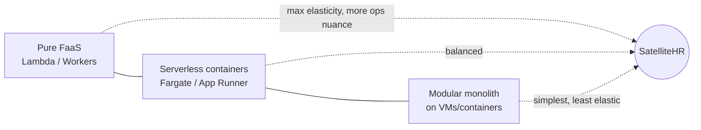
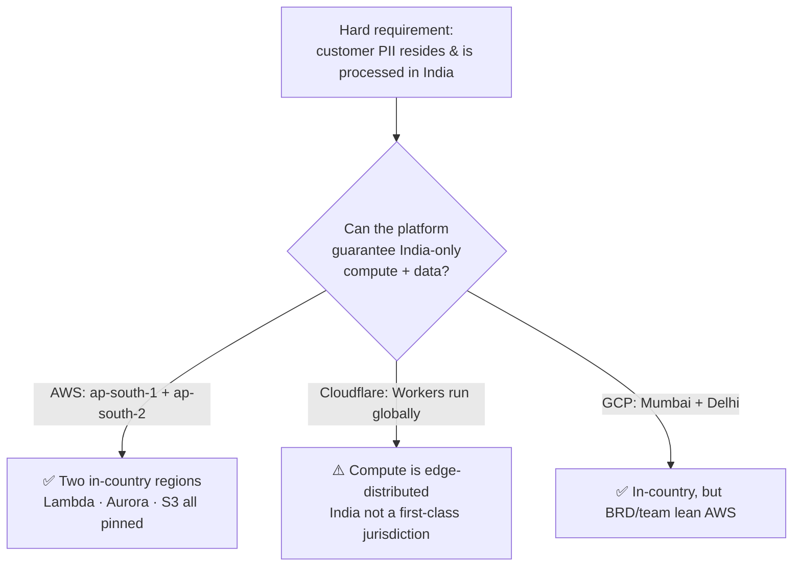
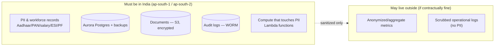
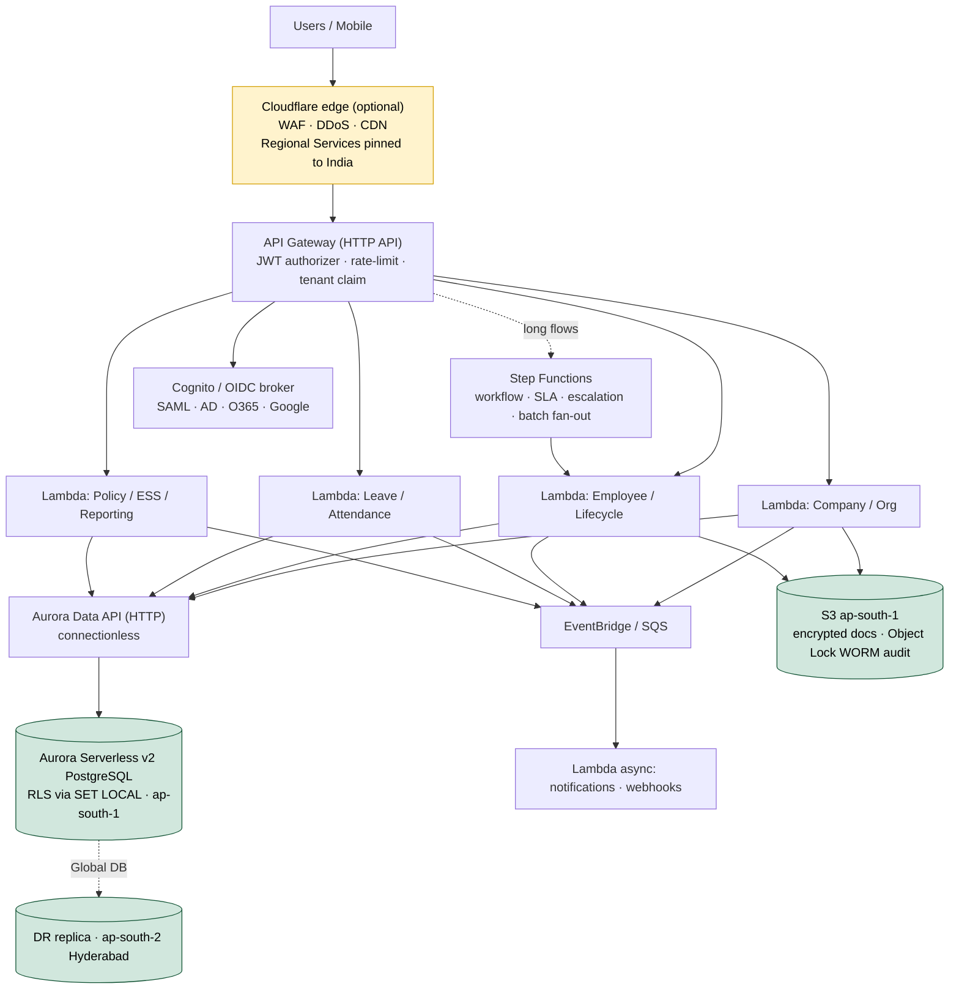

# SatelliteHR — Tech Stack & Infrastructure Comparison

> Decision-grade comparison of backend language, compute model, cloud platform, and data tier for SatelliteHR — a multi-tenant SaaS HRMS with hard India data-residency, enterprise compliance (ISO 27001 / SOC 2 / DPDP), and strict NFRs (sub-2s @ 1000 employees, 99.99% uptime, RTO 4h / RPO 15min).

**Status:** Draft v1.0 · **Companion to:** `execution.md` · **Source NFRs:** Phase I BRD §8

---

## 0. Decision summary (what we picked, and why)

| Layer | Choice | One-line rationale |
|-------|--------|--------------------|
| **Backend language** | **TypeScript** | One language with the React/TS frontend; deepest AI-codegen support; abundant India talent |
| **Framework & runtime** | **Hono** on **managed Node.js** (Lambda); **Bun** for dev/tooling + container batch | Hono's light cold-start fits pure FaaS; managed Node keeps the SOC2/ISO patching story clean (see §1.5) |
| **Compute model** | **Pure FaaS** (AWS Lambda) | Scale-to-zero elasticity, pay-per-use, no servers; with the guardrails in §7 |
| **Cloud platform** | **AWS** (`ap-south-1` Mumbai, DR `ap-south-2` Hyderabad) | Only option that satisfies **hard India residency** + Postgres-native serverless + in-country DR |
| **Data tier** | **Aurora Serverless v2 PostgreSQL** + **Data API** + **RLS** | Connectionless HTTP access (FaaS-safe), real Postgres, Global DB DR inside India |
| **Edge (optional)** | **Cloudflare** WAF/DDoS/CDN *with India Regional Services*, or **CloudFront + WAF** | Best-in-class edge security; must pin TLS termination to India |
| **Money math (Phase II)** | Postgres `NUMERIC` + decimal library | JS floats are not payroll-safe |

**The deciding constraint is data residency.** Everything below is filtered through "customer PII must reside and be processed in India" (see §5).

---

## 1. Backend language

| Criterion | .NET Core (BRD default) | **Node.js / TypeScript** | Java / Spring | Go |
|-----------|-------------------------|-----------------------------------|---------------|-----|
| Same language as React frontend | ❌ | ✅ shared types/validation end-to-end | ❌ | ❌ |
| Enterprise structure (DI, modules, guards) | ✅ | ✅ NestJS modules/guards/interceptors | ✅ | ⚠️ manual |
| FaaS cold-start | ⚠️ moderate | ✅ fast (esp. on ARM) | ❌ slow (JVM) | ✅✅ fastest |
| Native decimal/money type | ✅ `decimal` | ❌ needs `decimal.js` / PG `NUMERIC` | ✅ `BigDecimal` | ⚠️ libs |
| Talent availability (India) | ⚠️ moderate | ✅✅ deep pool | ✅ deep | ⚠️ smaller |
| AI-codegen quality | ✅ good | ✅✅ best (largest corpus) | ✅ good | ✅ good |
| ORM + migrations on Postgres | ✅ EF Core | ✅ Prisma / Drizzle | ✅ Hibernate | ⚠️ sqlc/gorm |
| OpenAPI/Swagger | ✅ Swashbuckle | ✅ `@nestjs/swagger` | ✅ springdoc | ⚠️ |

**Verdict → TypeScript.** Single-language full-stack squads + best AI leverage + deepest local talent. The one real caution — no native decimal — is fully mitigated by Postgres `NUMERIC` + a decimal library (mandatory for Phase II payroll/statutory math). *(Which TS framework + runtime is decided separately in §1.5.)*

> Deviation from BRD §8.10.2 (.NET) — must be ratified via an ADR with stakeholder sign-off, since the stack was contractually specified.

---

## 1.5 Backend framework & runtime (Hono vs NestJS · Bun vs Node)

"Use TypeScript" is two decisions, not one: the **web framework** and the **runtime**. They have different answers for a pure-FaaS, compliance-bound Lambda backend.

### 1.5.1 Framework — Hono vs NestJS

| Criterion | NestJS | **Hono** |
|-----------|--------|----------|
| Cold start on Lambda | ⚠️ heavy — bootstraps a full app context per cold start (its weak spot; pure FaaS cares most about this) | ✅✅ minimal — tiny, fast init |
| Structure for 29 modules / 6 squads | ✅✅ opinionated: modules, DI, guards, interceptors, lifecycle | ⚠️ you codify conventions yourself |
| RBAC (deny-by-default) | ✅ Guards | ✅ middleware (wire the pattern once) |
| Auto-audit on writes | ✅ Interceptors | ✅ middleware |
| OpenAPI (BRD requirement) | ✅ `@nestjs/swagger` | ✅ `@hono/zod-openapi` (zod-first, genuinely good) |
| DI / testability | ✅ built-in | ⚠️ add `awilix` / `tsyringe` |
| Edge portability (if some fns move to Cloudflare) | ❌ not edge-friendly | ✅✅ runs on Workers/Bun/Node/Lambda |
| Ecosystem / hiring familiarity | ✅✅ large | ✅ growing |

**Verdict → Hono.** For *pure FaaS*, Hono's lightness directly attacks the cold-start problem that is FaaS's main weakness, and it's edge-portable. The price is that NestJS's *structure* — the thing the paved road relies on for 6-squad consistency — becomes conventions the platform team **builds**: a DI container (`awilix`/`tsyringe`), a module-folder convention, and standard `tenant-context` / `authz` / `audit` middleware. That's a one-time platform cost, not a per-squad tax.

> NestJS stays defensible if the org values batteries-included structure over cold-start milliseconds — mitigate its cold start with provisioned concurrency on hot paths.

### 1.5.2 Runtime — Bun vs Node (on Lambda)

| Criterion | **Managed Node.js (recommended for Lambda)** | Bun on Lambda |
|-----------|----------------------------------------------|----------------|
| AWS-managed runtime (auto CVE patching) | ✅✅ yes — clean SOC2/ISO story | ❌ no managed Bun runtime → custom runtime/container, **you** patch it |
| Cold start | ✅ fast on ARM/Graviton | ✅✅ fastest |
| Ops burden | ✅ low | ⚠️ you own the runtime layer |
| Ecosystem / AWS SDK compatibility | ✅✅ reference platform | ✅ good, occasional edge cases |
| Dev/tooling speed (install, test, bundle) | ⚠️ ok | ✅✅ excellent |

**Verdict → managed Node.js for the production Lambda runtime; Bun for dev/tooling and container batch.**

- **Production Lambda → managed Node.** On Lambda there is no managed Bun runtime, so Bun means a custom runtime/container that *you* must patch — directly weakening the SOC2/ISO patching narrative for marginal cold-start gain (ARM Node + provisioned concurrency already neutralizes cold starts on hot paths).
- **Bun where it shines, without the compliance cost:** local dev, the test runner, bundling, and as the runtime for **Fargate/container batch** workloads (imports, payroll, reports). Big DX win, zero Lambda-patching risk.

> If the team explicitly wants Bun-on-Lambda (doable via container images), document it as a conscious decision that accepts ownership of runtime patching.

**Net stack:** **Hono + zod + `@hono/zod-openapi` + a light DI container, on AWS-managed Node.js Lambda; Bun for tooling + container batch.**

---

## 2. Compute model

| Criterion | **Pure FaaS (chosen)** | Serverless containers | Modular monolith |
|-----------|------------------------|------------------------|------------------|
| Scale-to-zero / pay-per-use | ✅✅ | ⚠️ scales to a floor | ❌ |
| Burst scaling ("scale like anything") | ✅✅ automatic | ✅ autoscaling | ⚠️ manual/HPA |
| Cold starts vs sub-2s NFR | ⚠️ needs provisioned concurrency | ✅ none | ✅ none |
| DB connection management | ⚠️ needs Data API / RDS Proxy | ✅ pooled in-process | ✅ pooled |
| Keeps clean module architecture | ⚠️ needs shared layers/discipline | ✅✅ | ✅✅ |
| Long batch (>15 min: imports, payroll, reports) | ⚠️ orchestrate via Step Functions | ✅ in-task | ✅ |
| Ops surface (many functions) | ⚠️ larger | ✅ smaller | ✅ smallest |
| Cost when steady-state busy | ⚠️ can exceed containers | ✅ predictable | ✅ |
| Cost when bursty/idle | ✅✅ cheapest | ⚠️ pays for floor | ❌ pays always |

**Verdict → Pure FaaS (AWS Lambda).** Chosen for maximum elasticity and pay-per-use. Non-negotiable guardrails in §7 (connections, RLS-with-pooling, cold starts, batch>15min via Step Functions, observability/IAM discipline). Long-running batch is orchestrated as fan-out across many Lambdas via Step Functions — still serverless, not a reintroduced monolith.

---

## 3. Cloud platform (filtered through hard India residency)

| Criterion | **AWS (ap-south-1/2)** | Cloudflare (Workers) | GCP (asia-south1/2) |
|-----------|------------------------|----------------------|---------------------|
| **India residency for compute** | ✅ region-pinned Lambda | ❌ Workers execute globally; `in` not first-class | ✅ region-pinned Cloud Run/Functions |
| **India residency for data** | ✅ Aurora/S3 in-region | ⚠️ D1/R2/DO India placement not guaranteed | ✅ Cloud SQL/AlloyDB in-region |
| Postgres-native serverless | ✅ Aurora Serverless v2 + Data API | ❌ no native PG (Hyperdrive→external) | ✅ AlloyDB / Cloud SQL |
| In-country multi-region DR (§8.3-4) | ✅✅ Aurora Global DB Mumbai↔Hyderabad | ⚠️ DIY, weak India story | ✅ Mumbai↔Delhi |
| Cold start | ⚠️ mitigable | ✅✅ ~0 | ⚠️ mitigable |
| Workflow engine | ✅ Step Functions | ✅ Durable Objects (great, but residency) | ✅ Workflows |
| Async / events | ✅ SQS/SNS/EventBridge | ✅ Queues (global) | ✅ Pub/Sub |
| Object store + WORM audit (§6.29) | ✅ S3 + Object Lock | ✅ R2 (India loc not guaranteed) | ✅ GCS + retention lock |
| SSO (SAML/AD/O365/Google) | ✅ Cognito / self-host | ✅ Access (brokering + residency) | ✅ Identity Platform |
| SOC2 / ISO / MeitY familiarity | ✅✅ gold standard | ✅ compliant vendor | ✅ strong |
| Edge security (WAF/DDoS/CDN) | ✅ CloudFront + WAF/Shield | ✅✅ best in class | ✅ Cloud Armor |
| **Score (this app)** | **~9 / 11** | ~2 / 11 | ~7 / 11 |

**Verdict → AWS.** With residency hard, Cloudflare's globally-executed Workers model is the disqualifier — its Data Localization Suite is EU-first and India (`in`) is not a first-class placement target for Workers/Durable Objects/D1. AWS gives **two in-country regions**, satisfying residency *and* DR simultaneously. GCP is a viable runner-up but the BRD and likely team familiarity favor AWS.

**Cloudflare still earns a role** as the **edge layer only** (WAF, DDoS, CDN) — *if* configured with **Regional Services pinned to India** so TLS termination/inspection stays in-country. Otherwise use CloudFront + AWS WAF and stay single-vendor.

---

## 4. Data tier (the real scaling bottleneck)

An HRMS scales on its database, not its compute. For pure FaaS, connection management is the make-or-break decision.

| Option | FaaS-safe connections | Postgres + RLS | India residency | DR | Verdict |
|--------|----------------------|----------------|-----------------|-----|---------|
| **Aurora Serverless v2 + Data API** | ✅✅ HTTP, connectionless | ✅ | ✅ ap-south-1 | ✅ Global DB | **Primary** |
| Aurora/RDS + **RDS Proxy** | ✅ pooled | ✅ | ✅ | ✅ | Alternative if Data API limits hit |
| Neon (serverless PG) | ✅ HTTP driver | ✅ | ⚠️ India region availability | ⚠️ | Only if India region confirmed |
| Cloudflare D1 | ✅ | ❌ SQLite, not PG; no RLS | ⚠️ | ⚠️ | ✗ (not Postgres) |
| DynamoDB | ✅ native | ❌ not relational; no RLS | ✅ | ✅ global tables | Use only for specific high-scale access patterns (e.g., sessions, audit fan-in) |

**Verdict → Aurora Serverless v2 + Data API + RLS.** Connectionless HTTP access removes the #1 FaaS failure mode. **Tenant isolation = RLS with `SET LOCAL company_id` inside each transaction** (session-level `SET` leaks across pooled/reused contexts — a P0 isolation bug). DynamoDB is a targeted supplement, not the system of record.

---

## 5. Why does (almost) everything need to be in India?

**Precise statement of the requirement:** *customer personal data (PII) must reside and be processed in India* (BRD §8.5 — "data shall reside in India unless otherwise contractually agreed"). Not literally every byte — sanitized, non-PII telemetry may live elsewhere — but the **data + compute plane** does.

### The drivers, ranked by how binding they are

| # | Driver | Binding? | What it forces |
|---|--------|----------|----------------|
| 1 | **Aadhaar & statutory IDs** | **Legally hard** | BRD captures Aadhaar, PAN, passport, UAN, ESIC (§6.9.6-7). The Aadhaar Act / UIDAI rules require Aadhaar data stored in India, encrypted, with strict access control. This alone pins the data plane in-country. |
| 2 | **Customer contracts / procurement** | **Commercially hard** | Indian enterprises, BFSI, and government buyers routinely mandate data localization in RFPs. For an HRMS holding salary, performance, and grievance data, "never leaves India" is a deal-maker. |
| 3 | **DPDP Act 2023** | **Safe default** | India's data-protection law doesn't hard-localize *all* data (negative-list model for cross-border transfer), but empowers the government & sector regulators to restrict transfers. Keeping PII in India is the posture that survives future tightening. |
| 4 | **Sectoral regulators** | Conditional | Customers in regulated sectors (banking, insurance) inherit stricter localization (e.g., RBI payment-data localization) that flows down to their HRMS vendor. |
| 5 | **Latency & sub-2s NFR (§8.1)** | Soft | Primary users are in India; in-country regions give the sub-2s budget real headroom vs cross-border round-trips. |
| 6 | **Audit & labour inspection** | Soft | EPF/ESI/PT data tied to Indian government systems; auditors and labour inspectors expect in-country, readily producible records. |

### What this rules in and out

**Why this kills Cloudflare-as-backend (recap):** if the *function that processes Aadhaar/salary* can execute in any of 300+ global edge locations, you cannot truthfully attest "processed in India." Region-pinned AWS Lambda can. That's the whole ballgame for driver #1 and #2.

**The pragmatic rule we adopt:** keep the entire data + compute plane in `ap-south-1` (DR in `ap-south-2`); allow only PII-scrubbed metadata to leave India. This keeps the SOC2/ISO/DPDP narrative simple and defensible to any auditor or enterprise buyer.

---

## 6. Recommended target architecture (consolidated)

**Service map**

| Concern | Service |
|---------|---------|
| API / routing | API Gateway (HTTP API) |
| Compute | AWS Lambda (ARM/Graviton, TypeScript) |
| Database | Aurora Serverless v2 PostgreSQL + Data API + RLS |
| DR | Aurora Global DB (ap-south-1 → ap-south-2) |
| Object storage | S3 + Object Lock (docs, WORM audit) |
| Workflow / SLA | Step Functions + EventBridge Scheduler |
| Async / events / webhooks | EventBridge, SQS, SNS |
| AuthN / SSO | Cognito or self-hosted OIDC broker |
| AuthZ | Policy-as-code (OPA/Cedar) + RLS |
| Secrets / keys | Secrets Manager + KMS (AES-256) |
| Observability | CloudWatch + X-Ray (tracing with company_id/correlation_id) |
| Edge security | Cloudflare (India Regional Services) or CloudFront + WAF |
| IaC | Terraform / AWS CDK |

---

## 7. Pure-FaaS guardrails (so it's bulletproof, not just elastic)

| Gotcha | Why it bites | Mitigation |
|--------|--------------|------------|
| DB connection exhaustion | Lambda fan-out overwhelms Postgres | **Aurora Data API** (connectionless) or RDS Proxy |
| **RLS tenant leak** | Session `SET` persists across reused execution contexts | `SET LOCAL company_id` **inside each transaction**; isolation test on every build |
| Cold start vs sub-2s | First-hit latency on hot paths | Provisioned concurrency, ARM/Graviton, keep Lambdas **out of VPC** (Data API avoids VPC) |
| 15-min / memory limits | 10k-row imports, payroll batch, big reports | Orchestrate fan-out via **Step Functions** |
| Decimal money math | JS float ≠ payroll-safe | Postgres `NUMERIC` + decimal lib; lint-ban `float` for money |
| Observability sprawl | Dozens of functions | X-Ray + structured logs keyed on company_id/correlation_id; per-domain dashboards |
| Shared code duplication | Many small functions | Lambda Layers / shared internal package; one deployment pipeline |
| Per-function IAM | Over-broad permissions | Least-privilege role per function; deny-by-default |

---

## 8. Cost model notes

- **FaaS is cheapest when bursty/idle** (HR traffic is exactly this — peaks at payroll/leave cycles, quiet otherwise) and can *exceed* containers under sustained high load. Monitor per-tenant invocation volume.
- **Provisioned concurrency** is both a latency lever and a cost lever — apply only to latency-critical paths (login, context switch, dashboards).
- **Aurora Serverless v2** scales ACUs with load; set sane min/max to avoid runaway cost while meeting sub-2s.
- **Data egress** is a hidden cost — keeping everything in-region (India) also minimizes cross-AZ/cross-region transfer charges.

---

## 9. Decision log → ADRs (to add in `execution.md`)

| ADR | Decision |
|-----|----------|
| ADR-002 (revised) | Modular architecture expressed as TypeScript Lambda handlers with shared layers |
| ADR-009 | Backend language = TypeScript, superseding BRD §8.10.2 .NET — with stakeholder sign-off |
| ADR-014 | Framework = Hono (+ zod / `@hono/zod-openapi` / DI container); runtime = AWS-managed Node.js for Lambda, Bun for dev/tooling + container batch |
| ADR-010 | Compute = Pure FaaS on AWS Lambda, ap-south-1 primary + ap-south-2 DR |
| ADR-011 | Data tier = Aurora Serverless v2 + Data API + RLS (`SET LOCAL`) |
| ADR-012 | Data residency = India-only data+compute plane; sanitized metadata only may egress |
| ADR-013 | Edge = Cloudflare (India Regional Services) or CloudFront + WAF |

---

*This document is a companion to `execution.md`. Where they differ, the ADRs above are the source of truth pending ratification.*
