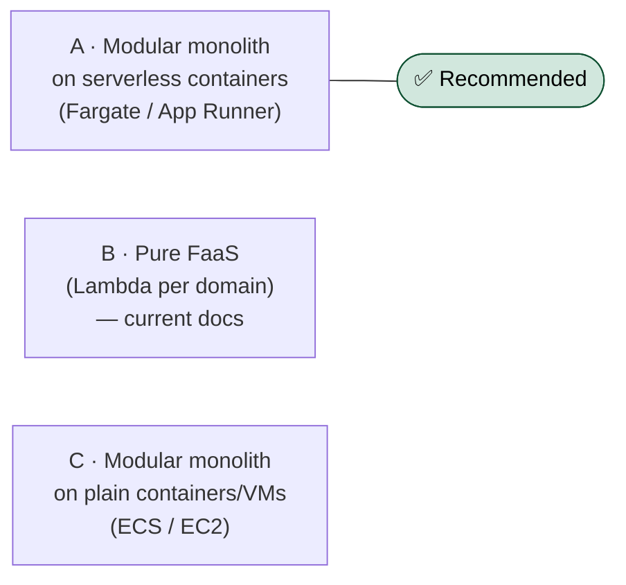
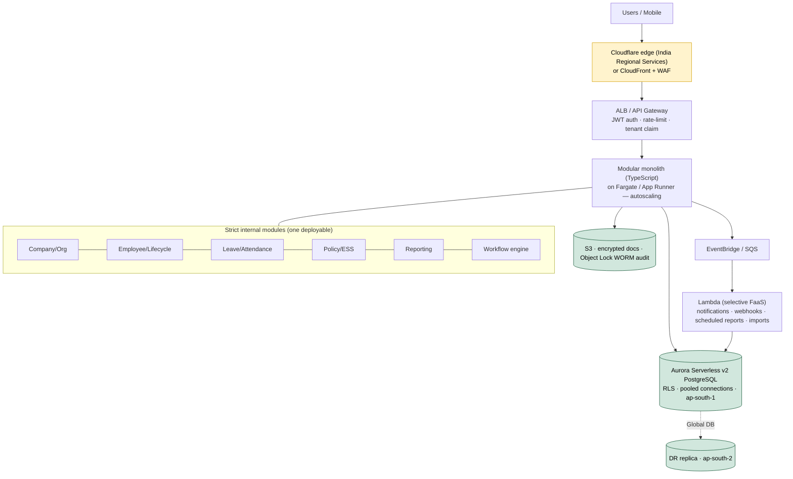

# SatelliteHR — Execution Architecture (small-team edition)

> How to build **full Phase I** with a **4–10 person team**, as fast as possible without losing enterprise-grade correctness. This document compares execution-architecture options and recommends one. It **re-scopes the pure-FaaS / multi-squad assumptions** in `execution.md` and `TECH-STACK-AND-INFRA-COMPARISON.md` for the real team size.

**Status:** Draft v0.1 (recommendation pending confirmation) · **Companion to:** `execution.md`, `TECH-STACK-AND-INFRA-COMPARISON.md`

---

## 0. Context & constraints (what actually drives this)

| Constraint | Value | Implication |
|------------|-------|-------------|
| Team size | **4–10 people** | No 5–6 squad model; 1–2 pods working a shared codebase sequentially |
| Scope | **Full Phase I (29 modules)** + platform foundation | Long haul — realistically **~12–18 months** with heavy AI assist |
| Compliance | **Deferred** (SOC 2 / ISO later) | Keep good habits (encryption, audit, RLS, controls-as-code) but no formal evidence program yet — faster now |
| Residency | **India hard** (unchanged) | AWS `ap-south-1` + `ap-south-2` DR; data + compute in India |
| NFRs | sub-2s @ 1000 emp, 99.9x uptime, RTO 4h/RPO 15min | Achievable on all options below; not a differentiator at this team size |

**Design principle for a small team: fewer moving parts wins.** Optimize for throughput-per-engineer and low ops burden, not for a scale problem you don't have yet.

---

## 1. What stays constant (team-size-independent)

These do **not** change regardless of which option below we pick — they're the "bulletproof" core:

- **Tenant isolation** = PostgreSQL **RLS** (`SET LOCAL company_id` per transaction) + app-layer filter + isolation tests on every build.
- **Identity invariant**: User ≠ Employee ≠ Contractor.
- **Audit from day one** (append-only, hash-chained).
- **Traceability** (every feature → BRD ID → test), **TDD + quality gates**, **AI in every loop**.
- **TypeScript** end-to-end; **Aurora PostgreSQL**; **S3** for documents; **India residency**.
- **Strict internal module boundaries** (so the codebase stays comprehensible and a piece can be extracted later).

The only thing under debate here is **how the backend is packaged and deployed** — monolith vs functions, serverless vs managed containers.

---

## 2. The three options

### Comparison (lens: 4–10 person team building full Phase I)

| Criterion | **A · Monolith on serverless containers** | B · Pure FaaS (Lambda) | C · Monolith on plain containers |
|-----------|-------------------------------------------|------------------------|----------------------------------|
| Time-to-first-module | ✅✅ fast | ❌ slow (build paved road, per-fn IAM, DI/middleware first) | ✅ fast |
| Small-team velocity | ✅✅ one codebase, one deploy | ⚠️ context-switching across many fns | ✅ one codebase |
| Ops burden | ✅ low (no servers, autoscaling) | ❌ high (100s of fns, IAM, observability sprawl) | ⚠️ you manage scaling/capacity |
| Local dev simplicity | ✅✅ run the app locally | ⚠️ emulate Lambda/Step Functions | ✅✅ |
| DB connections | ✅ pooled in-process | ⚠️ needs Data API / RDS Proxy | ✅ pooled in-process |
| Cold start vs sub-2s | ✅ none | ⚠️ needs provisioned concurrency | ✅ none |
| Burst scaling | ✅ autoscaling tasks | ✅✅ automatic | ⚠️ manual / HPA |
| Cost when idle | ⚠️ small always-on floor | ✅✅ scale-to-zero | ⚠️ pays always |
| Cost predictability | ✅ predictable | ⚠️ per-invoke, can surprise | ✅✅ |
| Enterprise-safe (RLS/audit/isolation) | ✅ identical | ✅ identical | ✅ identical |
| Path to extract a service later | ✅ clean boundaries → lift one out | ✅ already split (overly) | ✅ clean boundaries |
| India residency | ✅ region-pinned | ✅ region-pinned | ✅ region-pinned |

### Verdict → **Approach A**

A modular monolith on **Fargate/App Runner** is the smallest enterprise-safe architecture that still autoscales and stays in India. It gives a small team the fastest path to shipping modules, the lowest ops burden, and trivial local dev — while keeping every "bulletproof" guarantee. The only real trade-off (a small always-on cost floor instead of scale-to-zero) is negligible at this stage.

- **Approach B (pure FaaS)** is right for a *large org at extreme, spiky scale* — it optimizes for a problem you don't have yet, at the cost of the velocity you need now.
- **Approach C** is fine but you'd hand-manage scaling for no real gain over A.

---

## 3. Recommended architecture (Approach A, concrete)

A single TypeScript service (Hono or NestJS) with strict module boundaries, on autoscaling containers, with **Lambda used only for async/batch** — the pragmatic "monolith + selective FaaS" shape.

**Service map (deltas from the pure-FaaS doc in bold)**

| Concern | Service |
|---------|---------|
| Compute | **Fargate / App Runner (autoscaling containers)** — not per-endpoint Lambda |
| API | ALB or API Gateway (HTTP API) |
| Async / batch | **Lambda + EventBridge/SQS** (selective only) |
| Database | Aurora Serverless v2 PostgreSQL + RLS (**pooled in-process**, no Data API needed) |
| DR | Aurora Global DB (ap-south-1 → ap-south-2) |
| Object storage | S3 + Object Lock |
| Workflow | **In-app data-driven workflow engine** (config in DB, interpreted at runtime) — see §4 |
| AuthN / SSO | Cognito or self-hosted OIDC broker |
| AuthZ | Policy-as-code + RLS |
| Observability | CloudWatch + OpenTelemetry traces (company_id/correlation_id) |
| IaC | Terraform / AWS CDK |

---

## 4. Two architecture catches this surfaces (independent of A/B/C)

1. **Workflow engine is a product feature, not infra orchestration.** The BRD wants company admins to configure approval chains, conditional routing, SLAs, and escalations **at runtime**. AWS Step Functions orchestrates *infrastructure*, not user-defined runtime workflows. We need a **data-driven workflow engine** (definitions stored in Postgres, interpreted by the app, with a durable timer/queue for SLA + escalation). ~15 modules depend on it — it's a first-class build, not a library call.
2. **Reporting will strain the OLTP DB.** Consolidated/ad-hoc reporting at sub-2s belongs on a **read replica** (or a small analytics store), not the primary write path.

Both apply regardless of the compute choice and should be designed early.

---

## 5. Relationship to the other docs

- This document **revises ADR-002 and ADR-010** (pure FaaS → modular monolith on serverless containers + selective FaaS) for the 4–10 person team. ADR-001 (RLS tenancy), 003 (identity), 005 (authz), 006 (audit), 009 (TypeScript), 012 (residency), 013 (edge) are **unchanged**.
- `TECH-STACK-AND-INFRA-COMPARISON.md` §2 (compute model) had "Serverless containers" as the balanced option — **that becomes the pick** at this team size; the doc's pure-FaaS verdict was predicated on a larger org.
- Once the approach is confirmed, `execution.md` should be re-scoped (squad model → pod model, timeline → ~12–18 mo, architecture diagram → §3 here).

---

## 6. Open decisions (to confirm before this is finalized)

- [ ] **Confirm Approach A** (vs sticking with pure FaaS B, or plainer C).
- [ ] **Framework within A:** NestJS (batteries-included structure, ideal for a monolith) vs Hono (lighter; less needed now that cold-start isn't the driver). *For a monolith, NestJS's structure is the better fit — the cold-start argument that favored Hono no longer applies.*
- [ ] **Team split** (full-stack vs FE/BE) — drives module sequencing.
- [ ] **Workflow engine** design (§4.1) — build as a dedicated early epic.
