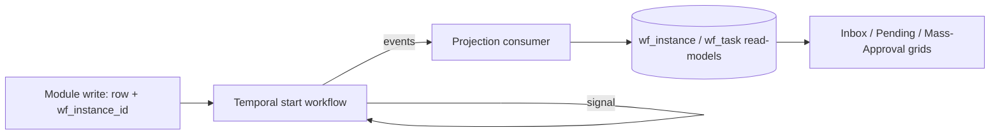

# Canonical Conventions — Single Source of Truth

This document **supersedes any conflicting fragment** in the other design docs. It exists because the
roadmap/system/DB/HLD/LLD documents were authored in parallel and drifted on a few shared constructs.
Where another doc disagrees with this one, **this one wins** — the others have been reconciled to match.

> Status of the original design review (`00-README.md`): every showstopper (§1.1–§1.6) and housekeeping
> item (§1.7) is resolved here or in the doc named. The coverage gaps (§2) are resolved in §7–§8 below.

---

## 1. Tenancy & RLS (resolves review §1.1, §1.7)

- **The tenant key is `tenant_id` (uuid), everywhere.** `company_id` is abolished. The real multi-company
  concept is `legal_entity_id` (a domain attribute on `work_relationship`, used for config resolution and
  statutory grouping) — it is **not** a tenant boundary.
- **GUC:** `app.tenant_id`, always set with **`SET LOCAL`** (transaction-scoped — session `SET` leaks across
  pooled checkouts). Optional `app.legal_entity`, `app.actor_id` likewise `SET LOCAL`.
- **Every tenant table** installs RLS via one helper (USING **and** WITH CHECK, so a tenant can neither read
  nor write another tenant's id), and the runtime role is `NOBYPASSRLS`:

```sql
CREATE OR REPLACE FUNCTION install_tenant_rls(tbl regclass) RETURNS void LANGUAGE plpgsql AS $$
BEGIN
  EXECUTE format('ALTER TABLE %s ENABLE ROW LEVEL SECURITY', tbl);
  EXECUTE format('ALTER TABLE %s FORCE  ROW LEVEL SECURITY', tbl);
  EXECUTE format($p$CREATE POLICY tenant_isolation ON %s
     USING       (tenant_id = current_setting('app.tenant_id')::uuid)
     WITH CHECK  (tenant_id = current_setting('app.tenant_id')::uuid)$p$, tbl);
END $$;
```

- **Temporal activities & Kafka consumers run outside the request transaction.** They MUST re-establish the
  GUC from the pinned context at the start of every unit of work:
  `BEGIN; SET LOCAL app.tenant_id = $tenantId; … ; COMMIT;` — the tenant id travels on the workflow input /
  message header, never inferred.
- Global dimension tables (`config_blob`, `ref_country`, `ref_currency`) are intentionally **not** RLS-fenced.

---

## 2. Bitemporal encoding (resolves review §1.2)

One encoding, used by every effective-dated entity (`assignment`, `position_detail`, `org_edge`, config bindings, …):

| Axis | Column | Meaning |
|---|---|---|
| Valid time | `effective daterange` (`[lo, hi)`, `'-infinity'`/`'infinity'` bounds) | the real-world window the fact is true |
| Transaction time | `sys_period tstzrange NOT NULL DEFAULT tstzrange(now(), null)` | when the DB believed it |
| **Current belief** sentinel | `upper(sys_period) IS NULL` | the one canonical predicate (never `tx_to = 'infinity'`) |
| Correction | close old row's `sys_period`, insert new row, same `effective`, fresh `sys_period` | beliefs are never destroyed |

The scalar-column variant (`valid_from/valid_to/tx_from/tx_to`) is **superseded** (was in an early Roadmap draft).
`assignment` carries both `assignment_id` (stable logical link, survives corrections) and `slice_id` (the physical row; PK is `(tenant_id, slice_id)`). **Snapshot pinning** (`config_snapshot`) lives on **workflow instances and accrual computations only** — never as a column on every domain slice.

---

## 3. Keys & foreign keys (resolves review §1.3)

- Surrogate PKs: `uuid` (UUIDv7/ULID preferred). Business keys are separate `UNIQUE (tenant_id, …)`.
- **Aggregate-to-aggregate FKs are composite** and carry the tenant: `FOREIGN KEY (tenant_id, x_id) REFERENCES x (tenant_id, x_id)` — a cross-tenant join becomes physically unstorable.
- **Anchor FKs are single-column.** The three immutable single-row anchors — `person`, `work_relationship`,
  `position` — each carry a dedicated single-column `UNIQUE (x_id)` on their globally-unique surrogate, so
  `REFERENCES person(person_id)` is valid. The child still stores `tenant_id` and is RLS-fenced.

---

## 4. Configuration storage (resolves review §1.4)

Three tables — **content**, **placement**, **pin** — plus the typed spine. (Full DDL in `05-LLD.md §0` and the
typed-spine view in `03-DB-DESIGN.md §3`.)

| Table | Role | Key |
|---|---|---|
| `config_blob` | immutable content, deduplicated; `schema_version` pinned | `hash` (PK), global |
| `config_binding` | effective-dated, tenant-scoped binding of a blob to a `(domain, name, scope, layer)` key | `(tenant_id, binding_id)`; EXCLUDE over key×valid×txn |
| `config_snapshot` | a pinned manifest `{ "<domain>/<name>": "<hash>" }` for an instance/computation | `(tenant_id, snapshot_id)` |
| `config_type` / `config_object` | the typed spine: JSON-Schema per type, logical identity per object | see DB §3 |

Content-addressing (hash) is **not** the bitemporal key — the same payload may be bound in many windows.
Resolution = deep-merge `global → industry → tenant → legal_entity`, hashed; publish is a **validation gate**
(JSON-Schema + cross-config invariants via the Rules engine). Caches keyed by `cfg:{tenant}:{hash}`, invalidated
by a per-tenant monotonic epoch.

---

## 5. Workflow persistence — Temporal is the source of truth (resolves review §1.5)

- **System of record = Temporal.** A process instance's live state, timers, history, and human decisions
  (Temporal **signals**) live in Temporal. The process definition is a **versioned JSON graph pinned per
  instance** (`graph_hash` + `config_snapshot` captured at start).
- **`wf_definition` is authored config** (the only Postgres-authoritative workflow table).
- **`wf_instance` / `wf_task` are CQRS read-models**, projected from Temporal (via Temporal Visibility +
  a consumer off the workflow event stream) to serve inbox / "Pending …" / "Mass Approval" grids cheaply.
- **Module rows reference workflow by an opaque id, never by FK.** `wf_instance_id uuid` (nullable until
  submitted) + denormalized `approval_status text` are plain columns — **no `REFERENCES wf_instance`** (the
  read-model is eventually consistent; a FK would dangle at write time). `wf_task → wf_instance` FK is allowed
  *within* the read-model since both are projected together.



---

## 6. Shared reference-data & expression conventions (resolves review §1.7)

- **One lookup API:** `ref_code(code_set, code)` (PK `(tenant_id, code_set, code)`), referenced in comments as
  `-> ref_code('exit_type')`. `ref_value` / `ref_set` / `ref_value_label` naming is abolished.
- **One expression language:** non-Turing-complete **CEL**, shared by Rules, Forms visibility, template
  conditionals, workflow guards, scheduler conditions. Typed context; AST/step/iteration limits; activations
  fully materialized before evaluation (no lazy I/O). Termination is guaranteed; **cost** is bounded only by the
  explicit limits.
- **Approver/position references resolve by id, as-of a date** — display strings like `"HR Manager"` are
  resolved to the position/role id effective on the instance's start date (names change; the binding must not).

---

## 7. The sixth engine — Scheduler / Temporal-Alert engine (resolves review §2.1)

The Notification engine is **event-driven** (outbox). Many crawled capabilities are **time-driven** — *"it is now
T and condition C holds"* — which no event covers. These get a dedicated **Scheduler/Temporal-Alert engine (L3)**.

**Owns (grounded in the crawl):** `CONFIG·Alerts` (Setup, Configure Alerts), `CONFIG·Orientation·Notification
Rule`, `CONFIG·Organization·Schedule Job`, `CONFIG·Attendance·Audit Recurrence Pattern`; and time-condition
triggers the modules assume — certification expiry (`My Certifications · Valid till`), work-permit/visa/passport
& candidate-document expiry (`candidate_document.expires_on`), probation/confirmation windows, contract end,
notice-period reminders, FFS SLAs.

**Design:** a durable scheduler (Temporal Schedules/cron + timers) drives two trigger kinds —
(a) **cron jobs** (`schedule_job` config) and (b) **alert rules** (`alert_rule`: a CEL `condition` over a target
entity-set + a cadence). On fire, the engine evaluates the CEL condition against the (bitemporal, as-of-now)
data and **emits a domain event** to the Notification engine (reminder) and/or starts a Workflow (e.g., re-verify
right-to-work). It never sends directly — it feeds the existing engines.

```sql
CREATE TABLE alert_rule (
  tenant_id   uuid NOT NULL,
  rule_id     uuid NOT NULL DEFAULT gen_random_uuid(),
  name        text NOT NULL,
  target      text NOT NULL,              -- entity-set: 'certification','work_permit','probation', …
  condition   text NOT NULL,              -- CEL, e.g. days_until(target.valid_to) <= 30
  cadence     text NOT NULL,              -- cron / 'daily'
  action      jsonb NOT NULL,             -- { notify: <template>, escalate?: <approver>, startWorkflow?: <type> }
  enabled     boolean NOT NULL DEFAULT true,
  PRIMARY KEY (tenant_id, rule_id)
);
SELECT install_tenant_rls('alert_rule');
```

This makes the engine count **six**: Workflow/Approval · Rules · Forms/UDF · Notification · Accrual/Balance/Time · **Scheduler/Alert**. Update HLD §6 and LLD accordingly.

---

## 8. Coverage decisions for the remaining gaps (resolves review §2.2–§2.9)

| Gap | Decision / owner |
|---|---|
| **Bulk / data-import** (`Mass update of Employee Data`, `Bulk Resume Upload`, `Manual Attendance Sheet`, `Import Data` + `Import Data Log`, `Bulk Resource Assignments`) | A first-class **Import framework**: `import_batch` (staging) → validate (schema + cross-refs + bitemporal valid-time correctness) → dry-run preview → commit; every batch writes an immutable `import_log`. It is the *only* sanctioned path for loading legacy/historical data into the bitemporal model. Lands in Phase 0 (used by Phase 1 onboarding migration). |
| **Reporting / analytical plane** (`Organization·Reports`, ~50% of an HRMS) | Operational↔analytical split: CDC → lakehouse; an **as-of bitemporal** semantic layer; **field-level security + tenant isolation projected into the warehouse** (the OLTP Cedar field-masks are compiled into row/column policies on the warehouse). Add an explicit **Reporting** track spanning Phases 1–3 (each module ships its marts with it). It is a named deliverable, not a box. |
| **Benefits** (Gratuity / Group Health / Medical Insurance, per-position access) | Real schema: `benefit_plan`, `eligibility_group` (CEL rule), `enrollment_window`, `election`, `nominee/dependant`. **Gratuity is an accrual** → modeled on the Accrual/Balance engine (§ engine #5), not bespoke. Field/position access via Cedar ABAC. |
| **Shared Party/Vendor model** (`Vendor`, `Vendor Management`, `Travel Vendors`, `Manage External Trainers`, asset suppliers) | One shared `party` entity (role-tagged: vendor / trainer / supplier) referenced by Asset, Travel, Learning — no per-module vendor tables. |
| **Acumatica / GL integration** (`Acumatica Integration`, `CONFIG·Integrations`) | A second anti-corruption adapter alongside payroll: HRMS emits GL-posting events; the ERP boundary stays vendor-owned. |
| **Anonymous Feedback/Grievance** vs mandatory audit | Reconciled: an anonymous submission writes the **business row with no `actor_id`** (or a per-submission pseudonym); the **audit log still records the action** with a redacted/pseudonymous actor + the fact that anonymity was elected. Anonymity is a property of the *business record*, not a hole in the audit chain. |
| **Attendance-audit sub-process** (`Audit Configuration Settings`, `Attendance Auditors Group`, `Audit Recurrence Pattern`) | A recurring **business** audit (distinct from the security audit log): owned by the Attendance context, scheduled by the Scheduler engine (§7), routed through Workflow. |
| **Ownership** | `Quadrant Rating` → **Performance** context. `Confirmation` → its own context under Performance. (Remove the duplicate Core-HR ownership.) |

---

## 9. Reconciliation status (against `00-README.md` review)

| Review item | Status | Where |
|---|---|---|
| §1.1 tenant key (`company_id`→`tenant_id`) | ✅ fixed | `03` (159 sites), §1 here |
| §1.2 `assignment` defined 3 ways | ✅ fixed | `03` canonical; `01` reconciled; §2 here |
| §1.3 invalid single-column FKs | ✅ fixed | anchor `UNIQUE(x_id)` added in `03`; §3 here |
| §1.4 config content vs placement | ✅ fixed | `05` split into blob/binding/snapshot; §4 here |
| §1.5 workflow SoT split | ✅ resolved | Temporal SoT + read-model projection; §5 here |
| §1.6 accrual ledger holds | ✅ fixed | `01` ledger has `state`/`expires_at`/`work_rel_id`; §2/§7 |
| §1.7 ref-data API, SET LOCAL, WITH CHECK, snapshot over-pin, approver-by-name | ✅ fixed | `03`/`05` + §1,§2,§6 here |
| §2.1 missing scheduler/alert engine | ✅ added | §7 here (6th engine) |
| §2.2–§2.9 coverage (import, reporting, benefits, vendor, GL, anonymity, attendance-audit, ownership) | ✅ decided | §8 here |

_All five design docs should be read with this file as the controlling reference._
