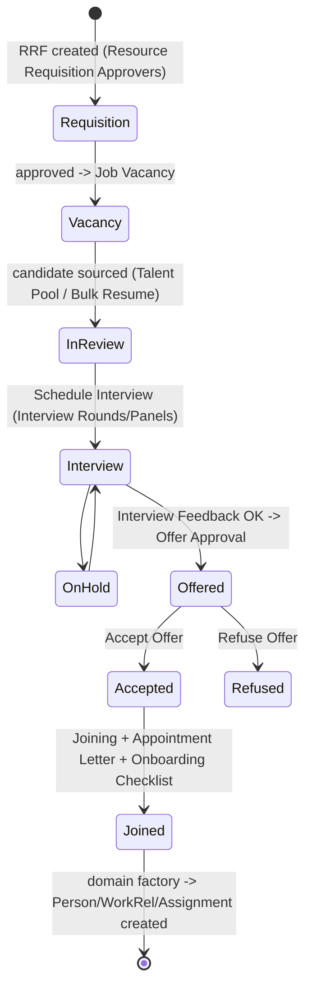
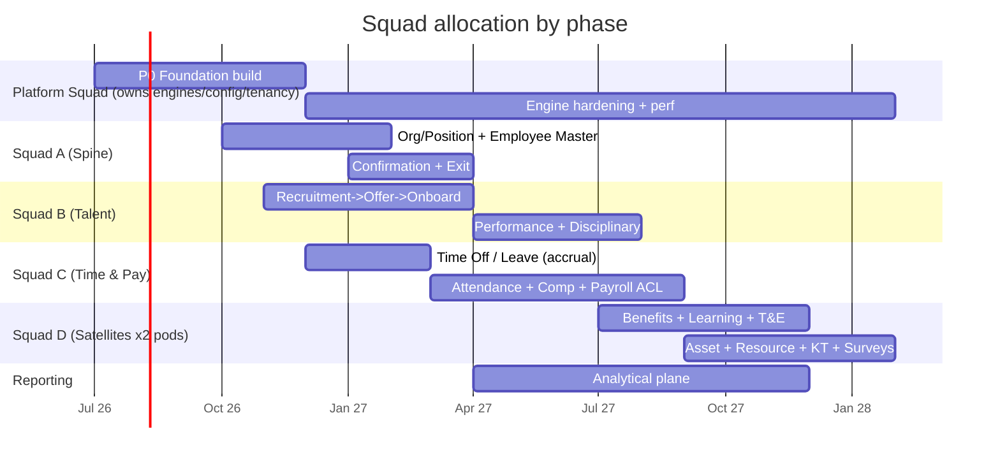
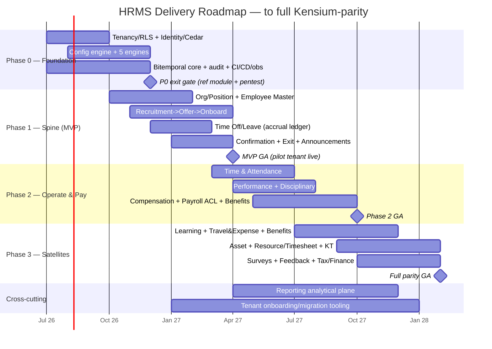

# Delivery Roadmap — Config-Driven Multi-Tenant HRMS (Kensium HR v6 Parity)

This roadmap sequences the ~30 crawled modules (305 screens) onto four delivery phases. The ordering is not arbitrary: it is forced by the dependency structure of a config-driven, bitemporal platform. Capabilities ship at build time; tenant behavior is selected at runtime. Therefore **engines and the config spine must exist before any tenant-facing module can be configured**, and the **canonical Person/Position model must exist before any module that references an employee**. Every phase below cites the exact crawled module/screen names it delivers so parity is auditable.

---

## 1. Guiding sequencing principles

1. **Engines before modules.** A leave module is ~80% accrual-engine + workflow-engine + forms-engine + config; only ~20% is leave-specific. The same five engines power leave, attendance, OT, comp-off, expenses, learning approvals, and confirmation. Build the engines once (Phase 0), then modules become *configuration + thin domain glue*.
2. **The spine before the limbs.** `Organization` (Position List, Department, Location, Employee Classification) and the canonical Person/Work-relationship/Position/Assignment lifecycles are referenced by *every* other module. They are the literal first dependency.
3. **Source-of-record before consumers.** `Employee Master` is the join target for Recruitment (Joining → Employee), Leave (balances per employee), Attendance, Performance, Compensation, Benefits, and all satellites. It cannot be late.
4. **Money modules need the most ground truth.** Compensation/payroll-integration consumes Attendance (LOP, OT), Leave (unpaid days), Salary Revision, and Arrears — so it lands in Phase 2, after its inputs exist.
5. **Config is a product, not an afterthought.** The crawl shows **191 CONFIG screens across ~30 config modules**. Each tenant-facing module ships *with its config screens in the same phase* (e.g., `CONFIG · Time Off / Leave` ships with the Leave module). Config screens are generated from the same JSON-Schema that governs the JSONB payload, so they are cheap once the config engine exists.

---

## 2. MVP definition

The MVP is the **smallest slice that lets one real tenant run hire-to-retire end to end with versioned config and bitemporal history** — i.e., the exit of Phase 1, not a sub-slice of it. A narrower MVP (e.g., "just Employee Master") cannot be sold because an HRMS with no leave, no onboarding, and no approvals is not an HRMS.

**MVP = Phase 0 (all of it) + Phase 1 core:**

| Capability | Crawled modules in MVP |
|---|---|
| Stand up a tenant from a template | `CONFIG · Organization` (Head Office, Localization Settings, Location, Work Area, Employee Classification, Group, Role, Assign Roles), `CONFIG · General` (Department, Shift) |
| Define org & positions | `Organization` (Position List, Org Chart, Hierarchy Chart) |
| Hire a person | `Recruitment` (Requisition List → Job Vacancy → In Review → Schedule Interview → Interview Feedback → Offer Approval → Offer Letter → Accept Offer → Joining Letter), `Employee Management` (Onboarding Checklist, New Joinees) |
| Become an employee of record | `Employee Management` (Employee Master) |
| Take leave with real balances | `Leave Management` (Apply Time Off, My Time Off Summary, Holiday List, Employee Time Off Requests + Summary) on the **accrual ledger** |
| Communicate | `Organization` (Announcements, Policies, Employee Acknowledgements) |
| Confirm & exit | `More` (Confirmation Review), `Employee Management` (Exit List, Exit HR CheckList, Exit Clearance List) |

**MVP exit gate:** a seeded tenant can run requisition → offer → onboard → employee → leave-with-accrual → confirmation → exit, with every state transition driven by the **workflow engine** on a pinned process version, every form driven by the **forms/UDF engine**, every decision by the **rules engine**, every notification by the **template engine**, every balance by the **accrual engine** — and every record carrying valid-time + transaction-time. If any transition is hard-coded rather than config-resolved, the MVP gate fails.

---

## 3. Module dependency graph

```mermaid
graph TD
  subgraph P0["Phase 0 — Platform Foundation"]
    TEN[Tenancy + RLS + Control Plane]
    IAM[Identity OIDC/SCIM + RBAC + Cedar ABAC]
    CFG[Config Engine -- typed spine + JSON-Schema JSONB]
    EWF[Engine: Workflow/Approval -- Temporal]
    ERL[Engine: Rules -- decision tables + CEL]
    EFM[Engine: Forms / UDF]
    ENT[Engine: Notification / Outbox]
    EAC[Engine: Accrual / Balance / Time]
    AUD[Audit hash-chain + crypto-shred]
    DOM[Bitemporal Core Domain -- Person/WorkRel/Position/Assignment]
    OBS[CI/CD + Observability + Integration spine]
  end

  subgraph P1["Phase 1 — Hire-to-Retire Spine"]
    ORG[Organization / Position]
    EMP[Employee Master]
    REC[Recruitment -> Offer -> Onboarding]
    LEV[Time Off / Leave]
    EXIT[Exit / Offboarding]
    CONF[Confirmation]
    ANN[Announcements / Policies]
  end

  subgraph P2["Phase 2 — Operate & Pay"]
    ATT[Time & Attendance]
    PERF[Performance + Quadrant + Peer/Periodic]
    DISC[Disciplinary + Appreciation]
    COMP[Compensation + Salary Revision + Arrears]
    PAY[Payroll Integration ACL]
    BEN[Benefits]
  end

  subgraph P3["Phase 3 — Satellites"]
    LRN[Learning / Training / Certifications]
    TNE[Travel & Expense]
    AST[Asset Tracking]
    RES[Resource Mgmt / Timesheets / Projects]
    SUR[Surveys]
    FBK[Feedback / Grievance]
    KT[Knowledge Transfer]
    TAX[Tax Planning / Finance]
    ORI[Orientation / Induction]
  end

  P0 --> ORG
  DOM --> ORG --> EMP
  CFG --> ORG
  EAC --> LEV
  EWF --> REC & LEV & EXIT & CONF
  EMP --> LEV & EXIT & CONF & ANN
  REC --> EMP
  EMP --> ATT & PERF & DISC & COMP & BEN
  EAC --> ATT
  ATT --> PAY
  LEV --> PAY
  COMP --> PAY
  COMP --> TAX
  EMP --> LRN & TNE & AST & RES & SUR & FBK & KT
  RES --> KT
  ORG --> ORI
```



The graph makes the build order non-negotiable: **everything fans out of Phase 0 engines + the bitemporal domain → Org/Position → Employee Master.** Payroll integration sits at a confluence (Attendance ∩ Leave ∩ Compensation), which is exactly why it is the *last* thing in Phase 2, not Phase 1.

---

## 4. Phase 0 — Platform Foundation

**Goal:** Ship the L1–L4 substrate so that subsequent phases are "configure + thin glue," not "build from scratch." Nothing in Phase 0 is tenant-facing; the deliverable is a platform a feature squad can build a module on in days.

### Included work (not crawled modules — these are the platform under them)

| Area | What ships | Maps to architecture decision |
|---|---|---|
| Multi-tenancy | Control-plane tenant catalog; POOL (shared schema + `tenant_id`) with **forced Postgres RLS**; BRIDGE (schema-per-tenant) and SILO (db-per-tenant) provisioning paths; one image, one migration pipeline | #2 |
| Identity & authz | OIDC/SAML federation per-tenant IdP; **SCIM** inbound provisioning; tenant-scoped RBAC; **Cedar ABAC** for field/row sensitivity (comp, national id, leave reason, performance) | #7 |
| Config engine | Typed spine + **JSON-Schema-governed JSONB**; content-addressed, immutable, **bitemporal** config versions; effective-dated; layered resolution global→industry→tenant→legal-entity; publish = validation gate; snapshot pinning | #5 |
| 5 shared engines | (a) Workflow/Approval on Temporal, process = versioned JSON graph pinned per instance; (b) Rules: decision tables + non-Turing **CEL**; (c) Forms/UDF over typed JSONB; (d) Notification via **transactional outbox**; (e) **Accrual/Balance/Time** immutable ledger | #4 |
| Bitemporal core domain | `Person` / `Work-relationship` / `Position` / `Assignment` as separate lifecycles; org structure as effective-dated edges incl. matrix/dotted-line | #3 |
| Audit & privacy | Hash-chained immutable audit; per-(subject×field-class) crypto-shred erasure (GDPR/DPDP) | #7 |
| Plumbing | Outbox → CDC (Debezium) → Kafka keyed by (tenant, aggregate); idempotent inbox; CI/CD with the one migration pipeline; observability (traces/metrics/logs); Redis config cache; OpenSearch | #8 |

### Reference DDL the whole platform stands on

> **Canonical encoding** — this matches `03-DB-DESIGN.md` exactly (valid-time `effective daterange` + transaction-time `sys_period tstzrange`; current belief = `upper(sys_period) IS NULL`). Earlier scalar-column drafts are superseded. Snapshot pinning lives on **workflow instances and accrual computations**, never on every domain slice (see `00-CONVENTIONS.md §2`).

```sql
-- One canonical bitemporal pattern, reused by every L1 entity.
CREATE TABLE assignment (
  tenant_id     uuid      NOT NULL,
  assignment_id uuid      NOT NULL DEFAULT gen_random_uuid(),  -- stable logical link (survives corrections)
  slice_id      uuid      NOT NULL DEFAULT gen_random_uuid(),  -- this physical row
  person_id     uuid      NOT NULL,
  work_rel_id   uuid      NOT NULL,
  position_id   uuid      NOT NULL,
  effective     daterange NOT NULL,                            -- VALID time
  sys_period    tstzrange NOT NULL DEFAULT tstzrange(now(), null),  -- TRANSACTION time
  payload       jsonb     NOT NULL DEFAULT '{}',               -- UDF, Forms-engine schema-governed
  PRIMARY KEY (tenant_id, slice_id),
  -- anchor FKs are single-column (DB §0.3); aggregate-to-aggregate FKs stay composite (tenant_id, …)
  FOREIGN KEY (person_id)   REFERENCES person(person_id),
  FOREIGN KEY (work_rel_id) REFERENCES work_relationship(work_rel_id),
  FOREIGN KEY (position_id) REFERENCES position(position_id),
  -- no two overlapping valid-time rows for one assignment in the currently-believed timeline
  EXCLUDE USING gist (
    tenant_id WITH =, assignment_id WITH =, effective WITH &&
  ) WHERE (upper(sys_period) IS NULL)
);
SELECT install_tenant_rls('assignment');   -- FORCE RLS, USING + WITH CHECK, NOBYPASSRLS runtime role
```

```sql
-- The accrual engine's immutable, REPLAYABLE ledger (decision #4e).
-- available = Σ(posted.delta) − Σ(active holds); recompute = replay the ledger (no generation stamp).
CREATE TABLE balance_ledger (
  tenant_id    uuid NOT NULL,
  entry_id     uuid NOT NULL DEFAULT gen_random_uuid(),
  work_rel_id  uuid NOT NULL,                 -- keyed to the EMPLOYMENT SPELL (rehire = fresh balances)
  balance_type text NOT NULL,                 -- 'PTO','SICK','COMP_OFF','OT_BANK'  (-> Leave config)
  effective_on date NOT NULL,
  unit         text NOT NULL DEFAULT 'days',  -- 'days' | 'hours'
  delta        numeric(9,3) NOT NULL,         -- +accrual / -consumption / +adjustment
  state        text NOT NULL DEFAULT 'posted',-- 'hold' (reservation) | 'posted' | 'reversed'
  expires_at   timestamptz,                   -- a hold auto-expires if its workflow is abandoned
  reason       text NOT NULL,                 -- 'MONTHLY_ACCRUAL','LEAVE_HOLD','LEAVE_APPLY','CARRY_FWD','FORFEIT'
  source_ref   uuid,                          -- workflow instance / leave request
  reverses     uuid,                          -- entry_id this corrects (corrections never delete)
  created_at   timestamptz NOT NULL DEFAULT now(),
  PRIMARY KEY (tenant_id, entry_id),
  FOREIGN KEY (work_rel_id) REFERENCES work_relationship(work_rel_id)
) PARTITION BY HASH (tenant_id);
SELECT install_tenant_rls('balance_ledger');
```

### Entry criteria
- Architecture decisions #1–#9 ratified (done — locked).
- Stack chosen and provisioned (Postgres/RLS, Temporal, Kafka/Debezium, Redis, OpenSearch, Cedar, OIDC).

### Exit criteria
- A **reference module** ("hello-leave-request") is built end-to-end *using only the engines and config* — proves a squad can ship a workflow + form + rule + notification + ledger entry without touching engine code.
- RLS verified by a **cross-tenant penetration test** (queries with a wrong/missing `app.tenant_id` return zero rows; FK with mismatched tenant rejected).
- A config version can be authored, validated at publish, content-hashed, effective-dated, **and pinned** by an in-flight Temporal workflow that survives a *subsequent* config change unchanged.
- Crypto-shred erases one subject's `national_id` field-class while the audit chain still verifies.
- One green CI/CD migration runs across POOL + BRIDGE + SILO topologies from a single image.

### Key risks
- **Engine over-abstraction.** Mitigation: drive each engine's API from the "hello-leave-request" reference module; if the engine needs a special case for it, the engine API is wrong.
- **Bitemporal correctness.** Effective-dated edges + transaction-time is the single highest-bug-density area. Mitigation: property-based tests for "as-of any (valid, tx) point" + the `EXCLUDE USING gist` constraint enforcing non-overlap at the DB.
- **RLS performance** under POOL at scale. Mitigation: tenant_id leading every composite index; partition hot ledgers by tenant hash.
- **Temporal operational learning curve.** Mitigation: dedicate a platform squad member to durable-execution patterns before Phase 1.

### Dependency rationale
Phase 0 has no upstream HR dependency and is the upstream of *everything*. Shipping any module first would mean building leave/attendance logic into the module, then ripping it out to generalize — the exact rework the 4-layer decision exists to prevent.

---

## 5. Phase 1 — Core Hire-to-Retire Spine (the MVP)

**Goal:** A tenant can run the full employment lifecycle. This is the first sellable release and the MVP gate.

### Included crawled modules

| Sub-domain | Crawled screens delivered | Config shipped alongside |
|---|---|---|
| **Org / Position** | `Organization`: Position List, Org Chart, Hierarchy Chart, Employee Current Status, Reports | `CONFIG · Organization` (21: Head Office, Localization Settings, Location, Work Area, Employee Classification, Group, Role, Assign Roles, Department series, Document Types, Required Certificates, Vendor, Project Types/Roles), `CONFIG · General` (Department, Shift) |
| **Employee Master** | `Employee Management`: Employee Master, New Joinees, Mass update of Employee Data, Employee Acknowledgements, Employee Verification | `CONFIG · Employee Management` (Employee Timeline, Joining Checklist, Life Event Types, Dependant Types, Verification, User Defined Fields, Document Custodian, Acknowledgement) |
| **Recruitment → Offer → Onboarding** | `Recruitment` (all 19: Requisition List, Bulk Resume Upload, Job Vacancy, Post Vacancies, Talent Pool, In Review, Schedule Interview, Interview Feedback, On Hold, Cancelled, Offer Approval/Letter/Release/Accept/Cancel/Refuse, Joining Letter, Appointment Letter, Pre Onboarding Checklist); `Employee Management`: Onboarding Checklist | `CONFIG · Recruitment` (21: Position Level PayGrade, Vacancy Assignment Method, Pre-Interview/CheckList Questionnaire, Pre-Joining HR/Network Approvers, Posting Channel/Source Approvers, Interview Rounds/Panels, Reference Check, Required Candidate Documents, Offer Approvers, Rehire Settings, Letter/Email Templates) |
| **Time Off / Leave** | `Leave Management` (all 8: Apply Time Off, My Time Off Summary, Holiday List, Employee Time Off Requests, Employee Time Off Summary, Employee Optional Holiday Requests, Office Closure, Pending Time Off Adjustments) | `CONFIG · Time Off / Leave` (12: Setup, Time Off Management, Paid/Unpaid Time Off, Holiday Calendar, Time Off Approvers, Adjustment Approvers, FMLA Qualifying/Rejection Reasons, FMLA Approvers, Templates); `CONFIG · Calendar` |
| **Confirmation** | `More`: Confirmation Review, Periodic Review (probation), Peer Review | `CONFIG · Confirmation` (6: Setup, Confirmation Questions, Approvers, Letter/Email/Notification Templates) |
| **Exit / Offboarding** | `Employee Management`: Exit List, Exit HR CheckList, Exit Clearance List, Enable Exit, Layoff List | `CONFIG · Exit` (8: Notice Period, Exit Management, Exit Questionnaire, Exit Tasks, Exit/Layoff/Clearance Approvers, Letter Templates) |
| **Announcements / Policies** | `Organization`: Announcements, Review Announcements, Policies | `CONFIG · Organization`: Announcement, Announcement Images, Policy Document, Thought of the day, Support Team; `CONFIG · Agreement` (Letter Templates) |

### Why this grouping and order
- **Org/Position first** — Position List, Department, Employee Classification, Location are foreign keys for everyone. Recruitment's `Requisition` references Department/Work location/Position; Employee Master references Position level/Class.
- **Recruitment before Employee Master's "real" use** — the crawl shows the hand-off explicitly: candidate states `In-Review → Interview → Offered → Accepted → Joined`, then `Joining Letter`/`Appointment Letter`/`Onboarding Checklist` → New Joinee → **Employee Master**. The "Joined" transition is the factory that *creates* the bitemporal Person/Work-relationship/Assignment. Build the recruitment funnel as a Temporal workflow whose terminal step calls the domain factory.
- **Leave needs the accrual engine (Phase 0) + Holiday Calendar + Employee** — so it can't precede Employee Master, but it must be in the MVP (an HRMS without leave is unsellable).
- **Confirmation & Exit close the loop** — Confirmation Review consumes probation periods set at hire; Exit produces the `valid_to` on the work-relationship (the bitemporal "termination" is a date close, never a row delete).

### Recruitment funnel as a pinned workflow (illustrates engine reuse)



### Entry criteria
- All Phase 0 exit gates green; the "hello-leave-request" reference module is live.

### Exit criteria (= MVP gate, see §2)
- One pilot tenant onboarded **entirely from a config template** runs requisition→offer→onboard→employee→leave-with-accrual→confirmation→exit.
- Leave balances reconcile to the **ledger** under recompute (change an accrual policy retroactively; balances recompute without mutating history).
- Bitemporal queries answer "what was this person's position as of 2025-03-01, as we believed it on 2025-02-01."
- Field-level ABAC enforced: a manager cannot read leave *reason* (health) outside policy.

### Key risks
- **Recruitment is the largest module (19 screens) and the most stateful.** Mitigation: model it as *one* workflow with config-driven stages, not 19 bespoke screens — the crawl shows the same candidate grid/actions repeated across In Review/Interview/Offer screens, confirming it's one state machine with filtered views.
- **Leave policy variety** (PTO/unpaid/FMLA/optional holidays/office closure/adjustments) tempts per-tenant code. Mitigation: all of it is `CONFIG · Time Off / Leave` data over the shared accrual engine.
- **Pilot data migration** of existing employees with history (see §9).

### Dependency rationale
This phase *is* the dependency root for Phases 2–3: every later module joins to Employee Master and Position, and consumes Leave (for LOP) once Compensation arrives.

---

## 6. Phase 2 — Operate & Pay

**Goal:** Run daily operations (attendance, performance, discipline) and turn employment into money (compensation → payroll-integration → benefits). This is where the platform earns its keep and where the **payroll build-vs-integrate** decision is executed.

### Included crawled modules

| Sub-domain | Crawled screens delivered | Config shipped alongside |
|---|---|---|
| **Time & Attendance** | `More`: My/Employee Shift Assignment, My Attendance Details, Employee Attendance Summary, My Out Time / Employee Out Time Request, Employee Work From Home Request, Employee Over Time Request, Employee Comp Off Request, Attendance Mass Approval, Manual Attendance Sheet, Pending Change Request | `CONFIG · Attendance Tracking` (19: Setup, Tracking Mode/Device, Break, Rule, Change Request Approvers, Audit Config/Auditors/Recurrence, Out Time/WFH/Flexi settings, Comp Off, Over Time + their approvers, Templates); `CONFIG · Time Management` (Timesheet/Type-of-Work/Short Time) |
| **Performance** | `More`: Employee Performance Review Ratings, Performance Review Initiation, Periodic Review, Peer Review; `Employee Management`: Employee Quadrant Rating | `CONFIG · Performance Review` (Setup, Performance Review Configuration), `CONFIG · Employee Management`: Quadrant Rating |
| **Disciplinary & Appreciation** | `Employee Management`: Disciplinary Actions, Employee Appreciation Summary/Details | `CONFIG · Disciplinary` (4: Action Approvers, Letter/Email/Notification Templates); `CONFIG · Employee Management`: Appreciation Categories, Employee Appreciations |
| **Compensation & Salary Revision** | `Employee Management`: Employee Salary Revision, Class Change Employees List; `More`: Employee Arrear Details | `CONFIG · Compensation`; `CONFIG · Salary Revision` (Questionnaire, Approvers); `CONFIG · Employee Management`: Class Change Approvers; `CONFIG · Recruitment`: Position Level PayGrade |
| **Payroll integration (ACL)** | (No payroll UI in crawl — confirms it's vendor-owned) pay-input event emission; `My Salary Details`, `My Deductions` are read views | `CONFIG · Organization`: Head Office (Payroll period, Payroll to occur), Employee Classification (Payroll frequency, Wage type) |
| **Benefits** | (Benefits enrollment surfaces; life-event-driven) | `CONFIG · Benefits` (Setup); `CONFIG · Employee Management`: Life Event Types, Dependant Types |

### Build-vs-integrate calls

| Area | Decision | Rationale grounded in crawl + decisions |
|---|---|---|
| **Payroll (gross-to-net, statutory tax)** | **INTEGRATE behind an anti-corruption layer** | The crawl exposes **zero** payroll calculation screens — only inputs (`Compensation`, `Position Level PayGrade`, `Head Office` payroll period/frequency) and read-back views (`My Salary Details`, `My Deductions`, `Employee Arrear Details`). This confirms decision #6: own compensation data, **emit pay-input events** (earnings, LOP days from Attendance/Leave, OT, arrears, deductions), let a vendor do gross-to-net/statutory. Model the **pay-period lifecycle (open→locked→paid→posted)** and **retro recalculation** ourselves. |
| **Attendance device capture (biometric)** | **INTEGRATE at the edge, own the rules** | `CONFIG · Attendance Tracking`: Tracking Device/Mode are integration points. Ingest raw punches via the inbox; the **accrual/time engine** owns shift rules, OT, comp-off, regularization — that's our IP, not the device's. |
| **Attendance/OT/comp-off/leave logic** | **BUILD on the shared accrual engine** | Decision #4e. These are the engine's reason for existing; outsourcing them fragments the ledger. |
| **Performance & disciplinary workflows** | **BUILD on workflow + forms + rules engines** | Pure config + the shared engines (questionnaires = forms engine; quadrant rating = rules engine decision table; review routing = workflow). |
| **Benefits administration / carrier feeds** | **INTEGRATE carrier connectivity, BUILD eligibility** | Eligibility is rules-engine + life events (`Life Event Types`, `Dependant Types`); carrier EDI is a localized rule-pack/connector, not core. |
| **Tax slabs / statutory** | **INTEGRATE as jurisdiction rule packs (data)** | Decision #8 — `CONFIG · Tax Planning / Finance` (Income Tax Slabs, Deductions) becomes versioned rule-pack *data*, lands fully in Phase 3 but its compensation inputs are wired here. |

### Pay-input event (anti-corruption boundary)

```json
{
  "event": "PayInputAccrued",
  "tenant_id": "t_42",
  "pay_period": "2026-06",
  "person_id": "p_991",
  "status": "locked",
  "components": [
    {"code": "BASE", "amount": 500000, "currency": "INR"},
    {"code": "OT",   "units": 6.0, "source": "accrual_ledger:OT_BANK"},
    {"code": "LOP",  "days": 1.5,  "source": "leave:unpaid+attendance:absent"},
    {"code": "ARREAR","amount": 18000, "source": "salary_revision:effective_backdated"}
  ],
  "config_snapshot": "sha256:9f3c…",
  "idempotency_key": "t_42:2026-06:p_991:v3"
}
```

### Entry criteria
- Phase 1 GA; Employee Master + Leave ledger stable in production; Position PayGrade modeled.

### Exit criteria
- Attendance produces LOP/OT that flows as **pay-input events**; a vendor sandbox returns net pay; read-back views (`My Salary Details`, `My Deductions`, `Employee Arrear Details`) reconcile.
- A **retro salary revision** triggers arrear recompute via the ledger and emits a corrected, idempotent pay-input event for a *closed* period.
- Performance cycle (Initiation → Periodic/Peer Review → Ratings → Quadrant) runs on the workflow engine with pinned config.
- Pay-period lifecycle enforced (no edits after `locked`; corrections go through retro, never mutation).

### Key risks
- **Payroll vendor coupling.** Mitigation: the ACL must be the *only* code that knows vendor schemas; pay-input events are our canonical contract, versioned independently.
- **Retro recalculation correctness across closed periods.** Mitigation: replay the immutable `balance_ledger` + immutable pay-period snapshots; never edit a posted period — issue reversing deltas.
- **Attendance edge-case sprawl** (flexi, breaks, short-time, WFH, regularization, change requests). Mitigation: every one is a `CONFIG · Attendance Tracking` setting over the engine; the 19 config screens are the spec.

### Dependency rationale
Compensation/payroll sits downstream of Attendance (LOP/OT) and Leave (unpaid) — its inputs only exist after Phase 1+ early-Phase-2. Benefits depends on life events captured in Employee Master. Placing money modules earlier would mean integrating against incomplete inputs.

---

## 7. Phase 3 — Satellites

**Goal:** Reach full parity. These modules are higher-value-but-lower-dependency: each hangs off Employee Master and the engines, and few depend on each other, so they parallelize across squads.

### Included crawled modules

| Module | Crawled screens | Config | Build/Integrate |
|---|---|---|---|
| **Learning / Training** | `More`: My Training Programs, My Learning Requests, My Certifications, Learning Program, Employee Certifications, Employee Learning Requests, Employee Enrollment Program, Training Mass Approval | `CONFIG · Learning Management` (Setup, External Trainers, Training Topics, Training Cost Approvers, Certification Questionnaire) | Build on engines; integrate external LMS/content optionally |
| **Travel & Expense** | `More`: My Travel Requests, My Expenses, My Advance Expenses, Employee Travel Requests, Trip Details, Employee Advance/Employee Expenses | `CONFIG · Travel Management` (Setup, Travel Vendors/Modes, Expense Head, Request + Expense Approvers) | Build approvals; integrate GDS/expense vendor optionally |
| **Asset Tracking** | `More`: My Asset Requisition/List, Employee Asset Requisition/List, New Asset Arrival List, Asset List, Out bound Asset List | `CONFIG · Asset Tracking` (Setup, Asset Categories) | Build |
| **Resource Mgmt / Timesheets / Projects** | `More`: My/Employee Project Allocation, Project Master, Task Library, Bulk Resource Assignments, Day Wise Resource Allocation, My Timesheet Entry/Details, Timesheet Utilization Summary, Sync Wrike Logs | `CONFIG · Resource Management` (Setup, Wrike Integration, Client Master, Settings, Escalation Matrix/Custom Fields, Survey Questions); `CONFIG · Time Management` | Build; **integrate Wrike** (Sync Wrike Logs confirms an existing connector) |
| **Surveys** | `Organization`: Surveys | `CONFIG · Surveys` (Setup, Survey List, Survey Approvers) | Build on forms engine |
| **Feedback / Grievance** | `Organization`: My Feedback / Grievance, Employee Feedback / Grievance | `CONFIG · Feedback / Grievance` (Setup, Receivers) | Build |
| **Knowledge Transfer** | `More`: KT to be provided/received by me, KT Tasks | `CONFIG · Knowledge Transfer` (Setup) | Build; depends on Resource/Project + Exit |
| **Tax Planning / Finance** | `More`: My Exemption, My LTA Reimbursement (+ Deductions read views from P2) | `CONFIG · Tax Planning / Finance` (Setup, Tax Planning Configuration, Income Tax Slabs, Categories, Deductions, Food Allowance) | **Integrate as jurisdiction rule packs (data)** |
| **Orientation / Induction** | `More`: Orientation Program | `CONFIG · Orientation` (Physical Resources, Setup, Orientation Topics, Question Bank, Notification Rule, Presenter Panel, Templates) | Build on workflow + forms |
| **Cross-cutting config** | — | `CONFIG · Alerts`, `CONFIG · Integrations`, `CONFIG · Data Import`, `CONFIG · Vendor Management`, `CONFIG · HR Budget`, `CONFIG · Security` (Active Directory, Password Policy), `CONFIG · Templates` (18 template screens) | Harden across all modules |

### Entry criteria
- Phase 2 GA; engines proven under load; the reporting analytical plane (decision #9) operational so satellite analytics (e.g., `Timesheet Utilization Summary`, `Employee Asset List` value rollups) project field-level security as-of bitemporal.

### Exit criteria
- **Full parity:** all 305 crawled screens reachable and config-driven.
- Knowledge Transfer auto-seeds from Exit (offboarding KT tasks) and Resource allocation — proving cross-satellite integration.
- Tax rule packs swap per jurisdiction without redeploy.
- Wrike sync and one external connector run through the idempotent inbox.

### Key risks
- **Long tail of config screens** (Templates ×18, Alerts, Integrations). Mitigation: these are generated from JSON-Schema; the cost is schema authoring, not screen-building.
- **Satellite scope creep.** Mitigation: parity-to-crawl is the hard line; anything beyond the 305 screens is post-parity backlog.

### Dependency rationale
Satellites are leaves in the dependency graph (§3) — they consume Employee Master + engines and rarely each other (KT←Resource/Exit is the one real intra-satellite edge). This makes Phase 3 the most parallelizable, hence the squad-fan-out shape below.

---

## 8. Team & effort shape

**Operating model: a platform squad that owns the engines + 4–5 feature squads that *consume* them.** The config-driven architecture is what makes this leverage real — feature squads ship modules as config + thin glue, never as new infrastructure.



**Indicative size (steady state):** Platform 6–8 eng + 1 SRE; each feature squad 4–5 eng + 1 PM + 1 QA; a 2-person reporting squad; 1 security/privacy engineer embedded with Platform; 1 implementation/config-template team forming in Phase 1 for tenant onboarding. **Total roughly 35–45 people at peak (Phase 2).**

**Effort weighting (relative):** Phase 0 ≈ 30% (it's the leverage); Recruitment + Attendance are the two heaviest *feature* modules (most states/config); the 191 config screens are ~15% spread across all phases because they are schema-generated.

---

## 9. Rollout & migration strategy

### Tenant onboarding from templates
1. **Industry/template catalog.** Ship a small set of seeded config templates (e.g., "IND services co.", "US mid-market") populated at the *global→industry* layers (decision #5). A new tenant = control-plane catalog entry (POOL/BRIDGE/SILO choice) + a template clone into the *tenant* layer.
2. **Guided setup follows the crawl's own order.** `CONFIG · Organization`'s `Save & Next` chain (Localization → Head Office → Employee Classification → Location → Work Area → Group → Role → Assign Roles) is literally the onboarding wizard — implement it as the tenant bootstrap sequence.
3. **Publish gate.** Tenant cannot transact until its config version passes the publish validation gate; until then it runs on inherited industry defaults.
4. **IdP + SCIM.** Connect the tenant's OIDC/SAML and turn on SCIM to provision the workforce as `Person` records before go-live.

### Data migration of bitemporal history
This is the hardest migration problem and gets first-class tooling (`CONFIG · Data Import`: Import Data, Import Data Log are the crawled hooks).

- **Two-axis load.** For each historical fact, set **valid-time** from the source effective dates and **transaction-time = migration timestamp** (we *believed* it at cut-over). This preserves "as-of-history" queries without faking that we knew old facts in real time.
- **Lifecycle decomposition.** Legacy single-row "employee" records are decomposed into `Person` + `Work-relationship` + `Assignment` segments — one valid-time interval per historical position/department change, not one mutable row (decision #3). Org changes load as effective-dated edges.
- **Ledger reconstruction.** Leave/comp-off/OT balances are migrated as **opening-balance ledger entries** (not mutable totals), so the accrual engine can recompute forward and the numbers tie out.
- **Idempotent, replayable loads** through the inbox with `Import Data Log` providing per-row provenance and the hash-chained audit recording the migration as an event.
- **Reconciliation gate.** A tenant goes live only when migrated balances/headcount reconcile against the legacy system as-of cut-over date.

### Release cadence
- **Strangler rollout per tenant:** migrate read-only first (run new HRMS alongside legacy for one full leave/pay cycle), then cut writes over module-by-module following the phase order. Phase boundaries are the natural cut-over points because each ends with a self-contained, reconcilable capability.
- **One image, one migration pipeline** (decision #2) means a tenant on SILO and a tenant on POOL get the same release; topology is a control-plane attribute, not a code branch.

---

## 10. Roadmap at a glance



**Bottom line:** First sellable MVP ~9 months in (end of Phase 1), full 305-screen parity ~19 months in. The schedule front-loads the platform (Phase 0) because every downstream module's cost is dominated by whether the engines and the bitemporal spine already exist — which is the entire premise of the locked architecture.