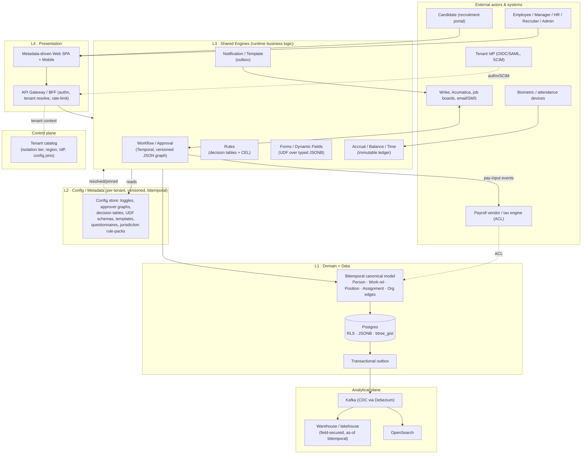
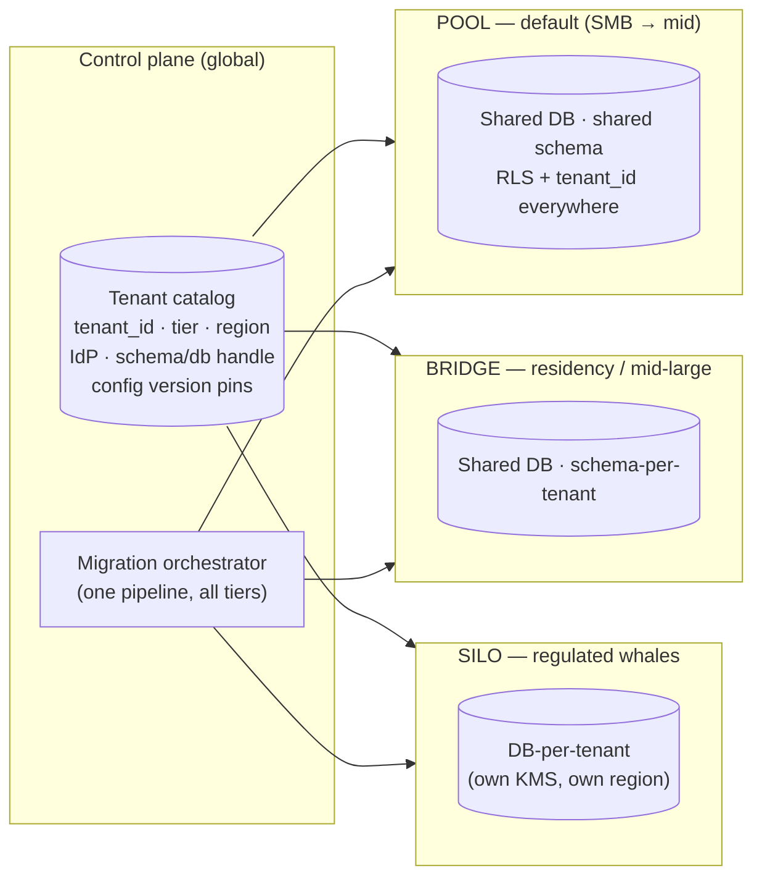
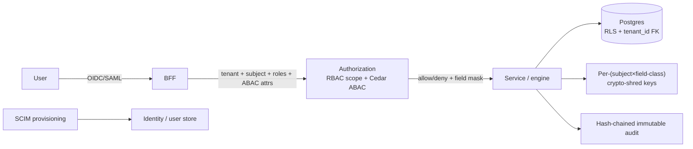
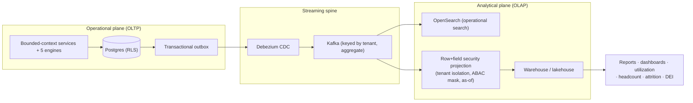
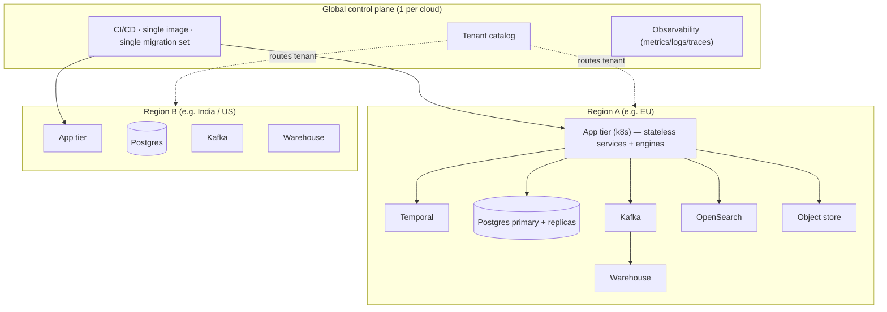

I have enough grounding. Here is the System Design document.

---

# HRMS Platform — System Design (Architecture Overview)

> **Status:** Strategic architecture baseline. This is the "how it all fits" document. It defines the architecture style, the layering contract, the tenancy model, the role of the shared engines, and the non-functional envelope. Component wiring, schemas at field granularity, and API surfaces belong to the HLD/LLD that descend from this doc. Every recommendation is anchored to the reverse-engineered **Kensium HR v6** feature set (305 screens / 7 top menus / ~30 config modules / **191 configuration screens**) captured in the capability digest and full screen inventory.

---

## 1. The problem this architecture solves

Kensium HR is not one app; it is **~25 functional modules wrapped around a configuration product**. The single most important signal from the crawl is the shape of the Configuration area: 191 screens whose dominant grammar is:

- **Module on/off toggles** — *"Do you want to enable the attendance tracking module?"*, *"…the calendar module?"*, *"…the Confirmation Management Module?"*, *"…the knowledge transfer module?"*, *"…the Acumatica Integration Module?"* (every module gates itself).
- **Behavioral policy toggles** — *"Do you support flexi schedule settings?"*, *"Do you support location based flexi schedule settings?"*, *"Do you support position based flexi schedule settings?"*, *"Do you support Anonymous Feedback / Grievance?"*, *"Do you perform exit questionnaire?"*, *"Do you support position level paygrade?"*.
- **Per-module approver chains** — Time Off Approvers, FMLA Approvers, Comp Off Approvers, Over Time Approvers, Change Request Approvers, Offer Approvers, Class Change Approvers, Exit / Layoff / Exit Clearance Approvers, Salary Revision Approvers, Training Cost Approvers, Travel Request + Travel Expense Approvers, plus an **Escalation Matrix** with custom fields.
- **Per-module questionnaires & templates** — Confirmation Questions, Exit Questionnaire, Interview Assessment Questions, Certification Questionnaire, Salary Revision Questionnaire, Survey Questions; and an **Email Templates + Notification Templates pair repeated in nearly every module**.
- **Jurisdiction data** — Localization Settings (country, date format, distance unit, currency symbol/format, pin-code format), Income Tax Slabs, Tax Categories/Deductions, FMLA Qualifying/Rejection Reasons (US), Holiday Calendar per location.

The architectural consequence is non-negotiable: **the differentiator is the configuration engine and the shared runtime engines that read it, not the screens.** If we build 305 bespoke screens with embedded logic we have rebuilt a 15-year-old monolith. Instead we ship a **small number of capabilities (engines) at build time and select per-tenant behavior at runtime via versioned config.** That single inversion is the whole architecture.

### Architecture style

- **Modular monolith → service-extractable.** One deployable image, one migration pipeline, internally partitioned into bounded contexts (Person/Work, Recruitment, Time-Off, Attendance, Performance, Comp/Payroll-edge, Asset, Learning, T&E, Config, Identity). We do **not** start as 25 microservices; we start with hard module boundaries and a transactional core, and extract only the contexts that earn independent scaling (search, reporting projections, attendance ingestion). This is the "majestic monolith first" stance, validated by the fact that every module shares the same five engines — premature service splits would shatter the engines into chatty RPC.
- **Config-driven, not code-driven.** Business *logic* lives in engines (build time). Business *behavior* is data (run time, per tenant, versioned). A new tenant policy is a published config version, not a deploy.
- **Bitemporal core.** Person, Work-relationship, Position, Assignment are separate lifecycles with valid-time + transaction-time. There is never one mutable `employee` row.
- **Event-sourced edges, state-stored core.** The transactional core is relational (SQL truth). Cross-context integration and the analytical plane are driven by a transactional **outbox → CDC → Kafka** spine. The Accrual/Balance engine keeps an **immutable ledger** (event-sourced) because balances must be recomputable and auditable.

---

## 2. The 4-layer config-driven model

The platform is four layers with a strict dependency rule: **higher layers depend on lower; engines (L3) depend on the canonical model (L1) and read config (L2); they never embed tenant policy.**

| Layer | Name | What lives here | Mutability | Multi-tenancy |
|---|---|---|---|---|
| **L1** | Domain + Data | Canonical bitemporal model (Person, Work-relationship, Position, Assignment, org edges) + persistence (Postgres, RLS) | Append-mostly, effective-dated | Tenant-scoped rows / schemas |
| **L2** | Config / Metadata | Per-tenant **data** the engines read: module toggles, approver graphs, decision tables, UDF schemas, templates, questionnaires, jurisdiction packs | Immutable, content-addressed, **versioned**, effective-dated | Layered: global → industry → tenant → legal-entity |
| **L3** | Engines (shared runtime) | The 5 engines = the business logic. Stateless except the Accrual ledger | Ships at build time | Tenant-agnostic code, tenant-scoped execution |
| **L4** | Presentation | Metadata-driven SPA + BFF/API gateway; renders L2 forms/grids, calls L3 | Build-time shell, runtime layout | Per-tenant theming/branding |

**The contract that makes this work:** L2 config is *governed data* (JSON-Schema-validated JSONB on a typed spine), L3 engines are *generic interpreters* of that data. A "Time Off Approvers" screen does not configure a Time-Off code path; it publishes an approver-graph config that the **one** Workflow engine interprets for any module. "Comp Off settings", "Over Time", "Flexi Schedule" do not each get bespoke accrual code; they publish accrual/balance rules the **one** Accrual engine interprets.



---

## 3. Multi-tenancy model

A **control-plane tenant catalog** assigns each tenant an **isolation tier**; the same image and migration pipeline serve all three.



### POOL is the default; RLS is the non-bypassable backstop

Most tenants run **shared schema + `tenant_id`** with **Postgres Row-Level Security** enforced via `FORCE ROW LEVEL SECURITY` so even the table owner is filtered. The application sets `app.tenant_id` per request from the authenticated context; the RLS policy filters every read/write. This is defense-in-depth, not the primary control — the app already scopes queries — but RLS guarantees that an app bug cannot leak across tenants.

```sql
-- L1: every business table carries tenant_id; RLS is the backstop.
ALTER TABLE work_relationship ENABLE ROW LEVEL SECURITY;
ALTER TABLE work_relationship FORCE ROW LEVEL SECURITY;   -- applies to owner too
CREATE POLICY tenant_isolation ON work_relationship
  USING      (tenant_id = current_setting('app.tenant_id')::uuid)
  WITH CHECK (tenant_id = current_setting('app.tenant_id')::uuid);

-- Cross-tenant-leak defense in depth: tenant_id is part of EVERY composite FK,
-- so a child can never reference a parent in another tenant.
ALTER TABLE assignment
  ADD CONSTRAINT fk_assignment_position
  FOREIGN KEY (tenant_id, position_id)
  REFERENCES position (tenant_id, position_id);
```

- **BRIDGE (schema-per-tenant):** same shared DB, isolated schema. Chosen for **data-residency-lite** and noisy-neighbor concerns; the migration orchestrator fans the one migration set across schemas.
- **SILO (db-per-tenant):** dedicated database (and optionally its own region + KMS key) for regulated/whale tenants. Highest isolation and blast-radius containment; highest per-tenant cost.

### Tenant context propagation

`BFF resolves tenant (from host/OIDC claim) → catalog lookup (tier, region, DB handle, config pins) → request context (tenant_id, legal_entity, subject, roles, ABAC attrs) → DB session sets app.tenant_id → outbox/Kafka messages keyed by (tenant, aggregate)`. The tenant_id rides the entire call chain and is asserted at the DB (RLS), the message bus (partition key), the authz layer (Cedar scope), and the analytical plane (row filter). There is **no path** where tenant identity is implicit.

---

## 4. The shared engines at a system level

> **Reconciliation note:** the system has **six** shared engines — the five below plus a **Scheduler / Temporal-Alert**
> engine for time-driven triggers (see [`00-CONVENTIONS.md §7`](00-CONVENTIONS.md)).

These engines **are** L3 — the business logic. They are tenant-agnostic code that interprets tenant-specific L2 config. Each maps directly to recurring grammar in the crawled config screens.

| # | Engine | System role | Substrate | Config it reads (L2) | Crawled evidence |
|---|---|---|---|---|---|
| 1 | **Workflow / Approval** | Durable orchestration of every multi-step, multi-actor process. Process = **versioned JSON graph pinned per instance** (a running approval survives a config change). | Temporal-style durable execution | Approver graphs, escalation matrix, quorums/tiers, SLAs | 20+ `*Approvers` screens; Escalation Matrix; recruitment In-Review→Joined pipeline; exit/clearance flows |
| 2 | **Rules** | Stateless decision-making: eligibility, routing, validation, pay-grade banding, applicability. Decision tables + a **non-Turing-complete CEL** expression language shared platform-wide. | In-process evaluator + cached decision tables | Decision tables, CEL expressions, applicability scopes (location/dept/position/class) | "Do you support *location/department/position* based flexi schedule?"; Position Level PayGrade; rehire settings |
| 3 | **Forms / Dynamic Fields (UDF)** | Renders and validates tenant-defined fields, questionnaires, and checklists over **typed JSONB (no EAV)**. Drives the metadata SPA. | JSON-Schema + typed JSONB columns | UDF schemas, questionnaires, checklist definitions | "User Defined Fields" (twice in Emp Mgmt); Confirmation/Exit/Certification/Salary-Revision questionnaires; Interview Assessment Questions |
| 4 | **Notification / Template** | All outbound comms (email, in-app, SMS, letters) via **transactional outbox** for exactly-once-ish delivery; template rendering with tenant data. | Outbox table → relay → channels | Email Templates + Notification Templates (per module), Letter/Offer/Appointment templates | The Email+Notification template *pair* recurs in nearly every module; 18 template screens under CONFIG·Templates alone |
| 5 | **Accrual / Balance / Time** | The only **stateful** engine. Leave accrual, balances, attendance, OT, comp-off as an **immutable ledger that is recomputable** (retro-safe). | Ledger tables + recompute jobs | Accrual rules, carry-forward/encashment, OT/comp-off thresholds, holiday calendars, FMLA | Comp Off ("min hours to avail"), Over Time, Paid/Unpaid Time Off, Holiday Calendar, FMLA, Attendance Summary |

**Why exactly these five, and why shared:** every functional module is a *composition* of (approve something) × (decide eligibility) × (collect tenant-defined data) × (notify) × (optionally move a balance). Owning these five primitives once and configuring them per module is what collapses 305 screens into a tractable build. Conversely, **business logic must never leak into config** — config selects and parameterizes engine behavior; it does not encode control flow. A toggle says *"comp-off enabled, min 4h"*; the Accrual engine owns *how* comp-off is computed and ledgered.

---

## 5. Technology stack & rationale

| Concern | Choice | Rationale (grounded) |
|---|---|---|
| Core services | **TypeScript/Node (NestJS) or Kotlin/Spring** | Strong typing for the config spine + UDF schemas; pick one and standardize. TS keeps a single language across BFF, engines, and config tooling; Kotlin if the team is JVM-strong and wants Temporal-Java maturity. |
| Primary store | **Postgres 16** | RLS for the tenancy backstop; **JSONB** for UDF/config payloads (no EAV); **btree_gist exclusion constraints** for bitemporal/effective-dated edges (no overlapping valid-time for an assignment); rich SQL for the reporting-heavy domain. |
| Durable workflow | **Temporal** | Approval chains span days/weeks (offer→accept→join; exit→clearance) and must survive restarts and config changes — pinned, versioned, durable execution beats a hand-rolled state machine. |
| Eventing / CDC | **Kafka + Debezium** | Transactional outbox → CDC keeps the relational core as the source of truth while feeding analytics, search, and cross-context consumers; keyed by (tenant, aggregate) for ordering and isolation. |
| Cache | **Redis** | Resolved-config cache (layered resolution is expensive), session, rate-limit, hot decision tables. |
| Search | **OpenSearch** | Talent Pool (147+ candidates), Employee Master, document search; faceted grids across modules. |
| Authorization | **Cedar (+ SpiceDB if relationship-heavy)** | ABAC for field/row sensitivity (comp, national id, health/leave-reason, performance); policy-as-data fits the config-driven ethos. |
| Object store | **S3-compatible** | Resumes, offer/appointment letters, policy documents, assets/invoices, certifications. |
| Identity | **OIDC/SAML + SCIM** | Per-tenant IdP federation (the crawl shows "Manage Active Directory" + Password Policy). |
| Frontend | **Metadata-driven SPA (React) + BFF** | L4 renders L2 form/grid metadata; one shell, tenant-specific layouts/branding (Login Page Images, Home Logo, Thought of the Day). |

---

## 6. Functional requirements (scope, grounded)

The platform must reach **feature parity** across the crawled modules. Grouped by bounded context:

- **Organization & Identity:** org chart + **hierarchy chart (matrix/dotted-line)**, departments, locations/work-areas, employee classifications, roles + screen-level role assignment, announcements, policies, surveys, feedback/grievance (incl. anonymous).
- **Recruitment:** requisition → vacancy → posting (multi-channel) → talent pool → hiring pipeline (In-Review · Interview · On-Hold · Cancelled · Offer · Accept/Refuse/Cancel · Joined) → offer/joining/appointment letters → pre-onboarding checklist.
- **Employee Management (bitemporal heart):** Employee Master, onboarding, **class change**, **salary revision**, **disciplinary actions**, **appreciation**, **quadrant rating**, mass data update, acknowledgements, **exit/offboarding** (notice period, questionnaire, tasks, clearance, layoff).
- **Time-Off / Leave:** apply/summary, paid/unpaid types, accrual, carry-forward/encashment, holiday + optional-holiday, office closure, adjustments, **FMLA** (US).
- **Attendance & Time:** shifts/assignment, flexi schedules (location/dept/position-scoped), out-time/WFH/OT/comp-off requests, regularization (change requests), biometric/device ingestion, manual sheets, mass approval, attendance audit.
- **Performance/Confirmation/Orientation/Learning:** review cycles (periodic/peer), confirmation review, induction programs, training/certifications with sponsorship/reimbursement approvals.
- **Resource Mgmt & Timesheets:** project master, allocation, timesheet entry/approval, utilization, Wrike sync.
- **Travel & Expense, Asset, Knowledge Transfer, Tax/Finance, Benefits:** trip/advance/expense flows; asset requisition→assignment→return→outbound; KT tasks; tax slabs/deductions/exemptions; benefits.
- **Configuration (191 screens):** every module's toggles, approvers, templates, questionnaires, jurisdiction data — all expressed as **L2 config**, all interpreted by the five engines.

---

## 7. Non-functional requirements

### Scale targets

| Dimension | Target (steady) | Headroom |
|---|---|---|
| Tenants (POOL) | 5,000 | 25,000 |
| Total employees | 5M | 20M |
| Largest single tenant | 250k employees | 1M (→ BRIDGE/SILO) |
| Peak concurrent users | 150k | 500k |
| Attendance events/day | 50M (biometric punches) | 250M |
| Config versions | 10M (immutable, content-addressed) | grows monotonically |

### Latency SLOs (per request, server-side p95 unless noted)

| Operation class | p95 | p99 |
|---|---|---|
| Interactive read (grid/list, e.g. Talent Pool, Emp Master) | 300 ms | 800 ms |
| Transactional write (apply leave, submit approval) | 500 ms | 1.2 s |
| Config resolution (cached) | 20 ms | 80 ms |
| Workflow step transition (Temporal) | 1 s | 3 s |
| Balance/accrual recompute (per employee) | async, < 30 s | < 2 min |
| Analytical query (warehouse) | 3 s | 10 s |

### Availability, durability, recovery

| Metric | Target |
|---|---|
| Control plane + operational core availability | **99.95%** (≤ ~4.4 h/yr) |
| Analytical plane availability | 99.5% |
| **RPO** | **≤ 5 min** (PITR + streaming replicas; outbox replay) |
| **RTO** | **≤ 1 h** (warm standby, automated failover); SILO whales: ≤ 30 min |
| Audit log durability | Hash-chained, WORM/append-only, 7-yr retention |
| Backups | Continuous WAL archiving + daily snapshots; quarterly restore drills |

### Data residency

Region is a **tenant-catalog attribute**. POOL tenants are pinned to a regional cluster; **BRIDGE/SILO** are the residency mechanism for tenants requiring in-region or single-DB storage (EU, India DPDP, etc.). No tenant's operational *or* analytical data crosses its assigned region; Kafka topics, warehouse partitions, and object-store buckets are region-scoped.

---

## 8. Security & compliance posture



- **Authn:** federated per-tenant IdP (OIDC/SAML), SCIM for lifecycle; the crawl's "Manage Active Directory" + "Password Policy" become AD/Entra federation + local fallback policy.
- **Authz (two layers):** **RBAC** is tenant-scoped and screen/module-granular (mirrors "Role" + "Assign Roles → Module/Screens"). **ABAC (Cedar)** enforces **field- and row-level sensitivity** — compensation, national id, health/leave-reason, performance ratings, disciplinary records. A manager sees a direct report's leave balance but **not** the leave *reason* unless policy grants it.
- **PII classification:** every field carries a sensitivity class (PUBLIC / INTERNAL / PII / SPI). SPI (national id, health, leave reason, salary, disciplinary) is encrypted per **(subject × field-class)** key.
- **GDPR / DPDP erasure:** right-to-be-forgotten via **crypto-shred** — destroy the per-subject/per-field-class key and the ciphertext is irrecoverable, **without** breaking the bitemporal/audit chain (the hash-chain references survive; the plaintext does not). This reconciles "immutable audit" with "erasure."
- **Audit:** every state change appended to a **hash-chained, append-only** log (who, what, before/after class, valid-time vs transaction-time). The bitemporal model already records *what we believed and when*; the audit chain makes it tamper-evident.
- **Defense in depth:** FORCE RLS + `tenant_id` in every composite FK (Section 3) means cross-tenant leakage requires simultaneous failure of app scoping **and** RLS **and** FK integrity.

---

## 9. Operational ↔ analytical split

An HRMS is ~50% reporting; mixing OLAP scans into the OLTP core would wreck the interactive SLOs. We **physically separate** the planes.



The analytical plane **re-projects** the operational security model — it is **not** a security bypass. Tenant isolation, field-level ABAC masking, and **as-of bitemporal** queries ("headcount as we believed it on 2026-03-31") are enforced on the warehouse side. Operational search (Talent Pool, Employee Master) goes to OpenSearch off the same CDC stream; heavy reporting (utilization, attrition, headcount, arrears) goes to the warehouse.

---

## 10. Environments & deployment topology



- **One image, one migration pipeline** across all tiers and regions (control-plane mandate). Tier (POOL/BRIDGE/SILO) and region are runtime properties from the catalog, not separate builds.
- **Environments:** `dev` → `staging` (prod-like, anonymized data, full bitemporal/CDC) → `prod`. Config changes flow through the same publish-gate validation in every environment.
- **App tier is stateless** and horizontally scaled; state lives in Postgres/Temporal/Kafka. SILO whales get dedicated DB (and optionally dedicated app namespace) for blast-radius isolation.
- **Deploy strategy:** blue/green for the app tier; expand-contract for schema (additive migration → backfill → switch → cleanup) so the single migration set is always backward-compatible during rollout.

---

## 11. Cross-cutting concerns

### Feature flags vs configuration — a hard distinction

These are frequently conflated; the crawl forces us to separate them because *both* appear as "Do you want to enable…?" toggles but mean different things:

| | **Feature flag** | **Configuration** |
|---|---|---|
| Owns | Platform engineering | Tenant admin |
| Question | "Is this *capability* released/safe to expose?" | "Does this *tenant* use this capability, and how?" |
| Lifecycle | Short-lived (rollout/kill-switch) or ops | Long-lived, **versioned, bitemporal, effective-dated** |
| Audited as | Operational change | Business change (publish gate) |
| Example | "Enable new attendance-audit algorithm v2 for 5% of tenants" | "*Do you want to enable the attendance tracking module?*" → tenant turns module on, sets accrual rules |

Rule of thumb: **module-on/off and policy toggles from the Config area are configuration** (per-tenant, versioned, governed). Engineering rollout/kill-switches are feature flags. They must not share a store.

### Config resolution & versioning

Config resolves in layers **global → industry → tenant → legal-entity**, with the most specific winning. Versions are **immutable and content-addressed**; **publish is a validation gate** (JSON-Schema + cross-reference + dry-run against engines). **In-flight workflows pin the config snapshot they started under** — a tenant editing its Time-Off Approvers does not retroactively re-route leave requests already mid-approval.

### i18n / jurisdiction

Localization is **versioned jurisdiction rule-packs shipped as data, not code** — Localization Settings (country, date/number/currency format, distance unit, pin-code format), Income Tax Slabs/Categories/Deductions, FMLA reasons (US), holiday calendars per location. A new country = a new rule-pack version + locale bundles, **not** a deploy. UI strings and formats are locale-resolved at L4; legal/tax behavior is resolved at L2 and interpreted by the Rules and Accrual engines.

### Payroll boundary (anti-corruption layer)

We **own compensation data** (salary revision, pay grades, arrears, deductions visible in the crawl) and **emit pay-input events**; gross-to-net and statutory tax stay **vendor-owned behind an ACL**. We model the **pay-period lifecycle (open → locked → paid → posted)** and **retro recalculation** so a back-dated salary revision (bitemporal valid-time change) produces correct arrears without rewriting history.

---

## 12. What this architecture explicitly is *not* (non-goals / guardrails)

- **Not** 25 microservices on day one — modular monolith first; extract on evidence (search, reporting projections, attendance ingestion are the likely first extractions).
- **Not** a workflow/rules implementation per module — five shared engines, configured.
- **Not** EAV for custom fields — typed JSONB governed by JSON-Schema.
- **Not** logic-in-config — config selects/parameterizes; engines decide.
- **Not** one mutable `employee` row — separate bitemporal lifecycles, always.
- **Not** a reporting layer that bypasses security — the analytical plane re-projects tenant + field-level ABAC + as-of.

---

### Source anchors

- Capability digest: `/private/tmp/claude-501/-Users-harshitsan-Documents-heliverse-hcm/b5b74293-ca6e-42ed-a91d-a48bd75c8517/scratchpad/feature-digest.md`
- Full screen inventory (305 screens): `/Users/harshitsan/Documents/heliverse/hcm/kensiumhr-features.md`