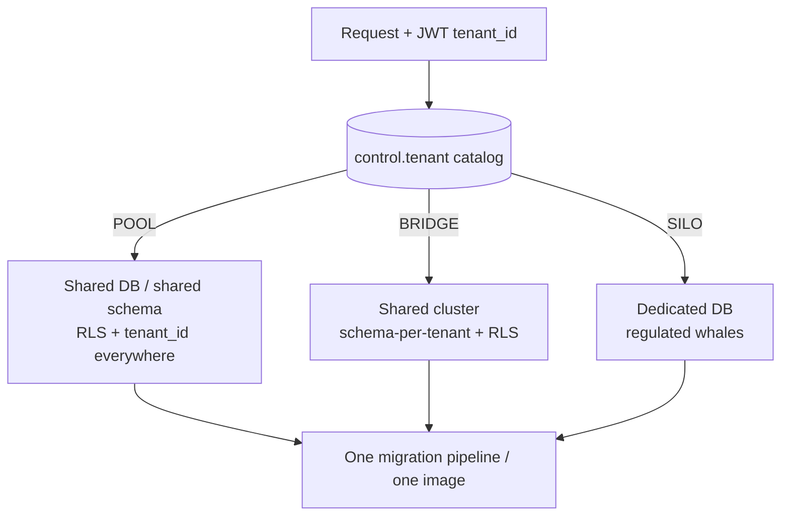
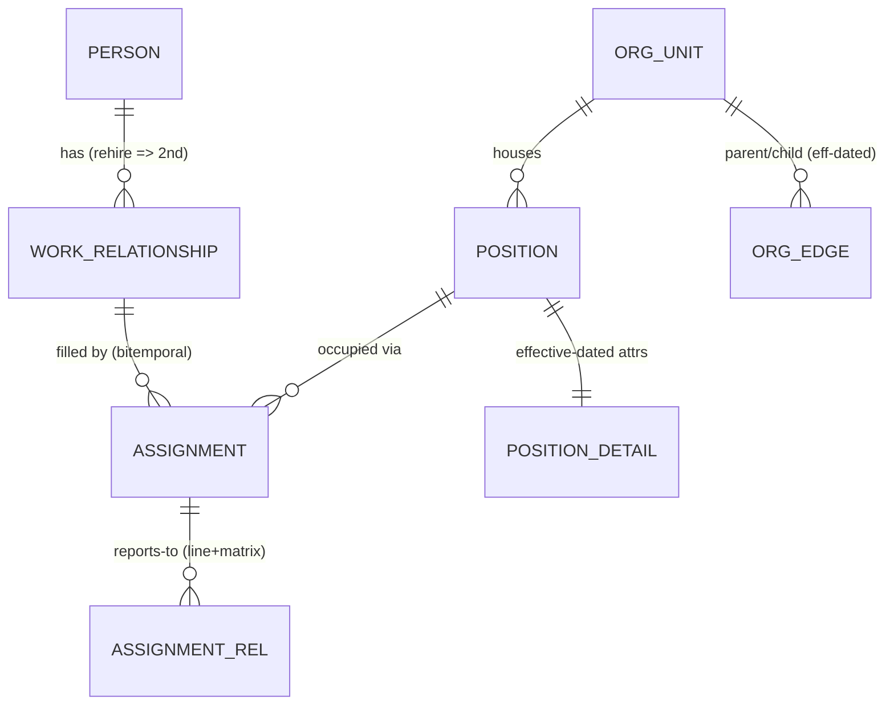
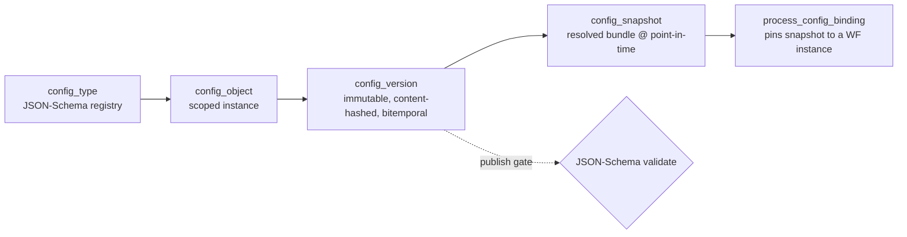
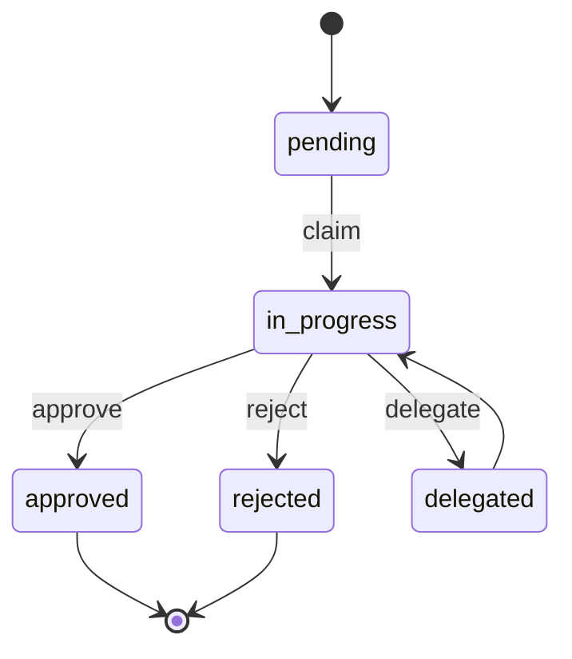
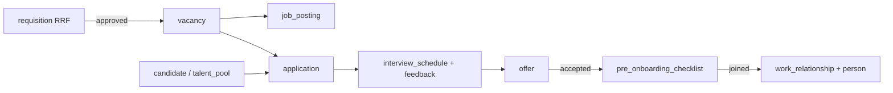
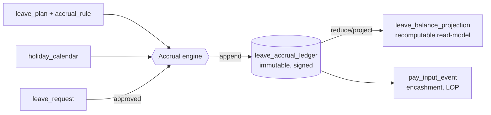
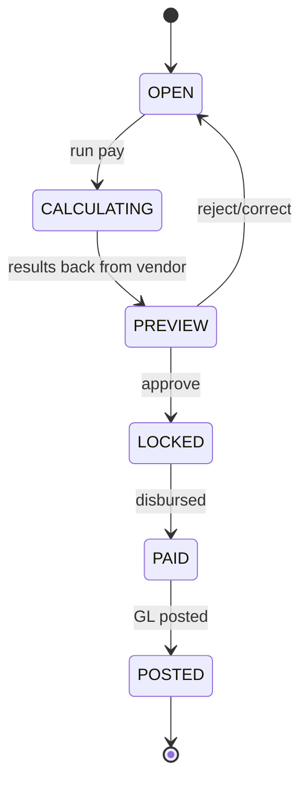

I have enough grounding. Here is the deliverable.

# Database Design — Core Domain, Config & Cross-cutting

This is the L1 (Domain + Data) and the persistence side of L2 (Config) and L3 (Workflow) for the HRMS. It is written for **PostgreSQL 16** with `btree_gist`, `pgcrypto`, and `pg_partman` available. Every design choice is grounded in the crawled Kensium v6 feature set: an `Employee Master` with ~40 effective-dated fields, a `Position List` distinct from `Position Level`/`Designation`, dual `Reporting Manager` + `Functional Manager` hierarchies (matrix), `Class Change` / `Salary Revision` / `Exit` as first-class lifecycle transitions (not in-place edits), effective-dated `Policies` and `Department` parent trees, 191 per-tenant config screens, and a field-level `View/Edit` access matrix over (`HR`, `Reporting Manager`, `Employee`).

The whole model rests on four non-negotiables: **(1)** every business row carries `tenant_id` and is fenced by RLS; **(2)** HR facts are **bitemporal** — never a single mutable employee row; **(3)** config is immutable, content-addressed, and effective-dated; **(4)** the audit log is append-only and hash-chained, holding key-pointers, never PII.

---

## 0. Conventions & Extensions

```sql
CREATE EXTENSION IF NOT EXISTS btree_gist;   -- GiST over scalar tenant_id + range cols
CREATE EXTENSION IF NOT EXISTS pgcrypto;     -- gen_random_uuid(), digest()
CREATE EXTENSION IF NOT EXISTS "uuid-ossp";

-- Two app roles. Migrations run as owner (BYPASSRLS); runtime never does.
CREATE ROLE hrms_owner   LOGIN;              -- DDL + migrations only
CREATE ROLE hrms_app     LOGIN;              -- runtime, RLS-enforced, NO BYPASSRLS
```

**Naming / typing conventions (applied everywhere below):**

| Concern | Convention |
|---|---|
| PK | `uuid` (`gen_random_uuid()`), UUIDv7-style time-ordered where insert-heavy |
| Tenant key | `tenant_id uuid NOT NULL` is **column #1** of every business table |
| Valid time | `effective daterange` (`[lower, upper)`), `'-infinity'`/`'infinity'` bounds |
| Transaction time | `sys_period tstzrange NOT NULL DEFAULT tstzrange(now(), null)` |
| Money | `numeric(18,4)` + explicit `currency char(3)`; never `float` |
| Codes / enums | reference tables (see §1.4), **not** Postgres `ENUM` (config-driven product) |
| Soft delete | forbidden in bitemporal tables — closing a row = setting `sys_period` upper |
| Timestamps | `timestamptz` only; app stores UTC, presents in `time_zone` (an Employee field) |

Every business table ends with the same **tenant guard trigger + RLS policy** stanza, factored into a reusable function (§1.2).

---

## 1. Tenancy Plumbing (Control Plane + Data Plane)

### 1.1 Control-plane: the tenant catalog

The control plane is a **separate database** (`hrms_control`) — it must be reachable even when a tenant DB is down, and it decides *where a tenant lives* (POOL / BRIDGE / SILO per the locked decision).

```sql
-- ===== DATABASE: hrms_control (NOT row-level-secured; ops-only access) =====

CREATE TYPE isolation_mode AS ENUM ('POOL','BRIDGE','SILO');
CREATE TYPE tenant_status  AS ENUM ('provisioning','active','suspended','exporting','purged');

CREATE TABLE tenant (
    tenant_id        uuid PRIMARY KEY DEFAULT gen_random_uuid(),
    slug             text NOT NULL UNIQUE,            -- 'kensium', used in URLs/JWT
    legal_name       text NOT NULL,
    isolation        isolation_mode NOT NULL DEFAULT 'POOL',
    status           tenant_status  NOT NULL DEFAULT 'provisioning',
    residency_region text NOT NULL,                   -- 'in-south-1', 'eu-central-1'
    industry_code    text,                            -- feeds config layer 'industry'
    -- physical routing: which cluster/db/schema serves this tenant
    cluster_dsn_ref  text NOT NULL,                   -- secret-manager handle, not a raw DSN
    db_name          text NOT NULL,                   -- SILO: per-tenant db; else shared
    schema_name      text NOT NULL DEFAULT 'public',  -- BRIDGE: per-tenant schema
    -- crypto-shred root: per-tenant KEK handle in KMS/HSM (see §4.2)
    kek_handle       text NOT NULL,
    created_at       timestamptz NOT NULL DEFAULT now(),
    UNIQUE (cluster_dsn_ref, db_name, schema_name, tenant_id)
);

-- Per-tenant IdP binding for federated authn (OIDC/SAML + SCIM)
CREATE TABLE tenant_idp (
    tenant_id     uuid NOT NULL REFERENCES tenant(tenant_id),
    protocol      text NOT NULL CHECK (protocol IN ('oidc','saml')),
    issuer        text NOT NULL,
    metadata_url  text,
    scim_enabled  boolean NOT NULL DEFAULT false,
    PRIMARY KEY (tenant_id, issuer)
);

-- Legal entities live PER TENANT in the data plane, but the control plane
-- needs a thin mirror to make config-layer 'legal-entity' resolution routable.
CREATE TABLE tenant_legal_entity_ref (
    tenant_id        uuid NOT NULL REFERENCES tenant(tenant_id),
    legal_entity_id  uuid NOT NULL,
    country          char(2) NOT NULL,                -- jurisdiction rule-pack selector
    PRIMARY KEY (tenant_id, legal_entity_id)
);
```

The application resolves a request's tenant from the JWT `tenant_id` claim, looks up routing in `tenant`, opens/borrows a pooled connection to the right cluster/db/schema, then sets the session GUCs that drive RLS:

```sql
-- Per request, on a connection running as hrms_app (never owner):
SET LOCAL app.tenant_id   = '7c9e...';   -- from verified JWT
SET LOCAL app.actor_id    = 'b1f3...';   -- the authenticated principal
SET LOCAL app.legal_entity = 'a44d...';  -- optional, for config resolution
```

`SET LOCAL` ties the GUC to the transaction, so a returned pool connection cannot leak a stale tenant context.

### 1.2 `tenant_id` convention, RLS policy pattern, and the composite-FK rule

Three layers of cross-tenant-leak defense, all mandatory:

1. **RLS** — the non-bypassable backstop. A missing `WHERE tenant_id = …` in app code cannot leak data.
2. **Composite FKs** — every FK includes `tenant_id` on both sides, so even a corrupted/malicious `parent_id` cannot point across tenants.
3. **`FORCE ROW LEVEL SECURITY`** — so even the table owner is filtered (defense in case an app accidentally runs as owner).

Factored into one helper applied to every business table:

```sql
-- Reusable RLS installer (run once per business table)
CREATE OR REPLACE FUNCTION install_tenant_rls(p_table regclass) RETURNS void
LANGUAGE plpgsql AS $$
BEGIN
  EXECUTE format('ALTER TABLE %s ENABLE ROW LEVEL SECURITY', p_table);
  EXECUTE format('ALTER TABLE %s FORCE  ROW LEVEL SECURITY', p_table);
  -- One policy covers SELECT/INSERT/UPDATE/DELETE; USING gates reads+updates+deletes,
  -- WITH CHECK gates inserts+updated rows so you cannot WRITE another tenant's id.
  EXECUTE format($p$
    CREATE POLICY tenant_isolation ON %s
      USING      (tenant_id = current_setting('app.tenant_id')::uuid)
      WITH CHECK (tenant_id = current_setting('app.tenant_id')::uuid)
  $p$, p_table);
END $$;
```

Why `current_setting('app.tenant_id')::uuid` and not `nullif(...,'')`: if the GUC is unset, the cast raises and the query **fails closed**. A bug that forgets to set tenant context errors out loudly rather than returning everything.

**Composite-FK rule** — illustrated once, applied throughout. The child carries `tenant_id`, and the FK references a `UNIQUE (tenant_id, id)` on the parent:

```sql
-- parent
ALTER TABLE org_unit ADD CONSTRAINT org_unit_tenant_pk UNIQUE (tenant_id, org_unit_id);
-- child references BOTH columns -> a row can only reference a same-tenant parent
ALTER TABLE assignment
  ADD CONSTRAINT assignment_org_fk
  FOREIGN KEY (tenant_id, org_unit_id)
  REFERENCES org_unit (tenant_id, org_unit_id);
```

### 1.3 Isolation modes mapped to physical layout



All three modes run the **same DDL and the same RLS** — RLS is redundant-but-on even in SILO (defense in depth, and it keeps one code path). BRIDGE just sets `search_path` to the tenant schema; POOL leans entirely on RLS.

### 1.4 Reference / lookup data

The product is config-driven, so "enums" are tenant-extensible reference data, not `ENUM` types. Many crawled screens (`Employee Life Event Types`, `Employee Dependant Types`, `Document Types`, `Travel Modes`, `Expense Head`, `Appreciation Categories`, `Project Types/Roles`) are exactly this.

```sql
-- Global, immutable reference (ISO countries, currencies) — no tenant_id, no RLS.
CREATE TABLE ref_country  (code char(2) PRIMARY KEY, name text NOT NULL);
CREATE TABLE ref_currency (code char(3) PRIMARY KEY, name text NOT NULL, minor_unit int NOT NULL);

-- Tenant-extensible code sets. A single table keyed by code_set drives dozens of screens.
CREATE TABLE ref_code (
    tenant_id   uuid NOT NULL,
    code_set    text NOT NULL,        -- 'life_event','dependant_type','travel_mode','exit_type'...
    code        text NOT NULL,        -- 'MARRIAGE','SPOUSE','AIR','RESIGNATION'
    label       text NOT NULL,
    sort_order  int  NOT NULL DEFAULT 0,
    is_active   boolean NOT NULL DEFAULT true,
    attrs       jsonb NOT NULL DEFAULT '{}',  -- e.g. {"paid":true} for a leave subtype
    PRIMARY KEY (tenant_id, code_set, code)
);
SELECT install_tenant_rls('ref_code');
```

`ref_country`/`ref_currency` are global and intentionally **not** RLS-protected (shared dimension data, no tenant). `ref_code` is per-tenant and fenced.

---

## 2. Bitemporal Core HR Domain

### 2.1 Why separate lifecycles (grounded in the crawl)

The `Employee Master` screen edits ~40 fields, but the crawl shows those fields change through **distinct lifecycle events** with their own approval flows and history screens: `Employee Salary Revision`, `Class Change Employees List` (old→new dept/position/class), `Exit List`/`Exit Clearance`, `Employee Shift Assignment`, dual `Reporting Manager`/`Functional Manager`. Collapsing these into one mutable `employee` row would destroy "what did this person's position look like on 2024-03-01, as we believed it on 2024-04-01" — which the `My Salary Details` (financial-year), arrear, and audit screens demand.

So we model **four lifecycles** plus org structure:



- **PERSON** — the human. Stable identity; survives rehire. Holds PII (crypto-shred targets).
- **WORK_RELATIONSHIP** — one employment spell (Kensium `Employee Class`, `Date of Joining`, exit). Rehire = a new relationship under the same person.
- **POSITION** (`+ position_detail`) — a *seat* in the org (`Position List`: id, dept, level, status), independent of who fills it. Open positions feed `Vacancies`/`Requisition`.
- **ASSIGNMENT** — the bitemporal join of *person/relationship × position* over valid-time; carries dept/location/manager/shift/comp snapshot. **This is the effective-dated heart.**

### 2.2 Bitemporal pattern (used by every "as-of" entity)

Valid-time = `daterange` (the real-world window the fact is true). Transaction-time = `sys_period tstzrange` (when the DB believed it). A correction = close the old row's `sys_period` and insert a new one with the same `effective` but a new `sys_period` — old beliefs are never destroyed (auditability + retro payroll recompute).

```sql
-- Generic bitemporal guard: no two CURRENTLY-BELIEVED rows for the same business key
-- may overlap in valid-time. Enforced with an exclusion constraint over a GiST index.
-- (Pattern repeated on assignment, position_detail, org_edge, policy_assignment, ...)
```

### 2.3 PERSON & WORK_RELATIONSHIP

```sql
CREATE TABLE person (
    tenant_id     uuid NOT NULL,
    person_id     uuid NOT NULL DEFAULT gen_random_uuid(),
    -- stable, human-facing identity:
    full_name     text NOT NULL,          -- denormalized display; PII components below are shred-able
    given_name    text,
    family_name   text,
    gender_code   text,                    -- -> ref_code('gender')
    birth_date    date,
    -- Sensitive identifiers are NOT stored in clear here. Pointers only (see §4.2):
    --   national id / PAN / Aadhaar / passport live in person_pii, crypto-shredded.
    primary_email citext,
    created_at    timestamptz NOT NULL DEFAULT now(),
    sys_period    tstzrange NOT NULL DEFAULT tstzrange(now(), null),
    PRIMARY KEY (tenant_id, person_id),
    UNIQUE (person_id)                             -- single-col: enables simple FKs from modules
);
SELECT install_tenant_rls('person');
CREATE INDEX person_email_idx ON person (tenant_id, primary_email);

-- One employment spell. Rehire (see CONFIG·Recruitment 'Rehire Settings') = new row.
CREATE TABLE work_relationship (
    tenant_id        uuid NOT NULL,
    work_rel_id      uuid NOT NULL DEFAULT gen_random_uuid(),
    person_id        uuid NOT NULL,
    legal_entity_id  uuid NOT NULL,                 -- which legal entity employs them
    employee_number  text NOT NULL,                 -- 'Employee Code', business key (see §2.7)
    employee_class   text NOT NULL,                 -- -> ref_code('employee_class')
    relationship_type text NOT NULL DEFAULT 'employee', -- employee|contractor|intern
    hire_date        date NOT NULL,                 -- 'Date of Joining'
    termination_date date,                          -- set by Exit lifecycle (nullable)
    status           text NOT NULL DEFAULT 'active',-- active|on_leave|terminated|layoff
    sys_period       tstzrange NOT NULL DEFAULT tstzrange(now(), null),
    PRIMARY KEY (tenant_id, work_rel_id),
    UNIQUE (work_rel_id),                          -- single-col: enables simple FKs from modules
    CONSTRAINT wr_person_fk
      FOREIGN KEY (tenant_id, person_id) REFERENCES person (tenant_id, person_id),
    -- business key uniqueness PER LEGAL ENTITY, only among currently-believed rows:
    EXCLUDE USING gist (
      tenant_id with =, legal_entity_id with =, employee_number with =
    ) WHERE (upper(sys_period) IS NULL)
);
SELECT install_tenant_rls('work_relationship');
```

### 2.4 POSITION & POSITION_DETAIL

`Position List` columns (`Position ID, Status, Department, Position, Level`) → a stable `position` row + effective-dated `position_detail` (so a position can be re-graded / moved departments over time without losing history; feeds `Position Level PayGrade` config and `Salary Revision`).

```sql
CREATE TABLE position (
    tenant_id      uuid NOT NULL,
    position_id    uuid NOT NULL DEFAULT gen_random_uuid(),
    position_code  text NOT NULL,            -- 'Position ID' business key
    is_single_incumbent boolean NOT NULL DEFAULT true, -- 1 seat vs pooled
    created_at     timestamptz NOT NULL DEFAULT now(),
    PRIMARY KEY (tenant_id, position_id),
    UNIQUE (position_id),                          -- single-col: enables simple FKs from modules
    UNIQUE (tenant_id, position_code)
);
SELECT install_tenant_rls('position');

CREATE TABLE position_detail (   -- bitemporal attributes of the seat
    tenant_id      uuid NOT NULL,
    position_id    uuid NOT NULL,
    org_unit_id    uuid NOT NULL,            -- department/team it belongs to
    title          text NOT NULL,            -- 'Position'
    position_level text NOT NULL,            -- 'Level' -> ref_code('position_level')
    pay_grade      text,                     -- -> 'Position Level PayGrade' config
    status         text NOT NULL DEFAULT 'open', -- open|filled|frozen|closed
    headcount      int  NOT NULL DEFAULT 1,
    effective      daterange NOT NULL,
    sys_period     tstzrange NOT NULL DEFAULT tstzrange(now(), null),
    PRIMARY KEY (tenant_id, position_id, effective, sys_period),
    CONSTRAINT pd_pos_fk FOREIGN KEY (tenant_id, position_id)
      REFERENCES position (tenant_id, position_id),
    CONSTRAINT pd_org_fk FOREIGN KEY (tenant_id, org_unit_id)
      REFERENCES org_unit (tenant_id, org_unit_id),
    -- no overlapping CURRENTLY-BELIEVED valid-time windows for a position
    EXCLUDE USING gist (
      tenant_id with =, position_id with =, effective with &&
    ) WHERE (upper(sys_period) IS NULL)
);
SELECT install_tenant_rls('position_detail');
```

### 2.5 ASSIGNMENT — the bitemporal core (current + history in one table)

This single table carries the effective-dated facts that the `Employee Master` surfaces, with full bitemporality. "Current" is just `WHERE effective @> CURRENT_DATE AND upper(sys_period) IS NULL` — no separate history table, no copy-on-write drift.

```sql
CREATE TABLE assignment (
    tenant_id        uuid NOT NULL,
    assignment_id    uuid NOT NULL DEFAULT gen_random_uuid(),
    work_rel_id      uuid NOT NULL,
    position_id      uuid NOT NULL,
    -- effective-dated snapshot of the Employee Master "work" fields:
    org_unit_id      uuid NOT NULL,          -- Department
    work_location_id uuid NOT NULL,          -- 'Work Location'
    work_area_id     uuid,                   -- 'Work Area'
    employee_class   text NOT NULL,          -- denormalized for fast filter (RLS-safe)
    designation      text,                   -- 'Designation' (free text vs Position title)
    shift_id         uuid,                   -- 'Shift'
    fte              numeric(5,4) NOT NULL DEFAULT 1.0,
    is_billable      boolean NOT NULL DEFAULT false, -- 'billable resource?'
    assignment_reason text NOT NULL,         -- hire|promotion|class_change|salary_revision|transfer
    -- BITEMPORAL:
    effective        daterange NOT NULL,     -- valid-time (effective dating)
    sys_period       tstzrange NOT NULL DEFAULT tstzrange(now(), null), -- transaction-time
    recorded_by      uuid NOT NULL,          -- actor that asserted this belief
    PRIMARY KEY (tenant_id, assignment_id, sys_period),
    CONSTRAINT asg_wr_fk  FOREIGN KEY (tenant_id, work_rel_id)
      REFERENCES work_relationship (tenant_id, work_rel_id),
    CONSTRAINT asg_pos_fk FOREIGN KEY (tenant_id, position_id)
      REFERENCES position (tenant_id, position_id),
    CONSTRAINT asg_org_fk FOREIGN KEY (tenant_id, org_unit_id)
      REFERENCES org_unit (tenant_id, org_unit_id),
    -- A relationship cannot hold two overlapping CURRENT assignments in valid-time:
    EXCLUDE USING gist (
      tenant_id with =, work_rel_id with =, effective with &&
    ) WHERE (upper(sys_period) IS NULL)
);
SELECT install_tenant_rls('assignment');

-- Hot path: "current assignment for an employee"
CREATE INDEX asg_current_idx ON assignment
  USING gist (tenant_id, work_rel_id, effective)
  WHERE upper(sys_period) IS NULL;
-- Org rollups: "everyone in dept X as of date"
CREATE INDEX asg_org_current_idx ON assignment
  USING gist (tenant_id, org_unit_id, effective)
  WHERE upper(sys_period) IS NULL;
```

**Reporting lines (matrix)** — Kensium has both `Reporting Manager` and `Functional Manager` (and a `Project reporting manager`), and an `Org Chart` + `Hierarchy Chart` with a view-type selector. Model the relationships as effective-dated edges between assignments, typed:

```sql
CREATE TABLE assignment_rel (
    tenant_id     uuid NOT NULL,
    rel_id        uuid NOT NULL DEFAULT gen_random_uuid(),
    sub_assignment_id uuid NOT NULL,         -- the report
    sup_assignment_id uuid NOT NULL,         -- the manager
    rel_type      text NOT NULL,             -- 'line' | 'functional' | 'project' | 'dotted'
    effective     daterange NOT NULL,
    sys_period    tstzrange NOT NULL DEFAULT tstzrange(now(), null),
    PRIMARY KEY (tenant_id, rel_id, sys_period),
    CONSTRAINT ar_sub_fk FOREIGN KEY (tenant_id, sub_assignment_id, ...) ,  -- composite
    -- one current line manager per report at a time (matrix allowed for non-line types):
    EXCLUDE USING gist (
      tenant_id with =, sub_assignment_id with =, rel_type with =, effective with &&
    ) WHERE (upper(sys_period) IS NULL)
);
SELECT install_tenant_rls('assignment_rel');
```

### 2.6 ORG_UNIT & ORG_EDGE (effective-dated, single-parent GiST + matrix)

`Department` screen has `Parent department` (a tree) and `Department acronym`; the org also spans `Location`, `Work Area`, `Group`. We model an **`org_unit`** of typed nodes and **`org_edge`** of effective-dated parent→child links. A GiST exclusion constraint enforces **single structural parent over time** while still permitting *additional* non-structural (matrix/dotted) edges via `edge_type`.

```sql
CREATE TABLE org_unit (
    tenant_id      uuid NOT NULL,
    org_unit_id    uuid NOT NULL DEFAULT gen_random_uuid(),
    unit_type      text NOT NULL,        -- 'department'|'location'|'work_area'|'business_unit'|'group'
    code           text NOT NULL,        -- 'Department acronym' / location acronym
    legal_entity_id uuid,                -- units can be scoped to a legal entity
    PRIMARY KEY (tenant_id, org_unit_id),
    UNIQUE (tenant_id, org_unit_id),
    UNIQUE (tenant_id, unit_type, code)
);
SELECT install_tenant_rls('org_unit');

CREATE TABLE org_unit_detail (   -- name/description can change over time
    tenant_id   uuid NOT NULL,
    org_unit_id uuid NOT NULL,
    name        text NOT NULL,
    is_active   boolean NOT NULL DEFAULT true,
    effective   daterange NOT NULL,
    sys_period  tstzrange NOT NULL DEFAULT tstzrange(now(), null),
    PRIMARY KEY (tenant_id, org_unit_id, effective, sys_period),
    CONSTRAINT oud_fk FOREIGN KEY (tenant_id, org_unit_id)
      REFERENCES org_unit (tenant_id, org_unit_id),
    EXCLUDE USING gist (tenant_id with =, org_unit_id with =, effective with &&)
      WHERE (upper(sys_period) IS NULL)
);
SELECT install_tenant_rls('org_unit_detail');

CREATE TABLE org_edge (
    tenant_id   uuid NOT NULL,
    edge_id     uuid NOT NULL DEFAULT gen_random_uuid(),
    parent_id   uuid NOT NULL,
    child_id    uuid NOT NULL,
    edge_type   text NOT NULL DEFAULT 'structural',  -- 'structural' | 'matrix' | 'dotted'
    effective   daterange NOT NULL,
    sys_period  tstzrange NOT NULL DEFAULT tstzrange(now(), null),
    PRIMARY KEY (tenant_id, edge_id, sys_period),
    CONSTRAINT oe_parent_fk FOREIGN KEY (tenant_id, parent_id)
      REFERENCES org_unit (tenant_id, org_unit_id),
    CONSTRAINT oe_child_fk  FOREIGN KEY (tenant_id, child_id)
      REFERENCES org_unit (tenant_id, org_unit_id),
    CHECK (parent_id <> child_id),
    -- SINGLE STRUCTURAL PARENT over valid-time: a child may have only one
    -- 'structural' parent at any instant; matrix/dotted edges are unconstrained.
    EXCLUDE USING gist (
      tenant_id with =, child_id with =, effective with &&
    ) WHERE (edge_type = 'structural' AND upper(sys_period) IS NULL)
);
SELECT install_tenant_rls('org_edge');
CREATE INDEX org_edge_struct_idx ON org_edge
  USING gist (tenant_id, parent_id, effective)
  WHERE edge_type = 'structural' AND upper(sys_period) IS NULL;
```

Cycle prevention (a tree can't have loops) is enforced in the workflow/service layer on edge insert via a recursive ancestor check, because Postgres exclusion constraints can't express reachability. The structural exclusion above guarantees a *forest* shape at any instant; the service-layer check rejects edges whose new parent is already a descendant.

### 2.7 Employee number / business keys

`Employee Code` and `Position ID` are tenant-visible business keys, distinct from surrogate UUIDs. They're generated by the `Configure Series` config screen (per-tenant number sequences). Uniqueness is scoped and effective-belief-aware (already shown via the `EXCLUDE` on `work_relationship.employee_number`). Sequence allocation:

```sql
CREATE TABLE number_series (
    tenant_id   uuid NOT NULL,
    series_key  text NOT NULL,        -- 'employee_code','rrf_id','asset_id','requisition'
    prefix      text NOT NULL DEFAULT '',
    next_value  bigint NOT NULL DEFAULT 1,
    pad_width   int NOT NULL DEFAULT 5,
    PRIMARY KEY (tenant_id, series_key)
);
SELECT install_tenant_rls('number_series');
-- Allocation uses SELECT ... FOR UPDATE on the (tenant_id, series_key) row to serialize.
```

### 2.8 Domain extension: UDFs (the Forms/Dynamic-Fields engine storage)

`User Defined Fields` appears under Employee Management config (twice) and elsewhere. Per the locked decision, UDFs are **typed JSONB**, not EAV. The UDF engine's *schema* lives in config (§3); the *values* attach to a host row in typed JSONB validated against that schema at write time.

```sql
CREATE TABLE udf_value (
    tenant_id   uuid NOT NULL,
    host_type   text NOT NULL,            -- 'person'|'work_relationship'|'assignment'|'expense'...
    host_id     uuid NOT NULL,
    config_version_id uuid NOT NULL,      -- which UDF schema version governed this write
    values      jsonb NOT NULL DEFAULT '{}',
    effective   daterange NOT NULL DEFAULT daterange(CURRENT_DATE,null),
    sys_period  tstzrange NOT NULL DEFAULT tstzrange(now(), null),
    PRIMARY KEY (tenant_id, host_type, host_id, effective, sys_period)
);
SELECT install_tenant_rls('udf_value');
-- GIN for queryable UDFs:
CREATE INDEX udf_value_gin ON udf_value USING gin (values jsonb_path_ops);
```

---

## 3. Config / Metadata Engine

This persists the 191 config screens as **immutable, content-addressed, bitemporal versions** resolved global→industry→tenant→legal-entity. Engines read config; config never holds logic (decision per the brief).



### 3.1 `config_type` — the registry (one row per kind of configurable thing)

```sql
CREATE TABLE config_type (
    config_type_id   text PRIMARY KEY,        -- 'leave.policy','attendance.rule','offer.approvers',
                                              -- 'confirmation.questions','wf.definition'...
    title            text NOT NULL,
    module           text NOT NULL,           -- 'TimeOff','Attendance','Recruitment'...
    json_schema      jsonb NOT NULL,          -- governs the payload (publish-time gate)
    scope_levels     text[] NOT NULL          -- allowed scopes, e.g. {global,tenant,legal_entity}
        DEFAULT '{tenant,legal_entity}',
    is_singleton     boolean NOT NULL DEFAULT false, -- e.g. 'Localization Settings' = 1 per scope
    schema_version   int NOT NULL DEFAULT 1
);
-- GLOBAL table: shipped with the build (capabilities at build time), not per-tenant. No RLS.
```

### 3.2 `config_object` — a scoped instance of a type

```sql
CREATE TABLE config_object (
    config_object_id uuid PRIMARY KEY DEFAULT gen_random_uuid(),
    config_type_id   text NOT NULL REFERENCES config_type(config_type_id),
    -- SCOPE: exactly one of these resolution levels is populated (CHECK enforces precedence)
    scope_level      text NOT NULL,           -- 'global'|'industry'|'tenant'|'legal_entity'
    industry_code    text,                    -- when scope_level='industry'
    tenant_id        uuid,                    -- when scope_level in (tenant, legal_entity)
    legal_entity_id  uuid,                    -- when scope_level='legal_entity'
    object_key       text NOT NULL DEFAULT '',-- discriminates multiple objects of same type
                                              -- (e.g. one 'leave.policy' per leave type)
    created_at       timestamptz NOT NULL DEFAULT now(),
    CHECK (
      (scope_level='global'       AND industry_code IS NULL AND tenant_id IS NULL) OR
      (scope_level='industry'     AND industry_code IS NOT NULL AND tenant_id IS NULL) OR
      (scope_level='tenant'       AND tenant_id IS NOT NULL AND legal_entity_id IS NULL) OR
      (scope_level='legal_entity' AND tenant_id IS NOT NULL AND legal_entity_id IS NOT NULL)
    ),
    UNIQUE (config_type_id, scope_level, industry_code, tenant_id, legal_entity_id, object_key)
);
```

RLS here is conditional — global/industry rows are visible to all tenants (shared dimension), tenant/legal_entity rows are fenced:

```sql
ALTER TABLE config_object ENABLE ROW LEVEL SECURITY;
ALTER TABLE config_object FORCE  ROW LEVEL SECURITY;
CREATE POLICY config_object_read ON config_object
  USING (
    scope_level IN ('global','industry')
    OR tenant_id = current_setting('app.tenant_id')::uuid
  )
  WITH CHECK (   -- writes only into your own tenant scope
    tenant_id = current_setting('app.tenant_id')::uuid
  );
```

### 3.3 `config_version` — immutable, content-addressed, bitemporal

```sql
CREATE TABLE config_version (
    config_version_id uuid PRIMARY KEY DEFAULT gen_random_uuid(),
    config_object_id  uuid NOT NULL REFERENCES config_object(config_object_id),
    version_no        int  NOT NULL,
    -- CONTENT ADDRESS: sha256 of canonicalized payload; identical payloads dedupe.
    content_hash      bytea NOT NULL,
    payload           jsonb NOT NULL,         -- the actual config, validated vs json_schema
    -- BITEMPORAL: effective-dating + when-we-published
    effective         daterange NOT NULL,     -- valid-time the config applies
    sys_period        tstzrange NOT NULL DEFAULT tstzrange(now(), null),
    status            text NOT NULL DEFAULT 'draft', -- draft|published|superseded|retired
    published_at      timestamptz,
    published_by      uuid,
    UNIQUE (config_object_id, version_no),
    -- IMMUTABILITY: once published, payload may never change (enforced by trigger below)
    EXCLUDE USING gist (
      config_object_id with =, effective with &&
    ) WHERE (status='published' AND upper(sys_period) IS NULL)
);
CREATE INDEX cv_object_eff ON config_version
  USING gist (config_object_id, effective) WHERE status='published';
```

Immutability + publish-as-validation-gate via trigger:

```sql
CREATE OR REPLACE FUNCTION config_version_guard() RETURNS trigger
LANGUAGE plpgsql AS $$
DECLARE schema jsonb;
BEGIN
  IF TG_OP='UPDATE' AND OLD.status='published' THEN
    -- only allowed transition on a published version: -> superseded/retired (no payload edit)
    IF NEW.payload <> OLD.payload OR NEW.effective <> OLD.effective THEN
      RAISE EXCEPTION 'config_version % is published and immutable', OLD.config_version_id;
    END IF;
  END IF;
  IF NEW.status='published' THEN
    SELECT ct.json_schema INTO schema
      FROM config_object co JOIN config_type ct USING (config_type_id)
      WHERE co.config_object_id = NEW.config_object_id;
    -- validate payload against JSON Schema (pg_jsonschema / jsonschema_is_valid)
    IF NOT jsonschema_is_valid(schema, NEW.payload) THEN
      RAISE EXCEPTION 'config payload fails schema for object %', NEW.config_object_id;
    END IF;
    NEW.content_hash := digest(NEW.payload::text, 'sha256');
    NEW.published_at := now();
  END IF;
  RETURN NEW;
END $$;
CREATE TRIGGER trg_config_version_guard
  BEFORE INSERT OR UPDATE ON config_version
  FOR EACH ROW EXECUTE FUNCTION config_version_guard();
```

### 3.4 `config_snapshot` + process binding

When a long-running process starts (an approval, a leave accrual run), it must use a **frozen** view of config even if admins republish midway. A snapshot is the resolved bundle (after layered global→industry→tenant→legal_entity precedence) as of a point in time; the binding pins it to a workflow instance.

```sql
CREATE TABLE config_snapshot (
    snapshot_id   uuid PRIMARY KEY DEFAULT gen_random_uuid(),
    tenant_id     uuid NOT NULL,
    as_of         timestamptz NOT NULL,            -- transaction-time the snapshot was resolved
    effective_on  date NOT NULL,                   -- valid-time the resolution targeted
    -- map of config_type_id|object_key -> config_version_id used in this resolution
    resolved      jsonb NOT NULL,
    content_hash  bytea NOT NULL,                  -- hash of resolved map (dedupe identical snapshots)
    created_at    timestamptz NOT NULL DEFAULT now()
);
SELECT install_tenant_rls('config_snapshot');
CREATE UNIQUE INDEX config_snapshot_dedupe ON config_snapshot (tenant_id, content_hash);

CREATE TABLE process_config_binding (
    tenant_id     uuid NOT NULL,
    process_id    uuid NOT NULL,                   -- wf_instance.instance_id
    snapshot_id   uuid NOT NULL,
    PRIMARY KEY (tenant_id, process_id),
    CONSTRAINT pcb_snap_fk FOREIGN KEY (snapshot_id)
      REFERENCES config_snapshot(snapshot_id)
);
SELECT install_tenant_rls('process_config_binding');
```

### 3.5 Layered resolution (the read path engines use)

```sql
-- Resolve one config object for a tenant/legal-entity at a point in valid+transaction time.
-- Precedence: legal_entity > tenant > industry > global. Most-specific published wins.
CREATE OR REPLACE FUNCTION resolve_config(
    p_type text, p_object_key text,
    p_tenant uuid, p_legal_entity uuid, p_industry text,
    p_effective_on date DEFAULT CURRENT_DATE,
    p_as_of timestamptz DEFAULT now()
) RETURNS jsonb LANGUAGE sql STABLE AS $$
  SELECT cv.payload
  FROM config_object co
  JOIN config_version cv ON cv.config_object_id = co.config_object_id
  WHERE co.config_type_id = p_type
    AND co.object_key = p_object_key
    AND cv.status = 'published'
    AND cv.effective @> p_effective_on            -- valid-time
    AND cv.sys_period @> p_as_of                  -- transaction-time
    AND (
         (co.scope_level='legal_entity' AND co.legal_entity_id = p_legal_entity)
      OR (co.scope_level='tenant'       AND co.tenant_id = p_tenant)
      OR (co.scope_level='industry'     AND co.industry_code = p_industry)
      OR (co.scope_level='global')
    )
  ORDER BY array_position(
      ARRAY['legal_entity','tenant','industry','global'], co.scope_level)  -- 0 = most specific
  LIMIT 1;
$$;
```

---

## 4. Audit Log (append-only, hash-chained) + Crypto-shred

### 4.1 Hash-chained audit (key-pointers, never PII)

The audit log is the immutable spine for GDPR/DPDP, payroll disputes, and the `Audit Configuration Settings` / `Employee Acknowledgements` screens. It is **append-only** (no UPDATE/DELETE grant to the app), **tamper-evident** (each row hashes its predecessor), and **PII-free** — it stores *what changed* as field-class pointers and value hashes, not the values.

```sql
CREATE TABLE audit_log (
    tenant_id    uuid NOT NULL,
    seq          bigint NOT NULL,                  -- per-tenant monotonic chain index
    audit_id     uuid NOT NULL DEFAULT gen_random_uuid(),
    occurred_at  timestamptz NOT NULL DEFAULT now(),
    actor_id     uuid NOT NULL,                    -- current_setting('app.actor_id')
    action       text NOT NULL,                    -- 'assignment.create','salary.revise','exit.initiate'
    entity_type  text NOT NULL,                    -- 'assignment','work_relationship','config_version'
    entity_id    uuid NOT NULL,
    -- WHAT changed, without WHAT IT IS: list of field-class pointers + before/after value HASHES
    changed      jsonb NOT NULL,                   -- [{"field":"base_salary","class":"comp",
                                                   --   "before_hash":"...","after_hash":"..."}]
    -- HASH CHAIN:
    prev_hash    bytea,                            -- audit_log.row_hash of seq-1 (NULL at genesis)
    row_hash     bytea NOT NULL,                   -- sha256(prev_hash || canonical(this row))
    PRIMARY KEY (tenant_id, seq)
);
ALTER TABLE audit_log ENABLE ROW LEVEL SECURITY;
ALTER TABLE audit_log FORCE  ROW LEVEL SECURITY;
-- READ + INSERT only; no UPDATE/DELETE policy => those operations are denied for hrms_app.
CREATE POLICY audit_select ON audit_log FOR SELECT
  USING (tenant_id = current_setting('app.tenant_id')::uuid);
CREATE POLICY audit_insert ON audit_log FOR INSERT
  WITH CHECK (tenant_id = current_setting('app.tenant_id')::uuid);
REVOKE UPDATE, DELETE ON audit_log FROM hrms_app;
```

Chain + sequence assigned atomically in an `AFTER` trigger that serializes per tenant:

```sql
CREATE OR REPLACE FUNCTION audit_chain() RETURNS trigger
LANGUAGE plpgsql AS $$
DECLARE last RECORD;
BEGIN
  SELECT seq, row_hash INTO last
    FROM audit_log WHERE tenant_id = NEW.tenant_id
    ORDER BY seq DESC LIMIT 1 FOR UPDATE;          -- serialize chain per tenant
  NEW.seq      := COALESCE(last.seq, 0) + 1;
  NEW.prev_hash:= last.row_hash;                   -- NULL at genesis
  NEW.row_hash := digest(
      coalesce(NEW.prev_hash,'') ||
      NEW.tenant_id::text || NEW.seq::text || NEW.occurred_at::text ||
      NEW.actor_id::text || NEW.action || NEW.entity_type ||
      NEW.entity_id::text || NEW.changed::text, 'sha256');
  RETURN NEW;
END $$;
CREATE TRIGGER trg_audit_chain BEFORE INSERT ON audit_log
  FOR EACH ROW EXECUTE FUNCTION audit_chain();
```

A periodic verifier walks each tenant chain confirming `row_hash[n] == sha256(row_hash[n-1] || row[n])`; a break = tampering. Chain heads are periodically anchored (e.g., written to WORM storage) so even a DB-admin rewrite is detectable.

### 4.2 Crypto-shred key model (per-subject × field-class)

GDPR/DPDP erasure is done by **destroying keys, not rows** — the bitemporal/audit invariants forbid deleting history, so PII is stored encrypted and "erased" by shredding the data key. Granularity is **(data subject × field class)** so we can honor "erase health/leave-reason but retain comp for tax" partial requests.

```sql
-- Per-tenant KEK lives in KMS (control.tenant.kek_handle). DEKs are wrapped by the KEK
-- and stored here, one per (subject, field_class). Erasure = delete the DEK row + KMS destroy.
CREATE TABLE crypto_dek (
    tenant_id    uuid NOT NULL,
    subject_id   uuid NOT NULL,                    -- person_id (the data subject)
    field_class  text NOT NULL,                    -- 'national_id'|'comp'|'health'|'leave_reason'|'contact'
    wrapped_dek  bytea NOT NULL,                   -- DEK encrypted under tenant KEK
    state        text NOT NULL DEFAULT 'active',   -- 'active' | 'shredded'
    created_at   timestamptz NOT NULL DEFAULT now(),
    shredded_at  timestamptz,
    PRIMARY KEY (tenant_id, subject_id, field_class)
);
SELECT install_tenant_rls('crypto_dek');

-- Encrypted PII lives apart from the domain row; domain holds only a pointer (the tuple above).
CREATE TABLE person_pii (
    tenant_id    uuid NOT NULL,
    person_id    uuid NOT NULL,
    field_class  text NOT NULL,                    -- ties to crypto_dek
    ciphertext   bytea NOT NULL,                   -- AES-GCM(value, DEK)
    nonce        bytea NOT NULL,
    PRIMARY KEY (tenant_id, person_id, field_class),
    CONSTRAINT pii_dek_fk FOREIGN KEY (tenant_id, person_id, field_class)
      REFERENCES crypto_dek (tenant_id, subject_id, field_class)
);
SELECT install_tenant_rls('person_pii');
```

Erasure flow: set `crypto_dek.state='shredded'`, destroy the KMS-wrapped DEK, write an `audit_log` row (`action='subject.erase'`, recording only the field_class + a hash) — the ciphertext becomes permanently undecryptable, history rows remain structurally intact, and the audit chain proves the erasure happened without re-exposing the data. `field_class` aligns 1:1 with the Cedar ABAC sensitivity classes and the `Employee Access Permission` field matrix (comp / national_id / health / performance), so authz, audit, and shred all share one vocabulary.

---

## 5. Workflow / Approval Engine Persistence

Approvals are pervasive in the crawl: `Offer Approvers`, `Class Change Approvers`, `Exit Approvers`, `Comp Off Approvers`, `Travel Request Approvers`, `Training Cost Approvers`, plus mass-approval grids. Per the locked decision the engine runs on a durable-execution substrate (Temporal-style); Postgres holds the **versioned process graph**, the **instances** (pinned to a graph version + config snapshot), the **tasks**, and a **CQRS inbox** for idempotent command intake.



### 5.1 Definition (versioned JSON graph)

```sql
CREATE TABLE wf_definition (
    tenant_id     uuid NOT NULL,
    wf_def_id     uuid NOT NULL DEFAULT gen_random_uuid(),
    process_key   text NOT NULL,                   -- 'offer.approval','exit.clearance','leave.apply'
    version_no    int  NOT NULL,
    graph         jsonb NOT NULL,                  -- nodes/edges/conditions (CEL guards, rule refs)
    content_hash  bytea NOT NULL,                  -- content-addressed, like config
    status        text NOT NULL DEFAULT 'draft',   -- draft|published|retired
    effective     daterange NOT NULL,
    sys_period    tstzrange NOT NULL DEFAULT tstzrange(now(), null),
    PRIMARY KEY (tenant_id, wf_def_id),
    UNIQUE (tenant_id, process_key, version_no)
);
SELECT install_tenant_rls('wf_definition');
```

### 5.2 Instance (pins graph version + config snapshot)

```sql
CREATE TABLE wf_instance (
    tenant_id     uuid NOT NULL,
    instance_id   uuid NOT NULL DEFAULT gen_random_uuid(),
    wf_def_id     uuid NOT NULL,                   -- pinned graph version (immutability of in-flight)
    process_key   text NOT NULL,
    subject_type  text NOT NULL,                   -- 'offer','exit','leave_request','salary_revision'
    subject_id    uuid NOT NULL,                   -- the business aggregate under approval
    state         text NOT NULL DEFAULT 'running', -- running|completed|cancelled|failed
    current_node  text,                            -- node id within graph
    variables     jsonb NOT NULL DEFAULT '{}',     -- workflow vars (CEL eval context)
    durable_run_id text,                           -- Temporal workflow id (1:1 binding)
    started_at    timestamptz NOT NULL DEFAULT now(),
    completed_at  timestamptz,
    PRIMARY KEY (tenant_id, instance_id),
    CONSTRAINT wfi_def_fk FOREIGN KEY (tenant_id, wf_def_id)
      REFERENCES wf_definition (tenant_id, wf_def_id)
    -- config snapshot binding lives in process_config_binding (§3.4)
);
SELECT install_tenant_rls('wf_instance');
CREATE INDEX wfi_subject_idx ON wf_instance (tenant_id, subject_type, subject_id);
CREATE INDEX wfi_open_idx ON wf_instance (tenant_id, state) WHERE state='running';
```

### 5.3 Tasks (the approver work items)

```sql
CREATE TABLE wf_task (
    tenant_id    uuid NOT NULL,
    task_id      uuid NOT NULL DEFAULT gen_random_uuid(),
    instance_id  uuid NOT NULL,
    node_id      text NOT NULL,
    task_type    text NOT NULL DEFAULT 'approval', -- approval|review|signoff|form
    -- assignee resolved from the *Approvers* config (role / position-level / reporting-mgr hierarchy):
    assignee_principal uuid,                        -- concrete user, OR
    assignee_role      text,                        -- a role queue
    assignee_rule      jsonb,                        -- e.g. {"reporting_mgr_hierarchy":1}
    state        text NOT NULL DEFAULT 'pending',  -- pending|in_progress|approved|rejected|delegated|expired
    decision     jsonb,                            -- {"outcome":"approved","comment":"..."}
    due_at       timestamptz,                       -- SLA / escalation (Escalation Matrix config)
    decided_by   uuid,
    decided_at   timestamptz,
    PRIMARY KEY (tenant_id, task_id),
    CONSTRAINT wft_inst_fk FOREIGN KEY (tenant_id, instance_id)
      REFERENCES wf_instance (tenant_id, instance_id)
);
SELECT install_tenant_rls('wf_task');
-- "My approvals" inbox: open tasks for a principal/role
CREATE INDEX wft_inbox_idx ON wf_task (tenant_id, assignee_principal, state) WHERE state IN ('pending','in_progress');
CREATE INDEX wft_role_idx  ON wf_task (tenant_id, assignee_role, state)      WHERE state IN ('pending','in_progress');
```

### 5.4 CQRS command inbox (idempotent intake)

Per the integration spine (idempotent inbox consumers), every state-changing command lands in an inbox keyed by an idempotency token so retries/duplicate Kafka deliveries are no-ops.

```sql
CREATE TABLE wf_command_inbox (
    tenant_id      uuid NOT NULL,
    idempotency_key text NOT NULL,                 -- client-supplied or message id
    instance_id    uuid,
    command_type   text NOT NULL,                  -- 'approve','reject','delegate','cancel','start'
    payload        jsonb NOT NULL,
    received_at    timestamptz NOT NULL DEFAULT now(),
    processed_at   timestamptz,
    status         text NOT NULL DEFAULT 'received', -- received|processed|failed
    PRIMARY KEY (tenant_id, idempotency_key)        -- dedupe = PK conflict on retry
);
SELECT install_tenant_rls('wf_command_inbox');
```

A paired **transactional outbox** (`wf_event_outbox`, same shape: `tenant_id`, `aggregate_id`, `event_type`, `payload`, `published_at NULL`) is written in the *same transaction* as the state change, then Debezium/CDC ships it to Kafka keyed by `(tenant, aggregate)` — closing the integration loop without dual-write risk.

---

## 6. Example As-Of Queries

### 6.1 Org chain (recursive CTE up the structural hierarchy, as of a date)

"Give me the department ancestry of Engineering as it stood on 2025-01-01" — uses the effective-dated `org_edge`:

```sql
WITH RECURSIVE chain AS (
    SELECT e.child_id, e.parent_id, 1 AS depth
    FROM org_edge e
    WHERE e.tenant_id   = current_setting('app.tenant_id')::uuid
      AND e.child_id    = :start_unit
      AND e.edge_type   = 'structural'
      AND e.effective  @> DATE '2025-01-01'        -- valid-time slice
      AND upper(e.sys_period) IS NULL              -- currently-believed

    UNION ALL

    SELECT e.child_id, e.parent_id, c.depth + 1
    FROM org_edge e
    JOIN chain c ON e.child_id = c.parent_id
    WHERE e.tenant_id   = current_setting('app.tenant_id')::uuid
      AND e.edge_type   = 'structural'
      AND e.effective  @> DATE '2025-01-01'
      AND upper(e.sys_period) IS NULL
)
SELECT c.depth, od.name
FROM chain c
JOIN org_unit_detail od
  ON od.org_unit_id = c.parent_id
 AND od.effective  @> DATE '2025-01-01'
 AND upper(od.sys_period) IS NULL
ORDER BY c.depth;
```

### 6.2 Bitemporal slice — "who held position P on 2024-06-01, as we believed it on 2024-07-15"

This is the canonical bitemporal lookup behind salary-dispute / arrear screens (the difference between *as it was* and *as we now know it*):

```sql
SELECT wr.employee_number, p.full_name, a.designation, a.org_unit_id
FROM assignment a
JOIN work_relationship wr USING (tenant_id, work_rel_id)
JOIN person p             USING (tenant_id, person_id)
WHERE a.tenant_id   = current_setting('app.tenant_id')::uuid
  AND a.position_id = :position_id
  AND a.effective  @> DATE '2024-06-01'            -- valid-time: true on this date
  AND a.sys_period @> TIMESTAMPTZ '2024-07-15 00:00Z'; -- transaction-time: as we believed then
```

Swapping the `sys_period` predicate for `upper(a.sys_period) IS NULL` gives the **corrected/current** belief about the same historical date — the two answers differing is exactly what triggers a retro payroll recompute (locked decision #6).

### 6.3 Current org roster with both line + functional managers (matrix)

```sql
SELECT p.full_name,
       line.full_name      AS reporting_manager,
       func.full_name      AS functional_manager
FROM assignment a
JOIN work_relationship wr USING (tenant_id, work_rel_id)
JOIN person p             USING (tenant_id, person_id)
LEFT JOIN LATERAL (
    SELECT sp.full_name FROM assignment_rel r
    JOIN assignment sa ON sa.assignment_id = r.sup_assignment_id
    JOIN work_relationship swr ON swr.work_rel_id = sa.work_rel_id AND swr.tenant_id = sa.tenant_id
    JOIN person sp ON sp.person_id = swr.person_id AND sp.tenant_id = swr.tenant_id
    WHERE r.tenant_id = a.tenant_id AND r.sub_assignment_id = a.assignment_id
      AND r.rel_type='line' AND r.effective @> CURRENT_DATE AND upper(r.sys_period) IS NULL
    LIMIT 1) line ON true
LEFT JOIN LATERAL ( /* identical block with r.rel_type='functional' */ ) func ON true
WHERE a.tenant_id = current_setting('app.tenant_id')::uuid
  AND a.org_unit_id = :dept
  AND a.effective @> CURRENT_DATE AND upper(a.sys_period) IS NULL;
```

---

## 7. Cross-Tenant-Leak Defenses (summary of the layered backstop)

| Layer | Mechanism | What it stops |
|---|---|---|
| **L1 RLS, FORCE** | `tenant_isolation` policy with `USING`+`WITH CHECK`, fail-closed cast | App code that forgets `WHERE tenant_id=…`; reads, writes, and updated-rows all fenced; even table-owner filtered |
| **L2 Composite FKs** | Every FK is `(tenant_id, id) → UNIQUE(tenant_id, id)` | A corrupted/injected `parent_id` pointing at another tenant's row — physically unjoinable |
| **L3 Connection role** | Runtime is `hrms_app` (no `BYPASSRLS`); only migrations use `hrms_owner` | An app bug or SQL injection cannot escape RLS by privilege |
| **L4 Session binding** | `SET LOCAL app.tenant_id` (transaction-scoped) from verified JWT only | Pool-connection reuse leaking a stale tenant context |
| **L5 Control-plane routing** | BRIDGE schema / SILO db for residency & regulated tenants | Physical co-tenancy where the law/contract forbids it |
| **L6 Append-only audit + hash chain** | `audit_log` REVOKE UPDATE/DELETE, per-tenant chain, WORM anchoring | Silent cross-tenant data manipulation; provides forensic proof |
| **L7 Crypto-shred isolation** | Per-tenant KEK, per-(subject×field-class) DEK | A leaked ciphertext is useless without that tenant's KMS key; supports lawful erasure without breaking history |

**Net:** a single forgotten predicate is not a breach (RLS), a single bad pointer is not a breach (composite FK), a single over-privileged connection is not a breach (role), and a single malicious admin write is detectable (hash chain). The bitemporal core guarantees we can always answer "what was true, and what we believed, as of any instant," and the config engine guarantees in-flight processes behave deterministically against pinned, content-addressed, schema-validated versions.


---

# Part II — Functional Module Schemas


---

# Database Design — Functional Modules

This document specifies the **per-module schemas** of the HRMS. The core domain (`person`, `work_relationship`, `position`, `assignment` with `slice_id`/`assignment_id`, `org_unit`/`org_edge`/`org_closure`, `ref_code`, `domain_event_outbox`, `audit_log`) and the five shared engines (`wf_definition`/`wf_instance`/`wf_task`/`wf_history`; `field_definition`/`form_response`; `decision_table`; `notification_template`/`notification_outbox`; `config_type`/`config_object`/`config_version`/`config_snapshot`) are defined in the Core DB design and are **referenced, never redefined** here.

Every table grounds in a crawled Kensium HR v6 screen. Priority depth is on **Leave accrual, Attendance, Recruitment, and Comp/Payroll** per the brief.

---

## 0. Module conventions (stated once, applied everywhere)

These rules are assumed on **every** table below; I do not repeat the boilerplate per table.

1. **Tenant column + RLS.** Every table carries `tenant_id uuid NOT NULL`. Every table gets:
   ```sql
   ALTER TABLE <t> ENABLE ROW LEVEL SECURITY;
   ALTER TABLE <t> FORCE ROW LEVEL SECURITY;
   CREATE POLICY tenant_isolation ON <t>
     USING (tenant_id = current_setting('app.tenant_id')::uuid);
   ```
2. **Surrogate PKs.** `uuid PRIMARY KEY DEFAULT gen_random_uuid()` (UUIDv7/ULID preferred — time-sortable, leaks no count). Business keys (`req_number`, `offer_number`, `asset_code`…) are separate `UNIQUE (tenant_id, …)`.
3. **Composite-FK tenant carry (defense in depth).** Cross-aggregate FKs target a tenant-scoped unique and carry `tenant_id`: `FOREIGN KEY (tenant_id, x_id) REFERENCES x (tenant_id, x_id)`. This makes a cross-tenant join physically unstorable even if RLS is misconfigured. Shown on load-bearing FKs; the convention applies throughout. **Exception — anchor FKs:** the immutable single-row anchors (`person`, `work_relationship`, `position`) each carry a dedicated single-column `UNIQUE (x_id)` on their globally-unique surrogate, so FKs to them are written single-column (e.g. `REFERENCES person(person_id)`). The child still stores `tenant_id` and is RLS-fenced, so isolation holds; the single-column FK is purely ergonomic on never-cross-tenant anchors.
4. **Dynamic fields.** Where a screen exposes "User Defined Fields", the table gets `custom jsonb NOT NULL DEFAULT '{}'` governed by the **Forms engine** `field_definition(entity_type=…)`; no module owns a `*_custom_fields` table. Hot fields are promoted to `GENERATED ALWAYS AS (custom->>'k') STORED` columns by the engine.
5. **Approval linkage (Workflow engine).** Anything approvable carries `wf_instance_id uuid` (nullable until submitted) + a denormalized `approval_status text`. The authoritative state is the workflow; `wf_instance.subject_ref = {kind:'<process_type>', id:<row_id>}` points back. The set of `process_type`s below maps 1:1 to the crawled "*Approvers*" config screens (Offer Approvers, Time Off Approvers, Comp Off Approvers, Travel Request Approvers, …).
6. **Rules linkage (Rules engine).** Eligibility/entitlement/multiplier decisions cite a `decision_table.key` (e.g. `leave.entitlement`, `leave.accrual`, `ot.multiplier`, `comp.guideline`). Modules never embed the predicate.
7. **Notification linkage.** Side-effect notifications are written to `notification_outbox(event_key=…)` in the **same transaction** as the state change. The crawled "*Email Templates / Notification Templates*" per module are `notification_template.key` rows.
8. **Effective-dating.** Worker **state-of-record** facts (compensation, assignment-linked attributes) are **full bitemporal** (`valid daterange` + `sys_period tstzrange` + history table + `sys_version()` trigger). Everything else (policy assignments, shift assignments, benefit elections, prices) is **valid-time only** (`valid daterange`), with transaction-time carried by `audit_log`. Pure transactional facts (punches, ledger entries, outbox) are **append-only**.
9. **Lookups.** Class/category/status enumerations that admins edit (employee classes, expense heads, asset categories, travel modes, learning topics) are `ref_value` rows (`ref_set_id`), not bespoke tables, unless they carry structural columns — in which case they get a typed table noted as **L2-config-owned**.

A recurring projector helper used by several modules:

```sql
-- Generic "as-of" valid-time read shape used by the L3 effective-dated repository.
-- Modules call the repo; this is the SQL the repo emits, never hand-written per module.
--   WHERE valid @> :as_of::date AND upper_inf(sys_period)   -- current belief, effective on :as_of
```

---

## 1. Recruitment (req → vacancy → talent pool → interview → offer → pre-onboard)

Screens: *Requisition List (RRF)*, *Bulk Resume Upload*, *Job Vacancy*, *Post Vacancies*, *Talent Pool* (folders), *In Review / Schedule Interview / Interview Feedback / On Hold / Cancelled*, *Offer Approval/Letter/Release/Accept/Refuse/Cancel*, *Joining/Appointment Letter*, *Pre Onboarding Checklist*. Config: *Position Level PayGrade, Vacancy Assignment Method, Pre-Interview Questionnaire, CheckList Questionnaire, Pre Joining HR/Network Approvers, Posting Channel, Recruiter Strengths, Interview Rounds, Interview Panels, Reference Check, Required Candidate Documents, Offer Approvers, Rehire Settings*.



### 1.1 Requisition (RRF) and vacancy

```sql
-- The "RRF Id" object. Approval routed via process_type='resource_requisition'
-- (config screen: Resource Requisition Approvers).
CREATE TABLE requisition (
  requisition_id   uuid PRIMARY KEY DEFAULT gen_random_uuid(),
  tenant_id       uuid NOT NULL,
  rrf_number       text NOT NULL,                 -- "RRF Id" business key
  position_id      uuid REFERENCES position(position_id),  -- the seat to fill (vacancy-driven)
  department_id    uuid NOT NULL,                 -- org_unit (COST_CENTER/SUPERVISORY)
  work_location_id uuid NOT NULL,                 -- location
  position_level   text NOT NULL,                 -- ref_code('POSITION_LEVEL')
  employee_class   text NOT NULL,                 -- ref_code('EMPLOYEE_CLASS')
  hiring_as        text NOT NULL,                 -- ref_code('HIRING_TYPE'): replacement|additional|...
  num_vacancies    int  NOT NULL CHECK (num_vacancies > 0),
  closing_date     date,
  budget_line_id   uuid,                          -- HR Budget Setup link (headcount/cost control)
  reason           text,
  status           text NOT NULL DEFAULT 'IN_PROGRESS',  -- IN_PROGRESS|CLOSED|WITHDRAWN|REJECTED
  wf_instance_id   uuid,
  approval_status  text,
  created_by       uuid NOT NULL,
  created_at       timestamptz NOT NULL DEFAULT now(),
  custom           jsonb NOT NULL DEFAULT '{}',
  CONSTRAINT rrf_uq UNIQUE (tenant_id, rrf_number)
);

-- A vacancy is the recruitable unit derived from a requisition; "Vacancy Assignment Method"
-- config decides recruiter assignment (round-robin/load/manual).
CREATE TABLE vacancy (
  vacancy_id        uuid PRIMARY KEY DEFAULT gen_random_uuid(),
  tenant_id        uuid NOT NULL,
  requisition_id    uuid NOT NULL,
  vacancy_code      text NOT NULL,
  num_vacancies     int  NOT NULL,
  status            text NOT NULL DEFAULT 'NEW',  -- NEW|ASSIGNED|IN_PROCESS|CLOSED|WITHDRAWN
  closing_date      date,
  pay_grade_id      uuid,                         -- "Position Level PayGrade" config
  custom            jsonb NOT NULL DEFAULT '{}',
  CONSTRAINT vac_uq UNIQUE (tenant_id, vacancy_code),
  CONSTRAINT vac_req_fk FOREIGN KEY (tenant_id, requisition_id)
        REFERENCES requisition (tenant_id, requisition_id)
);
ALTER TABLE requisition ADD CONSTRAINT req_co_uq UNIQUE (tenant_id, requisition_id);

CREATE TABLE vacancy_recruiter (         -- "Assigned recruiters" (M:N)
  vacancy_id   uuid NOT NULL REFERENCES vacancy(vacancy_id),
  tenant_id   uuid NOT NULL,
  recruiter_id uuid NOT NULL,            -- work_rel_id of recruiter
  assigned_at  timestamptz NOT NULL DEFAULT now(),
  PRIMARY KEY (vacancy_id, recruiter_id)
);

-- "Post Vacancies" → one posting per source/channel (config: Posting Channel/Source).
CREATE TABLE job_posting (
  posting_id     uuid PRIMARY KEY DEFAULT gen_random_uuid(),
  tenant_id     uuid NOT NULL,
  vacancy_id     uuid NOT NULL REFERENCES vacancy(vacancy_id),
  channel_code   text NOT NULL,          -- ref_code('POSTING_CHANNEL'): careers|linkedin|naukri|referral
  posted_at      timestamptz,
  expires_at     date,
  external_url   text,
  status         text NOT NULL DEFAULT 'DRAFT', -- DRAFT|POSTED|EXPIRED
  wf_instance_id uuid                    -- "Posting Source Approvers"
);
```

### 1.2 Candidate / talent pool

A **candidate is not a `person`** until hire — pre-hire data has different retention and PII rules. On *Joined*, the candidate is converted to `person` + `work_relationship` (and `rehire_settings` decides whether to bridge prior service to an existing `person`).

```sql
CREATE TABLE candidate (
  candidate_id    uuid PRIMARY KEY DEFAULT gen_random_uuid(),
  tenant_id      uuid NOT NULL,
  full_name       text NOT NULL,
  email           text NOT NULL,
  contact_number  text,
  source_channel  text,                  -- where they came from
  reviewed        boolean NOT NULL DEFAULT false,   -- "Not Reviewed (28)/Reviewed"
  person_id       uuid REFERENCES person(person_id),-- set if matched to existing human (rehire/referral)
  pii_key_id      uuid NOT NULL,         -- crypto-shred key (DPDP applies pre-hire too)
  resume_doc_id   uuid,                  -- → document store (Bulk Resume Upload lands here)
  custom          jsonb NOT NULL DEFAULT '{}',
  created_at      timestamptz NOT NULL DEFAULT now(),
  CONSTRAINT cand_email_uq UNIQUE (tenant_id, email)
);

CREATE TABLE talent_pool_folder (        -- "Select Folder(s)" / "Applicable folder(s)"
  folder_id  uuid PRIMARY KEY DEFAULT gen_random_uuid(),
  tenant_id uuid NOT NULL,
  name       text NOT NULL,
  CONSTRAINT folder_uq UNIQUE (tenant_id, name)
);
CREATE TABLE candidate_folder (
  candidate_id uuid NOT NULL REFERENCES candidate(candidate_id),
  folder_id    uuid NOT NULL REFERENCES talent_pool_folder(folder_id),
  tenant_id   uuid NOT NULL,
  PRIMARY KEY (candidate_id, folder_id)
);

-- "Required Candidate Documents" config → tracked per candidate (forms-engine checklist).
CREATE TABLE candidate_document (
  doc_id        uuid PRIMARY KEY DEFAULT gen_random_uuid(),
  tenant_id    uuid NOT NULL,
  candidate_id  uuid NOT NULL REFERENCES candidate(candidate_id),
  doc_type_code text NOT NULL,           -- ref_code('CANDIDATE_DOC_TYPE')
  object_key    text,                    -- S3 key, tenant-prefixed
  verified      boolean NOT NULL DEFAULT false,
  expires_on    date                     -- visa/work-permit expiry → alerting (see §17.3)
);
```

### 1.3 Application (the recruitment funnel state machine)

The crawled status tabs (*In-Review, Interview, On Hold, Cancelled, Offered, Accepted, Refused, Joined*) are the `stage` state machine. One row per candidate × vacancy.

```sql
CREATE TABLE application (
  application_id  uuid PRIMARY KEY DEFAULT gen_random_uuid(),
  tenant_id      uuid NOT NULL,
  candidate_id    uuid NOT NULL REFERENCES candidate(candidate_id),
  vacancy_id      uuid NOT NULL REFERENCES vacancy(vacancy_id),
  requisition_id  uuid NOT NULL,
  stage           text NOT NULL DEFAULT 'IN_REVIEW',
    -- IN_REVIEW|INTERVIEW|ON_HOLD|CANCELLED|OFFERED|ACCEPTED|REFUSED|JOINED
  applied_date    date NOT NULL DEFAULT CURRENT_DATE,
  communication_status text,             -- "Communication status" column
  hold_reason     text,
  cancel_reason   text,
  custom          jsonb NOT NULL DEFAULT '{}',
  CONSTRAINT app_uq UNIQUE (tenant_id, candidate_id, vacancy_id)
);
CREATE INDEX ON application (tenant_id, stage);

-- Append-only stage transitions (audit + funnel analytics source).
CREATE TABLE application_stage_event (
  event_id       bigint GENERATED ALWAYS AS IDENTITY,
  tenant_id     uuid NOT NULL,
  application_id uuid NOT NULL REFERENCES application(application_id),
  from_stage     text, to_stage text NOT NULL,
  actor_id       uuid NOT NULL,
  reason         text,
  at             timestamptz NOT NULL DEFAULT now(),
  PRIMARY KEY (tenant_id, event_id)
);
```

### 1.4 Interview rounds, panels, scheduling, feedback

Config screens *Interview Rounds*, *Interview Panels*, *Interview Assessment Questions*, *Pre-Interview Questionnaire* drive these. Assessment forms are **Forms-engine** instances (`form_response` keyed by the question set); scoring rolls up here.

```sql
CREATE TABLE interview_round_def (       -- L2-config: "Interview Rounds" (per employee class)
  round_def_id   uuid PRIMARY KEY DEFAULT gen_random_uuid(),
  tenant_id     uuid NOT NULL,
  panel_name     text NOT NULL,          -- "Interview rounds Panel name"
  employee_class text,                   -- nullable = all classes ("Employee class specific")
  ordinal        int  NOT NULL,
  mode           text,                   -- in_person|video|phone
  assessment_form_key text,              -- forms-engine def for this round's scorecard
  applicability  jsonb                   -- CEL-evaluated scope
);

CREATE TABLE interview_panel_member (    -- "Interview Panels"
  panel_member_id uuid PRIMARY KEY DEFAULT gen_random_uuid(),
  tenant_id      uuid NOT NULL,
  round_def_id    uuid NOT NULL REFERENCES interview_round_def(round_def_id),
  interviewer_id  uuid NOT NULL          -- work_rel_id
);

CREATE TABLE interview_schedule (
  schedule_id    uuid PRIMARY KEY DEFAULT gen_random_uuid(),
  tenant_id     uuid NOT NULL,
  application_id uuid NOT NULL REFERENCES application(application_id),
  round_def_id   uuid NOT NULL REFERENCES interview_round_def(round_def_id),
  scheduled_at   timestamptz NOT NULL,
  duration_min   int,
  location_or_link text,
  status         text NOT NULL DEFAULT 'SCHEDULED', -- SCHEDULED|DONE|NO_SHOW|RESCHEDULED|CANCELLED
  custom         jsonb NOT NULL DEFAULT '{}'
);

CREATE TABLE interview_feedback (
  feedback_id    uuid PRIMARY KEY DEFAULT gen_random_uuid(),
  tenant_id     uuid NOT NULL,
  schedule_id    uuid NOT NULL REFERENCES interview_schedule(schedule_id),
  interviewer_id uuid NOT NULL,
  form_response_id uuid,                 -- → form_response (assessment answers)
  overall_score  numeric(5,2),
  recommendation text,                   -- STRONG_YES|YES|NO|STRONG_NO
  submitted_at   timestamptz,
  CONSTRAINT fb_uq UNIQUE (tenant_id, schedule_id, interviewer_id)
);

CREATE TABLE reference_check (           -- config "Reference Check"
  ref_check_id   uuid PRIMARY KEY DEFAULT gen_random_uuid(),
  tenant_id     uuid NOT NULL,
  candidate_id   uuid NOT NULL REFERENCES candidate(candidate_id),
  referee_name   text, referee_contact text,
  form_response_id uuid,
  status         text NOT NULL DEFAULT 'PENDING',
  completed_at   timestamptz
);
```

### 1.5 Offer (approval → release → accept/refuse/cancel) and pre-onboarding

The offer carries a **structured comp breakdown** (the source of truth that flows into `compensation` on hire — see §5), is approved via `process_type='offer'` (config: *Offer Approvers*), and is generated as a document (offer/appointment/joining letter — *Letter Templates* config) through the document-generation service.

```sql
CREATE TABLE offer (
  offer_id        uuid PRIMARY KEY DEFAULT gen_random_uuid(),
  tenant_id      uuid NOT NULL,
  offer_number    text NOT NULL,
  application_id  uuid NOT NULL REFERENCES application(application_id),
  position_id     uuid REFERENCES position(position_id),
  pay_grade_id    uuid,
  proposed_doj    date,                  -- date of joining
  comp_breakdown  jsonb NOT NULL,        -- [{component_code, amount, frequency}] → seeds compensation
  status          text NOT NULL DEFAULT 'DRAFT',
    -- DRAFT|PENDING_APPROVAL|APPROVED|RELEASED|ACCEPTED|REFUSED|CANCELLED
  refuse_reason   text,
  wf_instance_id  uuid,                  -- offer approval chain
  offer_doc_id    uuid,                  -- generated PDF (e-sign tracked separately)
  released_at     timestamptz, responded_at timestamptz,
  custom          jsonb NOT NULL DEFAULT '{}',
  CONSTRAINT offer_uq UNIQUE (tenant_id, offer_number)
);

-- "Pre Onboarding Checklist" — a Forms-engine CHECKLIST whose completion rule gates the
-- joining workflow; "Pre Joining HR Approvers" + "Pre Joining Network Approvers" are two
-- parallel approval branches in that workflow.
CREATE TABLE pre_onboarding_case (
  case_id        uuid PRIMARY KEY DEFAULT gen_random_uuid(),
  tenant_id     uuid NOT NULL,
  offer_id       uuid NOT NULL REFERENCES offer(offer_id),
  checklist_form_response_id uuid,       -- forms-engine checklist instance
  hr_wf_instance_id  uuid,               -- Pre Joining HR Approvers
  net_wf_instance_id uuid,               -- Pre Joining Network Approvers
  target_doj     date,
  status         text NOT NULL DEFAULT 'OPEN', -- OPEN|COMPLETE|JOINED|CANCELLED
  custom         jsonb NOT NULL DEFAULT '{}'
);
```

**Engine bindings:** Workflow (`resource_requisition`, `offer`, `posting_source`, pre-joining HR/network), Rules (`recruitment.paygrade` for Position Level PayGrade banding; `recruitment.rehire_eligibility`), Forms (assessment scorecards, pre-interview questionnaire, candidate-document checklist, pre-onboarding checklist), Notify (`recruitment.interview_scheduled`, `offer.released`, …), Document-gen (offer/appointment/joining letters). On *Joined*: a transactional op inserts `person`(+bridge via Rehire Settings) → `work_relationship` → `assignment` → seeds `compensation` from `offer.comp_breakdown`, and emits `domain_event_outbox(event_type='WORKER_HIRED')`.

---

## 2. Onboarding / Joining

Screens: *Onboarding Checklist* (Timeline, Onboarding Type, Status), *New Joinees*. Config: *Employee Joining Checklist, Employee Timeline, Document Custodian, Employee Verification, Required Certificates, Acknowledgement, Orientation Program/Topics/Question Bank/Presenter Panel*.

```sql
CREATE TABLE onboarding_case (
  onboarding_id   uuid PRIMARY KEY DEFAULT gen_random_uuid(),
  tenant_id      uuid NOT NULL,
  work_rel_id     uuid NOT NULL REFERENCES work_relationship(work_rel_id),
  onboarding_type text NOT NULL,         -- ref_code('ONBOARDING_TYPE'): standard|rehire|transfer
  timeline_def_id uuid,                  -- "Employee Timeline" config (sequence of milestones)
  doj             date NOT NULL,
  status          text NOT NULL DEFAULT 'IN_PROGRESS',
  wf_instance_id  uuid,                  -- orchestrating onboarding workflow
  custom          jsonb NOT NULL DEFAULT '{}'
);

-- Joining checklist items (Forms-engine checklist + Document Custodian assignment).
CREATE TABLE onboarding_task (
  task_id        uuid PRIMARY KEY DEFAULT gen_random_uuid(),
  tenant_id     uuid NOT NULL,
  onboarding_id  uuid NOT NULL REFERENCES onboarding_case(onboarding_id),
  item_code      text NOT NULL,          -- from Employee Joining Checklist config
  custodian_id   uuid,                   -- "Document Custodian" responsible party
  due_date       date,
  status         text NOT NULL DEFAULT 'PENDING', -- PENDING|DONE|WAIVED
  form_response_id uuid,
  completed_at   timestamptz
);

-- Employee Verification (background/document verification) tracked as cases.
CREATE TABLE employee_verification (
  verification_id uuid PRIMARY KEY DEFAULT gen_random_uuid(),
  tenant_id      uuid NOT NULL,
  work_rel_id     uuid NOT NULL REFERENCES work_relationship(work_rel_id),
  check_type      text NOT NULL,         -- ref_code('VERIFICATION_TYPE'): education|employment|criminal
  vendor          text,
  status          text NOT NULL DEFAULT 'INITIATED',
  result          text, completed_at timestamptz
);

-- Orientation/Induction sessions (Orientation Program, Topics, Presenter Panel, Physical Resources).
CREATE TABLE orientation_program (
  program_id    uuid PRIMARY KEY DEFAULT gen_random_uuid(),
  tenant_id    uuid NOT NULL,
  title         text NOT NULL,
  training_mode text,                    -- in_person|virtual
  scheduled_from timestamptz, scheduled_to timestamptz,
  status        text NOT NULL DEFAULT 'PLANNED'
);
CREATE TABLE orientation_participant (
  program_id  uuid NOT NULL REFERENCES orientation_program(program_id),
  tenant_id  uuid NOT NULL,
  work_rel_id uuid NOT NULL REFERENCES work_relationship(work_rel_id),
  attended    boolean,
  feedback_form_response_id uuid,        -- Question Bank → forms-engine
  PRIMARY KEY (program_id, work_rel_id)
);
```

Acknowledgements (policy sign-off, "Employee Acknowledgements" screen) are one-field attestation `form_response` rows — no bespoke table.

---

## 3. Time Off / Leave  ★ (deep — the immutable accrual ledger)

Screens: *Apply Time Off, My Time Off Summary, Holiday List, Employee Time Off Requests/Summary, Optional Holiday Requests, Office Closure, Pending Time Off Adjustments*. Config: *Time Off Management, Paid/Unpaid Time Off, Holiday Calendar, Time Off Approvers, Time Off Adjustment Approvers, FMLA Qualifying/Rejection Reasons, FMLA Approvers*.

**Design law (from the critique): leave is an immutable LEDGER, not a recomputed balance.** A running balance is path-dependent (proration on hire/term, caps, carryover *with expiry*, negative-balance rules, accrual-during-unpaid-leave, waiting periods, encashment at exit). It cannot be a pure function of current facts; it is a **reduction over an append-only event stream**, replayable and auditable. This is owned by the **L3 stateful Accrual/Balance engine**.



### 3.1 Plan / type / policy (L2-config-owned)

```sql
-- "Paid Time Off" / "Unpaid Time Off" config rows. Comp-off is also a leave_plan
-- (banked time) so the SAME ledger serves comp-off balances (see §4.6).
CREATE TABLE leave_plan (
  leave_plan_id   uuid PRIMARY KEY DEFAULT gen_random_uuid(),
  tenant_id      uuid NOT NULL,
  code            text NOT NULL,         -- stable: 'EL','SL','CL','COMP_OFF','LOP','MAT'
  is_paid         boolean NOT NULL,      -- Paid vs Unpaid Time Off
  track_unit      text NOT NULL,         -- 'days'|'hours'  ("tracked in (hours/days)")
  is_fmla         boolean NOT NULL DEFAULT false,
  fmla_leave_type text,                  -- "FMLA time off type" mapping
  excluded_position_levels jsonb,        -- "Excluded position level(s)"
  allow_negative  boolean NOT NULL DEFAULT false,
  allow_half_day  boolean NOT NULL DEFAULT true,
  encashable      boolean NOT NULL DEFAULT false,
  applicability   jsonb,                 -- CEL scope (employee class/location/...)
  valid           daterange NOT NULL DEFAULT daterange(CURRENT_DATE, NULL),
  status          text NOT NULL DEFAULT 'ACTIVE',
  CONSTRAINT leave_plan_uq UNIQUE (tenant_id, code)
);

-- Accrual RULE: how entitlement is granted/accrued. Effective-dated; the rate ladder and
-- entitlement matrix live in the RULES engine (decision_table keys), not here.
CREATE TABLE accrual_rule (
  accrual_rule_id  uuid PRIMARY KEY DEFAULT gen_random_uuid(),
  tenant_id       uuid NOT NULL,
  leave_plan_id    uuid NOT NULL REFERENCES leave_plan(leave_plan_id),
  method           text NOT NULL,        -- ANNUAL_GRANT|MONTHLY|PER_PAY_PERIOD|TENURE_LADDER|UPFRONT
  entitlement_table_key text,            -- decision_table 'leave.entitlement' (juris × grade × tenure)
  accrual_table_key     text,            -- decision_table 'leave.accrual' (rate ladder)
  cycle_start_month int,                 -- "Time off calculations start from" (e.g. January)
  waiting_period_days   int  NOT NULL DEFAULT 0,   -- no accrual before this tenure
  prorate_on_hire  boolean NOT NULL DEFAULT true,
  prorate_on_term  boolean NOT NULL DEFAULT true,
  accrue_during_unpaid boolean NOT NULL DEFAULT false,
  max_balance_cap  numeric(8,2),         -- hard ceiling
  carryover_cap    numeric(8,2),         -- "carry_forward_cap" from leave.entitlement output
  carryover_expiry_months int,           -- carried lots expire after N months (lot tracking below)
  encash_on_exit   boolean NOT NULL DEFAULT false,
  valid            daterange NOT NULL,
  CONSTRAINT accrual_rule_co_uq UNIQUE (tenant_id, accrual_rule_id)
);
```

### 3.2 The immutable accrual ledger (the heart)

Every quantity change is a **signed, append-only** row. Balance = sum of entries up to an as-of date. **Corrections are reversals + re-posts, never updates.** Carryover and expiry use **lot tracking** so FIFO expiry is exact.

```sql
CREATE TYPE leave_ledger_event AS ENUM (
  'ACCRUAL',      -- + periodic/upfront grant
  'OPENING',      -- + initial migration balance
  'TAKE',         -- - approved leave consumed
  'CANCEL_TAKE',  -- + give back when an approved leave is cancelled
  'ADJUSTMENT',   -- +/- manual ("Pending Time Off Adjustments" screen)
  'CARRYOVER_IN', -- + lot carried into new cycle (capped)
  'CARRYOVER_OUT',-- - close of prior cycle's residual
  'EXPIRY',       -- - carried lot expired unused
  'ENCASHMENT',   -- - paid out (emits pay_input_event)
  'FORFEITURE',   -- - lost (cap exceeded / policy)
  'REVERSAL'      -- +/- exact inverse of a prior entry (corrections)
);

CREATE TABLE leave_accrual_ledger (
  entry_id        uuid PRIMARY KEY DEFAULT gen_random_uuid(),
  tenant_id      uuid NOT NULL,
  work_rel_id     uuid NOT NULL REFERENCES work_relationship(work_rel_id),
  leave_plan_id   uuid NOT NULL REFERENCES leave_plan(leave_plan_id),
  event_type      leave_ledger_event NOT NULL,
  amount          numeric(8,2) NOT NULL,         -- SIGNED: + credit, - debit (in plan.track_unit)
  unit            text NOT NULL,                 -- 'days'|'hours' (matches plan)
  effective_date  date NOT NULL,                 -- VALID-TIME the quantity change applies (civil date)
  cycle_year      int  NOT NULL,                 -- accrual cycle this entry belongs to
  lot_id          uuid,                          -- groups a grant for FIFO expiry; self for ACCRUAL
  expires_on      date,                          -- for carried/granted lots that can expire
  source_kind     text,                          -- 'leave_request'|'adjustment'|'engine_run'|'exit'
  source_id       uuid,                          -- FK-ish soft ref (e.g. leave_request_id)
  reverses_entry  uuid REFERENCES leave_accrual_ledger(entry_id), -- REVERSAL target
  computed_run_id uuid,                          -- accrual-engine batch id (idempotent recompute)
  recorded_by     uuid NOT NULL,
  recorded_at     timestamptz NOT NULL DEFAULT now(),
  -- ledger is append-only: no UPDATE/DELETE (enforced by trigger + GRANT)
  CONSTRAINT ledger_idem UNIQUE (tenant_id, computed_run_id, work_rel_id, leave_plan_id, event_type, effective_date)
);
CREATE INDEX ON leave_accrual_ledger (tenant_id, work_rel_id, leave_plan_id, effective_date);
CREATE INDEX ON leave_accrual_ledger (tenant_id, lot_id) WHERE lot_id IS NOT NULL;

-- Append-only guard (revoke UPDATE/DELETE at GRANT level too).
CREATE RULE leave_ledger_no_update AS ON UPDATE TO leave_accrual_ledger DO INSTEAD NOTHING;
CREATE RULE leave_ledger_no_delete AS ON DELETE TO leave_accrual_ledger DO INSTEAD NOTHING;
```

### 3.3 Balance projection (recomputable read model)

The projection is **derived** and can be dropped and rebuilt from the ledger at any time. It supports the *My Time Off Summary* / *Employee Time Off Summary* screens and **future-balance projection** (the engine can post *projected* ACCRUAL rows in a shadow run to answer "balance as of next 31-Dec").

```sql
CREATE TABLE leave_balance_projection (
  tenant_id     uuid NOT NULL,
  work_rel_id    uuid NOT NULL,
  leave_plan_id  uuid NOT NULL,
  as_of          date NOT NULL,                  -- snapshot date (today, or projected future)
  accrued        numeric(8,2) NOT NULL,
  taken          numeric(8,2) NOT NULL,
  adjusted       numeric(8,2) NOT NULL,
  carried_in     numeric(8,2) NOT NULL,
  expired        numeric(8,2) NOT NULL,
  encashed       numeric(8,2) NOT NULL,
  available      numeric(8,2) NOT NULL,          -- = accrued + carried_in + adjusted - taken - expired - encashed
  pending        numeric(8,2) NOT NULL DEFAULT 0,-- in-flight (submitted, not yet approved)
  computed_at    timestamptz NOT NULL DEFAULT now(),
  PRIMARY KEY (tenant_id, work_rel_id, leave_plan_id, as_of)
);

-- Canonical balance read (when projection is stale, this is the ground truth):
--   SELECT plan, SUM(amount) FILTER (WHERE effective_date <= :as_of) ...
--   GROUP BY plan;  -- engine wraps this; UI never sums the ledger directly.
```

### 3.4 Application + approval link

```sql
CREATE TABLE leave_request (
  leave_request_id uuid PRIMARY KEY DEFAULT gen_random_uuid(),
  tenant_id      uuid NOT NULL,
  work_rel_id     uuid NOT NULL REFERENCES work_relationship(work_rel_id),
  leave_plan_id   uuid NOT NULL REFERENCES leave_plan(leave_plan_id),
  from_date       date NOT NULL,
  to_date         date NOT NULL,
  is_tentative    boolean NOT NULL DEFAULT false,  -- "Tentative request"
  reason          text,                            -- "Reason for time off"
  total_units     numeric(8,2) NOT NULL,           -- computed across days (excl. holidays/weekly-off)
  notify_peers    boolean NOT NULL DEFAULT false,  -- "Notify peers"
  notify_emails   jsonb,                           -- "Employees to be notified"
  fmla_case_id    uuid,                            -- set if FMLA-qualifying
  status          text NOT NULL DEFAULT 'DRAFT',   -- DRAFT|SUBMITTED|APPROVED|REJECTED|CANCELLED
  wf_instance_id  uuid,                            -- process_type='leave_request' (Time Off Approvers)
  custom          jsonb NOT NULL DEFAULT '{}',
  CONSTRAINT leave_dates_ck CHECK (to_date >= from_date)
);
-- No two approved/submitted leaves for the same worker may overlap:
CREATE EXTENSION IF NOT EXISTS btree_gist;
ALTER TABLE leave_request ADD CONSTRAINT leave_no_overlap
  EXCLUDE USING gist (tenant_id WITH =, work_rel_id WITH =, daterange(from_date,to_date,'[]') WITH &&)
  WHERE (status IN ('SUBMITTED','APPROVED'));

-- Per-day breakdown — handles half-days, holiday/weekend bridging ("sandwich" rules),
-- and partial cancellation. The engine writes these from the calendar + plan.
CREATE TABLE leave_request_day (
  leave_request_id uuid NOT NULL REFERENCES leave_request(leave_request_id),
  tenant_id      uuid NOT NULL,
  day             date NOT NULL,
  portion         numeric(3,2) NOT NULL DEFAULT 1.00,  -- 1.0 full, 0.5 half
  counts          boolean NOT NULL DEFAULT true,       -- false = holiday/weekly-off bridged but not charged
  PRIMARY KEY (leave_request_id, day)
);
```

On approval (`end_approved.onEnter: posting.applyLeaveBalance` in the workflow graph), the engine posts a `TAKE` ledger entry **dated `effective_date = from_date`** and, for unpaid days, emits a `pay_input_event` (LOP). Cancellation posts `CANCEL_TAKE`.

### 3.5 Holidays, optional holidays, office closure

```sql
CREATE TABLE holiday_calendar (          -- "Holiday Calendar": Name · Location(s) · Year · Applicability
  calendar_id  uuid PRIMARY KEY DEFAULT gen_random_uuid(),
  tenant_id   uuid NOT NULL,
  name         text NOT NULL,
  year         int  NOT NULL,
  location_ids jsonb,                     -- applicable locations
  applicability jsonb,
  status       text NOT NULL DEFAULT 'ACTIVE',
  CONSTRAINT hcal_uq UNIQUE (tenant_id, name, year)
);
CREATE TABLE holiday (
  holiday_id   uuid PRIMARY KEY DEFAULT gen_random_uuid(),
  tenant_id   uuid NOT NULL,
  calendar_id  uuid NOT NULL REFERENCES holiday_calendar(calendar_id),
  holiday_date date NOT NULL,
  name         text NOT NULL,
  is_optional  boolean NOT NULL DEFAULT false,   -- optional/floating holiday
  CONSTRAINT holiday_uq UNIQUE (tenant_id, calendar_id, holiday_date, name)
);
-- "Employee Optional Holiday Requests" — election of a floating holiday (capped per cycle).
CREATE TABLE optional_holiday_election (
  election_id  uuid PRIMARY KEY DEFAULT gen_random_uuid(),
  tenant_id   uuid NOT NULL,
  work_rel_id  uuid NOT NULL REFERENCES work_relationship(work_rel_id),
  holiday_id   uuid NOT NULL REFERENCES holiday(holiday_id),
  status       text NOT NULL DEFAULT 'REQUESTED', -- REQUESTED|APPROVED|REJECTED
  wf_instance_id uuid,
  CONSTRAINT opt_hol_uq UNIQUE (tenant_id, work_rel_id, holiday_id)
);
-- "Office Closure" — company-wide non-working days that suppress accrual/attendance expectations.
CREATE TABLE office_closure (
  closure_id   uuid PRIMARY KEY DEFAULT gen_random_uuid(),
  tenant_id   uuid NOT NULL,
  location_ids jsonb,
  closure_range daterange NOT NULL,
  reason       text
);
```

### 3.6 FMLA / job-protected leave of absence

FMLA is a **long-running, job-protected** process (intermittent, certification-tracked, with return-to-work) — distinct from an ordinary leave request. It **suspends but preserves** the assignment (`assignment_status='ON_LEAVE'`), may continue/change benefits, and links N intermittent `leave_request` rows.

```sql
CREATE TABLE fmla_case (
  fmla_case_id   uuid PRIMARY KEY DEFAULT gen_random_uuid(),
  tenant_id     uuid NOT NULL,
  work_rel_id    uuid NOT NULL REFERENCES work_relationship(work_rel_id),
  qualifying_reason text NOT NULL,       -- "FMLA Qualifying Reasons" config
  case_type      text NOT NULL,          -- CONTINUOUS|INTERMITTENT|REDUCED_SCHEDULE
  entitlement_hours numeric(8,2),        -- e.g. 480h / 12 weeks; jurisdiction rule pack
  used_hours     numeric(8,2) NOT NULL DEFAULT 0,
  protected_from date NOT NULL, protected_to date,
  rejection_reason text,                 -- "FMLA Rejection Reasons" config
  cert_form_response_id uuid,            -- medical certification (forms-engine)
  rtw_date       date,                   -- return to work
  status         text NOT NULL DEFAULT 'OPEN', -- OPEN|APPROVED|DENIED|EXHAUSTED|CLOSED
  wf_instance_id uuid,                   -- process_type='fmla' (FMLA Approvers)
  custom         jsonb NOT NULL DEFAULT '{}'
);
ALTER TABLE leave_request
  ADD CONSTRAINT lr_fmla_fk FOREIGN KEY (fmla_case_id) REFERENCES fmla_case(fmla_case_id);
```

### 3.7 Adjustments

*Pending Time Off Adjustments* → `ADJUSTMENT` ledger entries, approved via `process_type='leave_adjustment'` (config: *Time Off Adjustment Approvers*). The request row is a thin wrapper; the effect is a ledger post.

**Accrual-engine run model:** a nightly/period `computed_run_id` job posts `ACCRUAL` (and at cycle boundary `CARRYOVER_IN`/`CARRYOVER_OUT`/`EXPIRY`/`FORFEITURE`) entries idempotently (unique key in §3.2). A retro change (backdated hire, class change) reposts via `REVERSAL` + new entries dated correctly — the ledger is **fully recomputable** and audit-true.

---

## 4. Attendance & Time  ★ (deep)

Screens: *My/Employee Shift Assignment, My Attendance Details, Employee Attendance Summary, My/Employee Out Time Request, WFH Request, Over Time Request, Comp Off Request, Pending Change Request, Attendance Mass Approval, Manual Attendance Sheet*. Config: *Tracking Mode, Tracking Device, Break, Rule, Change Request Approvers, Out Time/WFH/Flexi/Comp Off/Over Time Settings + Approvers, Audit Configuration/Recurrence*.

### 4.1 Shift definition & assignment

```sql
CREATE TABLE shift (                      -- "Shift": Shift id · Name · Start/End · Duration · Default · Locations · Weekly off(s)
  shift_id      uuid PRIMARY KEY DEFAULT gen_random_uuid(),
  tenant_id    uuid NOT NULL,
  code          text NOT NULL,
  name          text NOT NULL,
  start_time    time NOT NULL,
  end_time      time NOT NULL,            -- may be < start_time → overnight (spans_midnight)
  spans_midnight boolean GENERATED ALWAYS AS (end_time <= start_time) STORED,
  duration_min  int  NOT NULL,
  is_default    boolean NOT NULL DEFAULT false,
  weekly_offs   jsonb NOT NULL DEFAULT '[]',  -- ["SUN"] or ["SAT","SUN"] / alternate-week rules
  location_ids  jsonb,
  is_flexi      boolean NOT NULL DEFAULT false,  -- "Flexi Schedule Settings"
  flexi_core_window jsonb,                 -- core hours for flexi
  grace_late_min int NOT NULL DEFAULT 0,
  half_day_min  int,                       -- threshold for half-day
  status        text NOT NULL DEFAULT 'ACTIVE',
  CONSTRAINT shift_uq UNIQUE (tenant_id, code)
);
CREATE TABLE shift_break (                 -- "Break" config
  break_id   uuid PRIMARY KEY DEFAULT gen_random_uuid(),
  tenant_id uuid NOT NULL,
  shift_id   uuid NOT NULL REFERENCES shift(shift_id),
  name       text NOT NULL,
  duration_min int NOT NULL,
  is_paid    boolean NOT NULL DEFAULT true
);

-- "Shift Assignment" — effective-dated (From/End date), per employee. Supports rotation.
CREATE TABLE shift_assignment (
  shift_assignment_id uuid PRIMARY KEY DEFAULT gen_random_uuid(),
  tenant_id    uuid NOT NULL,
  work_rel_id   uuid NOT NULL REFERENCES work_relationship(work_rel_id),
  shift_id      uuid NOT NULL REFERENCES shift(shift_id),
  valid         daterange NOT NULL,       -- From date / End date
  rotation_pattern jsonb,                 -- optional rotating-shift cycle
  assigned_by   uuid NOT NULL,
  status        text NOT NULL DEFAULT 'ACTIVE',
  CONSTRAINT shift_asgn_no_overlap
    EXCLUDE USING gist (tenant_id WITH =, work_rel_id WITH =, valid WITH &&)
);
```

### 4.2 Biometric devices & raw punches

```sql
CREATE TABLE attendance_device (          -- "Tracking Device": Device name · Office location · Work area · Entry/Exit · Tracking mode
  device_id    uuid PRIMARY KEY DEFAULT gen_random_uuid(),
  tenant_id   uuid NOT NULL,
  name         text NOT NULL,
  location_id  uuid NOT NULL,
  work_area_id uuid,
  direction    text NOT NULL,             -- ENTRY|EXIT|BOTH
  tracking_mode text NOT NULL,            -- BIOMETRIC|RFID|WEB|MOBILE_GEO ("Tracking Mode")
  alert_emails jsonb,                     -- "Alerts be sent to (email)"
  external_id  text,                      -- vendor device serial
  last_seen_at timestamptz,
  status       text NOT NULL DEFAULT 'ACTIVE',
  CONSTRAINT device_uq UNIQUE (tenant_id, name)
);

-- Immutable raw events from devices/web/mobile. NEVER edited; corrections are regularizations.
CREATE TABLE attendance_punch (
  punch_id     uuid PRIMARY KEY DEFAULT gen_random_uuid(),
  tenant_id   uuid NOT NULL,
  work_rel_id  uuid NOT NULL REFERENCES work_relationship(work_rel_id),
  device_id    uuid REFERENCES attendance_device(device_id),  -- NULL for web/mobile self-punch
  direction    text NOT NULL,             -- IN|OUT
  punch_ts     timestamptz NOT NULL,      -- device-reported instant
  source       text NOT NULL,             -- DEVICE|WEB|MOBILE|MANUAL|IMPORT
  geo          jsonb,                     -- mobile geofence (deskless workforce)
  dedup_key    text,                      -- idempotent device ingest
  ingested_at  timestamptz NOT NULL DEFAULT now(),
  CONSTRAINT punch_dedup_uq UNIQUE (tenant_id, dedup_key)
);
CREATE INDEX ON attendance_punch (tenant_id, work_rel_id, punch_ts);
```

### 4.3 Computed daily attendance (recomputable projection)

`attendance_day` is **derived** by the time engine from punches + shift assignment + holidays + leave + approved regularizations/OT/WFH. It is recomputable (drop & rebuild) — corrections never mutate punches.

```sql
CREATE TABLE attendance_day (
  tenant_id    uuid NOT NULL,
  work_rel_id   uuid NOT NULL,
  work_date     date NOT NULL,            -- civil date in worker locale
  shift_id      uuid,
  first_in      timestamptz, last_out timestamptz,
  worked_min    int NOT NULL DEFAULT 0,
  break_min     int NOT NULL DEFAULT 0,
  late_min      int NOT NULL DEFAULT 0,
  early_out_min int NOT NULL DEFAULT 0,
  short_time_min int NOT NULL DEFAULT 0,  -- "Short Time Settings"
  ot_min        int NOT NULL DEFAULT 0,   -- approved overtime
  status        text NOT NULL,            -- PRESENT|ABSENT|HALF_DAY|WEEKLY_OFF|HOLIDAY|ON_LEAVE|WFH|HOLIDAY_WORKED
  is_regularized boolean NOT NULL DEFAULT false,
  computed_run_id uuid NOT NULL,
  computed_at   timestamptz NOT NULL DEFAULT now(),
  PRIMARY KEY (tenant_id, work_rel_id, work_date)
);
CREATE INDEX ON attendance_day (tenant_id, work_date, status);
```

### 4.4 Regularization / change requests, out-time, WFH

All four are **approvable requests** (Change Request Approvers / Out Time / WFH Approvers) that, when approved, feed the recompute of `attendance_day`. The crawl notes a *second-level approval after payroll date* toggle — that maps to a workflow branch gated by the **pay-period lifecycle** (§5.4).

```sql
CREATE TABLE attendance_change_request (  -- "Pending Change Request" / regularization
  change_request_id uuid PRIMARY KEY DEFAULT gen_random_uuid(),
  tenant_id   uuid NOT NULL,
  work_rel_id  uuid NOT NULL REFERENCES work_relationship(work_rel_id),
  work_date    date NOT NULL,
  requested_in  timestamptz, requested_out timestamptz,  -- corrected timings
  reason       text NOT NULL,
  status       text NOT NULL DEFAULT 'SUBMITTED',
  wf_instance_id uuid,                    -- process_type='attendance_change'
  is_post_payroll boolean NOT NULL DEFAULT false,        -- triggers 2nd-level approval branch
  custom       jsonb NOT NULL DEFAULT '{}'
);

CREATE TABLE out_time_request (           -- "My/Employee Out Time Request" (gate-pass / short out)
  out_time_id  uuid PRIMARY KEY DEFAULT gen_random_uuid(),
  tenant_id   uuid NOT NULL,
  work_rel_id  uuid NOT NULL REFERENCES work_relationship(work_rel_id),
  work_date    date NOT NULL,
  from_ts      timestamptz NOT NULL, to_ts timestamptz NOT NULL,
  reason       text,
  status       text NOT NULL DEFAULT 'SUBMITTED',
  wf_instance_id uuid                     -- "Out Time Request Settings" + approvers
);

CREATE TABLE wfh_request (                -- "Work From Home Request"
  wfh_id       uuid PRIMARY KEY DEFAULT gen_random_uuid(),
  tenant_id   uuid NOT NULL,
  work_rel_id  uuid NOT NULL REFERENCES work_relationship(work_rel_id),
  from_date    date NOT NULL, to_date date NOT NULL,
  reason       text,
  status       text NOT NULL DEFAULT 'SUBMITTED',
  wf_instance_id uuid                     -- "Work From Home Approvers"
);
```

### 4.5 Overtime → pay input

```sql
CREATE TABLE overtime_request (           -- "Over Time": can avail on weekly off / holiday
  ot_request_id uuid PRIMARY KEY DEFAULT gen_random_uuid(),
  tenant_id   uuid NOT NULL,
  work_rel_id  uuid NOT NULL REFERENCES work_relationship(work_rel_id),
  work_date    date NOT NULL,
  ot_minutes   int  NOT NULL,
  on_weekly_off boolean NOT NULL DEFAULT false,
  on_holiday    boolean NOT NULL DEFAULT false,
  status       text NOT NULL DEFAULT 'SUBMITTED',
  wf_instance_id uuid,                    -- "Over Time Approvers"
  custom       jsonb NOT NULL DEFAULT '{}'
);
-- On approval the engine computes the multiplier from RULES (decision_table 'ot.multiplier':
-- weekday 1.5x / weekly-off 2x / holiday 2x, FLSA exempt vs non-exempt) and emits a pay_input_event.
CREATE TABLE overtime_result (
  ot_result_id uuid PRIMARY KEY DEFAULT gen_random_uuid(),
  tenant_id   uuid NOT NULL,
  ot_request_id uuid NOT NULL REFERENCES overtime_request(ot_request_id),
  multiplier   numeric(4,2) NOT NULL,
  payable_minutes int NOT NULL,
  comp_off_minutes int NOT NULL DEFAULT 0,  -- OT taken as comp-off instead of pay
  pay_input_event_id uuid,                  -- → §5 pay_input_event
  computed_at  timestamptz NOT NULL DEFAULT now()
);
```

### 4.6 Comp-off (banked time — reuses the leave ledger)

Comp-off earned (working a weekly-off/holiday) is a **CREDIT** into a `leave_plan(code='COMP_OFF')`; availing it is a `TAKE`. **No separate balance machine** — the §3.2 ledger is the single source of truth for all banked time. "Min hours to avail comp off beyond business hours" is a Rules check at credit time.

```sql
CREATE TABLE comp_off_request (           -- "Comp Off Request" (the EARN side; availing = leave_request COMP_OFF)
  comp_off_id  uuid PRIMARY KEY DEFAULT gen_random_uuid(),
  tenant_id   uuid NOT NULL,
  work_rel_id  uuid NOT NULL REFERENCES work_relationship(work_rel_id),
  worked_date  date NOT NULL,             -- the weekly-off/holiday actually worked
  earned_units numeric(6,2) NOT NULL,
  expires_on   date,                      -- comp-off often expires (lot in ledger)
  status       text NOT NULL DEFAULT 'SUBMITTED',
  wf_instance_id uuid,                    -- "Comp Off Approvers"
  ledger_entry_id uuid                    -- ACCRUAL/CREDIT posted on approval
);
```

### 4.7 Mass approval & manual sheet

*Attendance Mass Approval* and *Manual Attendance Sheet* are bulk operations: they create/approve many `attendance_change_request`/`attendance_day` rows in one transaction (one `wf_instance` per row, or a bulk workflow). The *Audit Configuration / Auditors Group / Recurrence Pattern* config drives a scheduled attendance-audit job that flags anomalies into `attendance_change_request`.

**Engine bindings:** Accrual/Time engine owns `attendance_day` recompute + comp-off ledger; Workflow for every request type; Rules for `ot.multiplier`, late/short-time/half-day thresholds, comp-off eligibility; Notify for device-down alerts and request outcomes.

---

## 5. Compensation & Payroll Integration Boundary  ★ (deep)

Screens: *Employee Salary Revision, Employee Arrear Details, My Salary Details/Deductions/Exemption/LTA*. Config: *Compensation (salary metric slabs), Position Level PayGrade, Salary Revision Questionnaire/Approvers, Tax Planning Configuration, Income Tax Slabs, Deductions, Food Allowance*.

**Boundary law (from the critique): the HRMS owns compensation data and emits pay-input *events*; gross-to-net/tax computation stays vendor-owned behind an anti-corruption layer.** A retro change does **not** emit a computed `deltaMinor`; it emits the *retroactive event* (comp changed, effective X, `correction_of` Y) and the payroll vendor recomputes gross-to-net.

### 5.1 Multi-component, effective-dated, bitemporal compensation

Compensation is worker **state-of-record → full bitemporal** (backdated raises after payroll ran are the norm). Multi-component: base + allowances (HRA/transport/food) + variable target + equity.

```sql
CREATE TABLE pay_component_type (         -- L2-config: the component catalog
  component_type_id uuid PRIMARY KEY DEFAULT gen_random_uuid(),
  tenant_id   uuid NOT NULL,
  code         text NOT NULL,             -- 'BASE','HRA','TRANSPORT','FOOD_ALLOWANCE','VARIABLE','LTA'
  kind         text NOT NULL,             -- EARNING|DEDUCTION|EMPLOYER_CONTRIB|VARIABLE|EQUITY
  is_recurring boolean NOT NULL DEFAULT true,
  taxability   text,                      -- jurisdiction rule-pack ref (exempt/taxable/partially)
  gl_code      text,
  CONSTRAINT comp_type_uq UNIQUE (tenant_id, code)
);

-- The bitemporal comp record. One logical comp line per (work_rel, component) over time.
CREATE TABLE compensation (
  slice_id      uuid PRIMARY KEY DEFAULT gen_random_uuid(),
  comp_id       uuid NOT NULL,            -- stable logical id across slices/corrections
  tenant_id    uuid NOT NULL,
  work_rel_id   uuid NOT NULL REFERENCES work_relationship(work_rel_id),
  assignment_id uuid,                     -- which assignment (dual-employment split pay)
  component_type_id uuid NOT NULL REFERENCES pay_component_type(component_type_id),
  amount        numeric(14,4) NOT NULL,   -- decimal, never float
  currency      text NOT NULL,            -- ISO-4217
  frequency     text NOT NULL,            -- ANNUAL|MONTHLY|PER_PAY_PERIOD|HOURLY
  pay_grade_id  uuid,                     -- range for compa-ratio / range-penetration
  reason_code   text NOT NULL,            -- HIRE|REVISION|PROMOTION|CORRECTION|MARKET_ADJ
  valid         daterange NOT NULL,       -- VALID-TIME (effective dates, civil)
  sys_period    tstzrange NOT NULL DEFAULT tstzrange(now(), NULL),  -- TRANSACTION-TIME
  recorded_by   uuid NOT NULL,
  custom        jsonb NOT NULL DEFAULT '{}',
  CONSTRAINT comp_no_overlap
    EXCLUDE USING gist (comp_id WITH =, valid WITH &&)
);
CREATE TABLE compensation_history (LIKE compensation INCLUDING DEFAULTS);
CREATE TRIGGER compensation_versioning BEFORE INSERT OR UPDATE OR DELETE
  ON compensation FOR EACH ROW EXECUTE FUNCTION sys_version();  -- shared core trigger

-- Equity/vesting (grant → cliff → vest → refresh).
CREATE TABLE equity_grant (
  grant_id     uuid PRIMARY KEY DEFAULT gen_random_uuid(),
  tenant_id   uuid NOT NULL,
  work_rel_id  uuid NOT NULL REFERENCES work_relationship(work_rel_id),
  grant_type   text NOT NULL,             -- RSU|ESOP|OPTION
  units        numeric(16,4) NOT NULL,
  grant_date   date NOT NULL, cliff_date date, fully_vested_date date,
  strike_price numeric(14,4),
  custom       jsonb NOT NULL DEFAULT '{}'
);
CREATE TABLE equity_vesting_event (       -- the immutable vesting schedule/ledger
  vest_id    uuid PRIMARY KEY DEFAULT gen_random_uuid(),
  tenant_id uuid NOT NULL,
  grant_id   uuid NOT NULL REFERENCES equity_grant(grant_id),
  vest_date  date NOT NULL,
  units      numeric(16,4) NOT NULL,
  vested     boolean NOT NULL DEFAULT false
);
```

### 5.2 Salary metric slabs & salary revision

The crawled *Compensation* screen is a **statutory salary-metric slab** table (ESI SLAB, Above ESI, ranges in ₹) — used to classify workers for statutory deduction eligibility.

```sql
CREATE TABLE salary_metric_slab (         -- "Compensation": Slab name · Employee class specific · Slab range (₹)
  slab_id      uuid PRIMARY KEY DEFAULT gen_random_uuid(),
  tenant_id   uuid NOT NULL,
  name         text NOT NULL,             -- 'ESI SLAB','Above ESI'
  employee_class text,                    -- NULL = all ("Employee class specific")
  range_from   numeric(14,2) NOT NULL,
  range_to     numeric(14,2) NOT NULL,
  metric_kind  text,                      -- ESI|PF|PT bracket
  valid        daterange NOT NULL DEFAULT daterange(CURRENT_DATE, NULL),
  CONSTRAINT slab_uq UNIQUE (tenant_id, name, valid)
);

CREATE TABLE salary_revision (            -- "Employee Salary Revision": revision period · due date
  revision_id   uuid PRIMARY KEY DEFAULT gen_random_uuid(),
  tenant_id    uuid NOT NULL,
  work_rel_id   uuid NOT NULL REFERENCES work_relationship(work_rel_id),
  revision_cycle text,                    -- "Revision period"
  due_date      date,                     -- "Revision due date"
  proposed      jsonb,                    -- proposed component changes
  guideline_table_key text,              -- RULES decision_table 'comp.guideline' (merit matrix)
  budget_pool_id uuid,                    -- merit budget pool
  questionnaire_form_response_id uuid,    -- "Salary Revision Questionnaire"
  status        text NOT NULL DEFAULT 'PENDING', -- PENDING|IN_REVIEW|APPROVED|EFFECTED|REJECTED
  wf_instance_id uuid,                    -- "Salary Revision Approvers"
  effective_date date,
  custom        jsonb NOT NULL DEFAULT '{}'
);
```

On `EFFECTED`, the revision writes new `compensation` slices (bitemporal) and emits `COMP_CHANGED` to the outbox.

### 5.3 Pay-period lifecycle (first-class state machine)

The pay calendar **gates HR mutations**: a change effective in a `LOCKED`/`PAID`/`POSTED` period cannot mutate that period; it routes to **retro** into the next `OPEN` period.



```sql
CREATE TABLE pay_period (
  pay_period_id uuid PRIMARY KEY DEFAULT gen_random_uuid(),
  tenant_id   uuid NOT NULL,
  pay_group    text NOT NULL,             -- payroll frequency group (monthly/biweekly), from Employee Classification
  period       daterange NOT NULL,        -- the pay period coverage (civil dates)
  pay_date     date NOT NULL,
  status       text NOT NULL DEFAULT 'OPEN',  -- OPEN|CALCULATING|PREVIEW|LOCKED|PAID|POSTED
  locked_at    timestamptz, paid_at timestamptz, posted_at timestamptz,
  vendor_run_ref text,                    -- payroll vendor batch id (ACL)
  CONSTRAINT pay_period_uq UNIQUE (tenant_id, pay_group, period)
);
CREATE INDEX ON pay_period (tenant_id, pay_group, status);

-- Helper the engines call before any comp/time mutation:
--   "is :effective_date inside a non-OPEN period for this worker's pay_group?" → route to retro.
```

### 5.4 Pay-input events (the emit boundary) + retro

```sql
-- Immutable events the HRMS emits TO payroll across the anti-corruption layer.
CREATE TABLE pay_input_event (
  pay_input_id  uuid PRIMARY KEY DEFAULT gen_random_uuid(),
  tenant_id    uuid NOT NULL,
  work_rel_id   uuid NOT NULL REFERENCES work_relationship(work_rel_id),
  event_kind    text NOT NULL,            -- COMP_CHANGE|OT|LEAVE_LOP|LEAVE_ENCASH|EXPENSE_REIMB|
                                          --   BONUS|DEDUCTION|FINAL_SETTLEMENT
  amount        numeric(14,4),            -- nullable: for COMP_CHANGE we send the new comp, not a delta
  currency      text,
  effective_date date NOT NULL,           -- VALID-TIME of the underlying change
  target_period_id uuid REFERENCES pay_period(pay_period_id),  -- which OPEN period absorbs it
  source_kind   text NOT NULL,            -- 'compensation'|'overtime_result'|'leave'|'expense'|'exit'
  source_id     uuid NOT NULL,
  correction_of uuid REFERENCES pay_input_event(pay_input_id), -- retro: this corrects a prior event
  is_retro      boolean NOT NULL DEFAULT false,
  payload       jsonb NOT NULL,           -- full structured comp/time context the vendor needs
  emitted_at    timestamptz,             -- NULL until relayed via outbox/ACL
  status        text NOT NULL DEFAULT 'PENDING', -- PENDING|EMITTED|ACKED|FAILED
  idempotency_key text NOT NULL,
  CONSTRAINT pay_input_idem UNIQUE (tenant_id, idempotency_key)
);

-- Retro request: a change landing in a non-OPEN period. We DON'T compute gross-to-net;
-- we record the event + correctionOf and let the vendor recompute. Tracks the reconciliation.
CREATE TABLE retro_event (
  retro_id      uuid PRIMARY KEY DEFAULT gen_random_uuid(),
  tenant_id    uuid NOT NULL,
  work_rel_id   uuid NOT NULL REFERENCES work_relationship(work_rel_id),
  affected_period_id uuid NOT NULL REFERENCES pay_period(pay_period_id),  -- the locked period
  target_period_id   uuid NOT NULL REFERENCES pay_period(pay_period_id),  -- next OPEN period
  trigger_kind  text NOT NULL,            -- BACKDATED_COMP|BACKDATED_TIME|CLASS_CHANGE|TERMINATION
  source_id     uuid NOT NULL,            -- e.g. compensation.comp_id
  pay_input_event_id uuid REFERENCES pay_input_event(pay_input_id),
  status        text NOT NULL DEFAULT 'PENDING', -- PENDING|EMITTED|RECONCILED
  created_at    timestamptz NOT NULL DEFAULT now()
);

-- "Employee Arrear Details" — arrears resulting from retro, mirrored back from the vendor for display.
CREATE TABLE arrear (
  arrear_id    uuid PRIMARY KEY DEFAULT gen_random_uuid(),
  tenant_id   uuid NOT NULL,
  work_rel_id  uuid NOT NULL REFERENCES work_relationship(work_rel_id),
  retro_id     uuid REFERENCES retro_event(retro_id),
  period_id    uuid REFERENCES pay_period(pay_period_id),
  component_code text, amount numeric(14,4),
  recovered_in_period_id uuid,
  status       text NOT NULL DEFAULT 'PENDING'
);
```

### 5.5 Inbound payroll results (read-only mirror for payslips)

The vendor owns gross-to-net; we import results read-only to render *My Salary Details / My Deductions / My Exemption / My LTA Reimbursement*.

```sql
CREATE TABLE pay_result_import (          -- ACL inbound; idempotent on (period, work_rel, vendor_run)
  result_id    uuid PRIMARY KEY DEFAULT gen_random_uuid(),
  tenant_id   uuid NOT NULL,
  work_rel_id  uuid NOT NULL REFERENCES work_relationship(work_rel_id),
  pay_period_id uuid NOT NULL REFERENCES pay_period(pay_period_id),
  gross        numeric(14,4), net numeric(14,4),
  components   jsonb NOT NULL,            -- [{code, kind, amount}] earnings/deductions/contributions
  tax_breakup  jsonb,                     -- vendor-computed; we never recompute
  payslip_doc_id uuid,
  vendor_run_ref text NOT NULL,
  imported_at  timestamptz NOT NULL DEFAULT now(),
  CONSTRAINT pay_result_uq UNIQUE (tenant_id, work_rel_id, pay_period_id, vendor_run_ref)
);
```

**Engine bindings:** Workflow (salary revision, comp change approval); Rules (`comp.guideline` merit matrix, `comp.eligibility` for slabs, compa-ratio/range-penetration computed in engine from `pay_grade`); the **pay-period state machine gates** all comp/time writes via a shared engine guard; outbox emits `pay_input_event`; ACL adapter handles vendor I/O. Field-level ABAC (Cedar) on `compensation`/`pay_result_import` — comp is special-category.

---

## 6. Benefits

Screen: *Benefits Setup*. The critique mandates real depth: **windowed open-enrollment, qualifying life events (QLE), dependents/beneficiaries, carrier feeds, COBRA/continuation**. Plans/options are L2-config; elections are effective-dated facts.

```sql
CREATE TABLE benefit_plan (               -- L2-config
  plan_id      uuid PRIMARY KEY DEFAULT gen_random_uuid(),
  tenant_id   uuid NOT NULL,
  code         text NOT NULL,             -- 'MEDICAL','DENTAL','GTL','GMC','PF_TOPUP'
  plan_type    text NOT NULL,
  carrier      text,                      -- insurer/carrier
  eligibility_table_key text,             -- RULES 'benefits.eligibility'
  requires_eoi boolean NOT NULL DEFAULT false,  -- evidence of insurability
  valid        daterange NOT NULL,
  CONSTRAINT benefit_plan_uq UNIQUE (tenant_id, code, valid)
);
CREATE TABLE benefit_option (             -- coverage tiers (employee/+spouse/+family), rates
  option_id    uuid PRIMARY KEY DEFAULT gen_random_uuid(),
  tenant_id   uuid NOT NULL,
  plan_id      uuid NOT NULL REFERENCES benefit_plan(plan_id),
  tier         text NOT NULL,             -- EE|EE_SPOUSE|EE_CHILDREN|FAMILY
  ee_cost      numeric(12,2), er_cost numeric(12,2),
  sum_insured  numeric(14,2)
);

CREATE TABLE enrollment_window (          -- open-enrollment + QLE-driven windows
  window_id    uuid PRIMARY KEY DEFAULT gen_random_uuid(),
  tenant_id   uuid NOT NULL,
  window_type  text NOT NULL,             -- OPEN_ENROLLMENT|NEW_HIRE|QLE
  open_range   daterange NOT NULL,
  applicability jsonb
);

CREATE TABLE life_event (                 -- QLE; "Employee Life Event Types" config
  life_event_id uuid PRIMARY KEY DEFAULT gen_random_uuid(),
  tenant_id   uuid NOT NULL,
  work_rel_id  uuid NOT NULL REFERENCES work_relationship(work_rel_id),
  event_type   text NOT NULL,             -- MARRIAGE|BIRTH|DIVORCE|DEATH|ADDRESS_CHANGE
  event_date   date NOT NULL,
  reopens_until date,                     -- election window opened by this QLE
  proof_doc_id uuid,
  status       text NOT NULL DEFAULT 'PENDING',
  wf_instance_id uuid
);

CREATE TABLE dependent (                  -- "Employee Dependant Types" config drives relationship
  dependent_id uuid PRIMARY KEY DEFAULT gen_random_uuid(),
  tenant_id   uuid NOT NULL,
  person_id    uuid NOT NULL REFERENCES person(person_id),  -- the employee
  full_name    text NOT NULL,
  relationship text NOT NULL,             -- ref_code('DEPENDANT_TYPE')
  date_of_birth date,
  is_beneficiary boolean NOT NULL DEFAULT false,
  beneficiary_pct numeric(5,2),
  pii_key_id   uuid NOT NULL,             -- dependents are data subjects too
  custom       jsonb NOT NULL DEFAULT '{}'
);

CREATE TABLE benefit_election (           -- effective-dated election
  election_id  uuid PRIMARY KEY DEFAULT gen_random_uuid(),
  tenant_id   uuid NOT NULL,
  work_rel_id  uuid NOT NULL REFERENCES work_relationship(work_rel_id),
  option_id    uuid NOT NULL REFERENCES benefit_option(option_id),
  window_id    uuid REFERENCES enrollment_window(window_id),
  life_event_id uuid REFERENCES life_event(life_event_id),
  valid        daterange NOT NULL,        -- coverage effectivity
  status       text NOT NULL DEFAULT 'ELECTED', -- ELECTED|WAIVED|TERMINATED|COBRA
  eoi_status   text,
  wf_instance_id uuid,
  CONSTRAINT election_no_overlap
    EXCLUDE USING gist (tenant_id WITH =, work_rel_id WITH =, option_id WITH =, valid WITH &&)
);
CREATE TABLE benefit_dependent_coverage (
  election_id  uuid NOT NULL REFERENCES benefit_election(election_id),
  dependent_id uuid NOT NULL REFERENCES dependent(dependent_id),
  tenant_id   uuid NOT NULL,
  PRIMARY KEY (election_id, dependent_id)
);
```

Carrier feeds (e.g. EDI-834) are an integration concern: a scheduled job projects `benefit_election` deltas to the outbox → carrier adapter. COBRA/continuation is a `benefit_election.status='COBRA'` row opened by a termination `life_event`.

---

## 7. Performance Review, Quadrant Rating & Confirmation

Screens: *Employee Performance Review Ratings, Performance Review Initiation, Periodic Review, Peer Review, Confirmation Review, Employee Quadrant Rating*. Config: *Performance Review Configuration, Confirmation Questions/Approvers, Quadrant Rating*.

```sql
CREATE TABLE review_cycle (               -- "Performance Review Initiation" / config
  cycle_id     uuid PRIMARY KEY DEFAULT gen_random_uuid(),
  tenant_id   uuid NOT NULL,
  name         text NOT NULL,
  review_kind  text NOT NULL,             -- ANNUAL|PERIODIC|PEER|CONFIRMATION
  period       daterange NOT NULL,        -- "Review period from/to"
  config_version_id uuid,                 -- pinned Performance Review Configuration snapshot
  status       text NOT NULL DEFAULT 'DRAFT',
  CONSTRAINT review_cycle_uq UNIQUE (tenant_id, name)
);

CREATE TABLE review_instance (            -- one per employee per cycle
  review_id    uuid PRIMARY KEY DEFAULT gen_random_uuid(),
  tenant_id   uuid NOT NULL,
  cycle_id     uuid NOT NULL REFERENCES review_cycle(cycle_id),
  work_rel_id  uuid NOT NULL REFERENCES work_relationship(work_rel_id),
  reviewer_id  uuid,                      -- manager
  self_form_response_id uuid,             -- self-appraisal (forms-engine)
  mgr_form_response_id  uuid,
  overall_rating text,                    -- final rating code
  status       text NOT NULL DEFAULT 'PENDING',
  wf_instance_id uuid,                    -- multi-stage review workflow
  custom       jsonb NOT NULL DEFAULT '{}',
  CONSTRAINT review_uq UNIQUE (tenant_id, cycle_id, work_rel_id)
);

CREATE TABLE peer_review (                -- "Peer Review": nominated peers feedback
  peer_review_id uuid PRIMARY KEY DEFAULT gen_random_uuid(),
  tenant_id   uuid NOT NULL,
  review_id    uuid NOT NULL REFERENCES review_instance(review_id),
  peer_id      uuid NOT NULL,
  form_response_id uuid,
  status       text NOT NULL DEFAULT 'INVITED'
);

-- "Quadrant Rating" — 2-axis (e.g. performance × potential) 9-box placement.
CREATE TABLE quadrant_rating (
  quadrant_id  uuid PRIMARY KEY DEFAULT gen_random_uuid(),
  tenant_id   uuid NOT NULL,
  work_rel_id  uuid NOT NULL REFERENCES work_relationship(work_rel_id),
  cycle_id     uuid REFERENCES review_cycle(cycle_id),
  axis_x       text NOT NULL,             -- config 'Quadrant Rating' axis codes
  axis_y       text NOT NULL,
  box          text NOT NULL,             -- resulting box (e.g. 'STAR','SOLID')
  rated_by     uuid NOT NULL,
  rated_at     timestamptz NOT NULL DEFAULT now()
);

-- Confirmation (probation → confirmed). "Confirmation Review" + "Confirmation Questions/Approvers".
CREATE TABLE confirmation_case (
  confirmation_id uuid PRIMARY KEY DEFAULT gen_random_uuid(),
  tenant_id   uuid NOT NULL,
  work_rel_id  uuid NOT NULL REFERENCES work_relationship(work_rel_id),
  probation_end date NOT NULL,
  decision     text,                      -- CONFIRMED|EXTENDED|TERMINATED
  new_probation_end date,                 -- on extension
  questionnaire_form_response_id uuid,    -- "Confirmation Questions"
  status       text NOT NULL DEFAULT 'PENDING',
  wf_instance_id uuid,                    -- "Confirmation Approvers"
  letter_doc_id uuid                      -- confirmation letter (template)
);
```

On `CONFIRMED`, a new `assignment` slice may be written (status/grade change) and `domain_event_outbox(event_type='WORKER_CONFIRMED')` emitted.

---

## 8. Employee Actions: Disciplinary, Appreciation, Class Change

Screens: *Disciplinary Actions, Employee Appreciation Summary/Details, Class Change Employees List*. Config: *Disciplinary Approvers + letter/email/notification templates, Appreciation Categories, Class Change Approvers*.

```sql
CREATE TABLE disciplinary_action (
  action_id    uuid PRIMARY KEY DEFAULT gen_random_uuid(),
  tenant_id   uuid NOT NULL,
  work_rel_id  uuid NOT NULL REFERENCES work_relationship(work_rel_id),
  category     text NOT NULL,             -- ref_code('DISCIPLINARY_CATEGORY')
  severity     text,
  incident_date date, description text,
  action_taken text,                      -- WARNING|SUSPENSION|PIP|TERMINATION
  form_response_id uuid,                  -- inquiry/statement capture
  letter_doc_id uuid,                     -- "Disciplinary Letter Templates"
  status       text NOT NULL DEFAULT 'INITIATED',
  wf_instance_id uuid,                    -- "Disciplinary Action Approvers"
  custom       jsonb NOT NULL DEFAULT '{}'
);

CREATE TABLE appreciation (               -- gamified points; "Appreciation Categories"
  appreciation_id uuid PRIMARY KEY DEFAULT gen_random_uuid(),
  tenant_id   uuid NOT NULL,
  to_work_rel_id   uuid NOT NULL REFERENCES work_relationship(work_rel_id),
  by_work_rel_id   uuid NOT NULL REFERENCES work_relationship(work_rel_id),
  category     text NOT NULL,             -- "Appreciation category"
  feedback     text,
  points       int  NOT NULL DEFAULT 0,   -- "Points received"
  active       boolean NOT NULL DEFAULT true,
  created_at   timestamptz NOT NULL DEFAULT now()
);

-- "Class Change" — move between employee classes; old/new department & position recorded.
CREATE TABLE class_change (
  class_change_id uuid PRIMARY KEY DEFAULT gen_random_uuid(),
  tenant_id   uuid NOT NULL,
  work_rel_id  uuid NOT NULL REFERENCES work_relationship(work_rel_id),
  from_class   text NOT NULL, to_class text NOT NULL,
  from_department uuid, to_department uuid,
  from_position uuid, to_position uuid,
  effective_date date NOT NULL,
  status       text NOT NULL DEFAULT 'PENDING',
  wf_instance_id uuid,                    -- "Class Change Approvers"
  custom       jsonb NOT NULL DEFAULT '{}'
);
```

A class change, on approval, writes new `assignment`/`compensation` slices and (if it crosses pay groups) may trigger `retro_event` — it is a worker-state amendment, routed through the bitemporal repository.

---

## 9. Travel & Expense

Screens: *My/Employee Travel Requests, Trip Details, My/Employee Advance Expenses, My/Employee Expenses*. Config: *Travel Vendors, Travel Modes, Expense Head, Travel Request Approvers, Travel Request Expense Approvers*.

```sql
CREATE TABLE travel_request (
  travel_request_id uuid PRIMARY KEY DEFAULT gen_random_uuid(),
  tenant_id   uuid NOT NULL,
  work_rel_id  uuid NOT NULL REFERENCES work_relationship(work_rel_id),
  title        text NOT NULL,
  requested_advance numeric(14,2),        -- "Requested advance (₹)"
  currency     text NOT NULL DEFAULT 'INR',
  status       text NOT NULL DEFAULT 'DRAFT',
  wf_instance_id uuid,                    -- "Travel Request Approvers"
  custom       jsonb NOT NULL DEFAULT '{}'
);
CREATE TABLE trip_leg (                    -- "Trip Details": departure/destination city · date · mode · vendor
  leg_id       uuid PRIMARY KEY DEFAULT gen_random_uuid(),
  tenant_id   uuid NOT NULL,
  travel_request_id uuid NOT NULL REFERENCES travel_request(travel_request_id),
  departure_city text, destination_city text,
  departure_date date, return_date date,
  travel_mode  text,                      -- ref_code('TRAVEL_MODE')
  vendor       text,                      -- ref_code('TRAVEL_VENDOR')
  status       text NOT NULL DEFAULT 'PLANNED'
);

CREATE TABLE expense_report (             -- "My Expenses" header
  expense_report_id uuid PRIMARY KEY DEFAULT gen_random_uuid(),
  tenant_id   uuid NOT NULL,
  work_rel_id  uuid NOT NULL REFERENCES work_relationship(work_rel_id),
  travel_request_id uuid REFERENCES travel_request(travel_request_id),
  title        text NOT NULL,
  total_amount numeric(14,2) NOT NULL DEFAULT 0,
  currency     text NOT NULL DEFAULT 'INR',
  status       text NOT NULL DEFAULT 'DRAFT', -- DRAFT|SUBMITTED|APPROVED|REIMBURSED|REJECTED
  wf_instance_id uuid,                    -- "Travel Request Expense Approvers"
  reimbursed_via_pay_input uuid           -- → pay_input_event (EXPENSE_REIMB)
);
CREATE TABLE expense_line (
  expense_line_id uuid PRIMARY KEY DEFAULT gen_random_uuid(),
  tenant_id   uuid NOT NULL,
  expense_report_id uuid NOT NULL REFERENCES expense_report(expense_report_id),
  expense_head text NOT NULL,             -- ref_code('EXPENSE_HEAD')
  incurred_on  date NOT NULL,
  amount       numeric(14,2) NOT NULL,
  receipt_doc_id uuid,
  policy_violation jsonb                  -- RULES 'expense.policy' (per-head caps)
);
CREATE TABLE expense_advance (            -- "My Advance Expenses"
  advance_id   uuid PRIMARY KEY DEFAULT gen_random_uuid(),
  tenant_id   uuid NOT NULL,
  work_rel_id  uuid NOT NULL REFERENCES work_relationship(work_rel_id),
  travel_request_id uuid REFERENCES travel_request(travel_request_id),
  amount       numeric(14,2) NOT NULL,
  status       text NOT NULL DEFAULT 'REQUESTED',
  settled_against_report uuid REFERENCES expense_report(expense_report_id)
);
```

Approved reimbursements emit a `pay_input_event(event_kind='EXPENSE_REIMB')` into the next OPEN pay period.

---

## 10. Asset Tracking

Screens: *My/Employee Asset Requisition List, My/Employee Asset List, New Asset Arrival List, Asset List, Out bound Asset List*. Config: *Asset Tracking Setup, Asset Categories* (AssetCategoryID, Code, Maintain asset id(s), Approximate life months).

```sql
CREATE TABLE asset_category (             -- config
  category_id  uuid PRIMARY KEY DEFAULT gen_random_uuid(),
  tenant_id   uuid NOT NULL,
  name         text NOT NULL,
  code         text NOT NULL,
  maintains_asset_ids boolean NOT NULL DEFAULT true,  -- "Maintain asset id(s)"
  approx_life_months  int,                            -- "Approximate life of asset (months)"
  CONSTRAINT asset_cat_uq UNIQUE (tenant_id, code)
);
CREATE TABLE asset (                       -- "Asset List": serial, warranty, PO date
  asset_id     uuid PRIMARY KEY DEFAULT gen_random_uuid(),
  tenant_id   uuid NOT NULL,
  category_id  uuid NOT NULL REFERENCES asset_category(category_id),
  name         text NOT NULL,
  asset_code   text NOT NULL,             -- "Asset Id"
  serial_number text,
  vendor       text,
  procured_date date, invoice_number text,
  po_date      date, warranty_months int,
  value_amount numeric(14,2),             -- "Total asset value (₹)"
  status       text NOT NULL DEFAULT 'IN_STOCK', -- IN_STOCK|ASSIGNED|IN_REPAIR|RETIRED|OUTBOUND
  CONSTRAINT asset_uq UNIQUE (tenant_id, asset_code)
);
CREATE TABLE asset_requisition (
  requisition_id uuid PRIMARY KEY DEFAULT gen_random_uuid(),
  tenant_id   uuid NOT NULL,
  requisition_number text NOT NULL,
  work_rel_id  uuid NOT NULL REFERENCES work_relationship(work_rel_id),
  category_id  uuid NOT NULL REFERENCES asset_category(category_id),
  requested_qty int NOT NULL DEFAULT 1,
  issued_qty   int NOT NULL DEFAULT 0,
  return_before date,                      -- "To be returned before"
  status       text NOT NULL DEFAULT 'REQUESTED',
  wf_instance_id uuid,
  CONSTRAINT asset_req_uq UNIQUE (tenant_id, requisition_number)
);
-- Assignment/custody ledger (assigned_on, return_on, serial). Immutable history of custody.
CREATE TABLE asset_assignment (
  asset_assignment_id uuid PRIMARY KEY DEFAULT gen_random_uuid(),
  tenant_id   uuid NOT NULL,
  asset_id     uuid NOT NULL REFERENCES asset(asset_id),
  work_rel_id  uuid NOT NULL REFERENCES work_relationship(work_rel_id),
  requisition_id uuid REFERENCES asset_requisition(requisition_id),
  assigned_on  date NOT NULL,
  return_due_on date, returned_on date,
  condition_out text, condition_in text,
  status       text NOT NULL DEFAULT 'ASSIGNED'
);
CREATE TABLE asset_outbound (             -- "Out bound Asset List": security pass
  outbound_id  uuid PRIMARY KEY DEFAULT gen_random_uuid(),
  tenant_id   uuid NOT NULL,
  asset_id     uuid NOT NULL REFERENCES asset(asset_id),
  security_pass_number text, security_pass_date date,
  reason       text,
  status       text NOT NULL DEFAULT 'OUT'
);
```

Asset recovery is a checklist item on **exit clearance** (§17). Asset assignment is a join point with onboarding (IT-asset checklist).

---

## 11. Learning / Training & Certifications

Screens: *Learning Program, My/Employee Learning Requests, My/Employee Certifications, Employee Enrollment Program, Training Mass Approval, My Training Programs*. Config: *Learning Management Setup, External Trainers, Training Topics, Training Cost Approvers, Certification Questionnaire, Required Certificates*.

```sql
CREATE TABLE learning_program (
  program_id   uuid PRIMARY KEY DEFAULT gen_random_uuid(),
  tenant_id   uuid NOT NULL,
  title        text NOT NULL,
  program_type text NOT NULL,             -- ref_code('PROGRAM_TYPE'): internal|external|certification
  topic        text,                      -- "Training Topics"
  trainer_id   uuid,                      -- internal work_rel or "External Trainer" ref
  schedule     daterange,
  cost         numeric(14,2),
  status       text NOT NULL DEFAULT 'ACTIVE',
  custom       jsonb NOT NULL DEFAULT '{}'
);
CREATE TABLE training_enrollment (        -- "Employee Enrollment Program"
  enrollment_id uuid PRIMARY KEY DEFAULT gen_random_uuid(),
  tenant_id   uuid NOT NULL,
  program_id   uuid NOT NULL REFERENCES learning_program(program_id),
  work_rel_id  uuid NOT NULL REFERENCES work_relationship(work_rel_id),
  status       text NOT NULL DEFAULT 'ENROLLED', -- ENROLLED|ATTENDED|COMPLETED|DROPPED
  result       text,
  feedback_form_response_id uuid,
  wf_instance_id uuid,                    -- "Training Mass Approval"
  CONSTRAINT enroll_uq UNIQUE (tenant_id, program_id, work_rel_id)
);
CREATE TABLE learning_request (           -- self-nominated learning/certification w/ sponsorship
  learning_request_id uuid PRIMARY KEY DEFAULT gen_random_uuid(),
  tenant_id   uuid NOT NULL,
  work_rel_id  uuid NOT NULL REFERENCES work_relationship(work_rel_id),
  program_title text NOT NULL,
  learning_type text NOT NULL,            -- "Learning type"
  funding_type text NOT NULL,             -- SPONSORSHIP|REIMBURSEMENT
  cert_vendor  text,
  total_amount numeric(14,2),             -- "Certification total amount (₹)"
  max_sponsorship numeric(14,2),          -- "Max. amount of sponsorship (₹)"
  max_claimable numeric(14,2),
  is_reattempt boolean NOT NULL DEFAULT false,
  status       text NOT NULL DEFAULT 'SUBMITTED',
  wf_instance_id uuid,                    -- "Training Cost Approvers"
  custom       jsonb NOT NULL DEFAULT '{}'
);
CREATE TABLE certification (              -- "My/Employee Certifications"
  certification_id uuid PRIMARY KEY DEFAULT gen_random_uuid(),
  tenant_id   uuid NOT NULL,
  work_rel_id  uuid NOT NULL REFERENCES work_relationship(work_rel_id),
  name         text NOT NULL,
  is_mandatory boolean NOT NULL DEFAULT false,  -- "Is certification mandatory"
  completion_date date,
  valid_till   date,                      -- expiry → renewal alerting (§17.3 doc-expiry engine)
  cert_doc_id  uuid,
  status       text NOT NULL DEFAULT 'ACTIVE',
  questionnaire_form_response_id uuid      -- "Certification Questionnaire"
);
CREATE INDEX ON certification (tenant_id, valid_till) WHERE status = 'ACTIVE';  -- expiry sweep
```

Approved sponsorship/reimbursement emits a `pay_input_event`. Mandatory-certification gaps surface to the Notification engine.

---

## 12. Resource Management & Timesheets

Screens: *Project Master, Task Library, My/Employee Project Allocation, Bulk Resource Assignments, Day Wise Resource Allocation, My Timesheet Entry/Details, Timesheet Utilization Summary, Sync Wrike Logs*. Config: *Resource Management Setup, Wrike Integration, Client Master, Resource Management Settings, Escalation Matrix, Project Types/Roles*.

```sql
CREATE TABLE client (                      -- "Client Master"
  client_id    uuid PRIMARY KEY DEFAULT gen_random_uuid(),
  tenant_id   uuid NOT NULL,
  name         text NOT NULL,
  status       text NOT NULL DEFAULT 'ACTIVE',
  CONSTRAINT client_uq UNIQUE (tenant_id, name)
);
CREATE TABLE project (                     -- "Project Master"
  project_id   uuid PRIMARY KEY DEFAULT gen_random_uuid(),
  tenant_id   uuid NOT NULL,
  code         text NOT NULL,
  name         text NOT NULL,
  client_id    uuid REFERENCES client(client_id),
  project_type text,                       -- ref_code('PROJECT_TYPE')
  period       daterange,
  wrike_ref    text,                       -- "Wrike Integration"
  status       text NOT NULL DEFAULT 'ACTIVE',
  CONSTRAINT project_uq UNIQUE (tenant_id, code)
);
CREATE TABLE project_task (                -- "Task Library"
  task_id      uuid PRIMARY KEY DEFAULT gen_random_uuid(),
  tenant_id   uuid NOT NULL,
  project_id   uuid REFERENCES project(project_id),
  name         text NOT NULL,
  is_billable  boolean NOT NULL DEFAULT true,
  status       text NOT NULL DEFAULT 'ACTIVE'
);
-- Effective-dated allocation (Bulk/Day-wise Resource Allocation): hours/day + %/day.
CREATE TABLE resource_allocation (
  allocation_id uuid PRIMARY KEY DEFAULT gen_random_uuid(),
  tenant_id   uuid NOT NULL,
  project_id   uuid NOT NULL REFERENCES project(project_id),
  work_rel_id  uuid NOT NULL REFERENCES work_relationship(work_rel_id),
  project_role text,                       -- ref_code('PROJECT_ROLE')
  valid        daterange NOT NULL,
  hours_per_day numeric(4,2),
  pct_per_day  numeric(5,2),
  CONSTRAINT alloc_no_overlap
    EXCLUDE USING gist (tenant_id WITH =, work_rel_id WITH =, project_id WITH =, valid WITH &&)
);

CREATE TABLE timesheet (                   -- "My Timesheet Details" (weekly header)
  timesheet_id uuid PRIMARY KEY DEFAULT gen_random_uuid(),
  tenant_id   uuid NOT NULL,
  work_rel_id  uuid NOT NULL REFERENCES work_relationship(work_rel_id),
  period       daterange NOT NULL,
  total_hours  numeric(6,2) NOT NULL DEFAULT 0,
  status       text NOT NULL DEFAULT 'DRAFT', -- DRAFT|SUBMITTED|APPROVED|REJECTED
  wf_instance_id uuid,
  CONSTRAINT ts_uq UNIQUE (tenant_id, work_rel_id, period)
);
CREATE TABLE timesheet_entry (             -- "My Timesheet Entry" grid
  entry_id     uuid PRIMARY KEY DEFAULT gen_random_uuid(),
  tenant_id   uuid NOT NULL,
  timesheet_id uuid NOT NULL REFERENCES timesheet(timesheet_id),
  entry_date   date NOT NULL,
  client_id    uuid REFERENCES client(client_id),
  project_id   uuid REFERENCES project(project_id),
  task_id      uuid REFERENCES project_task(task_id),
  type_of_work text,                       -- "Type Of Work Settings" config
  activity     text,
  recorded_hours numeric(5,2) NOT NULL,
  is_productive boolean NOT NULL DEFAULT true,  -- "Is Productive"
  comments     text,
  wrike_log_ref text                       -- "Sync Wrike Logs"
);
CREATE INDEX ON timesheet_entry (tenant_id, project_id, entry_date);  -- utilization rollups
```

"Timesheet Utilization Summary" (productive vs non-productive, utilization vs non-utilization) is a reporting projection over `timesheet_entry` — served from the analytical plane, not OLTP. *Escalation Matrix* drives a scheduled workflow that escalates un-submitted timesheets.

---

## 13. Surveys

Screens: *Surveys, Survey List*. Config: *Surveys Setup, Survey Approvers, Survey Questions*. A survey is a **Forms-engine** definition + responses with an **anonymize** flag and a **k-anonymity suppression threshold** (critique: a 4-person "anonymous" pulse is re-identifiable).

```sql
CREATE TABLE survey (
  survey_id    uuid PRIMARY KEY DEFAULT gen_random_uuid(),
  tenant_id   uuid NOT NULL,
  title        text NOT NULL,
  form_key     text NOT NULL,             -- forms-engine definition (Survey Questions)
  is_anonymous boolean NOT NULL DEFAULT false,
  min_responses_to_show int NOT NULL DEFAULT 5,  -- k-anonymity suppression
  period       daterange,
  status       text NOT NULL DEFAULT 'DRAFT',
  wf_instance_id uuid                      -- "Survey Approvers"
);
CREATE TABLE survey_audience (
  survey_id   uuid NOT NULL REFERENCES survey(survey_id),
  tenant_id  uuid NOT NULL,
  work_rel_id uuid NOT NULL,
  responded   boolean NOT NULL DEFAULT false,
  PRIMARY KEY (survey_id, work_rel_id)
);
-- Responses reuse form_response; when survey.is_anonymous, subject_id is NULL (engine-enforced).
```

---

## 14. Feedback / Grievance

Screens: *My Feedback / Grievance, Employee Feedback / Grievance* (Raised by, Type, Title, Sent to, Status). Config: *Feedback/Grievance Setup, Receivers*.

```sql
CREATE TABLE grievance (
  grievance_id uuid PRIMARY KEY DEFAULT gen_random_uuid(),
  tenant_id   uuid NOT NULL,
  raised_by    uuid NOT NULL REFERENCES work_relationship(work_rel_id),
  grievance_type text NOT NULL,           -- ref_code('GRIEVANCE_TYPE')
  title        text NOT NULL,
  description  text,
  sent_to      uuid,                       -- "Sent to" (a configured Receiver)
  is_confidential boolean NOT NULL DEFAULT false,  -- POSH/whistleblower → restricted ABAC
  status       text NOT NULL DEFAULT 'SUBMITTED',  -- SUBMITTED|UNDER_REVIEW|RESOLVED|CLOSED
  wf_instance_id uuid,
  resolution   text, resolved_at timestamptz,
  custom       jsonb NOT NULL DEFAULT '{}'
);
CREATE TABLE grievance_note (             -- threaded discussion / case notes (append-only)
  note_id      uuid PRIMARY KEY DEFAULT gen_random_uuid(),
  tenant_id   uuid NOT NULL,
  grievance_id uuid NOT NULL REFERENCES grievance(grievance_id),
  author_id    uuid NOT NULL,
  body         text NOT NULL,
  visibility   text NOT NULL DEFAULT 'INTERNAL',
  created_at   timestamptz NOT NULL DEFAULT now()
);
```

Confidential grievances (`is_confidential`) get tight **Cedar ABAC** — visible only to designated receivers, never the line manager.

---

## 15. Knowledge Transfer

Screens: *Knowledge Transfer to be provided/received by me, KT Tasks* (Task, Provider, Receiver, Assigner, Project, Start/Due date). Config: *Knowledge Transfer Setup*. KT is the cross-link between **exit/offboarding** and resource continuity.

```sql
CREATE TABLE kt_plan (
  kt_plan_id   uuid PRIMARY KEY DEFAULT gen_random_uuid(),
  tenant_id   uuid NOT NULL,
  provider_id  uuid NOT NULL REFERENCES work_relationship(work_rel_id),  -- usually the exiting employee
  receiver_id  uuid NOT NULL REFERENCES work_relationship(work_rel_id),
  assigner_id  uuid NOT NULL,
  project_id   uuid REFERENCES project(project_id),
  exit_case_id uuid,                       -- link to offboarding (§17) if exit-driven
  status       text NOT NULL DEFAULT 'OPEN'
);
CREATE TABLE kt_task (
  kt_task_id   uuid PRIMARY KEY DEFAULT gen_random_uuid(),
  tenant_id   uuid NOT NULL,
  kt_plan_id   uuid NOT NULL REFERENCES kt_plan(kt_plan_id),
  task         text NOT NULL,
  start_date   date, due_date date,
  status       text NOT NULL DEFAULT 'PENDING',  -- PENDING|IN_PROGRESS|DONE
  artifact_doc_id uuid,
  signed_off_by uuid, signed_off_at timestamptz
);
```

---

## 16. Tax Planning / Finance

Screens: *My Salary Details, My Deductions, My Exemption, My LTA Reimbursement, Employee Arrear Details*. Config: *Tax Planning Setup/Configuration, Income Tax Slabs, Categories, Deductions, Food Allowance*. The HRMS **collects declarations and proofs**; the **payroll vendor computes tax** (boundary §5). These tables are the employee-facing declaration store.

```sql
CREATE TABLE tax_regime_config (          -- "Income Tax Slabs" per financial year
  tax_config_id uuid PRIMARY KEY DEFAULT gen_random_uuid(),
  tenant_id   uuid NOT NULL,
  financial_year text NOT NULL,
  jurisdiction text NOT NULL,             -- localization rule-pack key
  slabs        jsonb NOT NULL,            -- [{from,to,rate,surcharge}] — display + declaration sizing
  regime       text,                      -- e.g. IN old/new regime
  CONSTRAINT tax_cfg_uq UNIQUE (tenant_id, financial_year, jurisdiction, regime)
);
CREATE TABLE tax_declaration (            -- employee's investment/deduction declaration
  declaration_id uuid PRIMARY KEY DEFAULT gen_random_uuid(),
  tenant_id   uuid NOT NULL,
  work_rel_id  uuid NOT NULL REFERENCES work_relationship(work_rel_id),
  financial_year text NOT NULL,
  regime       text,
  status       text NOT NULL DEFAULT 'DRAFT', -- DRAFT|SUBMITTED|PROOF_PENDING|VERIFIED|LOCKED
  custom       jsonb NOT NULL DEFAULT '{}',
  CONSTRAINT tax_decl_uq UNIQUE (tenant_id, work_rel_id, financial_year)
);
CREATE TABLE tax_declaration_item (       -- "Deductions"/"Categories"/"Exemption"/"Food Allowance"/"LTA"
  item_id      uuid PRIMARY KEY DEFAULT gen_random_uuid(),
  tenant_id   uuid NOT NULL,
  declaration_id uuid NOT NULL REFERENCES tax_declaration(declaration_id),
  category     text NOT NULL,             -- ref_code('TAX_CATEGORY'): 80C, HRA, LTA, FOOD_ALLOWANCE
  declared_amount numeric(14,2) NOT NULL,
  approved_amount numeric(14,2),
  proof_doc_id uuid,
  verified_by  uuid, verified_at timestamptz
);
```

Verified declarations are emitted to payroll as `pay_input_event(event_kind='DEDUCTION')` context (vendor applies them). Arrears mirror back via §5.4.

---

## 17. Exit / Offboarding & Final Settlement

Screens: *Exit HR CheckList, Exit List, Exit Clearance List, Enable Exit, Layoff List*. Config: *Notice Period, Exit Management, Exit Questionnaire, Exit Tasks, Exit/Layoff/Exit-Clearance Approvers, Letter Templates*. The critique stresses: **termination is not a status flip** — it triggers leave encashment, final pay (with statutory deadlines), benefits/COBRA, access deprovisioning, and clearance workflows.

```sql
CREATE TABLE exit_case (
  exit_case_id uuid PRIMARY KEY DEFAULT gen_random_uuid(),
  tenant_id   uuid NOT NULL,
  work_rel_id  uuid NOT NULL REFERENCES work_relationship(work_rel_id),
  exit_type    text NOT NULL,             -- RESIGNATION|TERMINATION|LAYOFF|RETIREMENT|ABSCOND
  initiated_on date NOT NULL,
  notice_period_days int,                 -- "Notice Period" config
  last_working_day date,                  -- drives access deprovisioning + final-pay deadline
  reason       text,
  questionnaire_form_response_id uuid,    -- "Exit Questionnaire" (exit interview)
  status       text NOT NULL DEFAULT 'INITIATED',
  wf_instance_id uuid,                    -- "Exit Approvers" / "Layoff Approvers"
  custom       jsonb NOT NULL DEFAULT '{}'
);
-- Exit/clearance checklist (Exit Tasks) — per-department clearance (IT, Finance, Admin, Manager).
CREATE TABLE exit_clearance_item (
  clearance_id uuid PRIMARY KEY DEFAULT gen_random_uuid(),
  tenant_id   uuid NOT NULL,
  exit_case_id uuid NOT NULL REFERENCES exit_case(exit_case_id),
  department   text NOT NULL,             -- IT|FINANCE|HR|ADMIN|MANAGER
  task         text NOT NULL,
  owner_id     uuid,
  status       text NOT NULL DEFAULT 'PENDING', -- PENDING|CLEARED|BLOCKED
  wf_instance_id uuid,                    -- "Exit Clearance Approvers"
  cleared_at   timestamptz
);
-- Final & full settlement — aggregates encashment, recoveries, gratuity; emits one pay_input_event.
CREATE TABLE final_settlement (
  settlement_id uuid PRIMARY KEY DEFAULT gen_random_uuid(),
  tenant_id   uuid NOT NULL,
  exit_case_id uuid NOT NULL REFERENCES exit_case(exit_case_id),
  work_rel_id  uuid NOT NULL REFERENCES work_relationship(work_rel_id),
  leave_encashment_units numeric(8,2),    -- from leave ledger ENCASHMENT entries
  leave_encashment_amount numeric(14,2),
  gratuity_amount numeric(14,2),
  recoveries   jsonb,                     -- notice-period shortfall, asset non-return, advances
  net_settlement numeric(14,2),
  statutory_due_date date,                -- jurisdiction deadline (e.g. CA same-day, India F&F)
  pay_input_event_id uuid,                -- → FINAL_SETTLEMENT into pay
  status       text NOT NULL DEFAULT 'DRAFT',
  wf_instance_id uuid
);
```

On `last_working_day`: the engine posts leave `ENCASHMENT` ledger entries (§3.2), opens a COBRA `benefit_election`, sweeps open `asset_assignment` into `exit_clearance_item`, and triggers SCIM deprovisioning. The `assignment` gets a `TERMINATED` slice (valid-time = LWD) — it is **never deleted**.

### 17.1–17.3 Cross-cutting capabilities these modules depend on

- **17.1 Document generation & store.** Offer/appointment/joining/confirmation/disciplinary/exit letters merge HR data into *Letter Templates* → PDF → optional e-signature → store. A single `generated_document(doc_id, tenant_id, doc_kind, template_version, subject_ref, object_key, esign_status, generated_at)` table backs every `*_doc_id` FK above; templates are config (`config_object`), rendering is the Notification/Template engine.
- **17.2 Mass actions / data import.** *Mass update of Employee Data*, *Bulk Resume Upload*, *Import Data / Import Data Log* (config) run through a staged **simulate → validate → approve → commit** importer that writes correct historical valid-times into the bitemporal tables — the cutover failure mode the critique flags. `import_batch(batch_id, source, dry_run, status, error_report jsonb)` + `import_row` staging.
- **17.3 Expiry/compliance sweep.** A scheduled job over `certification.valid_till`, `candidate_document.expires_on`, work-permit/visa fields and `asset` warranty raises `notification_outbox` alerts — a compliance obligation, not a nice-to-have.

---

## 18. Module ↔ shared-engine binding (summary index)

| Module | Workflow `process_type`(s) | Rules `decision_table.key`(s) | Forms `entity_type`/form keys | Accrual/Time engine | Notify `event_key` family | Pay boundary |
|---|---|---|---|---|---|---|
| Recruitment | `resource_requisition`, `offer`, `posting_source`, `prejoin_hr`, `prejoin_network` | `recruitment.paygrade`, `recruitment.rehire_eligibility` | interview scorecards, pre-interview Q, candidate-doc checklist, pre-onboarding checklist | — | `recruitment.*`, `offer.*` | offer→`compensation` on hire |
| Onboarding | `onboarding` | — | joining checklist, verification | — | `onboarding.*` | — |
| **Leave** | `leave_request`, `leave_adjustment`, `optional_holiday`, `fmla` | **`leave.entitlement`, `leave.accrual`** | leave apply form, FMLA cert | **owns `leave_accrual_ledger` + projection** | `leave.*`, `fmla.*` | LOP/encash → `pay_input_event` |
| **Attendance** | `attendance_change`, `out_time`, `wfh`, `overtime`, `comp_off` | **`ot.multiplier`**, late/short-time/half-day, comp-off eligibility | manual sheet | **owns `attendance_day` recompute + comp-off ledger** | `attendance.*`, device alerts | OT → `pay_input_event` |
| **Comp/Payroll** | `salary_revision`, `comp_change` | **`comp.guideline`**, `comp.eligibility`, compa-ratio | salary-revision Q | pay-period gate guard | `comp.*`, `payroll.*` | **owns `pay_period`, `pay_input_event`, `retro_event`, ACL** |
| Benefits | `benefit_election`, `life_event` | `benefits.eligibility` | enrollment, EOI | — | `benefits.*` | premiums → `pay_input_event` |
| Performance/Confirm | `performance_review`, `peer_review`, `confirmation` | review config rules | self/mgr appraisal, confirmation Q | — | `review.*`, `confirmation.*` | — |
| Disciplinary/Appreciation/Class | `disciplinary`, `class_change` | — | inquiry capture | — | `disciplinary.*` | class change → retro |
| Travel & Expense | `travel_request`, `expense_report`, `expense_advance` | `expense.policy` (per-head caps) | — | — | `travel.*`, `expense.*` | reimb → `pay_input_event` |
| Asset | `asset_requisition` | — | — | custody ledger (`asset_assignment`) | `asset.*` | — |
| Learning | `training_enrollment`, `learning_request` | sponsorship caps | feedback, cert Q | — | `learning.*`, cert expiry | sponsorship → `pay_input_event` |
| Resource/Timesheet | `timesheet`, escalation | utilization rules | — | — | `timesheet.*` | — |
| Surveys | `survey` | k-anonymity threshold | survey questions | — | `survey.*` | — |
| Grievance | `grievance` | — | — | — | `grievance.*` | — |
| KT | `kt` | — | — | — | `kt.*` | — |
| Tax/Finance | (declaration verify) | tax-category caps | declaration form | — | `tax.*` | declarations → vendor |
| Exit | `exit`, `layoff`, `exit_clearance`, `final_settlement` | settlement rules, gratuity | exit interview | leave encashment posting | `exit.*`, SCIM deprovision | F&F → `pay_input_event` |

**Three structural reuse points worth restating:**
1. **One ledger for all banked time.** Leave, comp-off, and (optionally) OT-banking all post to `leave_accrual_ledger` — a single immutable, recomputable balance machine, not three.
2. **One emit boundary for all money.** OT, LOP, encashment, expense reimbursement, sponsorship, premiums, arrears, and final settlement all flow out as `pay_input_event` rows gated by the `pay_period` state machine — the HRMS never computes gross-to-net.
3. **One forms substrate for all data capture.** Every questionnaire/checklist/survey/scorecard/acknowledgement is a `field_definition` + `form_response`, so adding a tenant's custom intake screen is config, never a new table.