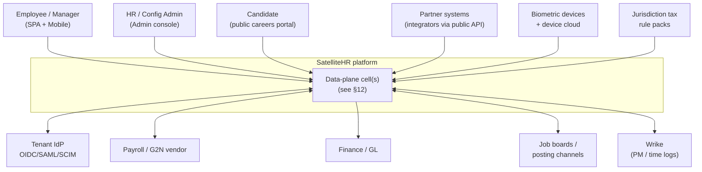
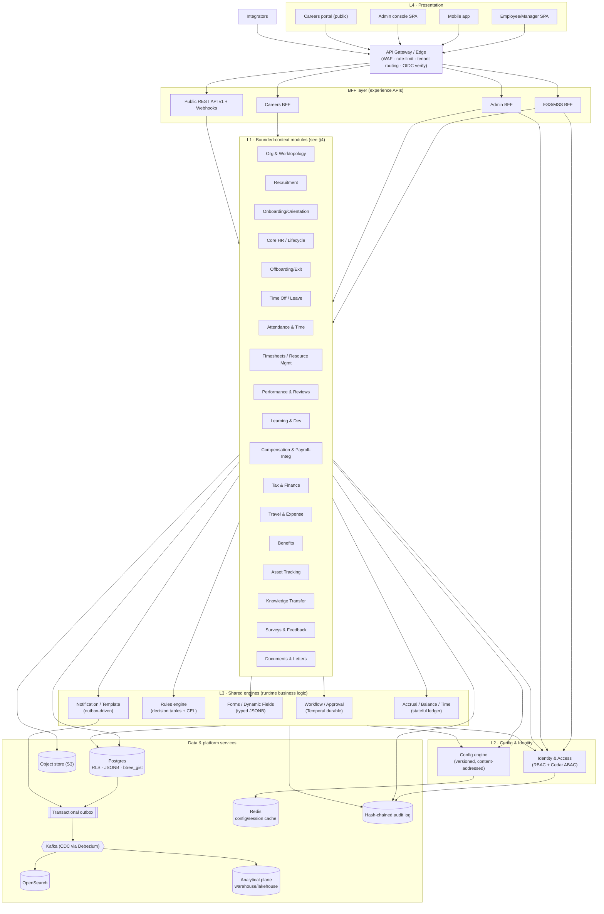
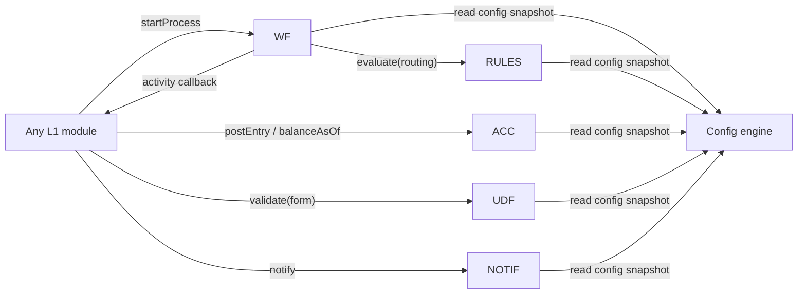
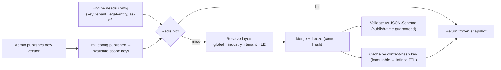
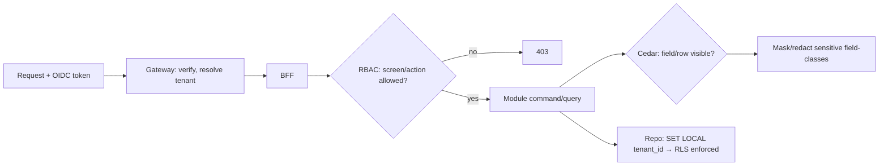
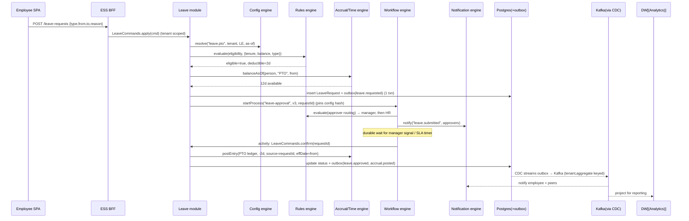
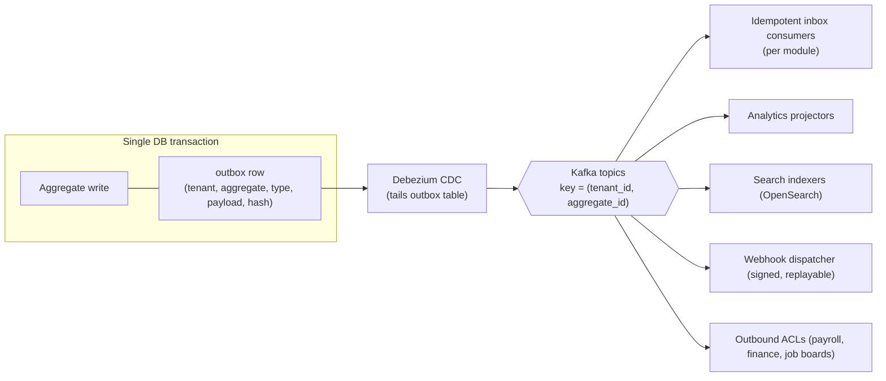
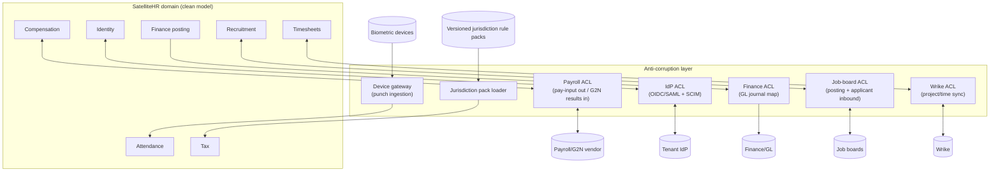
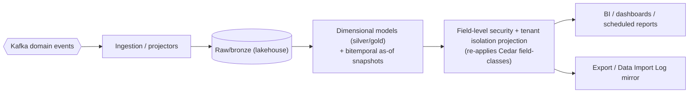
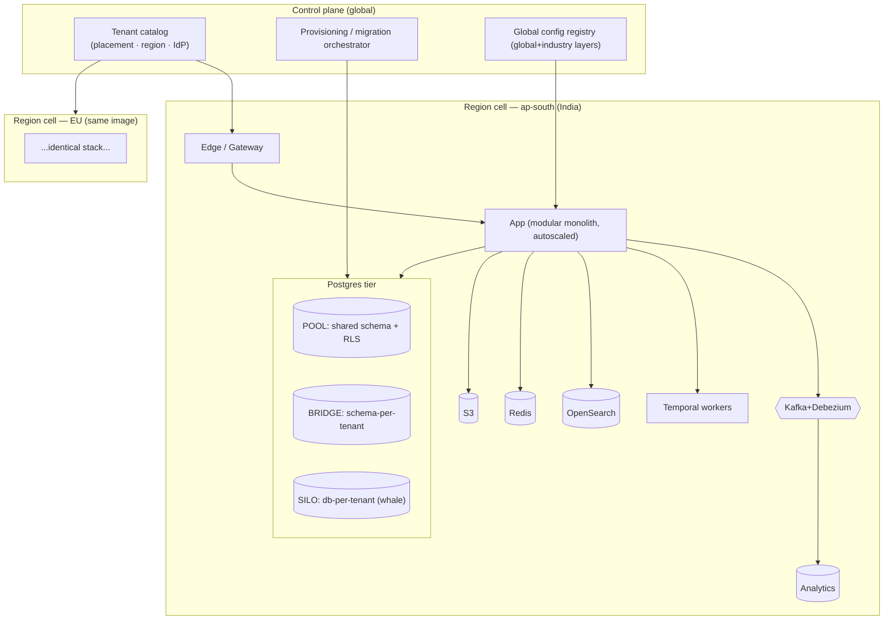

I have everything I need. The feature digest plus the locked architecture decisions are sufficient to author the HLD grounded in the real crawled modules. Producing the document now.

# SatelliteHR — High-Level Design (HLD)

> Multi-tenant, config-driven enterprise HRMS targeting feature parity with Kensium HR v6 (306 crawled screens, ~30 config modules). This document is the **structural** design: bounded contexts, components, the interfaces between them, and the runtime flows that connect them. Internals (table-level DDD, algorithms, schemas) belong to each context's LLD. Every context below is traced to crawled modules from `feature-digest.md` / `kensiumhr-features.md`.

---

## 1. Design frame

The system is a **modular monolith** (one deployable unit, one image, one migration pipeline) partitioned into **strictly bounded modules**, sitting on the four locked layers. We choose a monolith-with-seams over microservices-from-day-one because the dominant coupling in an HRMS is *data* coupling (everything references Person/Position/Assignment and shares the config + workflow + rules + accrual engines), and a shared transactional boundary around those is worth more than independent deployability we don't yet need. Seams are real and enforced so that the **named extraction candidates** (§13) can be lifted out without a rewrite.

**The four layers (locked) and where each lives in this HLD:**

| Layer | Contents | Section |
|---|---|---|
| **L4 Presentation** | SPA (employee/manager), Admin console, Mobile, BFFs, public API, webhooks | §3, §11 |
| **L3 Engines (shared runtime — business logic)** | Workflow, Rules, Forms/UDF, Notification, Accrual/Time | §6 |
| **L2 Config/Metadata (per-tenant data)** | Config engine: versioned, content-addressed JSONB read by engines | §7 |
| **L1 Domain + Data** | Bounded-context modules + bitemporal canonical model + Postgres/RLS | §4, §5 |

**Inviolable rules** (carried from locked decisions, enforced in code review and arch tests):
- Business logic lives **only** in L3 engines and L1 domain services. Config is *data*; it never contains imperative logic — at most non-Turing-complete CEL expressions the Rules engine evaluates.
- No module reads another module's tables. Cross-module interaction is via a **published in-process port** (synchronous query/command) or a **domain event** (async). Enforced by `dependency-cruiser` (TS) / ArchUnit-style tests in CI.
- Every row carries `tenant_id`; every composite FK includes `tenant_id`; **`FORCE ROW LEVEL SECURITY`** is the non-bypassable backstop, not the only one.
- The HR core is **bitemporal**: Person / Work-relationship / Position / Assignment are separate lifecycles with valid-time + transaction-time. No mutable "employee" row.

---

## 2. System context (C4 level 1)



Each external actor maps to crawled surface: candidate → Recruitment portal (`Job Vacancy`, `Talent Pool`), IdP → `CONFIG · Security · Manage Active Directory`, biometric → `CONFIG · Attendance · Tracking Device`, Wrike → `CONFIG · Resource Management · Wrike Integration` + `Sync Wrike Logs`, job boards → `Post Vacancies` + `CONFIG · Recruitment · Posting Channel`, tax packs → `CONFIG · Tax Planning · Income Tax Slabs`.

---

## 3. Component diagram (C4 level 2 — the whole landscape)



---

## 4. Bounded contexts and the crawled-module map

Each context is a module with its own tables (own schema namespace), aggregate roots, a synchronous **port** (commands/queries other modules may call), and a set of **published domain events**. The table below is the contract between "what Kensium has" and "what we build."

| # | Bounded context (module) | Crawled modules / screens it absorbs | Aggregate roots | Key published events |
|---|---|---|---|---|
| 1 | **Org & Worktopology** | Organization (Position List, Org Chart, Hierarchy Chart, Announcements, Policies, Employee Current Status); CONFIG·Organization (Head Office, Location, Work Area, Department, Employee Classification, Group, Series); CONFIG·General (Department, Shift) | Position, OrgUnit, Location, EffectiveDatedEdge | `position.created`, `orgedge.changed`, `policy.published` |
| 2 | **Identity & Access** | CONFIG·Organization (Role, Assign Roles, Group); CONFIG·Security (Manage Active Directory, Password Policy); Employee Access Permission | User, Role, Group, PermissionGrant | `user.provisioned`, `role.assigned`, `access.revoked` |
| 3 | **Recruitment** | Recruitment (19: Requisition→Vacancy→Talent Pool→In Review→Interview→Offer→Joining/Appointment); CONFIG·Recruitment (21) | Requisition, Vacancy, Candidate, Application, Offer | `requisition.approved`, `offer.released`, `candidate.joined` |
| 4 | **Onboarding & Orientation** | Pre Onboarding Checklist, Onboarding Checklist, New Joinees; Orientation Program; CONFIG·Orientation (8), Employee Joining Checklist | OnboardingCase, OrientationProgram | `onboarding.completed`, `orientation.scheduled` |
| 5 | **Core HR / Employee Lifecycle** | Employee Master, Mass update, Class Change, Salary Revision, Quadrant Rating, Disciplinary Actions, Appreciation (summary/detail), Acknowledgements; CONFIG·Employee Management (16: UDF, Life Events, Dependants, Timeline, Verification, Document Custodian, Appreciation Categories) | Person, WorkRelationship, Assignment, ClassChange, DisciplinaryCase | `person.hired`, `assignment.changed`, `classchange.effected`, `salary.revised` |
| 6 | **Offboarding / Exit** | Exit HR Checklist, Exit List, Exit Clearance, Enable Exit, Layoff List; CONFIG·Exit (8: Notice Period, Questionnaire, Tasks, Approvers, Clearance) | ExitCase, ClearanceItem, LayoffBatch | `exit.initiated`, `clearance.completed`, `relieving.done` |
| 7 | **Time Off / Leave** | Apply Time Off, My/Employee Time Off Summary, Holiday List, Optional Holiday Requests, Office Closure, Pending Adjustments; CONFIG·Time Off (12: PTO, Unpaid, Holiday Calendar, FMLA, Approvers) | LeaveRequest, LeavePlan, HolidayCalendar | `leave.requested`, `leave.approved`, `accrual.posted` |
| 8 | **Attendance & Time** | Shift Assignment, Attendance Summary/Details, Out Time, WFH, Over Time, Comp Off, Regularization (Change Request), Mass Approval, Manual Attendance; CONFIG·Attendance (19: Tracking Mode/Device, Break, Rule, Flexi, OT, Comp Off) | AttendanceDay, ShiftAssignment, OTRequest, CompOffRequest, RegularizationRequest | `attendance.captured`, `ot.approved`, `compoff.credited` |
| 9 | **Timesheets & Resource Mgmt** | Project Master, Task Library, Project/Resource Allocation, Bulk Resource Assignments, Timesheet Entry/Details, Utilization Summary, Sync Wrike Logs; CONFIG·Resource Management (7), CONFIG·Time Management (4) | Project, Allocation, TimesheetWeek, TaskCatalogItem | `timesheet.submitted`, `allocation.changed` |
| 10 | **Performance & Reviews** | Performance Review Initiation/Ratings, Periodic Review, Peer Review, Confirmation Review; Quadrant Rating; CONFIG·Performance Review (2), CONFIG·Confirmation (6) | ReviewCycle, ReviewForm, ConfirmationCase | `review.initiated`, `review.finalized`, `confirmation.decided` |
| 11 | **Learning & Development** | Learning Program, My/Employee Learning Requests, Certifications, Enrollment, Training Mass Approval, My Training Programs; CONFIG·Learning Management (5) | LearningProgram, Enrollment, Certification, LearningRequest | `enrollment.created`, `certification.recorded` |
| 12 | **Compensation & Payroll Integration** | My Salary Details, Arrear Details, Employee Salary Revision (comp side); CONFIG·Compensation, CONFIG·Recruitment·Position Level PayGrade | CompensationRecord, PayGrade, PayPeriod | `payinput.emitted`, `payperiod.locked`, `retro.recalculated` |
| 13 | **Tax & Finance** | My Deductions/Exemption/LTA Reimbursement; CONFIG·Tax Planning (6: Slabs, Categories, Deductions, Food Allowance), CONFIG·HR Budget | TaxDeclaration, TaxSlabSet, BudgetLine | `declaration.submitted`, `taxpack.activated` |
| 14 | **Travel & Expense** | My/Employee Travel Requests, Trip Details, My/Employee Expenses, Advance Expenses; CONFIG·Travel Management (6) | TravelRequest, ExpenseClaim, Advance | `travel.approved`, `expense.approved`, `advance.settled` |
| 15 | **Benefits** | CONFIG·Benefits (Setup) + benefit enrollment surfaces | BenefitPlan, Enrollment | `benefit.enrolled` |
| 16 | **Asset Tracking** | My/Employee Asset (Requisition/List), New Asset Arrival, Asset List, Outbound Asset; CONFIG·Asset Tracking (2) | Asset, AssetRequisition, Assignment | `asset.assigned`, `asset.returned` |
| 17 | **Knowledge Transfer** | KT to provide/receive, KT Tasks; CONFIG·Knowledge Transfer | KTPlan, KTTask | `kt.assigned`, `kt.completed` |
| 18 | **Surveys & Feedback** | Surveys, My/Employee Feedback / Grievance; CONFIG·Surveys (3), CONFIG·Feedback/Grievance (2) | Survey, Response, GrievanceCase | `survey.published`, `grievance.raised` |
| 19 | **Documents & Letters** | Letter/Email/Notification Templates (CONFIG·Templates 18 + per-module template screens), Document Types, Required Certificates, Agreement; Custodian | LetterTemplate, GeneratedDocument | `document.generated` |

This is the canonical decomposition: **19 bounded contexts** cover all 306 crawled screens. The enormous CONFIG area (191 screens) does **not** become contexts — it is data owned by the **Config engine (§7)** and surfaced as schemas-per-module; e.g. `CONFIG · Attendance Tracking · Rule` is an Attendance rule-set payload, not a separate service.

```mermaid
flowchart LR
  subgraph hireToRetire["Hire-to-retire spine (event-coupled)"]
    REC2[Recruitment] --> ONB2[Onboarding] --> CORE2[Core HR]
    CORE2 --> PERF2[Performance] --> COMP2[Compensation]
    CORE2 --> EXIT2[Exit]
  end
  CORE2 -. person/assignment reads .-> LEAVE2[Leave]
  CORE2 -. .-> ATT2[Attendance]
  CORE2 -. .-> TS2[Timesheets]
  ATT2 --> COMP2
  LEAVE2 --> COMP2
  TE2[Travel/Expense] --> COMP2
  TAXF2[Tax] --> COMP2
```

**Context relationships:** Core HR is the *upstream supplier*; almost every other context is a *customer* of Person/Assignment (consumed via published read-model events, not direct table joins). Compensation is the *downstream sink* that aggregates pay-affecting events from Leave, Attendance, Timesheets, Travel/Expense, and Tax into pay-input.

---

## 5. Module boundary mechanics (how the monolith stays modular)

Each module exposes exactly two surfaces and hides everything else:

```text
modules/
  leave/
    api/        ← Port: LeaveCommands, LeaveQueries (the ONLY thing others import)
    events/     ← Published event contracts (versioned Avro/JSON schema)
    domain/     ← aggregates, invariants  (private)
    infra/      ← repositories, tables    (private — `leave.*` schema)
```

- **Synchronous cross-module:** module A imports `B/api` (an interface), resolved by DI to B's implementation. Compile-time + `dependency-cruiser` rule: no import may reach into `*/domain` or `*/infra` of another module. Other module's tables are unreachable because RLS-scoped repositories are not exported.
- **Asynchronous cross-module:** publish a domain event via the **outbox** (same DB transaction as the state change). Consumers subscribe through the inbox. This is how Core HR fans `assignment.changed` to Leave/Attendance/Comp without a synchronous dependency.
- **Shared kernel:** only the bitemporal value objects (`PersonId`, `AssignmentId`, `EffectiveDate`, `TenantId`, `Money`) and the L3 engine ports live in a `shared-kernel` package that all modules may import. Nothing else is shared.

Arch test gate (CI): cyclic-dependency check across modules = 0; cross-context DB access = 0; every published event has a registered schema.

---

## 6. The shared engines (L3)

> **Reconciliation note:** there are **six** shared engines. The five below are the core; a sixth —
> **Scheduler / Temporal-Alert** (time-driven triggers: cert/visa expiry, probation windows, scheduled jobs,
> alert rules, recurring audits) — was added during reconciliation. Full spec in [`00-CONVENTIONS.md §7`](00-CONVENTIONS.md).

Engines are **shared runtime services**, instantiated once per process, stateless except where noted. They read tenant behavior from the Config engine; they never embed tenant-specific logic. Each exposes a narrow port.

### 6.1 Workflow / Approval engine (durable execution — Temporal)
- **Owns:** orchestration of any multi-step, human-in-the-loop, SLA-bound process. Process definition = **versioned JSON graph**; a running instance **pins the definition version + the config snapshot** at start so a mid-flight approval is immune to later config edits.
- **Grounding:** every `*Approvers` config (Offer Approvers, Time Off Approvers, FMLA Approvers, Class Change Approvers, Change Request Approvers, Exit/Clearance/Layoff Approvers, Training Cost Approvers, Travel Request/Expense Approvers, Salary Revision Approvers, Confirmation Approvers, Disciplinary Approvers, Posting Source Approvers) is a workflow graph the engine executes. ~15 contexts depend on it.
- **Port:** `startProcess(defKey, version, businessKey, input)`, `signal(taskId, decision, actor)`, `queryState(instanceId)`. Tasks materialize as work-items the BFF renders ("Pending …" grids, "Mass Approval" screens).
- **Interface to others:** modules call `startProcess`; the engine calls back into module ports via activities to apply the decision (e.g., on approval, invoke `LeaveCommands.confirm`). Escalation/timeout = durable timers.

### 6.2 Rules engine (stateless decision tables + CEL)
- **Owns:** all branching policy decisions: eligibility, accrual formulas selection, OT multipliers, approver routing predicates, leave caps, FMLA qualification, expense limits, rehire eligibility. Language = **non-Turing-complete CEL**; tabular logic = decision tables. Pure function of `(facts, ruleSet)`.
- **Grounding:** `CONFIG · Attendance · Rule`, `CONFIG · Time Off · Paid/Unpaid Time Off`, `CONFIG · Recruitment · Rehire Settings`, `CONFIG · Tax · Income Tax Slabs`, `CONFIG · Resource Mgmt · Escalation Matrix`.
- **Port:** `evaluate(ruleSetRef, facts) -> decision[]`. Deterministic, cacheable, replayable. Called by Workflow (routing), Accrual (formula), and modules (validation).

### 6.3 Forms / Dynamic-Fields (UDF) engine
- **Owns:** tenant-defined fields and dynamic forms over **typed JSONB** (no EAV). Renders questionnaires, validates, persists into the owning aggregate's `udf` JSONB column with a JSON-Schema contract.
- **Grounding:** `User Defined Fields` (Employee Mgmt), `Confirmation/Exit/Certification/Survey/Interview Questionnaire`s, `Escalation Custom Fields`, `Pre-Interview Questionnaire`. Every "Questions"/"Question Bank" screen is a Forms definition.
- **Port:** `getFormDef(formKey, version)`, `validate(formKey, payload)`, `project(formKey)` (emits the field-level schema the reporting plane and search index consume).

### 6.4 Notification / Template engine (transactional outbox)
- **Owns:** all outbound email/in-app/push from a single template + delivery pipeline. Templates are config; rendering + dispatch is the engine. Writes the message to the **outbox in the same transaction** as the triggering state change → exactly-once-ish via relay.
- **Grounding:** the 18 CONFIG·Templates screens + every module's `Email Templates`/`Notification Templates` (Confirmation, Exit, Disciplinary, Orientation, Attendance, Time Off, Recruitment). `CONFIG · Alerts · Configure Alerts` = alert subscriptions.
- **Port:** `notify(templateKey, audience, context)`. Channels and recipient resolution come from config; "Notify peers / employees to be notified" on Apply Time Off is a recipient-resolution rule.

### 6.5 Accrual / Balance / Time engine (stateful ledger)
- **Owns:** the only **stateful** engine. An **immutable, append-only ledger** for leave accrual, leave balances, comp-off credits, OT banks, and attendance derivation. Everything is **recomputable** from source events + config-as-of → supports retro and "what we believed" corrections (transaction-time).
- **Grounding:** `My Time Off Summary`, `Employee Time Off Summary`, leave accrual config, `Comp Off`, `Over Time`, `Employee Attendance Summary`, `Manual Attendance Sheet`, biometric punches.
- **Port:** `postEntry(ledgerKey, subjectId, delta, source, effectiveDate)`, `balanceAsOf(subjectId, type, date)`, `recompute(subjectId, fromDate)`. Drives `accrual.posted`, `compoff.credited`; feeds Compensation pay-input.



---

## 7. Config engine + resolution & caching path (L2)

The config engine is the heart of "config-driven." It stores **per-tenant metadata** that the engines read; it never executes logic.

- **Shape:** a typed *spine* (config key, scope, kind, version, effective range, content hash, status) + a **JSON-Schema-governed JSONB payload**. Versions are **immutable + content-addressed**; editing creates a new version. Versions are **bitemporal** (effective-dated valid-time + when-published transaction-time).
- **Layered resolution:** `global → industry → tenant → legal-entity`. A lookup returns the merged, frozen snapshot for `(key, scope, as-of)`. Lower layers override higher.
- **Publish is a validation gate:** a draft must pass JSON-Schema validation + cross-reference checks (referenced approvers/templates/forms exist) before it becomes `published` and resolvable. This is the "Save & Next" chain across CONFIG screens made transactional.
- **In-flight pinning:** when a workflow/process starts, it captures the resolved snapshot's content hash; the instance reads *that* hash for its lifetime regardless of later edits.



**Caching:** because versions are content-addressed and immutable, the cache key includes the content hash → entries never need TTL-based expiry; a publish event invalidates the *resolution pointer* (which hash is current for a scope+as-of), not the snapshots themselves. Redis is the hot cache; the resolution pointer is invalidated by the `config.published` event so all cells converge.

---

## 8. Identity & access (L2)

- **AuthN:** federated, **per-tenant OIDC/SAML** brokered at the edge; **SCIM** for inbound user provisioning/deprovisioning. Grounding: `CONFIG · Security · Manage Active Directory`. The gateway verifies the token, resolves the tenant, and injects `tenant_id` + subject + IdP claims downstream.
- **AuthZ — two tiers:**
  1. **RBAC** (tenant-scoped) for *screen/action* access — grounding: `Role`, `Assign Roles (Role × Module × Screens)`, `Group`, `Is admin`, `Employee Access Permission`.
  2. **ABAC via Cedar** for *field/row-level sensitivity* — comp, national ID, health/leave-reason, performance, disciplinary. A Cedar policy decides whether *this principal* may read *this field-class* of *this resource* in *this context* (e.g., manager sees own reports' leave but not reason; finance viewer sees masked national ID).
- **Defense in depth:** Cedar/RBAC at app layer **and** `FORCE RLS` + `tenant_id` in every composite FK at the DB layer. A bug in the app cannot leak across tenants because the DB session is `SET LOCAL app.tenant_id` and RLS predicates bind to it.
- **Privacy:** GDPR/DPDP erasure = **per-(subject × field-class) crypto-shred** (drop the key, not the row, preserving referential + audit integrity); all access/changes append to a **hash-chained immutable audit log**.



---

## 9. Representative request flow — "Apply Time Off"

Chosen because it exercises every engine, the config path, the outbox, and the bitemporal model. (`Apply Time Off` screen: type, from/to, reason, notify-peers.)



Key structural points: the BFF does *no* business logic; the outbox write is **in the same transaction** as the state change; the workflow instance **pins config** so a leave applied under policy v3 is decided under v3; the Accrual ledger entry references the request as `source` so it is **recomputable** if the request is later corrected (transaction-time).

---

## 10. Eventing — outbox → CDC → Kafka topology



- **Why outbox:** atomic "change state + publish intent." No dual-write. The relay (Debezium) guarantees at-least-once delivery; consumers are **idempotent** via an inbox dedup table keyed by event id.
- **Partitioning:** keyed by `(tenant_id, aggregate_id)` → per-aggregate ordering preserved, tenant-fair, and a hot tenant can be isolated to dedicated partitions.
- **Topic design:** one topic per aggregate type per bounded context (e.g., `leave.request.v1`), schema-registered. Versioned with backward-compatible evolution.
- **Replay:** the event log is the source of truth for downstream projections; reporting and search are rebuildable by replay; webhooks are replayable from offset for partner backfills.

---

## 11. Integration & anti-corruption layer (ACL)

Every external system is wrapped in an ACL so its model never leaks into the domain. Each ACL is a thin module with an inbound port and an outbound adapter; failures are isolated (circuit-breaker, retry, DLQ).



| ACL | Boundary contract | Direction | Grounding |
|---|---|---|---|
| **Payroll** | We own compensation + emit `pay-input` events; vendor owns gross-to-net/tax. Pay-period lifecycle `open→locked→paid→posted` + retro recalc. | bidirectional async | `CONFIG · Compensation`, `My Salary Details`, `Arrear Details` |
| **IdP** | OIDC/SAML login + SCIM user sync; claims → IAM. Per-tenant config. | bidirectional | `Manage Active Directory` |
| **Finance/GL** | Map approved expense/advance/payroll postings to journal entries; idempotent. | outbound | `Travel/Expense`, `Expense Head` |
| **Biometric device gateway** | Normalize heterogeneous punches → canonical `attendance.captured`; the *only* inbound device path. | inbound async | `CONFIG · Attendance · Tracking Device / Tracking Mode` |
| **Job boards** | Push `Post Vacancies` to channels; ingest applicants → Talent Pool. | bidirectional | `Post Vacancies`, `Posting Channel` |
| **Wrike** | Sync projects/tasks and pull time logs into timesheets. | bidirectional | `Wrike Integration`, `Sync Wrike Logs` |
| **Jurisdiction packs** | Localization = **data, not code**: versioned rule packs (tax slabs, holidays, leave statutes, FMLA) loaded into config/rules. | inbound (data) | `Income Tax Slabs`, `Localization Settings`, `FMLA` |

---

## 12. Reporting / analytics plane

An HRMS is ~50% reporting (`Reports`, every `*Summary`/`Utilization`, `Employee Current Status`). This belongs on a **separate analytical plane**, fed by the event stream, never querying OLTP for ad-hoc/consolidated reports.



- **Three guarantees re-projected into the warehouse:** (1) **tenant isolation** (tenant_id partition + row policies), (2) **field-level security** (sensitive field-classes masked/omitted unless the consuming role is entitled — the same Cedar classes as OLTP), (3) **as-of bitemporal** (every fact carries valid-time + transaction-time so "headcount as we believed it on date X" is answerable).
- **Pipeline:** CDC events → bronze → dimensional gold → governed semantic layer → BI + scheduled report jobs. Rebuildable by replay. `Schedule Job` config drives scheduled report generation.

---

## 13. Object store, search, and where to extract services later

- **Object store (S3):** documents, generated letters (`Letter Templates` → `document.generated`), resumes (`Bulk Resume Upload`), candidate docs, asset invoices. WORM/Object-Lock for audit-grade artifacts; per-tenant key prefixes; crypto-shred keys per subject for erasure.
- **Search (OpenSearch):** populated by Kafka indexers; powers `Talent Pool` keyword/folder search, `Vacancies` keyword search, employee/global search. Index docs carry `tenant_id` + field-class tags so search respects the same ABAC masking.

**Extraction candidates** (clean seams already in place; lift out when scale/SLA demands):
1. **Accrual/Time + biometric ingestion** — highest write volume, recompute-heavy, naturally async. First to extract.
2. **Notification engine** — fan-out heavy, independent SLA.
3. **Reporting/analytics plane** — already a separate plane; just deploy independently.
4. **Recruitment/Careers portal + public applicant API** — public-internet exposure, different scaling/security profile.
5. **Workflow engine** — already runs on Temporal workers; logically separable.

---

## 14. API surface overview

| Surface | Audience | Style / protocol | Auth | Notes |
|---|---|---|---|---|
| **ESS/MSS BFF** | Employee/Manager SPA + Mobile | GraphQL (or REST) tuned per screen | OIDC user token | Aggregates module ports; no business logic; enforces RBAC+ABAC presentation masking |
| **Admin BFF** | HR/Config admins | REST | OIDC + admin RBAC | Drives all CONFIG screens; talks to Config engine publish gate |
| **Careers BFF** | Public candidates | REST (rate-limited, captcha) | anonymous + session | Vacancy browse, apply, status |
| **Public REST API v1** | Integrators | Versioned REST, OpenAPI | OAuth2 client-credentials, tenant-scoped | Stable contracts over module ports; pagination, idempotency keys |
| **Webhooks (outbound)** | Partner systems | HTTPS POST, HMAC-signed | per-subscription secret | Subscription = (tenant, event types); replayable from offset; DLQ |
| **Inbound ingestion** | Devices / IdP / boards | REST + SCIM + device protocol | mTLS / SCIM token / device key | Biometric punches, SCIM, applicant inbound — each behind its ACL |
| **Control-plane API** | Platform ops | REST | platform admin | Tenant provisioning, placement (pool/bridge/silo), region assignment, config promotion |

BFFs are **per-experience** (avoid one-BFF-fits-all); the public API and webhooks are the **stable, versioned** contract; BFF contracts may churn with the UI.

---

## 15. Deployment topology & multi-tenant placement

**Control plane** (global, thin) holds the **tenant catalog**: for each tenant, its placement model (pool/bridge/silo), home region/cell, and IdP config. The control plane routes/onboards; it holds **no HR data**.

**Data plane** = independently deployable **regional cells**. A cell is a full stack (app, Postgres, Kafka+Debezium, Temporal, OpenSearch, Redis, S3, analytics). Tenants are placed in a cell by **residency** (e.g., India `ap-south`, EU) and **isolation tier**:

- **POOL** — shared schema + `tenant_id`, **FORCE RLS** backstop. Default; most tenants. Highest density.
- **BRIDGE** — schema-per-tenant in a shared cluster. For data-residency/isolation needs short of a dedicated DB.
- **SILO** — database-per-tenant (or dedicated cell). For regulated "whales."

**One image, one migration pipeline** runs across all three models — the only difference is the connection/placement the catalog resolves per request.



Request lifecycle across the topology: edge verifies token → control-plane catalog resolves tenant's cell + placement → routes to that region's app → app sets `SET LOCAL app.tenant_id` and (for bridge/silo) selects schema/DB → RLS + Cedar enforce isolation → events stay within the cell's Kafka and analytics, preserving residency.

---

## 16. NFR & cross-cutting traceability (summary)

| Concern | Mechanism | Section |
|---|---|---|
| Tenant isolation | RLS backstop + `tenant_id` in composite FKs + Cedar + cell placement | §8, §15 |
| Effective dating / "as we believed" | Bitemporal Person/WorkRel/Position/Assignment + recomputable ledger | §1, §6.5 |
| Configurability without redeploy | Config engine versions read by engines at runtime | §7 |
| Exactly-once integration | Outbox → CDC → idempotent inbox | §10 |
| Auditability | Hash-chained immutable audit on every access/change | §8 |
| Privacy / erasure | Per-(subject × field-class) crypto-shred | §8 |
| Reporting at scale | Separate analytical plane, replay-rebuildable | §12 |
| Vendor independence (payroll/tax) | ACLs + jurisdiction rule packs as data | §11 |
| Future scale | Named extraction seams in the monolith | §13 |

---

*This HLD is the structural contract. Each bounded context (§4) and each engine (§6) has a downstream LLD that fills in aggregates, table-level bitemporal DDD, decision-table content, and process graphs — none of which alter the boundaries fixed here.*