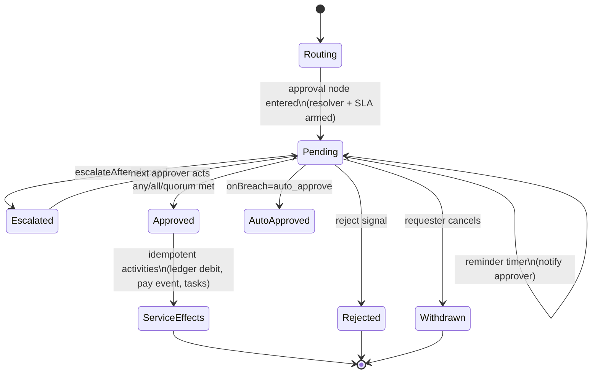
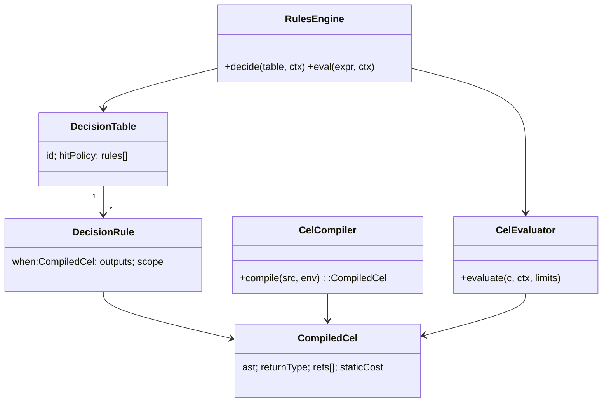
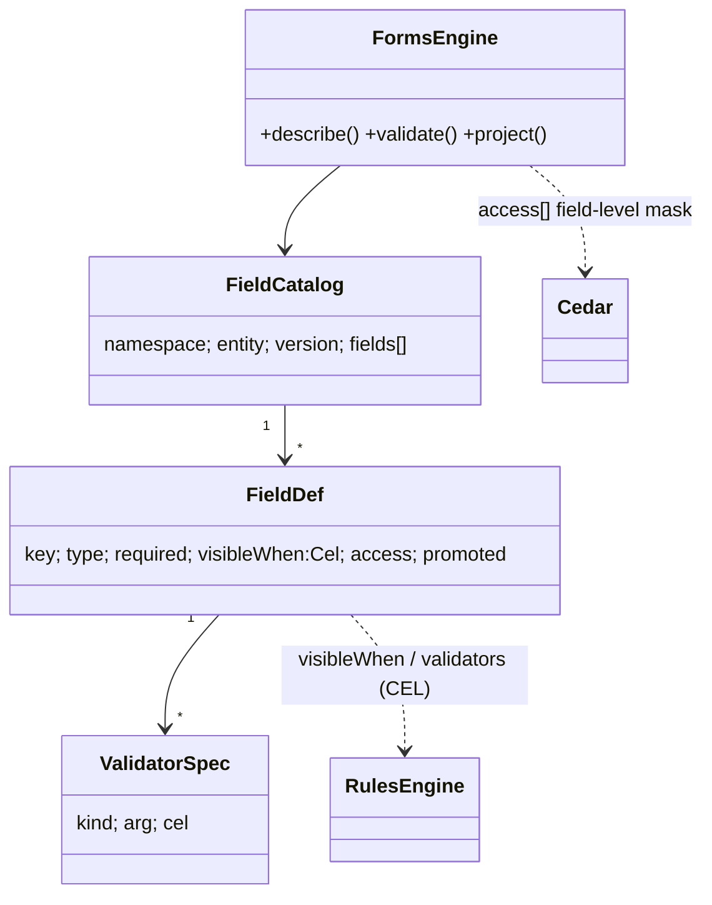
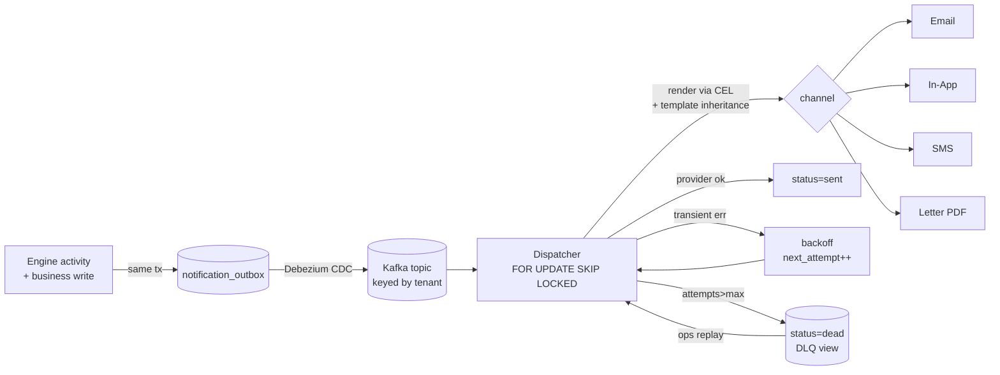
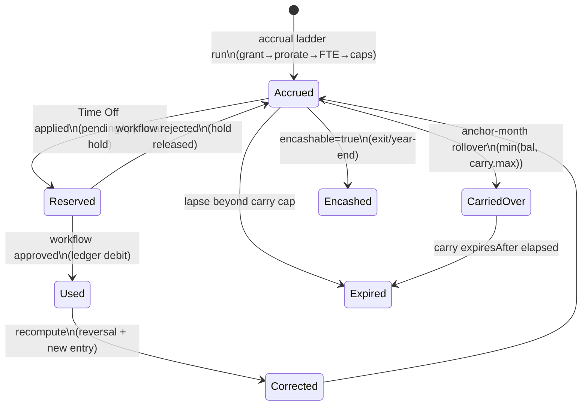
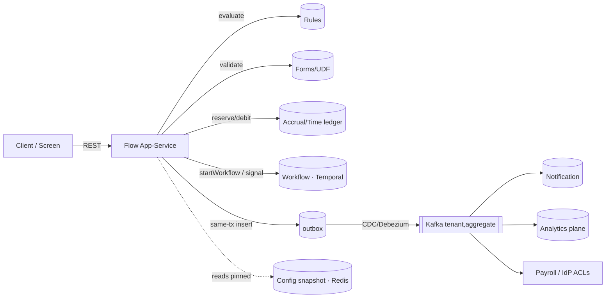
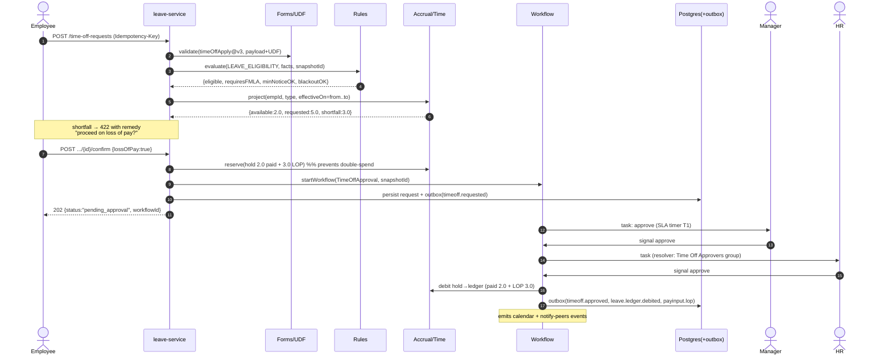
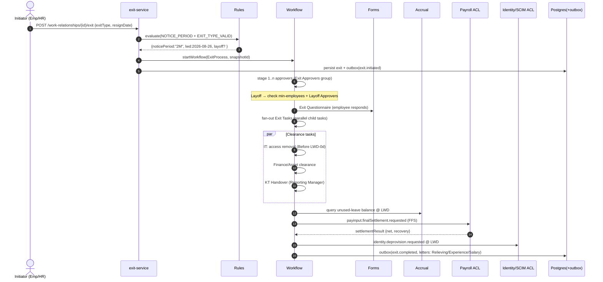
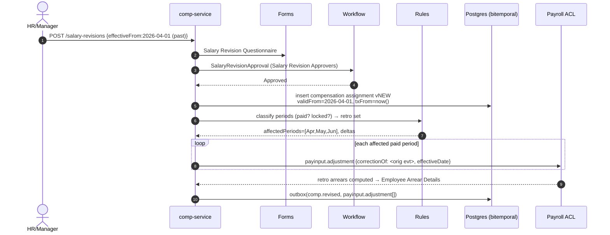
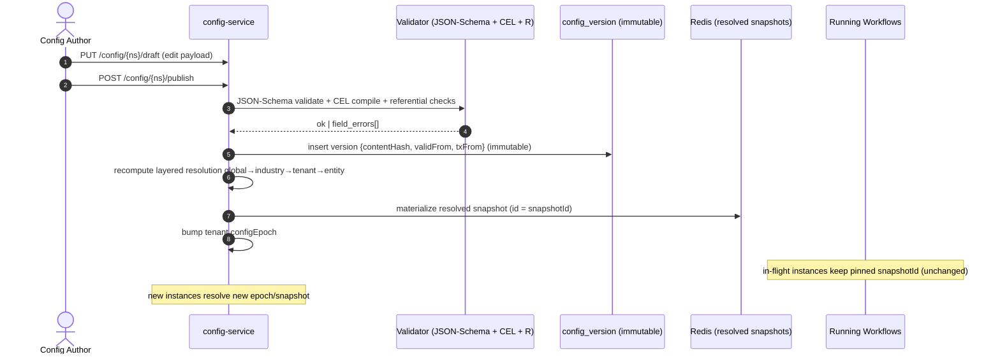

# Low-Level Design — Shared Engines (L3)

The five L3 engines are the **only** place business logic lives. They are tenant-agnostic, deployed in one image, and exhibit per-tenant behaviour purely by reading versioned L2 config. This document specifies their internals: data structures, interfaces, algorithms, and the precise contract by which each engine consumes L2 config.

Everything here is grounded in the crawled Kensium v6 feature set. The recurring shapes that drive the design:

- **Approvers** are expressed as resolver strings like `Reporting Manager Hierarchy(0-0)` and `Human Resources - HR Manager - 1`, scoped by `Location / Department / Position`, with parallel lanes (`Approver(s)` + `Loss of pay approver(s)`) and conditional second levels (`Do you support second level approval for change requests after payroll date?`). 23 distinct `*Approvers` config screens exist.
- **Rules** already ship as expressions: `(Attendance Effective Time > 8)`, `(Attendance Total Time < 8 AND Attendance Total Time != 0)`, `(Early Coming > 0.1)`, `(No of Breaks > 3)` — a decision table keyed by Shift with a color/severity output. Plus routing thresholds (`Maximum number of time off(s) that can be approved by immediate supervisor = 3`).
- **UDFs** carry `Field name · Field type (Textbox/Calendar/Dropdown) · Mandatory · Is Default` plus per-role `View/Edit` for HR / Reporting Manager / Employee, namespaced per module.
- **Templates** appear as Email / Notification / Letter triplets across ~18 screens, per business event.
- **Accrual** ladders show as leave types (`Casual 30.00 Days`, `Comp Off 12.00 Days`, `Medical 20.00 Days`), a `Time off calculations start from = January` anchor per employee class, `Wage type = Salaried/Hourly`, and comp-off thresholds (`Min hours to avail comp off beyond business hours = 4.00`).

---

## 0. Engine Platform Foundations (shared kernel)

Every engine call runs inside an `ExecutionContext` carrying tenancy, identity, and the bitemporal clock. This is the single chokepoint where RLS, the config snapshot, and the as-of time are bound.

```ts
interface ExecutionContext {
  tenantId: Uuid;                 // set as app.tenant_id GUC → drives Postgres RLS
  legalEntityId?: Uuid;           // for layered config resolution
  actor: Principal;               // subject id, roles, ABAC attrs (Cedar entity)
  validTime: Instant;             // effective-time "as of" (default = now)
  txnTime: Instant;               // transaction-time (immutable per request)
  configSnapshotId?: ContentHash; // pinned snapshot; null = resolve latest published
  traceId: Uuid;
}
```

### 0.1 How engines read L2 config — the `ConfigResolver`

No engine reads config tables directly. They all go through one resolver that performs **layered resolution** (global → industry → tenant → legal-entity), enforces **effective-dating**, and returns an **immutable, content-addressed** snapshot. In-flight workflow/accrual processes pin a `configSnapshotId`; everything else resolves "latest published as of `validTime`".

```ts
interface ConfigResolver {
  /** Resolve one typed config document for a key, honouring layering + effective date. */
  resolve<T>(ctx: ExecutionContext, key: ConfigKey): Promise<ConfigDoc<T>>;
  /** Resolve a collection (e.g. all Paid Time Off types for an employee class). */
  resolveSet<T>(ctx: ExecutionContext, key: ConfigKey, filter?: Cel): Promise<ConfigDoc<T>[]>;
  /** Freeze the exact set of docs an engine touched → a reproducible snapshot. */
  pin(ctx: ExecutionContext, keys: ConfigKey[]): Promise<ContentHash>;
}

type ConfigKey = {
  domain: string;     // "workflow.process" | "leave.type" | "udf.catalog" | "template" | "rules.table"
  name: string;       // "time_off_request" | "Casual" | "employee_master"
  scope?: Scope;      // { location?, department?, positionLevel?, employeeClass? }
};

interface ConfigDoc<T> {
  hash: ContentHash;          // sha256 of canonical JSON payload — the identity
  spineId: Uuid;              // typed row
  version: number;
  validFrom: Instant; validTo: Instant;   // effective-dating
  txnFrom: Instant; txnTo: Instant;       // bitemporal
  schemaVersion: string;     // JSON-Schema id that governed publish
  payload: T;                // JSONB body, validated at publish time
}
```

Resolution layering is materialised by deep-merge of payloads in precedence order (later wins on scalar keys, lists are replace-by-default with an explicit `$append` marker). The merged result is content-hashed so identical effective configs share one cache entry in Redis (`cfg:{tenant}:{hash}`).

Config storage separates **content** (immutable, hash-keyed, deduplicated) from **placement** (the effective-dated, tenant-scoped binding of a blob). Conflating them — a single table with `hash` as PK *and* an effective-window EXCLUDE — is invalid: the same payload legitimately recurs in two windows (re-publishing last year's policy) and would collide on the hash PK. See `03-DB-DESIGN.md §3` for the typed-spine (`config_object` / `config_snapshot`) view of the same model.

```sql
-- (a) CONTENT — immutable, deduplicated by hash, tenant-neutral once hashed.
CREATE TABLE config_blob (
  hash           bytea PRIMARY KEY,          -- sha256(canonical(payload))
  schema_version text  NOT NULL,             -- pinned so old snapshots stay interpretable
  payload        jsonb NOT NULL
);

-- (b) PLACEMENT — effective-dated, tenant-scoped binding of a blob to a config key.
CREATE TABLE config_binding (
  tenant_id    uuid NOT NULL,
  binding_id   uuid NOT NULL DEFAULT gen_random_uuid(),
  domain       text NOT NULL,
  name         text NOT NULL,
  scope        jsonb NOT NULL DEFAULT '{}',
  layer        text NOT NULL CHECK (layer IN ('global','industry','tenant','legal_entity')),
  hash         bytea NOT NULL REFERENCES config_blob(hash),  -- which content this window resolves to
  valid_from   timestamptz NOT NULL,         -- VALID time (effective dating)
  valid_to     timestamptz NOT NULL DEFAULT 'infinity',
  txn_from     timestamptz NOT NULL DEFAULT now(),           -- TRANSACTION time
  txn_to       timestamptz NOT NULL DEFAULT 'infinity',
  published_by uuid,
  PRIMARY KEY (tenant_id, binding_id),
  EXCLUDE USING gist (                        -- one live binding per key per instant
    tenant_id WITH =, domain WITH =, name WITH =, scope WITH =,
    tstzrange(valid_from, valid_to) WITH &&,
    tstzrange(txn_from, txn_to) WITH &&)
);
SELECT install_tenant_rls('config_binding');  -- FORCE RLS, USING + WITH CHECK

-- (c) PIN — a manifest of resolved hashes captured at instance/computation creation.
CREATE TABLE config_snapshot (
  tenant_id   uuid NOT NULL,
  snapshot_id uuid NOT NULL DEFAULT gen_random_uuid(),
  manifest    jsonb NOT NULL,                 -- { "<domain>/<name>": "<hash>", ... }
  created_at  timestamptz NOT NULL DEFAULT now(),
  PRIMARY KEY (tenant_id, snapshot_id)
);
SELECT install_tenant_rls('config_snapshot');
```

**Publish is a validation gate**: a config payload is rejected unless (a) it validates against its registered JSON-Schema, (b) every embedded CEL expression compiles and type-checks against the declared context, and (c) referenced ids (templates, resolvers, leave types) resolve. Only then does it get a hash and an effective window.

---

## 1. Workflow / Approval Engine

Drives all ~23 approver flows (Time Off, Comp Off, OT, WFH, Change Request, Exit, Offer, Salary Revision, Training Cost, Travel, Confirmation, Feedback…). Built on a durable-execution substrate (Temporal). A **process** is a versioned JSON graph; the engine ships one generic **interpreter** that walks the graph as a Temporal workflow; all side effects are **idempotent activities**.

### 1.1 The process-graph DSL

```ts
interface ProcessGraph {
  id: string;                 // "time_off_request"
  version: number;            // pinned per instance
  schemaVersion: "wf/v1";
  inputSchema: JsonSchemaRef; // shape of the trigger payload (the request aggregate)
  start: NodeId;
  nodes: Record<NodeId, WfNode>;
}

type WfNode =
  | ApprovalNode | ConditionNode | ServiceNode | ParallelNode | JoinNode
  | DelayNode | EndNode;

interface NodeBase { id: NodeId; kind: WfNode["kind"]; }

interface ApprovalNode extends NodeBase {
  kind: "approval";
  resolver: ResolverSpec;             // WHO approves (see §1.3)
  policy: "any" | "all" | "quorum";   // quorum -> threshold
  threshold?: number;                 // for quorum (e.g. 2 of N)
  onApprove: NodeId;
  onReject: NodeId;
  sla?: SlaSpec;                       // §1.4
  formGate?: { formId: string };      // attach a Forms-engine form (e.g. FMLA reason)
}

interface ConditionNode extends NodeBase {
  kind: "condition";
  // pure CEL over the instance context; first true branch wins (decision table inline)
  branches: { when: Cel; to: NodeId }[];
  otherwise: NodeId;
}

interface ServiceNode extends NodeBase {       // calls an idempotent activity
  kind: "service";
  activity: string;                   // "deductLeaveLedger" | "emitPayInputEvent" | "createExitTasks"
  args: Record<string, Cel>;          // each arg is a CEL expr over context
  next: NodeId;
}

interface ParallelNode extends NodeBase {       // e.g. Time Off Approver + Loss-of-Pay Approver lanes
  kind: "parallel";
  branches: NodeId[];
  join: NodeId;                       // JoinNode that waits per joinPolicy
}
interface JoinNode extends NodeBase { kind: "join"; joinPolicy: "all" | "any" | number; next: NodeId; }
interface DelayNode extends NodeBase { kind: "delay"; until: Cel; next: NodeId; } // e.g. payroll date
interface EndNode extends NodeBase { kind: "end"; outcome: "approved" | "rejected" | "cancelled"; }
```

A representative graph — the Time Off request, which crawled config shows has a primary `Approver(s) = Reporting Manager Hierarchy(0-0)` lane plus a separate `Loss of pay approver(s) = Human Resources - HR Manager - 1` lane, and a supervisor auto-approve threshold of 3:

```json
{
  "id": "time_off_request", "version": 7, "start": "n_route",
  "nodes": {
    "n_route": { "kind": "condition", "branches": [
        { "when": "request.days <= cfg.supervisorAutoApproveMax && request.payType == 'PAID'", "to": "svc_apply" }],
      "otherwise": "approve_rm" },
    "approve_rm": { "kind": "approval", "policy": "any",
      "resolver": { "type": "org_chain", "fromHop": 0, "toHop": 0 },
      "onApprove": "split_pay", "onReject": "end_reject",
      "sla": { "reminderAfter": "P1D", "escalateAfter": "P2D", "escalateTo": { "type": "org_chain", "fromHop": 1, "toHop": 1 } } },
    "split_pay": { "kind": "condition",
      "branches": [{ "when": "request.payType == 'LOP'", "to": "approve_lop" }], "otherwise": "svc_apply" },
    "approve_lop": { "kind": "approval", "policy": "any",
      "resolver": { "type": "position", "department": "Human Resources", "position": "HR Manager", "rank": 1 },
      "onApprove": "svc_apply", "onReject": "end_reject" },
    "svc_apply": { "kind": "service", "activity": "postLeaveLedgerDebit",
      "args": { "ledgerKey": "request.employeeId", "type": "request.timeOffType", "qty": "request.days" }, "next": "end_ok" },
    "end_ok": { "kind": "end", "outcome": "approved" },
    "end_reject": { "kind": "end", "outcome": "rejected" }
  }
}
```

### 1.2 The generic interpreter

The interpreter is a Temporal workflow function. It keeps a small mutable cursor; all durability/retry/timer semantics come from Temporal. Critically it **pins the config + graph version** on first execution so amendments to config never mutate an in-flight instance.

```ts
async function runProcess(input: WfInput): Promise<WfOutcome> {
  // 1. Pin: snapshot graph version + config the moment the instance starts
  const snap = input.configSnapshotId ?? await activities.pinProcessConfig(input);
  const graph = await activities.loadGraph(input.processId, input.graphVersion, snap);

  let cursor: NodeId = graph.start;
  const memo: WfContext = buildContext(input);   // request.*, employee.*, cfg.*, org.*

  while (true) {
    const node = graph.nodes[cursor];
    switch (node.kind) {
      case "condition":
        cursor = firstMatch(node.branches, memo)?.to ?? node.otherwise; break;

      case "service":
        // idempotent activity; Temporal guarantees at-least-once, activity dedups via key
        const res = await activities.invoke(node.activity, evalArgs(node.args, memo), idemKey(node, input));
        memo.result[node.id] = res; cursor = node.next; break;

      case "approval": {
        const approvers = await activities.resolveApprovers(node.resolver, memo, snap); // §1.3
        startSla(node.sla);                              // schedules reminders/escalation timers
        const decision = await waitForDecision(node, approvers, node.policy, node.threshold);
        cursor = decision.approved ? node.onApprove : node.onReject; break;
      }
      case "parallel": {
        const handles = node.branches.map(b => runSubgraph(b, memo));
        await joinAccordingTo(graph.nodes[node.join] as JoinNode, handles); cursor = (graph.nodes[node.join] as JoinNode).next; break;
      }
      case "delay":  await sleepUntil(evalCel(node.until, memo)); cursor = node.next; break;  // e.g. payroll date
      case "end":    return { outcome: node.outcome, ctx: memo };
    }
  }
}
```

Human decisions arrive as **signals** (`approve`/`reject`/`reassign`/`comment`). `waitForDecision` is a Temporal `condition()` over accumulated signals, evaluating the node `policy` (any / all / quorum-N).

### 1.3 Approver resolvers

Resolvers turn a `ResolverSpec` + context into a concrete ordered set of principals. The crawled strings map 1:1 to resolver types. Resolution is **as-of** the request's effective date against the bitemporal org graph (so a reorg doesn't reroute an in-flight approval).

```ts
type ResolverSpec =
  | { type: "org_chain"; fromHop: number; toHop: number; relation?: "solid" | "dotted" } // "Reporting Manager Hierarchy(0-0)"
  | { type: "position"; department: string; position: string; rank: number }             // "Human Resources - HR Manager - 1"
  | { type: "role"; role: string; scope?: Scope }                                         // "Applicable roles: Auditor"
  | { type: "group"; groupId: Uuid }                                                      // Exit Approvers Group
  | { type: "expression"; cel: Cel }                                                       // CEL returning principal ids
  | { type: "matrix"; matrixId: Uuid; level: number };                                    // Escalation Matrix L1/L2/L3

interface ApproverResolver {
  resolve(spec: ResolverSpec, ctx: WfContext, snap: ContentHash): Promise<Principal[]>;
}
```

**`org_chain(fromHop,toHop)`** — the dominant case. Walk the effective-dated reporting edges starting at the subject; collect managers at hop indices `[fromHop..toHop]`. `(0-0)` = immediate manager only; `(0-2)` = up three levels. `relation: "dotted"` traverses matrix/dotted-line edges (a stated requirement). Walk algorithm:

```ts
async function orgChain(subject: Uuid, from: number, to: number, asOf: Instant, rel = "solid"): Promise<Principal[]> {
  const out: Principal[] = []; let current = subject; let hop = 0;
  const seen = new Set<Uuid>([subject]);             // cycle guard
  while (hop <= to) {
    const mgr = await orgGraph.managerOf(current, asOf, rel);
    if (!mgr) break;                                  // top of org → stop (graph may be shorter than range)
    if (hop >= from) out.push(await principal(mgr));
    if (seen.has(mgr)) throw new ResolverCycle(subject, mgr); // bad data → fail loud, route to admin
    seen.add(mgr); current = mgr; hop++;
  }
  return dedupe(out);
}
```

**Delegation / OOO** is applied as a post-pass that every resolver runs through, with its own cycle break (A delegates to B delegates to A → collapse to a terminal resolvable approver, else fall back to the delegator's manager):

```ts
function applyDelegation(approvers: Principal[], asOf: Instant): Principal[] {
  return approvers.map(p => {
    const chain = new Set<Uuid>(); let cur = p.id;
    while (true) {
      const d = delegationOf(cur, asOf);              // active OOO/delegation rule
      if (!d) return principal(cur);
      if (chain.has(d.to)) return managerFallback(p, asOf); // cycle → escalate up one hop
      chain.add(cur); cur = d.to;
    }
  });
}
```

The **applicability scope** seen on every approver grid (`Location / Department / Position`, exit type, employee class) selects *which* resolver row fires. This is itself a decision-table lookup delegated to the Rules engine (§2): the most-specific matching scope row wins; the resolver of that row is used.

### 1.4 SLA, escalation, reminders

Crawled config drives this directly: `Reminder to the approver after N day(s)`, `Reminder to feedback coordinator after N day(s) if approver has not taken any action`, the 3-level Escalation Matrix, and `Maximum number of time off(s) that can be approved by immediate supervisor`.

```ts
interface SlaSpec {
  reminderAfter?: Duration;        // first nudge
  reminderEvery?: Duration;        // recurring
  escalateAfter?: Duration;        // hard escalation
  escalateTo?: ResolverSpec;       // next approver / matrix level
  onBreach?: "escalate" | "auto_approve" | "auto_reject";
}
```

Each `ApprovalNode` registers Temporal **timers** in parallel with `waitForDecision`. The first to fire wins:

```ts
async function withSla(node: ApprovalNode, decide: Promise<Decision>): Promise<Decision> {
  const timers: Promise<SlaEvent>[] = [];
  if (node.sla?.reminderAfter) timers.push(timer(node.sla.reminderAfter).then(() => ({ k: "remind" })));
  if (node.sla?.escalateAfter) timers.push(timer(node.sla.escalateAfter).then(() => ({ k: "escalate" })));
  while (true) {
    const ev = await Promise.race([decide.then(d => ({ k: "decision", d })), ...timers]);
    if (ev.k === "decision") return ev.d;
    if (ev.k === "remind")   { await activities.notify(reminderTemplate(node), currentApprovers); rearmReminder(node.sla); }
    if (ev.k === "escalate") {
      const next = await resolveApprovers(node.sla!.escalateTo!, ctx, snap); // e.g. matrix level+1, or org_chain hop+1
      currentApprovers = next; await activities.notify(escalationTemplate(node), next);
      if (node.sla!.onBreach === "auto_approve") return { approved: true, by: "sla" };
    }
  }
}
```

### 1.5 In-flight version pinning

Two things are pinned at instance creation and never re-read: the **graph version** and the **config snapshot hash**. A `config_version` publish or a graph edit produces a *new* version; running instances keep their pin. Reporting can answer "which process version + config did instance X run under" deterministically.

### 1.6 Idempotent activities + CQRS inbox read model

All write side effects are activities keyed by `(instanceId, nodeId, attemptClass)` so Temporal's at-least-once delivery is safe. Workflow state lives in Temporal; the UI **never** queries Temporal. Instead activities project decisions onto a denormalised **inbox read model** consumed via the integration spine (outbox → CDC → Kafka → idempotent inbox consumer). This is what powers every "Pending …" / "Employee … Requests" grid.

```sql
CREATE TABLE wf_inbox (              -- one row per pending approval task (the "My Approvals" grid)
  task_id       uuid PRIMARY KEY,
  tenant_id     uuid NOT NULL,
  process_id    text NOT NULL, instance_id uuid NOT NULL, node_id text NOT NULL,
  approver_id   uuid NOT NULL,                 -- resolved principal (post-delegation)
  subject_id    uuid NOT NULL,                 -- employee the request is about
  request_kind  text NOT NULL,                 -- 'time_off' | 'over_time' | 'exit' ...
  summary       jsonb NOT NULL,                -- grid columns for that screen
  state         text NOT NULL DEFAULT 'pending',-- pending|approved|rejected|escalated|withdrawn
  sla_due_at    timestamptz,
  created_at    timestamptz NOT NULL DEFAULT now(),
  consumer_seq  bigint NOT NULL                 -- idempotency: inbox dedups on (instance,node,seq)
);
ALTER TABLE wf_inbox ENABLE ROW LEVEL SECURITY;
CREATE POLICY rls_inbox ON wf_inbox USING (tenant_id = current_setting('app.tenant_id')::uuid);
CREATE INDEX ON wf_inbox (tenant_id, approver_id, state);
```



---

## 2. Rules Engine

A **stateless** decision service shared platform-wide. Two artefacts: **decision tables** (the structure already visible in the Attendance `Rule` screen and every `*Approvers` applicability grid) and a **non-Turing-complete CEL** expression language used as the cell/condition language. The same engine is embedded by Workflow (condition nodes, approver-scope selection), Forms (validation + conditional visibility), Templates (recipient/condition gating), and the Time engine (attendance event classification).

### 2.1 Decision-table model

```ts
interface DecisionTable {
  id: string;                         // "attendance.event_rules" | "approver.scope.time_off"
  contextSchema: CelTypeEnv;          // declared, typed input variables
  inputs: ColSpec[];                  // condition columns
  outputs: ColSpec[];                 // result columns
  hitPolicy: "first" | "all" | "priority" | "collect";
  rules: DecisionRule[];
}
interface DecisionRule {
  id: string;
  priority?: number;
  when: Cel;                          // compiled once at publish; e.g. (attendance.totalTime < 8 && attendance.totalTime != 0)
  outputs: Record<string, Cel>;       // { severity: "'BAD'", color: "'#d33'" }
  scope?: Scope;                      // applicability (location/dept/position/employeeClass)
}
```

Direct encoding of the crawled Attendance rules (`color`/severity output, applied per Shift):

```json
{ "id": "attendance.event_rules", "hitPolicy": "collect",
  "contextSchema": { "attendance.totalTime":"double","attendance.effectiveTime":"double",
                     "attendance.earlyComing":"double","attendance.lateComing":"double",
                     "attendance.lateLeaving":"double","attendance.breakCount":"int" },
  "inputs": [], "outputs": [{"name":"event","type":"string"},{"name":"severity","type":"string"}],
  "rules": [
    { "id":"good_effective", "when":"attendance.effectiveTime > 8", "outputs":{"event":"'Actual Productive hours'","severity":"'GOOD'"} },
    { "id":"bad_daily", "when":"attendance.totalTime < 8 && attendance.totalTime != 0", "outputs":{"event":"'Daily Attendance time (Bad)'","severity":"'BAD'"} },
    { "id":"early_coming", "when":"attendance.earlyComing > 0.1", "outputs":{"event":"'Early Coming'","severity":"'INFO'"} },
    { "id":"late_coming", "when":"attendance.lateComing > 0.5", "outputs":{"event":"'Late Coming'","severity":"'WARN'"} },
    { "id":"breaks_exceeded", "when":"attendance.breakCount > 3", "outputs":{"event":"'Exceeded breaks'","severity":"'WARN'"} }
  ] }
```

```ts
interface RulesEngine {
  /** Evaluate a published decision table against a typed context. */
  decide(ctx: ExecutionContext, tableId: string, input: CelContext): Promise<DecisionResult>;
  /** Evaluate a single expression (the path Forms/Templates take). */
  eval(ctx: ExecutionContext, expr: CompiledCel, input: CelContext): CelValue;
}
interface DecisionResult { matched: DecisionRule[]; outputs: Record<string, CelValue>[]; cost: number; }
```

Evaluation: filter `rules` by `scope` against context, evaluate each `when` (short-circuit), apply `hitPolicy`. `first`/`priority` return one row; `collect` returns all (used by attendance, which can flag multiple events on one day). Tables compile at publish into a flat ordered array — no tree walking at runtime; eval is O(rules) with early exit.

### 2.2 The CEL expression language

A typed, **non-Turing-complete** subset (no unbounded loops, no recursion, no I/O) — deliberately chosen so config authored by HR admins cannot hang an engine. The grammar covers exactly the operators seen in crawled rules plus the standard library:

- Literals, `&&` / `||` / `!`, comparisons `== != < <= > >=`, arithmetic, ternary `a ? b : c`.
- Member access `employee.department`, indexing `udf['passport_no']`.
- Whitelisted pure functions: `has()`, `size()`, `in`, `startsWith`, `matches(regex)`, `date()`, `duration()`, `now()`, `age()`, `dayOfWeek()`, `workingDays(a,b)`.
- **No** user-defined functions, no comprehensions that aren't bounded by a literal collection.

```ts
interface CelCompiler {
  compile(src: string, env: CelTypeEnv): CompiledCel; // throws CelTypeError at publish (the validation gate)
}
interface CompiledCel { ast: CelAst; returnType: CelType; refs: string[]; staticCost: number; }

interface CelEvaluator {
  evaluate(c: CompiledCel, ctx: CelContext, limits: CelLimits): CelValue;
}
interface CelLimits { maxSteps: number; maxDepth: number; deadlineMs: number; } // termination + cost guard
```

**Termination & cost limits.** Every compiled expression has a `staticCost` (node count weighted by op). At runtime an interpreter step counter is decremented per node visited; exceeding `maxSteps` or `deadlineMs` throws `CelBudgetExceeded` (caught by the host engine and surfaced as a config error, never a hang). Because the language has no loops/recursion, `staticCost` is a true upper bound — the runtime guard is defence-in-depth, not the primary safety mechanism.

**Typed context.** The `CelTypeEnv` is declared per usage site so `compile()` rejects `attendance.totalTimee` (typo), `employee.age > "x"` (type error), or referencing an undeclared variable — at publish, not in production. The available context per host:

| Host | Context root vars |
|---|---|
| Workflow condition | `request.*`, `employee.*`, `org.*`, `cfg.*` |
| Forms visibility/validation | `form.*` (sibling field values), `employee.*` |
| Template gating | `event.*`, `recipient.*` |
| Attendance classification | `attendance.*`, `shift.*` |



---

## 3. Forms / Dynamic-Fields (UDF) Engine

Backs the `User Defined Fields` screens (per-module: Employee Management, Resource Management, Recruitment, …) and all questionnaire/assessment screens. Field values live in **typed JSONB** (no EAV). The catalog defines fields; validation and conditional visibility delegate to CEL; frequently-filtered fields get **promoted to generated columns** without a data migration of values.

### 3.1 Typed field-definition catalog

Captures exactly the crawled columns — `Field name · Field type · Mandatory · Is Default` plus the per-role `View/Edit` triplet (HR / Reporting Manager / Employee), which is field-level RBAC that the Cedar authz layer enforces.

```ts
interface FieldDef {
  key: string;                        // stable json key, e.g. "two_wheeler_number"
  label: string;                      // "Two/Four wheeler number"
  type: FieldType;                    // see below
  required: boolean;                  // "Mandatory = Yes"
  isDefault: boolean;
  options?: OptionSource;             // for dropdown: static list | config-backed | query
  validators?: ValidatorSpec[];       // regex, range, length, CEL cross-field
  visibleWhen?: Cel;                  // conditional visibility (CEL over sibling fields)
  editableWhen?: Cel;
  access: Record<RoleClass, "none" | "view" | "edit">; // {hr:'edit', reportingManager:'view', employee:'view'}
  scope?: Scope;                      // "Employee class specific" / "Position specific"
  promoted?: { column: string };      // hot-field promotion target (see §3.4)
}

type FieldType =
  | "text" | "textarea" | "number" | "decimal" | "date"   // "Textbox", "Calendar"
  | "datetime" | "boolean" | "dropdown" | "multiselect"   // "Dropdown"
  | "employee_ref" | "document" | "currency";

interface FieldCatalog { namespace: string; entity: string; version: number; fields: FieldDef[]; }
```

The catalog is an L2 config doc (`domain:"udf.catalog"`) resolved by namespace+entity. Values are stored in one JSONB column on the owning aggregate:

```sql
ALTER TABLE employee_assignment
  ADD COLUMN udf jsonb NOT NULL DEFAULT '{}';     -- typed values, keyed by FieldDef.key
CREATE INDEX gin_emp_udf ON employee_assignment USING gin (udf jsonb_path_ops);
```

### 3.2 Validation

```ts
interface FormsEngine {
  describe(ctx: ExecutionContext, ns: string, entity: string): Promise<FieldCatalog>;
  validate(ctx: ExecutionContext, ns: string, entity: string, values: Json): Promise<ValidationResult>;
  /** Project values a given role is allowed to see (field-level masking). */
  project(ctx: ExecutionContext, catalog: FieldCatalog, values: Json, role: RoleClass): Json;
}
```

`validate` runs, per field, in order: (1) **type coercion** against `FieldType`; (2) `required` when `visibleWhen` evaluates true (a hidden field is never required); (3) declared `validators` (regex/length/range); (4) cross-field CEL validators. Each step short-circuits to a structured error keyed by `field.key`. Type-coercion is strict — a value that can't be coerced to the declared type is rejected, which is what keeps the JSONB typed without an EAV type column.

### 3.3 Conditional visibility / editability via CEL

`visibleWhen` / `editableWhen` compile against a context where `form.<key>` exposes sibling values and `employee.*`/`request.*` expose the surrounding aggregate. Example: a "Notice period waiver reason" field that only appears when an exit is involuntary — `visibleWhen: "form.exit_type == 'INVOLUNTARY'"`. The same compiled expression is shipped to the client (L4) for live UI toggling **and** re-evaluated server-side in `validate` (never trust the client). One compiled artefact, two execution sites.

### 3.4 Hot-field promotion to generated columns

When a UDF becomes a frequent filter/sort target (e.g. a tenant routinely searches employees by a custom `cost_center`), it is promoted to a Postgres **generated column** sourced from the JSONB — zero value migration, instantly indexable, query-planner friendly. Promotion is an online DDL step recorded in the catalog (`promoted.column`).

```sql
-- Promotion migration emitted from FieldDef{ key:"cost_center", type:"text", promoted.column:"udf_cost_center" }
ALTER TABLE employee_assignment
  ADD COLUMN udf_cost_center text
  GENERATED ALWAYS AS (udf->>'cost_center') STORED;
CREATE INDEX CONCURRENTLY idx_emp_cost_center ON employee_assignment (tenant_id, udf_cost_center);
```

The query layer prefers `udf_cost_center` when a promoted column exists, else falls back to the GIN-indexed `udf @> '{...}'` containment. Demotion drops the column without touching values (they remain in `udf`). This gives EAV's flexibility with relational query performance.



---

## 4. Notification / Template Engine

Serves every `Email Templates` / `Notification Templates` / `Letter Templates` triplet (~18 template config screens) plus the Alerts module (`Do you want to alert the employee on overdue tasks?`) and all workflow reminders/escalations. Delivery is **exactly-once-ish** via a **transactional outbox** + idempotent dispatch; templates support **inheritance**; channels are pluggable; failures land in a **DLQ**.

### 4.1 Template model + inheritance

```ts
interface Template {
  id: string;                         // "time_off.applied.email"
  channel: Channel;                   // "email" | "in_app" | "sms" | "letter_pdf" | "push"
  extends?: string;                   // inheritance: a base layout/brand template
  locale: string;                     // jurisdiction rule-pack aware (en-US, en-IN…)
  subject?: string;                   // Handlebars-style, {{employee.name}}
  body: string;                       // {{...}} placeholders resolved from event context
  attachments?: TemplateRef[];        // e.g. generated Offer/Joining/Appointment letter PDF
  sendWhen?: Cel;                     // gate: only send if expression true
  recipients: RecipientSpec[];        // to/cc/bcc resolvers (reuse §1.3 ResolverSpec)
}
type Channel = "email" | "in_app" | "sms" | "letter_pdf" | "push";
```

**Inheritance** resolves at render: `extends` chains are merged child-over-parent (child `body` blocks override named `{{> block}}` regions of the parent layout). This is how a tenant overrides only the footer/brand while inheriting the platform's accessible HTML skeleton — and how the 18 near-identical module template sets share one base.

### 4.2 Rendering + the shared expression layer

Placeholders (`{{employee.name}}`, `{{request.fromDate}}`) and `sendWhen` gates both go through the **same CEL evaluator** (§2), so template logic, form logic, and workflow logic share one expression semantics and one type checker. Rendering is sandboxed (no helper can perform I/O); missing keys render to empty + emit a warning metric (never throw in the hot path).

### 4.3 Transactional outbox → dispatch

The producing transaction (e.g. workflow service activity, accrual posting) writes the business row **and** an outbox row in **one** DB transaction. A relay (Debezium CDC → Kafka) streams outbox rows; a dispatcher consumes and delivers per channel. This guarantees a notification is never lost when the business write commits, and never sent if it rolls back.

```sql
CREATE TABLE notification_outbox (
  id            uuid PRIMARY KEY DEFAULT gen_random_uuid(),
  tenant_id     uuid NOT NULL,
  template_id   text NOT NULL,
  channel       text NOT NULL,
  context       jsonb NOT NULL,         -- the event payload CEL/placeholders read
  dedup_key     text NOT NULL,          -- idempotency: (event, subject, recipient, channel)
  status        text NOT NULL DEFAULT 'pending', -- pending|sent|failed|dead
  attempts      int  NOT NULL DEFAULT 0,
  next_attempt  timestamptz NOT NULL DEFAULT now(),
  created_at    timestamptz NOT NULL DEFAULT now(),
  UNIQUE (tenant_id, dedup_key)         -- collapses duplicate emits (at-least-once upstream)
);
ALTER TABLE notification_outbox ENABLE ROW LEVEL SECURITY;
CREATE POLICY rls_outbox ON notification_outbox USING (tenant_id = current_setting('app.tenant_id')::uuid);
```

```ts
interface NotificationEngine {
  enqueue(ctx: ExecutionContext, ev: NotifyEvent, tx: DbTx): Promise<void>; // writes outbox row in caller's tx
}
interface Dispatcher {
  poll(): Promise<void>;            // claim pending rows whose next_attempt <= now (SKIP LOCKED)
  deliver(row: OutboxRow): Promise<DeliveryResult>;
}
```

### 4.4 Idempotency, retries, DLQ

- **Dedup**: `UNIQUE(tenant_id, dedup_key)` makes `enqueue` idempotent under at-least-once upstream emits; a duplicate event is a no-op `ON CONFLICT DO NOTHING`.
- **Claim**: dispatcher uses `SELECT … FOR UPDATE SKIP LOCKED` to fan out across workers without double-send.
- **Retry**: exponential backoff via `next_attempt = now() + backoff(attempts)`; per-channel provider receipt id stored for delivery-confirmation reconciliation.
- **DLQ**: after `maxAttempts`, `status='dead'`; row moves to a DLQ view with the last provider error, surfaced in an ops screen and replayable after fix.



---

## 5. Accrual / Balance / Time Engine

The only **stateful** engine. It owns leave accrual, balances, comp-off, attendance and OT computation. Core principle: an **immutable, append-only ledger** is the source of truth; balances are a **projection** that is always recomputable from `(accrual config snapshot, ledger, calendar)`. This makes retro corrections, carryover audits, and "as-of" balance queries trivially correct — essential because an HRMS is challenged on leave math constantly.

Grounded in: leave types (`Casual 30.00 Days`, `Comp Off 12.00 Days`, `Medical 20.00 Days`, tracked in Days/Hours, FMLA flag); `Time off calculations start from = January` per employee class; `Wage type = Salaried/Hourly`; comp-off `Min hours … beyond business hours = 4.00`; attendance rules from §2.

### 5.1 The immutable ledger

```sql
CREATE TABLE leave_ledger (
  id            bigint GENERATED ALWAYS AS IDENTITY,
  tenant_id     uuid NOT NULL,
  employee_id   uuid NOT NULL,
  leave_type    text NOT NULL,          -- 'Casual' | 'Comp Off' | 'Medical' ...
  entry_type    text NOT NULL,          -- accrual|debit|carryover|expiry|adjustment|encashment|reversal
  unit          text NOT NULL,          -- 'days' | 'hours'  (per leave-type config)
  amount        numeric(9,4) NOT NULL,  -- signed: +accrual, -debit
  effective_on  date NOT NULL,          -- valid-time of the movement
  posted_at     timestamptz NOT NULL DEFAULT now(),  -- transaction-time
  source        text NOT NULL,          -- 'engine.accrual' | 'wf:time_off_request:<inst>' | 'manual'
  config_hash   bytea NOT NULL,         -- accrual config snapshot used (recompute reproducibility)
  reverses_id   bigint,                 -- corrections never UPDATE; they post a reversal
  meta          jsonb NOT NULL DEFAULT '{}',
  PRIMARY KEY (tenant_id, id)
);
ALTER TABLE leave_ledger ENABLE ROW LEVEL SECURITY;
CREATE POLICY rls_ledger ON leave_ledger USING (tenant_id = current_setting('app.tenant_id')::uuid);
CREATE INDEX ON leave_ledger (tenant_id, employee_id, leave_type, effective_on);
```

A balance is `SUM(amount)` over the ledger filtered by type and `effective_on <= asOf`. Corrections are **never** updates — they post a `reversal` + a fresh entry, preserving the audit chain.

### 5.2 The accrual ladder (config) and its algorithm

```ts
interface AccrualPolicy {                // L2 config: domain "leave.accrual", scoped by employeeClass
  leaveType: string;                     // "Casual"
  unit: "days" | "hours";
  anchorMonth: number;                   // "Time off calculations start from = January" -> 1
  grant: GrantSpec;                      // how much, how often
  proration: "none" | "monthly" | "daily";   // for mid-year joiners / FTE
  fteScaled: boolean;                    // part-timers accrue pro-rata to FTE
  caps?: { maxBalance?: number; maxAccrualPerYear?: number };
  carryover?: { max: number; expiresAfter?: Duration };  // carry N, expire rest
  negativeAllowed?: { floor: number };   // allow going negative to floor
  waitingPeriod?: Duration;              // from date of joining
  encashable?: boolean;
  fmlaType?: boolean;
}
interface GrantSpec { frequency: "annual" | "monthly" | "per_pay_period"; amount: number; }
```

The **ladder** is the ordered pipeline applied each accrual run; order matters and is fixed in the engine (the ladder shape is logic, the numbers are config):

```ts
function runAccrual(emp: Employee, pol: AccrualPolicy, period: Period, snap: ContentHash): LedgerEntry[] {
  const out: LedgerEntry[] = [];
  // 1. eligibility — waiting period from DOJ
  if (period.start < addDuration(emp.doj, pol.waitingPeriod)) return out;
  // 2. base grant for the period
  let amt = grantForPeriod(pol.grant, period);
  // 3. proration for mid-period joiners/leavers
  if (pol.proration !== "none") amt *= prorationFactor(emp, period, pol.proration);
  // 4. FTE scaling for part-timers
  if (pol.fteScaled) amt *= emp.fte;             // e.g. 0.5 FTE accrues half
  // 5. per-year accrual cap
  amt = applyAccrualCap(amt, ytdAccrued(emp, pol), pol.caps?.maxAccrualPerYear);
  if (amt > 0) out.push(entry("accrual", pol.leaveType, amt, period.end, snap));
  // 6. max-balance cap (clip the *resulting* balance)
  const over = projectedBalance(emp, pol) + amt - (pol.caps?.maxBalance ?? Infinity);
  if (over > 0) out.push(entry("adjustment", pol.leaveType, -over, period.end, snap));
  return out;
}

// At anchor-month rollover: carryover + expiry
function runRollover(emp: Employee, pol: AccrualPolicy, asOf: Date, snap: ContentHash): LedgerEntry[] {
  const bal = balanceAt(emp, pol.leaveType, asOf);
  const keep = Math.min(bal, pol.carryover?.max ?? 0);
  const lapse = bal - keep;
  const out = [];
  if (lapse > 0) out.push(entry("expiry", pol.leaveType, -lapse, asOf, snap));   // unused beyond carry cap lapses
  if (pol.carryover?.expiresAfter)                                                // carried units get their own expiry timer
    scheduleExpiry(emp, pol.leaveType, keep, addDuration(asOf, pol.carryover.expiresAfter));
  return out;
}
```

### 5.3 Balance projection (read model)

A consume request (Apply Time Off) checks availability against the projected balance, honouring `negativeAllowed.floor`. The projection is a CQRS read model rebuilt from the ledger and cached, with an `as-of` variant for bitemporal queries ("My Time Off Summary" / "Employee Time Off Summary").

```ts
interface BalanceEngine {
  balanceAt(ctx: ExecutionContext, emp: Uuid, type: string, asOf: Date): Promise<Balance>;
  canDebit(ctx: ExecutionContext, emp: Uuid, type: string, qty: number, asOf: Date): Promise<Eligibility>;
  postDebit(ctx: ExecutionContext, req: DebitReq, tx: DbTx): Promise<LedgerEntry>; // called by wf service node
  recompute(ctx: ExecutionContext, emp: Uuid, from: Date): Promise<RecomputeReport>;
}
interface Balance { available: number; accrued: number; used: number; carriedOver: number; pendingApproval: number; unit: "days"|"hours"; }
```

`pendingApproval` is reserved (a tentative hold) the moment a Time Off request enters workflow, released on reject — this prevents double-spend across concurrent requests.

### 5.4 Recompute

Because the ledger stores the `config_hash` per entry and is immutable, recompute is deterministic: replay accrual from a date with the *correct* policy snapshot, diff against existing entries, and post **only reversal+correction deltas** (never rewrite history). This handles retro hires, backdated class changes (the `Class Change` module), and corrected joining dates.

```ts
async function recompute(emp, from): Promise<RecomputeReport> {
  const recomputed = simulateLedger(emp, from);        // pure function of (config, calendar, ledger debits)
  const existing   = await ledgerSince(emp, from);
  const deltas     = diffLedger(existing, recomputed);  // set of correction entries
  for (const d of deltas) await postCorrection(d);      // reversal + new entry, audited
  return { corrected: deltas.length, balanceBefore, balanceAfter };
}
```

### 5.5 Attendance / OT / Comp-off

Daily attendance facts (from biometric devices / manual sheet / WFH) are reduced to a per-day record, classified by the **Rules engine** decision table from §2.1, then the engine derives OT and comp-off ledger entries.

```ts
interface TimeEngine {
  buildDay(ctx, emp, date, punches: Punch[], shift: Shift): DailyAttendance; // effective/total time, breaks, early/late
  classify(ctx, day: DailyAttendance): AttendanceEvent[];   // delegates to RulesEngine.decide("attendance.event_rules")
  deriveOvertime(ctx, day, otPolicy): LedgerEntry[];        // hours beyond shift, capped by supervisor-approval threshold
  deriveCompOff(ctx, day, compPolicy): LedgerEntry[];       // if extra >= "Min hours beyond business hours" (4.00) -> credit Comp Off
}
```

`deriveCompOff` reads the crawled `Min hours to avail comp off beyond business hours = 4.00`: when a working-day's effective hours beyond business hours ≥ threshold (or any worked hours on a holiday), it posts a `Comp Off` **accrual** entry to the same ledger — so comp-off naturally flows through the identical balance/expiry machinery as leave. OT routes through the workflow engine when it exceeds `Maximum over time hours that can be approved by immediate supervisor`.



---

## Cross-engine integration summary

| Concern | Owner | Consumed by |
|---|---|---|
| CEL compile/eval + decision tables | Rules | Workflow (conditions, approver scope), Forms (visibility/validators), Templates (gating/placeholders), Time (attendance classify) |
| Config snapshot pinning | ConfigResolver | Workflow instances, Accrual ledger entries (`config_hash`) |
| Approver resolution (`org_chain`, `position`, `role`, `group`, `matrix`, `expression`) | Workflow | Notification (recipient resolution reuses `ResolverSpec`) |
| Transactional outbox | Notification | Workflow (reminders/escalation), Time/Accrual (balance alerts), Alerts module |
| Immutable ledger + balance projection | Accrual/Time | Workflow service nodes (`postDebit`), Payroll ACL (pay-input events), Reporting plane |

The decomposition keeps **business logic in engines, behaviour in config**: a new tenant gets new leave types, approver chains, attendance rules, UDFs and templates entirely as L2 config documents — no engine code changes, one image, one migration pipeline.


---

# Part II — Key Flows & API Contracts

I have everything I need. Authoring the LLD now.

# Low-Level Design — Key Flows & API Contracts

> Scope: the runtime mechanics of five end-to-end flows, plus the cross-cutting API/event contract style every flow obeys. Every flow is expressed as a choreography over the **five shared L3 engines** — Workflow (W), Rules (R), Forms/UDF (F), Notification (N), Accrual/Balance/Time (A) — reading **per-tenant L2 config** through a pinned snapshot. Grounded in the crawled Kensium v6 screens (RRF/requisition, Hiring states, Exit Tasks/Approvers, Notice Period, Apply Time Off, Salary Revision/Arrears). HTTP examples are illustrative but contract-complete.

---

## 0. Engine-invocation contract (how flows talk to L3)

Before the flows, fix the call discipline so the sequence diagrams read consistently. The application service for a flow is a thin orchestrator; it never embeds business logic, it *invokes engines*:

| Engine | Invocation style | Returns | Side-effect ownership |
|---|---|---|---|
| **Rules (R)** | synchronous, pure: `evaluate(decisionId, factsJSON, snapshotId)` | decision + matched-row + obligations | none (stateless) |
| **Forms/UDF (F)** | synchronous: `validate(formId@version, payloadJSON)` | typed payload or `field_errors[]` | none |
| **Accrual/Time (A)** | command on ledger: `reserve / debit / credit / project(asOf)` | balance projection / `ledgerEntryId` | appends to immutable ledger |
| **Workflow (W)** | `startWorkflow(type@ver, input, snapshotId, idemKey)` then `signal()` / `query()` | `instanceId` (durable) | owns the process; pins snapshot |
| **Notification (N)** | **never called inline** — orchestrator writes an **outbox row** in the same DB tx; N drains it | nothing (fire-and-forget, at-least-once) | transactional outbox → Kafka |

**Golden rule for atomicity:** the only things that share a single Postgres transaction with the aggregate write are (a) the **outbox** insert and (b) the **idempotency/inbox** row. Workflow start, ledger commands, and downstream events all run as their own durable/idempotent units, reconciled by `correlationId`. This is what lets a flow be crash-safe without 2PC.



---

## 1. API design conventions (cross-cutting)

### 1.1 Resource naming & versioning
- Base: `/api/v1`. Version in path; breaking changes only bump major. Additive fields never bump.
- **Plural, lowercase, kebab nouns**; sub-resources nest one level; verbs only as a `decisions`/`actions` sub-collection (never `/approveTimeOff`). Examples:
  - `POST /api/v1/time-off-requests`
  - `POST /api/v1/time-off-requests/{id}/decisions` (approve/reject/clarify)
  - `GET  /api/v1/employees/{id}/time-off-balances`
  - `POST /api/v1/work-relationships/{id}/exit`
  - `POST /api/v1/requisitions/{id}/vacancies`
- **JSON is camelCase.** IDs are typed, prefixed, sortable (`tor_01J...`, `req_01J...` — ULID body). Money is `{ "amount": "120000.00", "currency": "INR" }` (string decimal, never float). Dates are ISO-8601; instants carry `Z`.

### 1.2 Tenancy & config epoch (mandatory on every request)
- `tenant_id` is **never** a body/query param — it is derived from the OIDC token claim and bound into the request context, then forced into RLS (`SET LOCAL app.tenant_id`) and into every composite FK. A mismatch between path resource tenant and token tenant is `404` (not `403`, to avoid existence disclosure).
- `X-Config-Epoch` (response header, echoed): the resolved tenant config epoch used to serve the request. Clients may send `If-Config-Epoch` for read-after-publish coherence.

### 1.3 Bitemporal access — `asOf` and `effectiveOn`
The HR domain is bitemporal, so reads expose **both** axes:

| Param | Axis | Default | Meaning |
|---|---|---|---|
| `effectiveOn=YYYY-MM-DD` (or `effectiveFrom`/`effectiveTo` range) | **valid time** | today | "what is true in the real world on this date" |
| `asOf=<instant>` | **transaction time** | now | "what we believed at this instant" (audit/replay) |

`GET /employees/{id}/compensation?effectiveOn=2026-04-01&asOf=2026-06-01T00:00:00Z` reproduces *what we believed on Jun 1 about the April salary* — the exact pair the retro-comp flow (§5) and audit defence depend on. Writes that are effective-dated carry `effectiveFrom`/`effectiveTo` in the body; transaction-time is always server-stamped.

### 1.4 Pagination — keyset, not offset
List endpoints are cursor/keyset based (offset paging breaks on the large grids — e.g. *Hiring* has 52, *Notice Period* spans hundreds of position rows):
```jsonc
GET /api/v1/candidates?status=interview&limit=50&cursor=eyJhcHBsaWVkIjoiMjAyNi0wMS0wOCJ9
// 200
{ "data": [ /* ... */ ],
  "page": { "nextCursor": "eyJ...", "hasMore": true, "limit": 50 } }
```
Cursor is an opaque base64 of the last sort key `(sortField, id)`. `count` is *not* returned by default (the UI's "Displaying items 1–10 of 52" badge uses a separate cheap `GET ...?meta=count`).

### 1.5 Idempotency
- Every **state-changing POST** accepts `Idempotency-Key: <uuid>` (required for money/ledger/payroll-emitting endpoints, optional elsewhere). Stored in an **inbox** table keyed `(tenant_id, key)` with the hashed request body + the first response. Replay within TTL (24h) returns the **stored response** with `Idempotent-Replay: true`; a same-key different-body returns `409 idempotency_key_reused`.
- PUT/PATCH use **optimistic concurrency**: `ETag` on read, `If-Match` on write; stale write → `412`.

```sql
CREATE TABLE inbox (
  tenant_id   uuid NOT NULL,
  idem_key    text NOT NULL,
  req_hash    bytea NOT NULL,
  resp_status int,
  resp_body   jsonb,
  created_at  timestamptz NOT NULL DEFAULT now(),
  PRIMARY KEY (tenant_id, idem_key)
);  -- RLS-protected like everything else
```

### 1.6 Error model — RFC 9457 `application/problem+json`
```jsonc
// 422
{ "type": "https://errors.hrms.io/leave/insufficient-balance",
  "title": "Insufficient leave balance",
  "status": 422,
  "code": "LEAVE_BALANCE_SHORTFALL",          // stable machine code
  "detail": "Requested 5d exceeds available 2d for type=PTO",
  "instance": "/api/v1/time-off-requests",
  "traceId": "00-4bf92f...-01",
  "configEpoch": 184,
  "errors": [                                   // field-level (Forms/Rules)
    { "pointer": "/days", "code": "EXCEEDS_BALANCE", "meta": { "available": "2.0", "requested": "5.0" } }
  ],
  "remedies": [ { "action": "proceed_loss_of_pay", "rel": "self" } ] // mirrors the real screen prompt
}
```
`code` is the contract; `title`/`detail` are human text. `remedies[]` lets the UI surface the actual Kensium prompt *"Applied time off(s) are more than balance… proceed on loss of pay?"* as a structured next action rather than free text.

### 1.7 AuthZ / ABAC enforcement at the **serialization boundary**
RBAC gates the *endpoint* (can this role call `GET /employees`?). **ABAC (Cedar) gates the fields**, and it runs in a **serialization interceptor**, not scattered in handlers — this is the single most important convention.

- The DTO is annotated with **field-classes**: `comp`, `nationalId`, `health` (leave reason / FMLA qualifying reason), `performance`, `contact`.
- After the handler builds the full DTO, the serializer issues **one batched Cedar decision** per field-class for `(principal, action=view:<class>, resource=this row)`.
- Denied classes are **masked, not errored**: the resource still returns `200`, the field becomes `{ "_masked": true }` (or is omitted for collections). A manager listing their team sees names + leave *dates* but the **leave reason** (health-class) is masked unless they are the leave approver or HR.

```jsonc
// GET /employees/emp_123  — caller = peer manager
{ "id": "emp_123", "name": "A. Gupta",
  "compensation": { "_masked": true },          // comp class denied
  "nationalId":   { "_masked": true },
  "currentLeave": { "type": "PTO", "from": "2026-07-01", "to": "2026-07-03",
                    "reason": { "_masked": true } } }  // health class denied
```
Masking decisions are themselves recorded into the hash-chained audit log (who tried to read what class), satisfying GDPR/DPDP accountability.

### 1.8 Event envelope (outbox → Kafka)
All async contracts share one CloudEvents-derived envelope. Partition key is `(tenant_id, aggregateId)` to preserve per-aggregate ordering; `correctionOf` is first-class (the retro flow depends on it).
```jsonc
{ "specversion": "1.0",
  "id": "evt_01J...",                 // dedup key for idempotent consumers
  "type": "hr.leave.ledger.debited.v1",
  "source": "leave-service",
  "time": "2026-06-27T09:15:04Z",
  "tenantId": "t_kensium",
  "aggregate": { "type": "TimeOffRequest", "id": "tor_01J..." },
  "partitionKey": "t_kensium:tor_01J...",
  "correlationId": "corr_...",        // ties the whole flow together
  "causationId": "evt_prev...",
  "correctionOf": null,               // non-null = retro/amend (see §5)
  "configEpoch": 184,
  "effectiveDate": "2026-07-01",      // valid-time of the business fact
  "traceparent": "00-4bf...-01",
  "dataschema": "https://schemas.hrms.io/leave/ledger-debited/1.json",
  "data": { /* type-specific */ } }
```

---

## 2. Flow 1 — Apply Time Off

**Screens:** *Apply Time Off* (type, tentative request, from/to, reason, notify peers, upload docs), *My Time Off Summary*, *Employee Time Off Requests* (approver grid), *Holiday List / Office Closure*, *Pending Time Off Adjustments*. **Config:** *Time Off Management / Paid / Unpaid*, *Time Off Approvers*, *FMLA Qualifying Reasons / Approvers*, *Holiday Calendar*, Email/Notification Templates. **Engines:** F (apply form + UDF), R (eligibility), A (balance + ledger), W (manager→HR + SLA), N.



### Step detail
1. **Validate (F).** `timeOffApply@v3` is a tenant form: typed fields (`type`, `from`, `to`, `tentative`, `reason`, `notifyPeers[]`, `documents[]`) plus tenant UDFs over typed JSONB. Half-day/hourly handled by `from/to` carrying time.
2. **Eligibility (R).** One CEL decision table keyed on `employeeClass × timeOffType`: min-notice (`requestLeadDays >= type.minNotice`), blackout/Office-Closure overlap, max-consecutive, gender/tenure gates, and `requiresFMLA` (if reason ∈ *FMLA Qualifying Reasons*). Obligations name the approver chain + whether an FMLA sub-workflow is needed.
3. **Balance projection (A).** Projects balance *as of the leave's effective range*, netting future accrual and already-held/approved-future requests — not just today's balance. Returns `shortfall`. This is the engine behind the actual screen prompt.
4. **Loss-of-pay branch.** Shortfall → `422 LEAVE_BALANCE_SHORTFALL` with `remedies:[proceed_loss_of_pay]`. Employee re-POSTs `confirm`; request is split paid/LOP.
5. **Reserve (A).** A **hold** ledger entry is written immediately (immutable), so two concurrent applications can't both consume the same balance. Holds expire if the workflow is abandoned.
6. **Workflow (W).** `TimeOffApproval` pins `snapshotId`. Resolver order: **direct manager → HR group** from *Time Off Approvers* (matched by `location × department × employeeClass`). SLA timer per stage → escalate to skip-level / delegate on timeout. FMLA path forks to *FMLA Approvers* with qualifying/rejection reasons. Approve/reject/request-clarification are Temporal **signals**; the *Pending Time Off Adjustments* screen is a query over open instances.
7. **Settle (A) + payroll.** Final approve converts hold → **debit**; the LOP portion emits `hr.payinput.lop.recorded.v1` to the payroll ACL. Balance is always *recomputable* by replaying the ledger.
8. **Calendar + N.** Outbox emits `timeoff.approved` → calendar projection (and ICS/Graph/Google push), and notifies peers listed in `notifyPeers[]`. Cancellation posts a **compensating credit** (never deletes), reversing any LOP pay-input with a `correctionOf`.

### Contracts
```jsonc
// POST /api/v1/time-off-requests   Idempotency-Key: 6f1a...
{ "employeeId": "emp_123", "type": "PTO", "tentative": false,
  "from": "2026-07-01", "to": "2026-07-05",
  "reason": "Family travel",
  "notifyPeers": ["emp_980","emp_981"],
  "documents": ["doc_77"],
  "udf": { "destinationCountry": "FR" } }

// 422 (shortfall) → problem+json (see §1.6) ... then:
// POST /api/v1/time-off-requests/{id}/confirm
{ "acceptLossOfPay": true }
// 202
{ "id": "tor_01J...", "status": "pending_approval",
  "workflowId": "wf_...", "split": { "paidDays": "2.0", "lopDays": "3.0" },
  "approvalChain": [ {"stage":"manager","assignee":"emp_044"},
                     {"stage":"hr","group":"TimeOffApprovers/HYD"} ] }

// GET /api/v1/employees/emp_123/time-off-balances?asOf=2026-06-27T00:00Z&effectiveOn=2026-07-01
{ "asOf":"2026-06-27T00:00:00Z", "effectiveOn":"2026-07-01",
  "balances": [ { "type":"PTO","available":"2.0","accruedYtd":"10.0",
                  "heldPending":"0.0","unit":"day" } ] }

// POST /api/v1/time-off-requests/{id}/decisions   If-Match:"v3"
{ "decision": "approve", "comment": "ok", "actorRole": "manager" }
```
**Events:** `hr.leave.requested.v1` → `hr.leave.approved.v1` → `hr.leave.ledger.debited.v1` (+ `hr.payinput.lop.recorded.v1`, `hr.calendar.entry.upserted.v1`).

---

## 3. Flow 2 — Exit / Offboarding

**Screens:** *Enable Exit*, *Exit List*, *Exit HR CheckList*, *Exit Clearance List*. **Config:** *Exit Management* (per-class toggle + exit types: Formal Resignation, Suspension, Termination variants, Layoff), *Notice Period* (duration by class/location/dept/position), *Exit Questionnaire*, *Exit Tasks* (task → applicable exit types → responsible **position level / role / reporting manager** → timeframe e.g. *"Before LWD − 0 Day(s)"*), *Exit Approvers* (group keyed `exitType × location × department`, chain like *"Hiring Manager Hierarchy(0-1), HR Manager-1"*), *Layoff Approvers* (min employees to initiate), *Exit Clearance Approvers*, *Letter Templates* (Relieving / Experience / Salary). **Engines:** R (notice period + type validity), W (approval + task fan-out + clearance), F (questionnaire), A (leave encashment), N.



### Step detail
1. **Initiate.** `POST /work-relationships/{id}/exit` with `exitType` and either `resignationDate` (resignation) or `effectiveImmediately` (termination/absconding). Guard: *Exit Management* must be enabled for the employee's class.
2. **Notice period + LWD (R).** *Notice Period* config is resolved by the most-specific match of `employeeClass × location × department × positionLevel`; `LWD = resignationDate + duration` (HR may shorten with a reason → buyout/recovery flag). Termination-Absconding sets `LWD = today`.
3. **Approval (W).** `ExitProcess` resolves the *Exit Approvers* group by `exitType × location × department`. The chain syntax maps directly to resolver primitives:
   - `Hiring Manager Hierarchy(0-1)` → **hierarchy resolver**, walk reporting line levels 0→1.
   - `Human Resources-HR Manager-1` → **position-level resolver** (department + position + ordinal).
   **Layoff** additionally gates on `headcount ≥ minEmployeesToInitiate` and routes to *Layoff Approvers*.
4. **Questionnaire (F).** *Exit Questionnaire* (subjective, responded by employee) rendered/validated by Forms; stored as typed JSONB, health/sentiment fields are `performance`/`health` field-class for ABAC.
5. **Task & clearance fan-out (W).** On approval, W spawns one child task per *Exit Tasks* row whose `applicableExitTypes` contains this type, assigned to the resolved **responsible position-level / role / reporting manager**, with a deadline computed from `timeframe` relative to LWD (*"Before LWD − 0 Day(s)"*). These render as *Exit HR CheckList* + *Exit Clearance List*; clearance sign-off uses *Exit Clearance Approvers* (IT, Finance/Asset, Admin). Asset return cross-links to the Asset Tracking domain.
6. **FFS / Final Settlement.** When all **mandatory** clearance + questionnaire complete **and** LWD reached, W queries A for unused-leave encashment, then emits `hr.payinput.finalSettlement.requested.v1` to the payroll ACL (encashment, notice recovery/shortfall, gratuity input, pending arrears, deductions). Payroll computes net behind the anti-corruption layer and returns `settlementResult`.
7. **Letters (N).** Settlement result drives generation of *Relieving / Experience / Salary* letters from *Exit Letter Templates*.
8. **Access deprovision.** `hr.identity.deprovision.requested.v1` → SCIM de-provision at the per-tenant IdP, session revocation, Cedar principal disabled. Timed at LWD for resignations; immediate for terminations. The Work-relationship gets an **effective-dated termination assignment** (bitemporal) at LWD — the Person row is never mutated/deleted.

### Contracts
```jsonc
// POST /api/v1/work-relationships/wr_55/exit   Idempotency-Key: ...
{ "exitType": "FORMAL_RESIGNATION", "resignationDate": "2026-06-27",
  "reason": "Career change", "requestedLwd": "2026-08-26" }
// 202
{ "exitId": "ext_01J...", "workflowId": "wf_...",
  "noticePeriod": { "name": "Notice Period", "duration": "P2M" },
  "lastWorkingDay": "2026-08-26", "status": "pending_approval",
  "approvalChain": [
    { "stage": 1, "resolver": "hierarchy", "spec": "0-1" },
    { "stage": 2, "resolver": "position-level", "spec": "Human Resources/HR Manager/1" } ],
  "tasks": [
    { "name": "I.D Card access removal", "owner": "IT/Front Office Associate/2", "dueOffsetDays": 0, "anchor": "LWD" },
    { "name": "KT Handover", "owner": "reportingManager", "due": null },
    { "name": "Removal of all access", "owner": "IT/Manager/2" } ] }
```
**Events:** `hr.exit.initiated.v1` → `hr.exit.approved.v1` → `hr.exit.clearance.completed.v1` → `hr.payinput.finalSettlement.requested.v1` → `hr.identity.deprovision.requested.v1` → `hr.exit.completed.v1`.

---

## 4. Flow 3 — Recruitment (Requisition → Onboarding)

**Screens:** *Requisition List* (RRF Id, hiring as New Join/Replacement, status *"Approved − <name>"*), *Job Vacancy* (assigned recruiters), *Post Vacancies*, *Talent Pool / Bulk Resume Upload*, *Hiring* state grid (In-Review → Interview round n → On Hold / Cancelled / Offered / Accepted / Refused / Joined / Rejected / Blacklisted / Withdrawn), *Interview Feedback*, *Offer Approval*, *Offer / Release / Accept / Cancel / Refuse Offer*, *Joining / Appointment Letter*, *Pre Onboarding Checklist*, *Onboarding Checklist*. **Config:** *Resource Requisition Approvers*, *Vacancy Assignment Method*, *Posting Channel / Source Approvers*, *Interview Rounds* (Round1..N → panel), *Interview Assessment Questions*, *Pre-Interview Questionnaire*, *Offer Approvers*, *Position Level PayGrade*, *Pre Joining HR / Network Approvers*, *Required Candidate Documents*, *Letter Templates*. **Engines:** W (3 nested workflows), R (budget + paygrade), F (questionnaires + feedback forms), N.

```mermaid
sequenceDiagram
    autonumber
    actor RM as Hiring Mgr
    participant API as recruit-service
    participant R as Rules
    participant W as Workflow
    participant F as Forms
    actor REC as Recruiter
    actor PAN as Interview Panel
    actor OA as Offer Approver
    actor CAN as Candidate

    RM->>API: POST /requisitions {dept,position,count,hiringAs}
    API->>R: budget check (HR Budget config)
    API->>W: RequisitionApproval (Resource Requisition Approvers)
    W-->>API: Approved → status "Approved - <approver>"
    API->>API: create Vacancy (Vacancy Assignment Method → recruiters)
    API->>API: Post to Posting Channels
    CAN->>API: apply / Bulk Resume / Talent Pool
    API->>F: Pre-Interview Questionnaire
    API->>W: HiringProcess(candidate) state machine
    loop Interview Rounds 1..N
      W->>PAN: schedule round r (panel from Interview Rounds)
      PAN->>F: Interview Feedback (Assessment Questions, score)
      F-->>W: signal feedback(round r)
    end
    W->>R: paygrade band (Position Level PayGrade)
    W->>W: OfferApproval (Offer Approvers) [child wf]
    OA->>W: approve → generate Offer Letter
    W->>CAN: Release Offer
    CAN->>W: Accept (or Refuse/Cancel)
    W->>W: Pre Onboarding (Pre Joining HR + Network Approvers)
    Note over W: On Join → Person+WorkRel+Assignment (bitemporal)<br/>Onboarding Checklist; decrement vacancies; close RRF
```

### Step detail
1. **Requisition (RRF).** `POST /requisitions`. R checks *HR Budget* / headcount; W runs `RequisitionApproval` against *Resource Requisition Approvers*. Status string *"Approved − Naveen Ranganna"* is `status=APPROVED` + `decidedBy` (the UI concatenates).
2. **Vacancy + posting.** On approval, create child **Vacancy**; *Vacancy Assignment Method* assigns recruiters (round-robin/load/manual). *Post Vacancies* fans out to *Posting Channels* (gated by *Posting Source Approvers*).
3. **Candidate intake.** Apply / *Bulk Resume Upload* / *Talent Pool* → **Candidate** aggregate (own lifecycle, *not* a Person yet). *Pre-Interview Questionnaire* + *Required Candidate Documents* via F. Dedup against Talent Pool + *Rehire Settings*.
4. **Hiring state machine (W).** `HiringProcess` per candidate mirrors the crawled states exactly. *Interview Rounds* config drives a loop: each round resolves its **panel**; *Interview Feedback* uses *Interview Assessment Questions* (F, scored). Feedback arrives as a **signal**; branches `On Hold / Cancelled / Rejected / Blacklisted / Withdrawn` are signals that transition/terminate.
5. **Offer (child W).** Paygrade band from *Position Level PayGrade* (R); `OfferApproval` child workflow → *Offer Approvers*. Approval generates *Offer Letter* (N/template). *Release Offer* → candidate; `Accept` / `Refuse` / `Cancel` are signals.
6. **Pre-onboarding.** On Accept: *Joining Letter* + *Appointment Letter*; *Pre Onboarding Checklist* runs *Pre Joining HR Approvers* and *Pre Joining Network Approvers* (laptop/AD account provisioning).
7. **Join → conversion.** On join date: Candidate is **converted** to `Person + Work-relationship + Assignment` (bitemporal, effective-dated at DoJ); *Onboarding Checklist* (timeline + onboarding type) and *Employee Joining Checklist* tasks spawn. Decrement `vacancies`; when 0 the requisition closes. Identity provisioned via SCIM.

### Contracts
```jsonc
// POST /api/v1/requisitions
{ "department":"Quality Assurance", "workLocation":"NAW - India",
  "positionId":"pos_analyst_1", "numberOfVacancies":1,
  "hiringAs":"NEW_JOIN", "employeeClass":"PERMANENT", "closingDate":"2026-08-02" }
// 201 → { "id":"req_1112", "status":"PENDING_APPROVAL", "workflowId":"wf_..." }

// POST /api/v1/candidates/{id}/interviews/{round}/feedback   (panel member)
{ "round":2, "recommendation":"PROCEED",
  "scores":[ {"questionId":"q_dsa","score":4}, {"questionId":"q_sys","score":3} ],
  "comments":"strong" }

// POST /api/v1/candidates/{id}/offer
{ "positionId":"pos_dev_2", "payGradeId":"pg_L3",
  "compensation":{"amount":"1800000.00","currency":"INR","frequency":"ANNUAL"},
  "joiningDate":"2026-09-01" }
// 202 → { "offerId":"off_...", "status":"PENDING_OFFER_APPROVAL",
//         "approvalChain":[{"resolver":"offer-approvers","spec":"HYD/AVP"}] }
```
**Events:** `hr.requisition.approved.v1`, `hr.vacancy.posted.v1`, `hr.candidate.advanced.v1`, `hr.offer.released.v1`, `hr.offer.accepted.v1`, `hr.candidate.converted.v1` (→ triggers onboarding + SCIM provision).

---

## 5. Flow 4 — Retroactive compensation change

**Screens:** *Employee Salary Revision* (status: Pending submission / Pending approval / Need clarification / Approved), *Employee Arrear Details* (the retro output), *My Salary Details / Deductions*. **Config:** *Salary Revision Approvers*, *Salary Revision Questionnaire*, *Compensation*. **Engines:** F (questionnaire), W (revision approval), R (delta computation rules), A (period-aware), N. This is the canonical **bitemporal correction**: valid-time start in the past, transaction-time = now.



### Step detail
1. **Effective-dated-in-the-past write.** HR submits a revision with `effectiveFrom` earlier than today (e.g. cycle effective April 1, entered June 27). The API does **not** mutate the current comp row; it stages a **new compensation assignment version**.
2. **Approval (W) + questionnaire (F).** `SalaryRevisionApproval` routes through *Salary Revision Approvers*; *Need clarification* is a signal that loops back to the initiator (matches the screen's status set).
3. **Bitemporal insert.** On approval, insert `compensation_assignment` with `valid_from = 2026-04-01`, `valid_to = ∞`, `tx_from = now()`; the previously-believed row is closed in **transaction-time** only — so `asOf` queries before now still reproduce the old salary. (DDL below.)
4. **Retro classification (R).** Rules engine intersects the new valid-time interval with **pay periods** and classifies each as `open` (will pick up naturally) vs `locked/paid` (needs retro). For each locked/paid period it computes the **delta**.
5. **Pay-input with `correctionOf`.** For every affected paid period, emit `hr.payinput.adjustment.v1` whose envelope `correctionOf` references the **original pay-input event id** for that period and carries `effectiveDate`. The payroll ACL runs **retro recalculation** behind the anti-corruption layer and returns arrears → surfaced on *Employee Arrear Details*; the pay-period lifecycle (open→locked→paid→posted) treats this as a posted correction, not a re-open.
6. **Audit reproducibility.** Both beliefs are retained: `GET /compensation?effectiveOn=2026-04-01&asOf=<beforeApproval>` returns the *old* salary; with `asOf=now` returns the revised one — the bitemporal guarantee that powers audit and dispute resolution.

### DDL (load-bearing — the bitemporal correction)
```sql
CREATE TABLE compensation_assignment (
  id            uuid NOT NULL,
  tenant_id     uuid NOT NULL,
  work_rel_id   uuid NOT NULL,
  amount        numeric(18,2) NOT NULL,
  currency      char(3) NOT NULL,
  valid_from    date NOT NULL,
  valid_to      date NOT NULL DEFAULT 'infinity',   -- valid time
  tx_from       timestamptz NOT NULL DEFAULT now(),  -- transaction time
  tx_to         timestamptz NOT NULL DEFAULT 'infinity',
  superseded_by uuid,
  PRIMARY KEY (tenant_id, id),
  FOREIGN KEY (tenant_id, work_rel_id)
     REFERENCES work_relationship (tenant_id, id),   -- tenant_id in composite FK
  EXCLUDE USING gist (                                -- no overlap per (tenant,work_rel) in live tx-time
     tenant_id WITH =, work_rel_id WITH =,
     daterange(valid_from, valid_to) WITH &&)
     WHERE (tx_to = 'infinity')
);
ALTER TABLE compensation_assignment ENABLE ROW LEVEL SECURITY;
ALTER TABLE compensation_assignment FORCE ROW LEVEL SECURITY;
CREATE POLICY t ON compensation_assignment
  USING (tenant_id = current_setting('app.tenant_id')::uuid);
```
```jsonc
// POST /api/v1/salary-revisions
{ "workRelationshipId":"wr_55", "effectiveFrom":"2026-04-01",
  "newCompensation":{"amount":"1980000.00","currency":"INR","frequency":"ANNUAL"},
  "reason":"Annual cycle", "questionnaire":{"justification":"exceeds-bar"} }
// 202 → { "revisionId":"rev_...","status":"PENDING_APPROVAL","retroDetected":true,
//         "affectedPeriods":["2026-04","2026-05","2026-06"] }

// Emitted per affected paid period:
{ "type":"hr.payinput.adjustment.v1", "effectiveDate":"2026-04-01",
  "correctionOf":"evt_payinput_apr_orig",
  "data":{ "workRelationshipId":"wr_55","payPeriod":"2026-04",
           "component":"BASE","delta":"15000.00","currency":"INR" } }
```

---

## 6. Flow 5 — Config publish (validate → snapshot → epoch bump → pinning)

**Grounding:** the entire CONFIG area (191 screens) — e.g. *Time Off Approvers*, *Exit Tasks*, *Interview Rounds*, *Offer Approvers*, *Notice Period* — is the data this engine governs. **Engines:** R (CEL compile + cross-config invariants), and the config engine itself (typed spine + JSON-Schema'd JSONB, content-addressed, bitemporal). Publish is a **validation gate**.



### Step detail
1. **Draft.** Edits land in a mutable **workspace draft** (per namespace, e.g. `exit.tasks`, `timeoff.approvers`). Nothing live changes.
2. **Validation gate (V).** Publish runs three checks atomically: (a) **JSON-Schema** validation of the JSONB payload against the namespace's registered schema version; (b) **CEL compile/lint** of every expression (non-Turing-complete, so statically analyzable — unbound vars, type errors, cycles rejected); (c) **referential + invariant** checks via R — e.g. *Exit Approvers* groups reference existing positions, *Notice Period* covers all active classes, no overlapping applicability. Failure → `422` with `errors[]` pointing at JSON pointers; **nothing is published**.
3. **Immutable, content-addressed version.** On pass, the payload is hashed (`contentHash = sha256(canonical_json)`); a new `config_version` row is inserted with `valid_from` (effective date) and `tx_from = now()`. Re-publishing identical content reuses the hash (dedup).
4. **Layered resolution + snapshot.** The resolver composes `global → industry → tenant → legal-entity` into a single **resolved snapshot**, assigns it a `snapshotId`, and caches it (Redis). The tenant `configEpoch` increments.
5. **Pinning (the crux).** A workflow instance captures `snapshotId` **at start** and reads only that snapshot for its entire life (Temporal continue-as-new preserves the pin). So a *Time Off Approvals* instance started yesterday keeps yesterday's approver chain even if you republish today; only **new** instances pick up the new epoch. This is what makes "publish" safe mid-flight.
6. **Rollback = forward publish.** There is no destructive edit: rolling back republishes a prior `contentHash` as a *new* version/epoch. Full bitemporal history of "what config did we believe was active, when."

### DDL + contract
```sql
CREATE TABLE config_version (
  tenant_id     uuid NOT NULL,
  namespace     text NOT NULL,            -- 'exit.tasks', 'timeoff.approvers', ...
  version       int  NOT NULL,
  content_hash  bytea NOT NULL,           -- content-addressed
  payload       jsonb NOT NULL,           -- JSON-Schema governed
  schema_ver    int NOT NULL,
  valid_from    date NOT NULL,
  valid_to      date NOT NULL DEFAULT 'infinity',
  tx_from       timestamptz NOT NULL DEFAULT now(),
  tx_to         timestamptz NOT NULL DEFAULT 'infinity',
  published_by  uuid NOT NULL,
  PRIMARY KEY (tenant_id, namespace, version)
);
```
```jsonc
// POST /api/v1/config/timeoff.approvers/publish
{ "validFrom":"2026-07-01", "note":"add Bengaluru HR tier" }
// 422 (gate failed)
{ "type":"https://errors.hrms.io/config/validation",
  "code":"CONFIG_VALIDATION_FAILED", "status":422,
  "errors":[ { "pointer":"/groups/2/approvers/0/position",
               "code":"UNKNOWN_POSITION", "meta":{"value":"HR-Phantom-1"} } ] }
// 201 (published)
{ "namespace":"timeoff.approvers", "version":19, "epoch":185,
  "contentHash":"sha256:7c1f...", "snapshotId":"snap_01J...",
  "validFrom":"2026-07-01", "affectsNewInstancesOnly":true }
```

---

## 7. Endpoint catalog (marquee examples consolidated)

| # | Endpoint | Engines | Key contract feature |
|---|---|---|---|
| 1 | `POST /api/v1/time-off-requests` (+`/confirm`,`/decisions`) | F,R,A,W,N | LOP `remedy` in error; balance hold→debit |
| 2 | `POST /api/v1/work-relationships/{id}/exit` | R,W,F,A,N | resolver specs (hierarchy/position-level); FFS event |
| 3 | `POST /api/v1/candidates/{id}/offer` | R,W,N | offer child-workflow; paygrade band |
| 4 | `POST /api/v1/salary-revisions` | F,W,R,A | bitemporal past-effective + `correctionOf` pay-input |
| 5 | `POST /api/v1/config/{ns}/publish` | R + config engine | validation gate + epoch bump + snapshot pin |

**Cross-cutting on all five:** `Idempotency-Key` honored; `tenant_id` from token + RLS; ABAC field-masking at serialization (comp/health/perf/nationalId); responses echo `X-Config-Epoch`; every state change writes an outbox event with the §1.8 envelope keyed `(tenant, aggregate)`.

---

## 8. How each flow exercises the shared engines (traceability matrix)

| Flow | Workflow (W) | Rules (R) | Forms/UDF (F) | Accrual/Time (A) | Notification (N) |
|---|---|---|---|---|---|
| Apply Time Off | manager→HR + SLA + FMLA fork | eligibility, notice, blackout, FMLA gate | apply form + UDF | balance project → hold → debit (LOP) | submit/step/peer + calendar |
| Exit | approval + task fan-out + clearance | notice period, exit-type validity, layoff min | exit questionnaire | leave encashment @ LWD | approvals + 3 letters |
| Recruitment | requisition / hiring / offer (nested) | budget, paygrade band | pre-interview Q, feedback scoring | — | offers, letters, onboarding |
| Retro comp | salary-revision approval (+clarify loop) | period classify + delta | revision questionnaire | period-aware delta source | revised + arrears notice |
| Config publish | (consumer of pins) | CEL compile + invariants | (schema-validated payload) | — | publish notice |

Every flow reads config **only** through a pinned snapshot, writes its aggregate + outbox in one Postgres transaction under forced RLS, and lets durable workflows + idempotent consumers provide crash-safety without distributed transactions — the contract that keeps a multi-tenant, bitemporal, config-driven HRMS correct under concurrency and mid-flight config change.