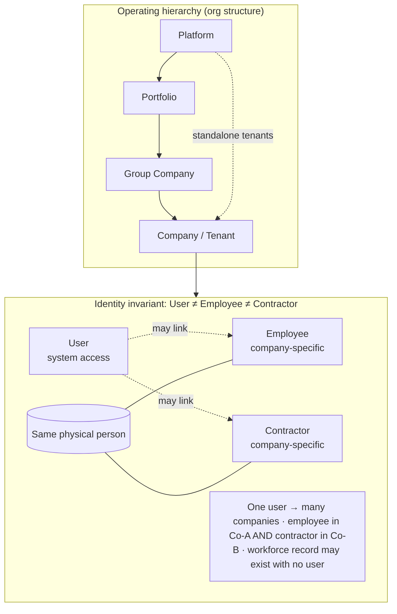
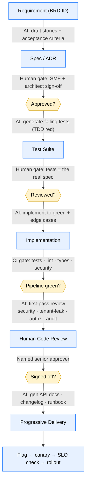
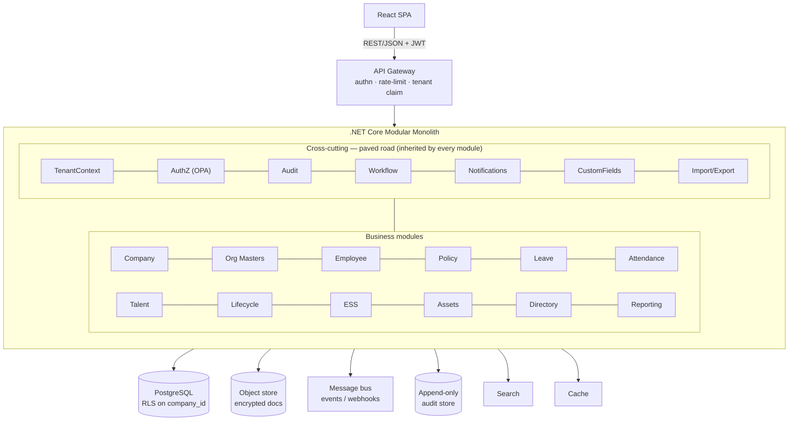
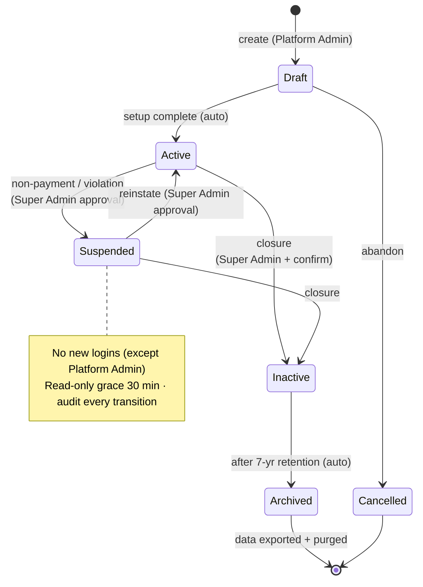
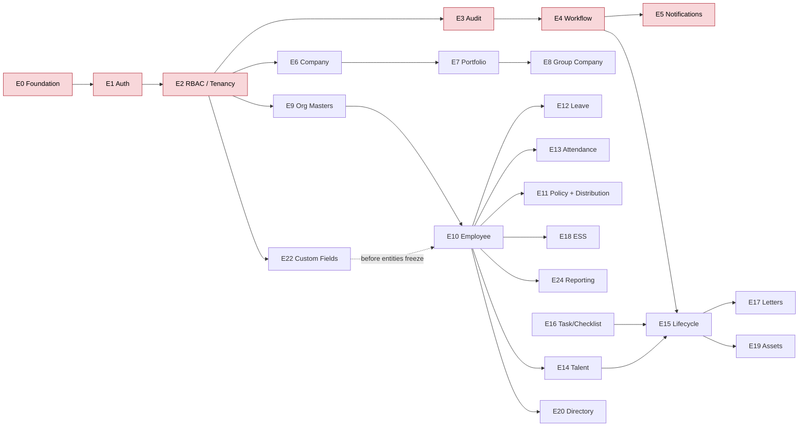
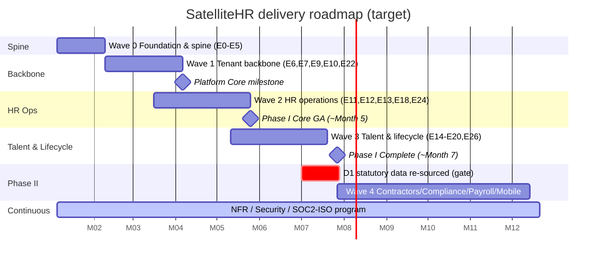
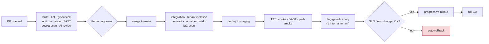

# SatelliteHR — Execution Plan

> How a product-led, AI-native engineering org (think Anthropic/Claude-style: small senior teams, AI in every loop, ruthless quality gates) would ship SatelliteHR **fast** without trading away **enterprise-grade** correctness, security, and auditability.

**Status:** Draft v1.0 · **Owner:** Eng Leadership · **Source of truth:** `SatelliteHR Phase I-BRD`, `SatelliteHR Phase II-BRD`, `SatelliteHR-FunctionalSpec-CompanyManagement`
**Locked stack (per BRD §8.10.2):** React (frontend) · .NET Core (backend) · PostgreSQL (DB) · REST + OAuth2/JWT · OpenAPI/Swagger

---

## 0. TL;DR

- **Product:** Multi-tenant SaaS HRMS. Operating hierarchy `Platform > Portfolio > Group Company > Company`. Core design invariant: **User ≠ Employee ≠ Contractor** (three independent identities).
- **Scale of Phase I:** ~29 functional modules across 9 domains, 4-tier RBAC (~20 roles), full HR lifecycle, hard compliance/uptime NFRs.
- **Strategy:** A **paved-road platform foundation first**, then **parallel vertical-slice squads** delivering module-by-module behind feature flags, with **AI accelerating every SDLC stage** (spec→tests→code→review→docs) under **non-negotiable quality gates**.
- **Architecture call:** **Modular monolith** in .NET (clean module boundaries) + **PostgreSQL Row-Level Security (RLS)** for tenant isolation. Extract services only where scale forces it (Reporting, Notifications, Workflow). *(See §4 for why, and how this reconciles the doc's conflicting isolation language.)*
- **Timeline (target, aggressive-but-real):** Foundation ~5 weeks → **Phase I core GA ~5 months** → **full Phase I ~7 months** → **Phase II ~+5 months**, with 5–6 parallel squads.
- **Bulletproof doctrine:** TDD, trunk-based dev, everything-as-code, every merge gated by tests + security + AI review, progressive delivery, SLOs with error budgets, immutable audit from day one.

### The two invariants the whole product rests on

> Get either of these wrong and the product is unrecoverable. Tenant isolation (the hierarchy + RLS) and the three-way identity separation are P0 invariants enforced by code **and** automated tests on every build.

---

## 1. Guiding Principles (the "bulletproof" doctrine)

These are the rules the whole org commits to. They are how we go fast *and* stay solid.

1. **Spec is code's contract.** Every feature traces to a BRD/FunctionalSpec requirement ID (`COMP-FR-001`, etc.). No code without a traced requirement; no requirement shipped without a test that proves it.
2. **Tenant isolation is a P0 invariant, not a feature.** A cross-tenant data leak is a company-ending event for a multi-tenant HRMS. Isolation is enforced at the database layer (RLS) *and* the application layer *and* proven by automated tests on every build.
3. **AI accelerates, humans are accountable.** AI writes the first draft of specs, tests, code, and reviews. A named senior engineer owns and signs off on every merge. AI output is never trusted unverified — see the **source-data integrity** issues in §2.
4. **Security & audit are built in, not bolted on.** Encryption, RBAC checks, audit trails, and PII handling are part of the Definition of Done for every story — not a later "hardening sprint."
5. **Vertical slices over horizontal layers.** Ship `Company Management` end-to-end (DB→API→UI→tests→docs→telemetry) before starting the next module. Always demoable, always shippable.
6. **Trunk-based + feature-flagged.** Small PRs to `main`, dark-launched behind flags. No long-lived branches, no big-bang merges.
7. **Quality gates are automated and non-bypassable.** If the pipeline is red, nothing ships. Speed comes from fast feedback, not from skipping checks.
8. **Everything as code.** Infra (IaC), pipelines, policies (OPA), DB migrations, dashboards, runbooks — all version-controlled and reviewable.
9. **Definition of Done includes "operable."** Logs, metrics, traces, alerts, and a runbook ship *with* the feature.
10. **Scope discipline.** Phase I BRD §3.3 explicitly forbids scope creep. The plan treats the phase boundaries as contractual.

---

## 2. Pre-Flight: Source Document Integrity (do this in Week 0)

Bulletproof execution starts by refusing to build on bad inputs. The discovery pass surfaced concrete issues that must be resolved **before** the relevant modules are estimated or built.

| # | Finding | Location | Action | Owner | Gate |
|---|---------|----------|--------|-------|------|
| D1 | **Corrupted compliance data.** "Form 5–200 (ESI): Medical benefit claim for TB treatment" repeated ~195× is hallucinated/placeholder garbage. Real ESI statutory forms do not run to 200. | Phase II BRD §5.3.1 | Re-source the authoritative ESI/EPF form list from statute + a compliance SME/legal partner. Do **not** code the form registry from this doc. | Compliance Lead + Legal | Phase II compliance epic blocked until corrected |
| D2 | **Multi-tenancy isolation is self-contradictory.** "Create tenant database schema" (COMP-FR-004) implies schema-per-tenant, but §7.2 says "all queries must include company_id filter" (shared-schema). | FuncSpec §3.1.1 vs §7.2 | Resolve via ADR-001 (§4). Recommendation: shared-schema + RLS as default; schema/DB-per-tenant as an Enterprise-tier deployment option. | Principal Architect | ADR-001 signed before Foundation Wave |
| D3 | **Open requirements.** Mandatory/optional attributes for master entities; full statutory field list; biometric/3rd-party attendance integration specs are open. | Phase I BRD §10 | Run 3 targeted spec workshops; capture as ADRs + updated field dictionaries. Stub interfaces where specs are pending. | Product + Architect | Affected epics start as "spec-ready" only |
| D4 | **Effective-dating scope ambiguity.** Manager changes are effective-dated (BRD §6.9.5) but company config is "no future-dating for Phase I" (FuncSpec COMP-FR-016). Confirm which entities are temporal. | Cross-doc | Define the temporal-data policy once, centrally (which entities are bitemporal). | Architect | Data-model freeze gate |
| D5 | **Excel artifact not ingested.** `Adrenalin Features.xlsx` (competitor/feature reference) was skipped. | Repo root | Product to extract any binding requirements; otherwise mark as reference-only. | Product | Backlog grooming |

**Principle:** AI is excellent at drafting but will faithfully reproduce errors in its inputs (D1 is a textbook example). Every AI-assisted artifact passes through human SME verification before it becomes a build input.

---

## 3. The AI-Augmented SDLC (where speed actually comes from)

We don't get speed by working faster manually — we get it by collapsing each SDLC stage with AI, then enforcing verification. AI is applied at **every** stage; humans own the gates between stages.

### 3.1 Toolchain by stage

| Stage | AI leverage | Human accountability | Guardrail |
|-------|-------------|----------------------|-----------|
| Discovery / specs | Summarize BRD, draft stories + acceptance criteria, build traceability matrix, surface contradictions (like D1/D2) | Product + SME validate; architect signs ADRs | Every story links a BRD ID |
| Data modeling | Draft entities/migrations from FuncSpec field tables; propose indexes & RLS policies | DBA/architect review; review the migration, not just the model | Migrations reviewed + reversible + tested on prod-like data |
| Test-first | Generate unit/integration/contract tests from acceptance criteria | Engineers review tests = the contract | Coverage + mutation thresholds (§9) |
| Implementation | Claude Code / IDE agents implement to green, refactor, fill edge cases | Author owns correctness | No merge on red pipeline |
| Code review | AI review bot on every PR: security, tenant leakage, N+1, missing authz, missing audit | Named senior approver required | AI review is advisory; human approval is mandatory |
| Security | AI-assisted threat models per module; SAST/DAST/dep-scan triage | AppSec sign-off on sensitive modules | No criticals/highs unresolved |
| Docs | Auto-gen OpenAPI clients, API docs, ADR drafts, runbooks | Tech writer/eng polish | Docs ship with the feature |
| Ops | AI-assisted incident triage, log summarization, runbook suggestions | On-call owns the call | Runbook exists before GA |

### 3.2 The "paved road" (Internal Developer Platform)

A platform squad builds the golden path so module squads move at full speed without re-deciding solved problems:

- **Service template / scaffold:** one command generates a new module with wiring for auth, tenant context, audit, logging, tracing, error handling, test harness, and a sample slice.
- **Shared libraries:** `TenantContext`, `AuthZ` (policy checks), `AuditWriter`, `WorkflowClient`, `NotificationClient`, `CustomFields`, `Importer/Exporter`, `ReportingSDK`.
- **CI/CD templates, IaC modules, observability defaults, and reference patterns** for the recurring shapes (CRUD-with-approval, list-with-RLS, bulk-import).

This is what lets 5–6 squads parallelize safely: they consume the same paved road, so isolation, audit, and security are *inherited*, not re-implemented (and re-broken) per module.

---

## 4. Target Architecture

### 4.1 Architecture Decision Records (sign these first)

| ADR | Decision | Recommendation | Rationale |
|-----|----------|----------------|-----------|
| **ADR-001 Tenancy** | How are tenants isolated? | **Shared DB, shared schema, PostgreSQL RLS** keyed on `company_id`, with tenant context from JWT claims. Offer **schema-/DB-per-tenant** as an Enterprise deployment tier. | RLS scales to "thousands of companies, no platform limit" (BRD §8.2) operationally far better than thousands of schemas. Resolves D2. Defense-in-depth: RLS *and* app-layer filter. |
| **ADR-002 Modularity** | Monolith vs microservices? | **Modular monolith** with enforced module boundaries; extract only Reporting, Notifications, and the Workflow Engine as services when load demands. | Fastest to build & operate; avoids premature distributed-systems tax. Boundaries are clean enough to split later. |
| **ADR-003 Identity model** | User/Employee/Contractor | Three separate aggregates; a `PersonLink` concept maps the same physical person across companies/types. Never collapse them. | This is *the* core BRD invariant (§1, §7). Getting it wrong is unrecoverable. |
| **ADR-004 Workflow engine** | Build vs adopt | Build a thin configurable engine over a **durable execution** foundation (e.g., a saga/state-machine library) supporting sequential/parallel/conditional + SLA + escalation. | Required by ~15 modules (§6.25). Centralize once; reuse everywhere. |
| **ADR-005 AuthN/AuthZ** | SSO + RBAC | OAuth2/OIDC broker for SAML/AD/O365/Google + local; **policy-as-code (OPA/Cedar)** for the 4-tier RBAC + row-level security; permissions = composable capability sets (BRD §5.1). | Roles-as-personas / permissions-as-capabilities is explicit in the BRD. Policy-as-code makes the RBAC matrix testable. |
| **ADR-006 Audit & temporal** | Immutable audit + effective-dating | Append-only audit store (hash-chained for tamper-evidence); bitemporal pattern for entities flagged temporal (resolve via D4). | BRD §6.29, §8.6, §6.9.5. "Tamper-resistant logs" is a stated requirement. |
| **ADR-007 Multi-region/DR** | Meet RTO/RPO | Active-passive multi-region in India region; async replication; automated failover ≤5 min; PITR. | BRD §8.3/§8.4: RTO 4h, RPO 15min, India data residency (§8.5). |
| **ADR-008 Extensibility** | Custom fields | Typed EAV / JSONB hybrid with validation, indexed, searchable, workflow- and report-aware. | BRD §6.26 spans 6 entities, many data types. Must be designed before those entities are finalized. |

### 4.2 Logical layering (every module follows this)

### 4.3 Non-negotiable cross-cutting concerns (inherited by all modules)

- **Tenant context** propagated end-to-end (JWT claim → request scope → DB session var for RLS).
- **AuthZ** at every endpoint via policy check; deny-by-default.
- **Audit** auto-emitted on create/update/delete/status-change for audited entities.
- **PII handling:** field-level classification, AES-256 at rest, TLS 1.2+ in transit, masking in logs.
- **Idempotency + optimistic concurrency** on writes; **rate limiting** on all public APIs.
- **Observability:** structured logs, RED/USE metrics, distributed traces with `company_id` + `correlation_id`.

### 4.4 Company lifecycle state machine (FuncSpec §3.1.3)

This is a representative example of the rigor every stateful entity gets: an explicit, test-enforced state machine with guarded transitions and audit on every hop.

---

## 5. Team Topology & Operating Model

Small, senior, full-stack squads on a paved road. (Stream-aligned + platform + enabling — Team Topologies model.)

| Team | Mission | Size (indicative) |
|------|---------|-------------------|
| **Platform / Paved Road** | IDP, CI/CD, IaC, shared libs, tenancy & RLS, workflow & notification engines, observability | 4–5 |
| **Identity & Access** | AuthN (SSO), RBAC/OPA, context switching, tenant isolation, audit | 3–4 |
| **Squad A — Company & Org** | Companies, Portfolio, Group, Jurisdiction, Location, Group, Dept, Position | 4–5 |
| **Squad B — Workforce & Lifecycle** | Employee, Talent Acquisition, Lifecycle, Letters, Directory | 4–5 |
| **Squad C — Time & Policy** | Leave, Time & Attendance, Policy Mgmt + Distribution, Feedback | 4–5 |
| **Squad D — Self-Service & Platform Features** | ESS, Assets, Documents, Custom Fields, Data Mgmt, Notifications | 4–5 |
| **Squad E — Reporting & Analytics** | Standard/ad-hoc/scheduled reports, dashboards, consolidated reporting | 3–4 |
| **SRE / Security (enabling)** | SLOs, DR, pen-test coordination, SOC2/ISO program, threat modeling | 3–4 |
| **Product / QA / Compliance SME** | Story ownership, acceptance, statutory correctness (esp. Phase II) | 4–6 |

**Operating cadence:** 1- or 2-week iterations, trunk-based, async-first. Weekly architecture council (ADR review). Twice-weekly demo of working slices. AI used by every role daily; humans own all gates.

---

## 6. Work Breakdown — Epics mapped to the BRD

Each epic is a **vertical slice**: data model → migrations(+RLS) → API → UI → tests → audit → docs → telemetry → flag. "DoD" = §9 Definition of Done met.

### 6.1 Phase I epic map (29 modules → epics, with priority)

| # | Epic | BRD ref | Squad | Priority | Key risks/notes |
|---|------|---------|-------|----------|-----------------|
| E0 | **Foundation / paved road** | §8.10, §8.6 | Platform | P0 | Scaffold, CI/CD, IaC, observability, secrets, base UI shell/design system |
| E1 | **AuthN + SSO** | §6.1 | IAM | P0 | SAML/AD/O365/Google/local; user≠employee; MFA |
| E2 | **RBAC + tenant isolation** | §5, §6.12, FS§7 | IAM | P0 | 4-tier roles, OPA policies, RLS, context switching |
| E3 | **Audit & logging** | §6.29 | IAM/Platform | P0 | Immutable, hash-chained, record-level history |
| E4 | **Workflow engine** | §6.25 | Platform | P0 | Seq/parallel/conditional, SLA, escalation — reused everywhere |
| E5 | **Notifications** | §6.27 | Squad D | P0 | Email mandatory; templating; preferences |
| E6 | **Company Management** | FuncSpec (full) | Squad A | P0 | Reference implementation — sets the quality bar for all squads |
| E7 | **Portfolio + context switching** | §6.x, FS§3.2 | Squad A | P0 | One portfolio per company; secure switch |
| E8 | **Group Company + shared constructs** | §6.3, FS§3.3 | Squad A | P1 | Shared locations/policy templates; no circular refs |
| E9 | **Org masters** (Jurisdiction, Location, Group, Dept, Position) | §6.4–6.8 | Squad A | P0 | n-level hierarchy; policy applicability dimensions |
| E10 | **Employees** | §6.9 | Squad B | P0 | Manager hierarchy, dotted-line, effective-dating, dedupe, statutory fields |
| E11 | **Policy Mgmt + Distribution/Ack** | §6.10–6.11 | Squad C | P1 | Versioning, effective dating, ack tracking, re-ack |
| E12 | **Leave Management** | §6.17 | Squad C | P0 | Configurable policies, balances, approvals, overrides, calendars |
| E13 | **Time & Attendance** | §6.18 | Squad C | P1 | Capture (manual/biometric/API/import), shifts, OT, exceptions |
| E14 | **Talent Acquisition** | §6.13 | Squad B | P1 | Requisition→offer→convert; scorecards |
| E15 | **Employee Lifecycle** | §6.15 | Squad B | P1 | Onboarding, probation, transfers, exit (depends on workflow + tasks) |
| E16 | **Task/Checklist** | §6.x | Squad B | P1 | Reusable templates (note: referenced TaskChecklist-BRD missing — D-item) |
| E17 | **HR Letters & Certificates** | §6.28 | Squad B | P2 | Templated PDFs, merge fields, approval |
| E18 | **Employee Self-Service** | §6.16 | Squad D | P0 | Web-first (mobile is Phase II) |
| E19 | **Asset Management** | §6.20 | Squad D | P2 | Lifecycle states, acknowledgements, onboarding/exit hooks |
| E20 | **Directory & Org Chart** | §6.21 | Squad B | P2 | Views, advanced search, cross-company (group) search |
| E21 | **Documents & Attachments** | §6.22 | Squad D | P1 | Encrypted at rest, expiry, RBAC, 2MB limit |
| E22 | **Custom Fields** | §6.26 | Squad D | P1 | 6 entities; must land before those entities freeze |
| E23 | **Data Import/Export** | §6.24 | Squad D | P1 | Sandbox/validate/rollback; dependency sequencing |
| E24 | **Reporting & Analytics** | §6.23 | Squad E | P1 | Standard + ad-hoc + scheduled + consolidated (RLS-filtered) |
| E25 | **Announcements** | §6.14 | Squad D | P2 | Targeted, scheduled, expiring |
| E26 | **Feedback & Grievance** | §6.19 | Squad C | P2 | Restricted access, status tracking |
| E27 | **Cross-module business rules** | §7 | All | P0 | Enforced as shared invariants + property tests |
| E28 | **NFR program** (perf, DR, security certs) | §8 | SRE/Sec | P0 | Runs continuously, not at the end |

### 6.2 Dependency ordering (the critical path)

*Red = platform spine (E0–E5). Nothing downstream builds until the spine is GA-quality, because every module inherits its isolation, audit, and authz guarantees.*

**Hard rule:** nothing builds on the platform spine (E0–E5) until it's GA-quality, because every downstream module inherits its isolation, audit, and authz guarantees.

---

## 7. Delivery Timeline (waves)

Aggressive but achievable with 5–6 parallel squads on the paved road. Weeks are relative to kickoff.

### Wave 0 — Foundation & Spine (Weeks 1–5)
- ADR-001…008 signed. Source-data fixes (D1–D5) triaged.
- Paved road: scaffold, CI/CD, IaC, observability, design system, secrets mgmt.
- E1 Auth (SSO + local + MFA), E2 RBAC+RLS+context switch, E3 Audit, E4 Workflow, E5 Notifications.
- **Exit gate:** a "hello-tenant" vertical slice proves end-to-end tenant isolation (RLS test suite green), audit emission, an approval workflow, and an email notification — all behind flags, all observable.

### Wave 1 — Core Tenant Backbone (Weeks 4–12, overlaps Wave 0)
- E6 Company Management (full FuncSpec — the **reference implementation**).
- E7 Portfolio + context switching, E9 Org masters, E10 Employee (with manager hierarchy + statutory fields), E22 Custom Fields, E21 Documents.
- **Exit gate / Milestone "Platform Core":** provision a company, set up org structure, create employees, switch context, with full audit + RBAC + custom fields.

### Wave 2 — HR Operations (Weeks 10–20)
- E12 Leave, E13 Attendance, E11 Policy + Distribution, E18 ESS, E5 notification templates, E24 Reporting (standard + scheduled).
- E23 Data Import/Export (so customers can migrate), E25 Announcements.
- **Milestone "Phase I Core GA" (~Month 5):** companies, org, employees, leave, attendance, ESS, policy, notifications, reporting, audit — production-ready for a first design-partner tenant. *(Behind flags; canary tenant.)*

### Wave 3 — Talent & Lifecycle (Weeks 18–28)
- E14 Talent Acquisition, E16 Task/Checklist, E15 Lifecycle (onboarding/probation/transfer/exit), E17 Letters, E19 Assets, E20 Directory, E26 Feedback, E8 Group Company, E24 ad-hoc + consolidated reporting.
- **Milestone "Phase I Complete" (~Month 7):** all 29 modules GA, full traceability matrix green, NFR + security certification evidence collected.

### Wave 4 — Phase II (Months 8–12)
- **Pre-req:** D1 corrected (authoritative statutory form/registry list with compliance SME + legal).
- Vendors & Contractors (extends identity model), India Statutory Compliance Enablement (data capture, eligibility, registers, dashboards, alerts — *enablement only, no filing/payment*), Payroll, Mobile app (iOS/Android), advanced contractor/vendor roles.
- **Architecture readiness for multi-jurisdiction** (Phase 3+) baked into the rules engine, not built yet.

> **Phasing matters:** Phase II compliance carries legal risk. We deliberately sequence it after the platform is hardened, and gate it on SME-verified statutory data — never on the corrupted source (D1).

---

## 8. Engineering Standards

### 8.1 Definition of Ready (story can start)
- Linked BRD/FuncSpec ID(s); acceptance criteria written; spec ambiguities resolved or stubbed; design/ADR impact noted; test approach agreed.

### 8.2 Definition of Done (story can ship) — **all required**
- [ ] Acceptance criteria met, proven by tests (unit + integration; contract where APIs cross modules).
- [ ] **Tenant isolation test** passes (no cross-`company_id` access possible).
- [ ] **AuthZ test** passes (RBAC matrix from FuncSpec §7 enforced; deny-by-default).
- [ ] **Audit events** emitted for create/update/delete/status per BRD §6.29.
- [ ] PII classified; encryption at rest/in transit verified; no PII in logs.
- [ ] Coverage + mutation thresholds met (§9); SAST/dep-scan clean of high/critical.
- [ ] API documented (OpenAPI); error codes match FuncSpec §9 convention.
- [ ] Telemetry (logs/metrics/traces) + dashboard + alert + runbook delta shipped.
- [ ] AI code review addressed **and** named human approver signed off.
- [ ] Feature-flagged; migration reversible and tested on prod-like data.

### 8.3 Coding standards
- Trunk-based; PRs < ~400 lines where feasible; conventional commits; semantic versioning of APIs (`/api/v1`).
- Deny-by-default authz; idempotent writes; optimistic concurrency; pagination defaults (FuncSpec: 20, max 100).
- No raw SQL bypassing RLS; all DB access through the tenant-scoped data layer.

---

## 9. Testing Strategy (proving "bulletproof")

Test pyramid, AI-generated and human-curated, with isolation/security as first-class test categories.

| Layer | What | Tooling | Gate |
|-------|------|---------|------|
| **Unit** | Domain logic, business rules (BRD §7 invariants as property tests) | xUnit + AI-generated cases | ≥80% line, ≥70% branch on domain code |
| **Mutation** | Are the tests meaningful? | Stryker.NET | ≥60% mutation score on critical modules |
| **Integration** | API + DB + RLS + authz together | Testcontainers (real Postgres) | Per-module suite green |
| **Tenant-isolation** | Attempt cross-tenant reads/writes; must fail | Custom harness in CI | **Zero leaks — hard fail** |
| **Contract** | Cross-module + frontend/back contracts | Pact/OpenAPI diff | No breaking change unflagged |
| **E2E** | Critical user journeys (provision company, onboard employee, leave→approve, context switch) | Playwright | Smoke green pre-deploy |
| **Performance** | NFR §8.1: sub-2s @ 1000 employees, report SLAs, import SLAs, 2× burst | k6 + load env | Meets NFR thresholds before GA |
| **Security** | SAST, DAST, dependency, secrets, IaC scan + annual pen test | Pipeline + external pen-test | No high/critical open |
| **Chaos/DR** | Failover ≤5 min, RTO 4h / RPO 15min restore drills | GameDay automation | Quarterly drill passes |
| **Accessibility** | WCAG on key flows | axe in CI | No critical a11y |

**AI's role:** drafts the bulk of unit/integration/contract tests from acceptance criteria (TDD red phase), then engineers curate them as the real spec. AI never marks its own homework — coverage/mutation/isolation gates are objective and machine-enforced.

---

## 10. CI/CD & Progressive Delivery

- **Trunk-based, multiple deploys/day** to staging; production via progressive rollout with automated rollback on SLO breach.
- **Database migrations:** expand/contract pattern, reversible, applied automatically, tested against prod-shaped data; never destructive in a single step.
- **Feature flags** decouple deploy from release; every risky feature dark-launches.
- **Supply chain:** signed artifacts, SBOM generated, pinned dependencies, base-image scanning.

---

## 11. Security, Compliance & Data Governance (continuous workstream)

Runs from Day 1 in parallel — *not* a hardening phase at the end.

| Area | Requirement (BRD) | How |
|------|-------------------|-----|
| Certifications | ISO 27001, SOC 2 Type I (Phase I) → Type II, GDPR/DPDP (§8.6) | Controls-as-code, evidence auto-collected via pipeline & IaC; auditor-ready from Wave 0 |
| Encryption | AES-256 at rest, TLS 1.2+ in transit, encrypted backups (§8.6.2) | KMS-managed keys, enforced at platform layer |
| Data residency | India unless contracted otherwise (§8.5) | Region pinning in IaC; residency tests |
| Data subject rights | Access/rectify/erase, 30-day SLA (§8.7.3) | DSR workflow + automated export/anonymize jobs |
| Retention & purge | Per §8.7 matrix; anonymization; legal hold | Automated monthly purge with legal-hold suspension; tested |
| Secure SDLC | Threat modeling, secure coding, pen testing (§8.6.3) | Per-module AI-assisted threat models; pen test before Phase I GA |
| Audit integrity | Tamper-resistant, role-based, tenant-bound (§6.29) | Append-only, hash-chained store; access-audited |
| PII minimization | Mask in logs, classify fields | Field classification dictionary enforced in code review + scanners |

---

## 12. Observability & SRE (proving the NFRs)

- **SLOs with error budgets** per availability tier (99.99% critical / 99.95% standard / 99.9% background — BRD §8.3). Releases pause when budget is burned.
- **Golden signals** per module; dashboards templated by the paved road; every log/trace carries `company_id` + `correlation_id` (with PII redaction).
- **DR proven, not assumed:** automated failover drills (≤5 min), monthly backup-restore tests, quarterly DR GameDays (§8.4).
- **On-call + runbooks** exist before any module reaches GA. Blameless postmortems; action items tracked to closure.

---

## 13. Risk Register

| Risk | Impact | Likelihood | Mitigation |
|------|--------|-----------|------------|
| **Cross-tenant data leak** | Catastrophic | Low (if controls hold) | RLS + app filter + isolation tests on every build; pen test; deny-by-default |
| **Corrupted statutory data shipped** (D1) | Legal/financial | Medium if unmanaged | Re-source from statute + SME/legal; block compliance epic until verified |
| **Tenancy model thrash** (D2) | Rework | Medium | Resolve ADR-001 before Foundation; defense-in-depth keeps options open |
| **AI-generated errors slip through** | Quality | Medium | Human gates at every stage; mutation tests; AI review is advisory only |
| **Workflow engine underbuilt** | Blocks ~15 modules | Medium | Build E4 early as a first-class platform capability; durable execution foundation |
| **Scope creep** (BRD §3.3) | Schedule | Medium | Phase boundaries treated as contract; new asks → backlog, not in-flight |
| **NFR miss at scale** (sub-2s @ 1000 emp) | Customer trust | Medium | Perf tests in CI from Wave 1; load env; index/RLS perf reviewed in ADR-001 |
| **Missing referenced docs** (TaskChecklist-BRD, attendance integration specs, D3) | Blocks E13/E16 | Medium | Spec workshops; stub interfaces; mark epics "spec-pending" |
| **Compliance/legal sign-off latency** (Phase II) | Schedule | Medium | Engage compliance SME + legal in Wave 0; parallelize legal review with build |

---

## 14. Success Metrics

**Delivery / DORA**
- Deployment frequency: multiple/day to staging, ≥weekly to prod.
- Lead time for change: < 1 day (commit→prod-capable).
- Change failure rate: < 15%.
- MTTR: < 1 hour.

**Quality / bulletproof**
- Zero cross-tenant isolation failures in CI or prod (hard target).
- Requirement traceability: 100% of shipped features map to a BRD/FuncSpec ID with a passing test.
- Mutation score ≥ 60% on critical modules; coverage thresholds met.
- Zero unresolved high/critical security findings at any GA.

**Product / business**
- Phase I Core GA with a design-partner tenant by ~Month 5.
- Full Phase I by ~Month 7; SOC 2 Type I evidence package complete.
- NFR conformance: sub-2s p95 @ 1000-employee tenant; DR drill meets RTO 4h / RPO 15min.

---

## 15. Why this is both *fast* and *bulletproof*

| Lever | Speed | Safety |
|-------|-------|--------|
| Paved-road platform | Squads don't re-solve auth/tenancy/audit | Isolation & audit inherited, uniformly correct |
| AI at every SDLC stage | First drafts in minutes, not days | Human gates + objective machine gates between stages |
| Vertical slices + flags | Always shippable, parallel squads | Small blast radius, dark launches, easy rollback |
| TDD + mutation + isolation tests | Confident refactors → faster change | The spec is executable; regressions caught instantly |
| Trunk-based + progressive delivery | Continuous flow, no merge hell | Canary + SLO gates catch issues pre-rollout |
| Security/compliance as continuous workstream | No end-of-project crunch | Auditor-ready throughout; no last-minute surprises |
| Scope discipline (phase boundaries) | No churn | Predictable, contractual delivery |

The core idea: **AI compresses the work inside each stage; rigorous, automated gates between stages keep quality non-negotiable.** That combination — not heroics — is how a product-led AI-native org ships an enterprise multi-tenant HRMS fast without it ever being fragile.

---

### Appendix A — First 2 weeks, concretely
1. Sign ADR-001 (tenancy) and ADR-003 (identity model) — they unblock everything.
2. Triage D1–D5; book the 3 spec workshops (D3); engage compliance SME + legal (D1).
3. Stand up the paved road: repo, scaffold, CI/CD skeleton, IaC for the India region, observability defaults, design system shell.
4. Build the "hello-tenant" slice proving RLS isolation + audit + workflow + email, with the full quality gate pipeline green.
5. Start E1 (Auth) and E6 (Company Management) as the reference vertical slice that sets the bar for every squad.

### Appendix B — Traceability
Maintain a living matrix: `Requirement ID → Epic → Stories → Tests → Status`. Generated/updated by AI from the BRDs and the test suite, reviewed by Product. No requirement is "done" until its row is green end-to-end. This matrix is the single artifact that proves, at any moment, that the build matches the spec.
